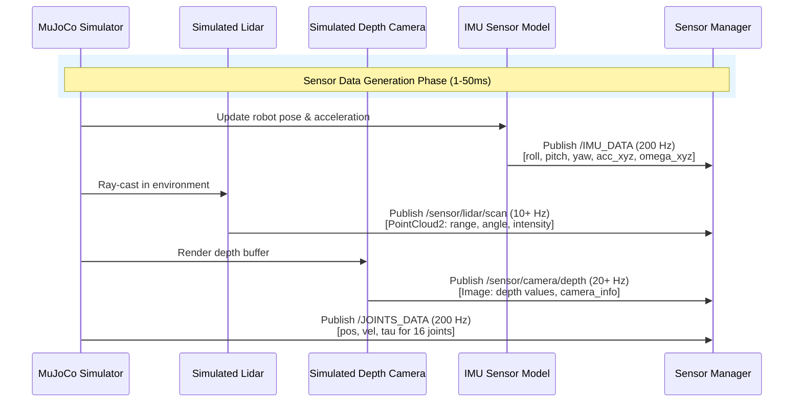
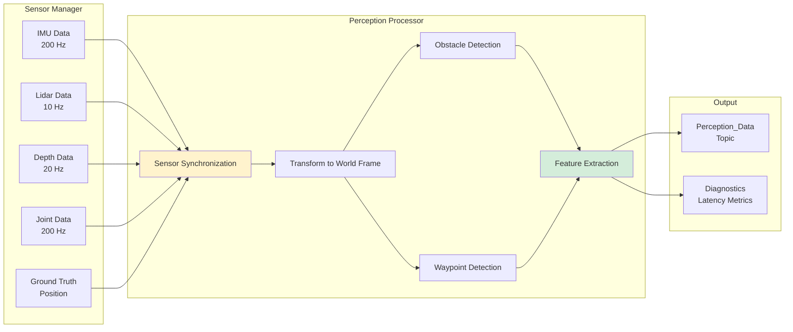
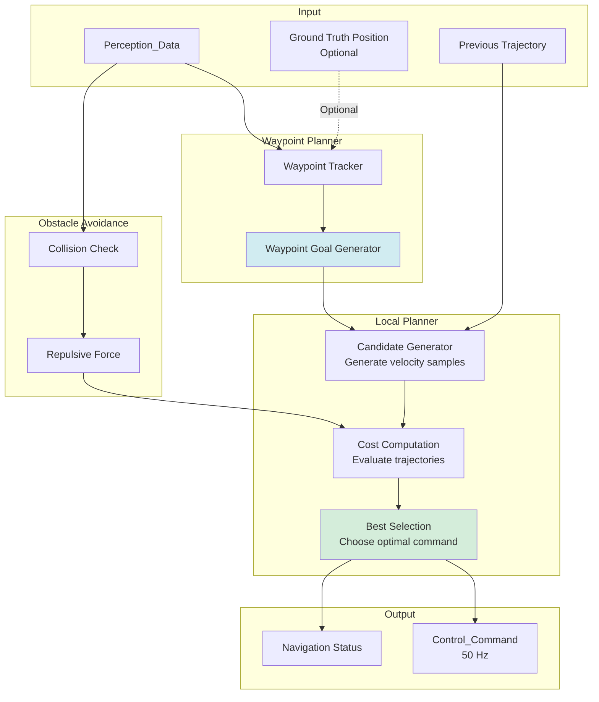
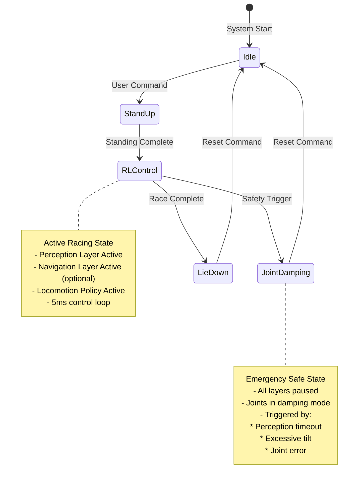
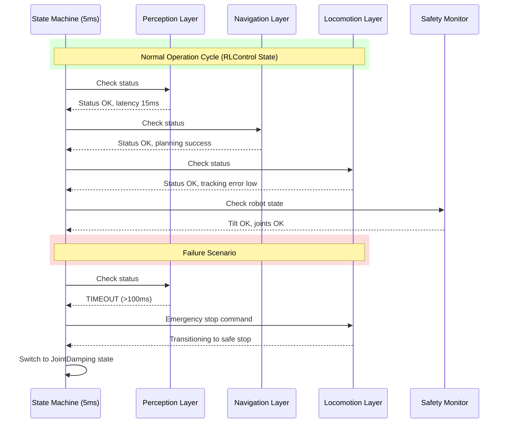

# S10 Robot Three-Layer Architecture - Data Flow Diagram

## System Overview

This document provides a comprehensive data flow analysis for the S10 robot three-layer architecture deployment in the perception racing contest.

## High-Level Architecture

```mermaid
graph TB
    subgraph "MuJoCo Simulation Environment"
        MJ[MuJoCo Physics Engine]
        SENS[Sensor Models<br/>Lidar + Depth Camera]
        WT[Waypoint Tracker]
        MJ --> SENS
        MJ --> WT
    end
    
    subgraph "Perception Layer"
        SM[Sensor Manager]
        PP[Perception Processor]
        SM --> PP
    end
    
    subgraph "Navigation Layer (Optional)"
        WP[Waypoint Planner]
        LP[Local Planner]
        OA[Obstacle Avoidance]
        WP --> LP
        LP --> OA
    end
    
    subgraph "Locomotion Layer"
        POLICY[Locomotion Policy<br/>RL/Learned]
        JC[Joint Controller]
        POLICY --> JC
    end
    
    subgraph "State Machine"
        FSM[State Machine Base<br/>5ms Control Loop]
        STATES[States: Idle, StandUp,<br/>RLControl, JointDamping]
        FSM --> STATES
    end
    
    subgraph "ROS 2 DDS Communication"
        IMU_T[/IMU_DATA Topic]
        JOINT_T[/JOINTS_DATA Topic]
        CMD_T[/JOINTS_CMD Topic]
        SENS_T[/sensor/* Topics]
        PERC_T[/perception/* Topics]
        NAV_T[/navigation/* Topics]
    end
    
    SENS --> SENS_T
    MJ --> IMU_T
    MJ --> JOINT_T
    SENS_T --> SM
    IMU_T --> SM
    JOINT_T --> SM
    
    PP --> PERC_T
    PERC_T --> WP
    OA --> NAV_T
    
    NAV_T --> POLICY
    PERC_T -.Direct Mode.-> POLICY
    
    JC --> CMD_T
    CMD_T --> MJ
    
    FSM -.Controls.-> POLICY
    FSM -.Monitors.-> JC
    
    style MJ fill:#e1f5ff
    style SENS fill:#fff3cd
    style PP fill:#d4edda
    style LP fill:#d1ecf1
    style POLICY fill:#f8d7da
    style FSM fill:#e2e3e5
```

## Detailed Data Flow

### 1. Sensor Data Generation (MuJoCo → Sensor Manager)



**Data Structures:**

- **IMU_DATA** (drdds/msg/ImuData):
  ```
  header: {frame_id, timestamp}
  data: {
    roll, pitch, yaw (degrees)
    acc_x, acc_y, acc_z (m/s²)
    omega_x, omega_y, omega_z (rad/s)
  }
  ```

- **JOINTS_DATA** (drdds/msg/JointsData):
  ```
  header: {frame_id, timestamp}
  data: {
    joints_data[16]: {
      position (rad), velocity (rad/s), torque (N·m)
      motion_temp, driver_temp, status_word
    }
  }
  ```

- **Lidar Scan** (sensor_msgs/PointCloud2):
  ```
  header: {frame_id, timestamp}
  points: [(x, y, z, intensity), ...]
  ```

- **Depth Image** (sensor_msgs/Image):
  ```
  header: {frame_id, timestamp}
  data: depth_values (float32 array)
  width, height, encoding
  ```

### 2. Perception Layer Processing (Sensor Manager → Perception Processor)



**Processing Pipeline:**

1. **Sensor Synchronization**: Align lidar, depth, and IMU data using timestamps
2. **Transform to World Frame**: Apply IMU orientation to sensor data
3. **Obstacle Detection**: Extract point clouds within 10m radius, cluster obstacles
4. **Waypoint Detection**: Identify waypoint markers in sensor FOV
5. **Feature Extraction**: Compute occupancy grid, local elevation map

**Output Data Structure - Perception_Data** (custom message):
```
header: {frame_id, timestamp}
obstacle_cloud: PointCloud2
waypoint_direction: Vector3
occupancy_grid: OccupancyGrid
processing_time_ms: float32
status: {valid: bool, error_msg: string}
```

### 3. Navigation Layer Planning (Perception → Navigation → Control Commands)



**Navigation Data Flow:**

1. **Waypoint Tracking**: Monitor current position vs next waypoint (0.2m reach radius)
2. **Goal Generation**: Set target velocity toward next waypoint
3. **Trajectory Sampling**: Generate candidate velocity commands (v_linear, v_angular)
4. **Cost Evaluation**: 
   - Distance to goal: minimize distance to waypoint
   - Obstacle cost: penalize proximity to obstacles
   - Smoothness: penalize sudden velocity changes
5. **Best Command Selection**: Choose lowest-cost velocity command

**Output Data Structure - Control_Command**:
```
header: {frame_id, timestamp}
linear_velocity: Vector3 (m/s)
angular_velocity: Vector3 (rad/s)
mode: {waypoint_tracking, obstacle_avoidance, recovery}
```

**Navigation Status**:
```
current_waypoint: int32
waypoints_remaining: int32
distance_to_waypoint: float32
planning_success: bool
```

### 4. Locomotion Layer Control (Control Commands → Joint Commands)

```mermaid
flowchart LR
    subgraph "Input"
        NAV_CMD[Navigation<br/>Control_Command]
        PERC_IN[Direct Perception<br/>Fallback Mode]
        STATE[Robot_State<br/>Joint + IMU]
    end
    
    subgraph "Locomotion Policy"
        MODE[Mode Selector]
        RL[RL Policy Network<br/>Trained Model]
        TRAJ[Trajectory Generator]
        
        MODE --> RL
        MODE -.Fallback.-> TRAJ
    end
    
    subgraph "Joint Controller"
        PD[PD Controller]
        LIMIT[Safety Limiter]
        CONV[Command Converter]
        
        PD --> LIMIT
        LIMIT --> CONV
    end
    
    subgraph "Output"
        JCMD[/JOINTS_CMD Topic<br/>200 Hz]
        LOG[Control Log]
    end
    
    NAV_CMD --> MODE
    PERC_IN -.Fallback.-> MODE
    STATE --> RL
    STATE --> TRAJ
    
    RL --> PD
    TRAJ --> PD
    
    CONV --> JCMD
    CONV --> LOG
    
    style RL fill:#f8d7da
    style PD fill:#d4edda
```

**Locomotion Control Flow:**

1. **Mode Selection**: Choose between navigation-guided or perception-direct mode
2. **Policy Execution**: 
   - Input: [robot_state, control_command, perception_features]
   - Output: [target_joint_positions, target_joint_velocities]
3. **PD Control**: Compute torques using: τ = Kp(q_des - q) + Kd(v_des - v) + τ_ff
4. **Safety Limiting**: Enforce joint limits, torque limits, velocity limits
5. **Command Conversion**: Transform to DDS message format with calibration

**Output Data Structure - JOINTS_CMD** (drdds/msg/JointsDataCmd):
```
data: {
  joints_data[16]: {
    kp, kd (PD gains)
    position (rad), velocity (rad/s)
    torque (feedforward, N·m)
    control_word (command type)
  }
}
```

### 5. State Machine Control Flow



**State Machine Data Flow:**



## Data Flow Summary Table

| Source | Topic/Interface | Destination | Data Type | Frequency | Latency Req |
|--------|----------------|-------------|-----------|-----------|-------------|
| MuJoCo Sim | /IMU_DATA | Sensor Manager | ImuData | 200 Hz | < 5ms |
| MuJoCo Sim | /JOINTS_DATA | Sensor Manager | JointsData | 200 Hz | < 5ms |
| MuJoCo Sim | /sensor/lidar/scan | Sensor Manager | PointCloud2 | 10+ Hz | < 100ms |
| MuJoCo Sim | /sensor/camera/depth | Sensor Manager | Image | 20+ Hz | < 50ms |
| Sensor Manager | /perception/data | Perception Processor | Perception_Data | 10-20 Hz | < 50ms |
| Perception Processor | /perception/data | Navigation Planner | Perception_Data | 10-20 Hz | - |
| Perception Processor | /perception/data | Locomotion Policy | Perception_Data | 10-20 Hz | - |
| Navigation Planner | /navigation/cmd_vel | Locomotion Policy | Control_Command | 50 Hz | < 20ms |
| Locomotion Policy | /JOINTS_CMD | MuJoCo Sim | JointsDataCmd | 200 Hz | < 5ms |
| All Layers | /diagnostics | Monitoring | DiagnosticArray | 1 Hz | - |

## Three-Layer Architecture Configuration Modes

### Mode 1: Full Three-Layer (with Navigation)

```
┌─────────────────┐
│   Perception    │  ← /IMU_DATA, /JOINTS_DATA, /sensor/*
│     Layer       │
└────────┬────────┘
         │ /perception/data
         ▼
┌─────────────────┐
│   Navigation    │  ← /ground_truth/pose (optional)
│     Layer       │
└────────┬────────┘
         │ /navigation/cmd_vel
         ▼
┌─────────────────┐
│   Locomotion    │  → /JOINTS_CMD
│     Layer       │
└─────────────────┘

Race time bonus: ÷ 1.2
```

### Mode 2: Direct Perception (without Navigation)

```
┌─────────────────┐
│   Perception    │  ← /IMU_DATA, /JOINTS_DATA, /sensor/*
│     Layer       │
└────────┬────────┘
         │ /perception/data (waypoint direction)
         ▼
┌─────────────────┐
│   Locomotion    │  → /JOINTS_CMD
│     Layer       │
└─────────────────┘

Race time: no bonus
```

## Performance Budget Analysis

### Timing Breakdown (Target)

```
Total Control Loop: 200 Hz (5ms period)
├─ Sensor Acquisition: 0.5ms
├─ Perception Processing: 1.5ms
├─ Navigation Planning: 1.0ms (if enabled)
├─ Policy Inference: 1.0ms
├─ PD Control Computation: 0.5ms
└─ Command Transmission: 0.5ms
```

### Latency Requirements

- **End-to-End (Sensor → Joint Command)**: < 50ms (10 control cycles)
- **Perception Critical Path**: < 15ms
- **Navigation Critical Path**: < 20ms
- **Locomotion Critical Path**: < 10ms

### Message Throughput

- **High Frequency** (200 Hz): IMU_DATA, JOINTS_DATA, JOINTS_CMD
- **Medium Frequency** (20-50 Hz): Perception data, Navigation commands
- **Low Frequency** (10 Hz): Lidar scans, Diagnostics

## Deployment Configurations

### Configuration 1: Development Mode
```yaml
mode: development
sensors:
  lidar:
    enabled: true
    frequency: 10
    noise: 0.01
  depth_camera:
    enabled: true
    frequency: 20
    noise: 0.005
navigation:
  enabled: true
  planning_frequency: 50
logging:
  rosbag: true
  verbose: true
visualization:
  rviz: true
```

### Configuration 2: Competition Mode
```yaml
mode: competition
sensors:
  lidar:
    enabled: true
    frequency: 10
    noise: 0.01
navigation:
  enabled: true  # Set false to disable bonus
  planning_frequency: 50
logging:
  rosbag: false
  verbose: false
visualization:
  rviz: false
```

### Configuration 3: Testing Mode
```yaml
mode: testing
sensors:
  synthetic: true  # Use test data
navigation:
  enabled: true
logging:
  rosbag: true
  verbose: true
diagnostics:
  publish_metrics: true
```

## Next Steps: Design Phase

After requirements approval, the design phase will specify:

1. **Perception Layer Design**: 
   - Sensor fusion algorithms
   - Feature extraction methods
   - Obstacle detection strategy

2. **Navigation Layer Design**:
   - Path planning algorithm (DWA, TEB, MPC)
   - Cost function design
   - Waypoint tracking controller

3. **Locomotion Layer Design**:
   - Policy network architecture
   - Training procedure and dataset
   - PD gain tuning strategy

4. **Integration Design**:
   - ROS 2 node architecture
   - Launch file structure
   - Parameter management system
