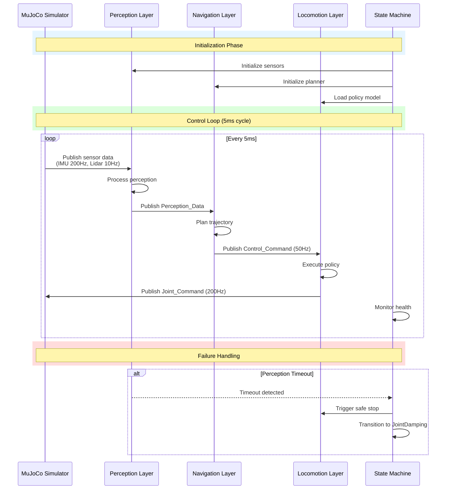
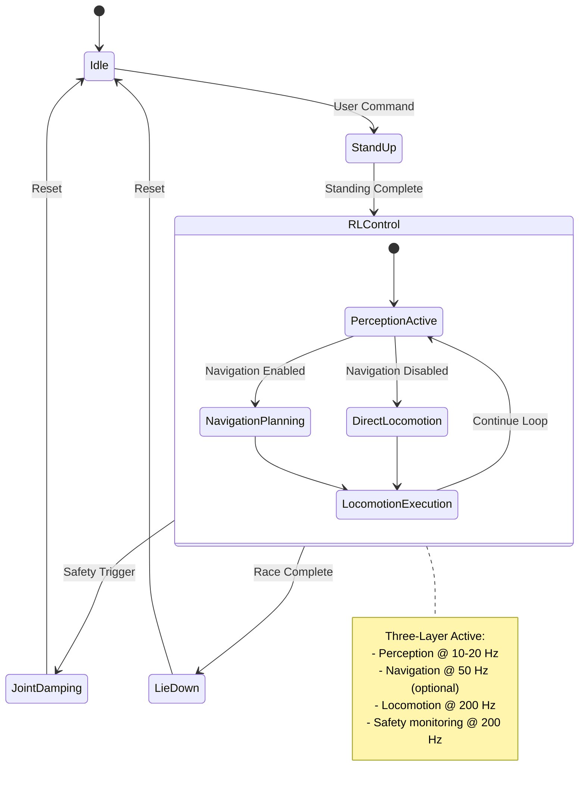

# Three-Layer Architecture Deployment - Design Document

## Overview

### System Purpose

This design document specifies the implementation of a three-layer perception-based control architecture for the S10 quadruped robot in the perception racing contest. The architecture enables the robot to navigate a waypoint track using simulated sensor data (lidar/depth camera), process environmental information, plan collision-free paths, and execute coordinated locomotion.

The three-layer architecture provides:

1. **Perception Layer**: Processes raw sensor data to extract environmental features and detect obstacles/waypoints
2. **Navigation Layer** (optional): Plans collision-free trajectories and generates velocity commands to reach waypoints
3. **Locomotion Layer**: Executes learned locomotion policies to convert high-level commands into joint-level control

### Key Design Decisions

**Decision 1: Optional Navigation Layer**
- **Rationale**: The competition allows participants to choose between full navigation (1.2x score bonus) or direct perception-to-locomotion control. This design supports both modes through runtime configuration.
- **Tradeoff**: Additional complexity in maintaining two execution paths, but provides flexibility for different strategies.

**Decision 2: ROS 2 Topic-Based Communication**
- **Rationale**: Leverages existing DDS infrastructure, provides loose coupling between layers, enables independent development and testing.
- **Tradeoff**: Topic-based communication introduces latency compared to direct function calls, but maintains system modularity.

**Decision 3: Simulated Sensors in MuJoCo**
- **Rationale**: Contest requires perception-based control; simulation allows rapid iteration without hardware constraints.
- **Tradeoff**: Sim-to-real transfer challenges, but simplified development and testing.

**Decision 4: Learned Locomotion Policy**
- **Rationale**: Reinforcement learning provides robust control across varying terrain and velocities.
- **Tradeoff**: Requires training infrastructure and data, but offers superior performance compared to hand-tuned controllers.


### Design Principles

1. **Modularity**: Each layer is independently testable and replaceable
2. **Real-time Performance**: Maintain 200 Hz control loop with < 50ms end-to-end latency
3. **Safety First**: Graceful degradation and fail-safe mechanisms at every layer
4. **Configuration-Driven**: Runtime behavior controlled via YAML configuration files
5. **Observable**: Comprehensive diagnostics and logging for debugging and performance analysis

### System Context

The three-layer architecture integrates with:
- **MuJoCo Simulator**: Physics simulation providing sensor data and actuating joint commands
- **ROS 2 DDS**: Communication middleware for inter-layer data flow
- **State Machine**: Existing control framework managing robot states (Idle, StandUp, RLControl, JointDamping)
- **Hardware Abstraction**: RobotInterface and DdsInterface for hardware communication


## Architecture

### High-Level Architecture Diagram

```mermaid
graph TB
    subgraph "External Systems"
        MUJOCO[MuJoCo Simulator<br/>Physics + Sensors]
        USER[User Configuration<br/>YAML Files]
    end
    
    subgraph "Three-Layer Architecture"
        direction TB
        
        subgraph "Perception Layer"
            SM[Sensor Manager]
            PP[Perception Processor]
            SM --> PP
        end
        
        subgraph "Navigation Layer<br/>(Optional)"
            WPT[Waypoint Tracker]
            LP[Local Planner]
            OA[Obstacle Avoidance]
            WPT --> LP
            LP --> OA
        end
        
        subgraph "Locomotion Layer"
            POLICY[Locomotion Policy<br/>RL Network]
            JC[Joint Controller<br/>PD Control]
            POLICY --> JC
        end
    end
    
    subgraph "Control Framework"
        FSM[State Machine<br/>5ms Control Loop]
        SAFETY[Safety Monitor]
        FSM --> SAFETY
    end
    
    subgraph "ROS 2 DDS Communication"
        TOPICS[/Topics:<br/>/IMU_DATA, /JOINTS_DATA<br/>/JOINTS_CMD<br/>/sensor/*, /perception/*<br/>/navigation/*]
    end
    
    MUJOCO -.Sensor Data.-> SM
    PP --> WPT
    PP -.Direct Mode.-> POLICY
    OA --> POLICY
    JC --> MUJOCO
    FSM -.Controls.-> POLICY
    SAFETY -.Monitors.-> JC
    USER -.Config.-> SM
    USER -.Config.-> WPT
    USER -.Config.-> POLICY
    
    TOPICS -.ROS 2 Topics.-> SM
    TOPICS -.ROS 2 Topics.-> PP
    TOPICS -.ROS 2 Topics.-> WPT
    TOPICS -.ROS 2 Topics.-> POLICY
    TOPICS -.ROS 2 Topics.-> JC
```


### Execution Flow




### Layer Interaction Modes

The system supports two operational modes:

**Mode 1: Full Three-Layer (with Navigation)**
```
Sensors → Perception → Navigation → Locomotion → Actuators
          (10-20Hz)    (50Hz)       (200Hz)
```
- Navigation planning enabled
- Score bonus: ÷ 1.2
- Full obstacle avoidance and path planning

**Mode 2: Direct Perception (without Navigation)**
```
Sensors → Perception → Locomotion → Actuators
          (10-20Hz)    (200Hz)
```
- Navigation layer bypassed
- No score bonus
- Locomotion policy directly uses waypoint direction from perception


## Components and Interfaces

### Perception Layer

#### Sensor Manager Component

**Purpose**: Acquire and synchronize sensor data from MuJoCo simulation

**Responsibilities**:
- Subscribe to simulated sensor topics (/sensor/lidar/scan, /sensor/camera/depth)
- Subscribe to robot state topics (/IMU_DATA, /JOINTS_DATA)
- Synchronize multi-rate sensor data using timestamp alignment
- Publish ground truth position data for debugging

**Interface**:
```cpp
class SensorManager {
public:
    SensorManager(rclcpp::Node::SharedPtr node, const SensorConfig& config);
    
    // Callbacks for sensor data
    void lidarCallback(const sensor_msgs::msg::PointCloud2::SharedPtr msg);
    void depthCallback(const sensor_msgs::msg::Image::SharedPtr msg);
    void imuCallback(const drdds::msg::ImuData::SharedPtr msg);
    void jointsCallback(const drdds::msg::JointsData::SharedPtr msg);
    
    // Synchronized data retrieval
    SensorDataPacket getSynchronizedData(double target_time);
    
    // Ground truth access (optional)
    Eigen::Vector3d getGroundTruthPosition();
    
private:
    // Time-based message buffers
    std::deque<LidarData> lidar_buffer_;
    std::deque<DepthData> depth_buffer_;
    std::deque<ImuData> imu_buffer_;
    std::deque<JointData> joint_buffer_;
    
    // Configuration
    SensorConfig config_;
    double time_sync_threshold_ = 0.05; // 50ms max sync error
};
```


#### Perception Processor Component

**Purpose**: Transform raw sensor data into actionable environmental features

**Responsibilities**:
- Transform sensor data to world/body frames using IMU orientation
- Detect obstacles within configurable radius (default 10m)
- Identify waypoint markers in sensor field of view
- Generate occupancy grid and local elevation map
- Publish Perception_Data at sensor input rate

**Interface**:
```cpp
class PerceptionProcessor {
public:
    PerceptionProcessor(rclcpp::Node::SharedPtr node, const PerceptionConfig& config);
    
    // Main processing pipeline
    PerceptionData process(const SensorDataPacket& sensor_data);
    
    // Processing stages
    pcl::PointCloud<pcl::PointXYZ>::Ptr transformToWorldFrame(
        const pcl::PointCloud<pcl::PointXYZ>::Ptr& cloud,
        const Eigen::Matrix3d& rotation);
    
    ObstacleCloud extractObstacles(
        const pcl::PointCloud<pcl::PointXYZ>::Ptr& cloud,
        double radius);
    
    WaypointDetection detectWaypoints(
        const pcl::PointCloud<pcl::PointXYZ>::Ptr& cloud);
    
    OccupancyGrid generateOccupancyGrid(
        const ObstacleCloud& obstacles,
        double resolution);
    
    // Latency tracking
    double getProcessingLatency() const;
    
private:
    PerceptionConfig config_;
    rclcpp::Publisher<perception_msgs::msg::PerceptionData>::SharedPtr pub_;
    rclcpp::Publisher<diagnostic_msgs::msg::DiagnosticArray>::SharedPtr diag_pub_;
    
    // Processing parameters
    double obstacle_radius_ = 10.0;  // meters
    double waypoint_detection_threshold_ = 0.5;  // meters
    double occupancy_grid_resolution_ = 0.1;  // meters per cell
};
```


**Perception Algorithms**:

1. **Point Cloud Transformation**
   - Input: Raw lidar/depth point cloud in sensor frame
   - Process: Apply IMU rotation matrix to transform to world frame
   - Output: Point cloud in world coordinates
   - Algorithm: `P_world = R_imu * P_sensor + t_base`

2. **Obstacle Detection**
   - Input: Transformed point cloud
   - Process: 
     - Filter points by radius (< 10m from robot)
     - Voxel grid downsampling (0.05m resolution)
     - Ground plane removal using RANSAC
     - Euclidean clustering for obstacle grouping
   - Output: Clustered obstacle point clouds with bounding boxes

3. **Waypoint Detection**
   - Input: Point cloud and visual marker geometry
   - Process:
     - Extract points within expected waypoint height range (0.5-2.0m)
     - Template matching for cylindrical waypoint markers
     - Compute direction vector from robot to detected waypoint
   - Output: Waypoint direction unit vector, distance

4. **Occupancy Grid Generation**
   - Input: Obstacle clusters
   - Process:
     - Project 3D points to 2D grid (bird's eye view)
     - Mark occupied cells using raycasting
     - Apply morphological dilation for safety margin
   - Output: 2D occupancy grid (200x200 cells, 0.1m resolution)


### Navigation Layer

#### Waypoint Tracker Component

**Purpose**: Monitor progress through waypoint sequence and provide goal targets

**Responsibilities**:
- Track current waypoint index and distance
- Detect waypoint arrival (0.2m horizontal radius)
- Compute heading and distance to next waypoint
- Log waypoint timing statistics

**Interface**:
```cpp
class WaypointTracker {
public:
    WaypointTracker(const std::vector<Eigen::Vector3d>& waypoints);
    
    // Update robot position and check waypoint progress
    void updatePosition(const Eigen::Vector3d& position);
    
    // Check if current waypoint is reached
    bool checkWaypointReached(double radius = 0.2);
    
    // Get next waypoint information
    Eigen::Vector3d getNextWaypoint() const;
    Eigen::Vector3d getWaypointDirection() const;
    double getDistanceToWaypoint() const;
    
    // Track completion
    bool allWaypointsReached() const;
    int getCurrentWaypointIndex() const;
    
    // Timing statistics
    double getElapsedTime() const;
    void logWaypointReached(int index, double sim_time);
    
private:
    std::vector<Eigen::Vector3d> waypoints_;
    int current_waypoint_index_ = 0;
    Eigen::Vector3d current_position_;
    double start_time_ = 0.0;
    std::vector<double> waypoint_times_;
};
```


#### Local Planner Component

**Purpose**: Generate collision-free velocity commands to reach waypoint goals

**Responsibilities**:
- Sample candidate velocity commands (v_linear, v_angular)
- Predict trajectories for each candidate
- Evaluate trajectory costs (goal distance, obstacle proximity, smoothness)
- Select optimal velocity command

**Local Planning Algorithm**: Dynamic Window Approach (DWA)

**Rationale**: DWA is well-suited for legged robots because:
- Generates kinematically feasible velocities within robot's dynamic window
- Fast computation (< 10ms per cycle) meets real-time requirements
- Proven performance in cluttered environments
- Simple tuning with interpretable cost parameters

**DWA Algorithm**:
```
1. Generate velocity samples:
   v_linear ∈ [v_current - a_max*dt, v_current + a_max*dt]
   v_angular ∈ [ω_current - α_max*dt, ω_current + α_max*dt]
   
2. For each (v, ω) sample:
   a) Predict trajectory over time horizon T (2 seconds)
   b) Check collision with occupancy grid
   c) Compute cost:
      cost = α * heading_cost + β * distance_cost + γ * velocity_cost
      
      heading_cost = angle_diff(trajectory_end_heading, goal_heading)
      distance_cost = distance(trajectory_end, goal)
      velocity_cost = (v_max - v_linear) / v_max
      
3. Select (v*, ω*) with minimum cost
4. Publish Control_Command with selected velocity
```

**Interface**:
```cpp
class LocalPlanner {
public:
    LocalPlanner(const DWAConfig& config);
    
    // Main planning function
    ControlCommand plan(
        const PerceptionData& perception,
        const Eigen::Vector3d& goal_position,
        const RobotState& robot_state);
    
    // Velocity sampling
    std::vector<VelocityCandidate> sampleVelocities(
        double current_v, double current_w);
    
    // Trajectory prediction
    Trajectory predictTrajectory(
        const VelocityCandidate& vel,
        double time_horizon);
    
    // Cost evaluation
    double computeCost(
        const Trajectory& traj,
        const Eigen::Vector3d& goal,
        const OccupancyGrid& grid);
    
private:
    DWAConfig config_;
    
    // DWA parameters
    double v_max_ = 1.0;  // m/s
    double w_max_ = 1.5;  // rad/s
    double a_max_ = 0.5;  // m/s²
    double alpha_max_ = 1.0;  // rad/s²
    double time_horizon_ = 2.0;  // seconds
    double dt_ = 0.1;  // trajectory time step
    
    // Cost weights
    double w_heading_ = 2.0;
    double w_distance_ = 1.0;
    double w_velocity_ = 0.5;
    double w_obstacle_ = 5.0;
};
```


#### Obstacle Avoidance Component

**Purpose**: Modify planned trajectories to avoid detected obstacles

**Responsibilities**:
- Apply repulsive forces from nearby obstacles
- Adjust velocity commands to maintain safe clearance
- Trigger emergency stop if collision imminent

**Avoidance Strategy**: Artificial Potential Field

```
Repulsive Force:
F_rep = k_rep * (1/d - 1/d_safe)² * (direction_away_from_obstacle)

where:
  d = distance to obstacle
  d_safe = 1.0 meter (safe clearance distance)
  k_rep = 2.0 (repulsion strength coefficient)
```

**Interface**:
```cpp
class ObstacleAvoidance {
public:
    ObstacleAvoidance(double safe_distance, double k_rep);
    
    // Apply obstacle avoidance to velocity command
    ControlCommand applyAvoidance(
        const ControlCommand& planned_cmd,
        const ObstacleCloud& obstacles,
        const RobotState& robot_state);
    
    // Compute repulsive force from obstacles
    Eigen::Vector3d computeRepulsiveForce(
        const ObstacleCloud& obstacles,
        const Eigen::Vector3d& robot_pos);
    
    // Check for imminent collision
    bool isCollisionImminent(
        const ObstacleCloud& obstacles,
        const RobotState& robot_state,
        double time_horizon);
    
private:
    double safe_distance_ = 1.0;  // meters
    double k_rep_ = 2.0;
    double emergency_stop_distance_ = 0.3;  // meters
};
```


### Locomotion Layer

#### Locomotion Policy Component

**Purpose**: Convert high-level control commands to joint-level actions using trained RL policy

**Responsibilities**:
- Load trained policy neural network
- Construct observation vector from robot state and control commands
- Infer joint position/velocity targets via policy network
- Provide fallback behavior if navigation unavailable

**Policy Architecture**: Actor-Critic with Multilayer Perceptron (MLP)

**Network Structure**:
```
Observation (input): 
  - Robot state (48 dims): joint_pos[16], joint_vel[16], base_rpy[3], base_omega[3], 
                          base_acc[3], projected_gravity[3], prev_action[16]
  - Control command (3 dims): v_linear_x, v_linear_y, v_angular_z
  - Perception features (optional, 32 dims): occupancy grid embedding
  Total: 48 + 3 + 32 = 83 dimensions

Hidden layers:
  - Layer 1: 256 neurons, ELU activation
  - Layer 2: 128 neurons, ELU activation
  - Layer 3: 128 neurons, ELU activation

Action (output): 
  - Joint targets (16 dims): target_joint_pos[16]
  - Joint velocities implicit from position change
```

**Training Procedure** (for reference):
- Algorithm: Proximal Policy Optimization (PPO)
- Reward components:
  - Velocity tracking: minimize error between desired and actual velocity
  - Energy efficiency: minimize joint torques
  - Stability: penalize excessive roll/pitch angles
  - Smoothness: penalize sudden action changes
- Training environment: MuJoCo with randomized terrain and velocities
- Training duration: ~10M timesteps


**Interface**:
```cpp
class LocomotionPolicy {
public:
    LocomotionPolicy(const std::string& model_path, const PolicyConfig& config);
    
    // Load trained policy network
    bool loadModel(const std::string& path);
    
    // Main inference function
    RobotAction infer(
        const RobotState& robot_state,
        const ControlCommand& control_cmd,
        const PerceptionData& perception);
    
    // Construct observation vector
    Eigen::VectorXd buildObservation(
        const RobotState& robot_state,
        const ControlCommand& control_cmd,
        const PerceptionData& perception);
    
    // Fallback behaviors
    RobotAction directPerceptionFallback(
        const RobotState& robot_state,
        const PerceptionData& perception);
    
    RobotAction safeStopAction(const RobotState& robot_state);
    
private:
    // Neural network inference engine (e.g., ONNX Runtime, TorchScript)
    std::unique_ptr<InferenceEngine> inference_engine_;
    
    // Policy configuration
    PolicyConfig config_;
    
    // Action history for observation
    std::deque<Eigen::VectorXd> action_history_;
    const int history_length_ = 1;
};
```


#### Joint Controller Component

**Purpose**: Convert joint position targets from policy to torque commands using PD control

**Responsibilities**:
- Implement PD control law: τ = Kp(q_des - q) + Kd(v_des - v) + τ_ff
- Enforce joint limits (position, velocity, torque)
- Detect dangerous states and trigger safety transitions
- Convert to DDS message format for /JOINTS_CMD topic

**PD Control Law**:
```
For each joint i:
  position_error = target_pos[i] - current_pos[i]
  velocity_error = target_vel[i] - current_vel[i]
  torque[i] = Kp[i] * position_error + Kd[i] * velocity_error + feedforward_torque[i]
  
  // Apply torque limits
  torque[i] = clamp(torque[i], -tau_max[i], tau_max[i])
```

**PD Gain Selection**:
- Hip joints (higher inertia): Kp = 80, Kd = 2.0
- Knee joints (medium inertia): Kp = 100, Kd = 2.5  
- Ankle joints (lower inertia): Kp = 60, Kd = 1.5

**Gain Tuning Rationale**: 
- Higher Kp provides stiff position tracking for stance phase
- Moderate Kd provides damping without over-oscillation
- Tuned empirically through simulation tests

**Safety Limits**:
```cpp
// Joint position limits (radians)
const std::vector<double> q_min = {-0.8, -1.0, -2.5, ...};  // 16 joints
const std::vector<double> q_max = { 0.8,  2.0,  0.1, ...};

// Joint velocity limits (rad/s)
const double v_max = 10.0;

// Joint torque limits (N·m)
const std::vector<double> tau_max = {50.0, 50.0, 40.0, ...};
```


**Interface**:
```cpp
class JointController {
public:
    JointController(const JointConfig& config);
    
    // Main control function
    drdds::msg::JointsDataCmd computeCommand(
        const RobotAction& action,
        const RobotState& robot_state);
    
    // PD control computation
    Eigen::VectorXd computePDControl(
        const Eigen::VectorXd& target_pos,
        const Eigen::VectorXd& target_vel,
        const Eigen::VectorXd& current_pos,
        const Eigen::VectorXd& current_vel);
    
    // Safety enforcement
    bool checkJointLimits(const Eigen::VectorXd& positions);
    bool checkVelocityLimits(const Eigen::VectorXd& velocities);
    Eigen::VectorXd applyTorqueLimits(const Eigen::VectorXd& torques);
    
    // Safety state detection
    bool detectUnsafeState(const RobotState& robot_state);
    
private:
    JointConfig config_;
    
    // PD gains per joint
    Eigen::VectorXd kp_;
    Eigen::VectorXd kd_;
    
    // Joint limits
    Eigen::VectorXd q_min_, q_max_;
    Eigen::VectorXd v_max_;
    Eigen::VectorXd tau_max_;
    
    // Safety thresholds
    double max_position_error_ = 0.5;  // radians
    double max_roll_pitch_ = 0.785;  // 45 degrees
};
```


### State Machine Integration

The three-layer architecture integrates with the existing state machine framework:

**State Diagram**:


**State Machine Modifications**:

1. **RLControl State Enhancement**:
   - Initialize all three layers on entry
   - Run perception/navigation/locomotion pipeline in control loop
   - Monitor layer health and timeouts
   - Trigger safety transitions on failures

2. **Safety Monitor Integration**:
   - Check perception data timeout (< 100ms)
   - Check navigation command timeout (< 200ms)
   - Monitor robot tilt angles (< 45 degrees)
   - Monitor joint position errors (< 0.5 radians)


## Data Models

### Sensor Data Structures

**ImuData** (from drdds/msg/ImuData.msg):
```cpp
struct ImuData {
    std_msgs::Header header;
    double roll;     // radians
    double pitch;    // radians
    double yaw;      // radians
    double acc_x;    // m/s²
    double acc_y;    // m/s²
    double acc_z;    // m/s²
    double omega_x;  // rad/s
    double omega_y;  // rad/s
    double omega_z;  // rad/s
};
```

**JointsData** (from drdds/msg/JointsData.msg):
```cpp
struct JointDataValue {
    double position;        // radians
    double velocity;        // rad/s
    double torque;          // N·m
    double motion_temp;     // Celsius
    double driver_temp;     // Celsius
    uint16_t status_word;
};

struct JointsData {
    std_msgs::Header header;
    JointDataValue joints_data[16];
};
```

**LidarData** (sensor_msgs/PointCloud2):
```cpp
struct LidarData {
    std_msgs::Header header;
    uint32_t height;          // 1 for unordered point cloud
    uint32_t width;           // number of points
    PointField[] fields;      // x, y, z, intensity
    bool is_bigendian;
    uint32_t point_step;
    uint32_t row_step;
    uint8_t[] data;           // raw point cloud data
};
```

**DepthImage** (sensor_msgs/Image):
```cpp
struct DepthImage {
    std_msgs::Header header;
    uint32_t height;          // image height (pixels)
    uint32_t width;           // image width (pixels)
    string encoding;          // "32FC1" (32-bit float, 1 channel)
    uint8_t is_bigendian;
    uint32_t step;            // row stride in bytes
    uint8_t[] data;           // depth values in meters
};
```


### Intermediate Data Structures

**PerceptionData** (custom message: perception_msgs/msg/PerceptionData.msg):
```cpp
struct PerceptionData {
    std_msgs::Header header;
    
    // Obstacle information
    sensor_msgs::PointCloud2 obstacle_cloud;
    
    // Waypoint information
    geometry_msgs::Vector3 waypoint_direction;  // unit vector
    float waypoint_distance;                     // meters
    bool waypoint_detected;
    
    // Occupancy grid
    nav_msgs::OccupancyGrid occupancy_grid;
    
    // Processing status
    float processing_time_ms;
    bool valid;
    string error_msg;
};
```

**ControlCommand** (custom message: navigation_msgs/msg/ControlCommand.msg):
```cpp
struct ControlCommand {
    std_msgs::Header header;
    
    // Velocity commands
    geometry_msgs::Vector3 linear_velocity;   // [v_x, v_y, v_z] m/s
    geometry_msgs::Vector3 angular_velocity;  // [ω_x, ω_y, ω_z] rad/s
    
    // Control mode
    uint8_t mode;
    uint8_t MODE_WAYPOINT_TRACKING = 0;
    uint8_t MODE_OBSTACLE_AVOIDANCE = 1;
    uint8_t MODE_RECOVERY = 2;
    uint8_t MODE_DIRECT_PERCEPTION = 3;
};
```

**NavigationStatus** (custom message: navigation_msgs/msg/NavigationStatus.msg):
```cpp
struct NavigationStatus {
    std_msgs::Header header;
    
    // Waypoint tracking
    int32_t current_waypoint;
    int32_t waypoints_remaining;
    float distance_to_waypoint;
    
    // Planning status
    bool planning_success;
    float planning_time_ms;
    
    // Trajectory quality metrics
    float trajectory_cost;
    float obstacle_clearance;
};
```


### Internal Data Structures

**RobotState**:
```cpp
struct RobotState {
    // Time
    double timestamp;
    
    // Base state (from IMU)
    Eigen::Vector3d base_rpy;           // roll, pitch, yaw (radians)
    Eigen::Quaterniond base_quat;       // orientation quaternion
    Eigen::Matrix3d base_rot_mat;       // rotation matrix
    Eigen::Vector3d base_omega;         // angular velocity (rad/s)
    Eigen::Vector3d base_acc;           // linear acceleration (m/s²)
    
    // Joint state (from JOINTS_DATA)
    Eigen::VectorXd joint_pos;          // 16 joints (radians)
    Eigen::VectorXd joint_vel;          // 16 joints (rad/s)
    Eigen::VectorXd joint_tau;          // 16 joints (N·m)
    
    // Optional: ground truth position (for debugging)
    Eigen::Vector3d ground_truth_pos;   // [x, y, z] meters
    
    // Temperature and status
    Eigen::VectorXd motor_temps;        // 16 joints (Celsius)
    std::vector<uint16_t> status_words; // 16 joints
};
```

**RobotAction**:
```cpp
struct RobotAction {
    // Joint targets
    Eigen::VectorXd goal_joint_pos;     // 16 joints (radians)
    Eigen::VectorXd goal_joint_vel;     // 16 joints (rad/s)
    
    // PD gains
    Eigen::VectorXd kp;                 // 16 joints
    Eigen::VectorXd kd;                 // 16 joints
    
    // Feedforward torque
    Eigen::VectorXd tau_ff;             // 16 joints (N·m)
    
    // Convert to DDS message format
    MatXf ConvertToMat() {
        MatXf res(goal_joint_pos.rows(), 5);
        res.col(0) = kp;
        res.col(1) = goal_joint_pos;
        res.col(2) = kd;
        res.col(3) = goal_joint_vel;
        res.col(4) = tau_ff;
        return res;
    }
};
```


**Configuration Structures**:

```cpp
struct SensorConfig {
    // Lidar configuration
    bool lidar_enabled = true;
    double lidar_frequency = 10.0;  // Hz
    double lidar_noise_stddev = 0.01;  // meters
    
    // Depth camera configuration
    bool depth_enabled = true;
    double depth_frequency = 20.0;  // Hz
    double depth_noise_stddev = 0.005;  // meters
    int depth_width = 640;
    int depth_height = 480;
    
    // IMU configuration
    double imu_frequency = 200.0;  // Hz
    
    // Time synchronization
    double sync_threshold = 0.05;  // seconds
};

struct PerceptionConfig {
    double obstacle_radius = 10.0;  // meters
    double voxel_grid_resolution = 0.05;  // meters
    double occupancy_grid_resolution = 0.1;  // meters
    int occupancy_grid_size = 200;  // cells (20m x 20m)
    
    double waypoint_height_min = 0.5;  // meters
    double waypoint_height_max = 2.0;  // meters
    double waypoint_detection_threshold = 0.5;  // meters
    
    double max_processing_latency = 0.05;  // seconds
};

struct NavigationConfig {
    bool enabled = true;
    
    // DWA parameters
    double v_max = 1.0;  // m/s
    double w_max = 1.5;  // rad/s
    double a_max = 0.5;  // m/s²
    double alpha_max = 1.0;  // rad/s²
    double time_horizon = 2.0;  // seconds
    double dt = 0.1;  // seconds
    
    // Cost weights
    double w_heading = 2.0;
    double w_distance = 1.0;
    double w_velocity = 0.5;
    double w_obstacle = 5.0;
    
    // Obstacle avoidance
    double safe_distance = 1.0;  // meters
    double k_rep = 2.0;
    double emergency_stop_distance = 0.3;  // meters
    
    // Waypoint tracking
    double waypoint_reach_radius = 0.2;  // meters
    double planning_frequency = 50.0;  // Hz
};

struct LocomotionConfig {
    std::string policy_model_path;
    bool use_perception_features = true;
    
    // PD gains (per joint)
    std::vector<double> kp;  // 16 values
    std::vector<double> kd;  // 16 values
    
    // Joint limits
    std::vector<double> q_min;
    std::vector<double> q_max;
    std::vector<double> v_max;
    std::vector<double> tau_max;
    
    // Safety thresholds
    double max_position_error = 0.5;  // radians
    double max_roll_pitch = 0.785;  // radians (45 degrees)
    
    // Control frequency
    double control_frequency = 200.0;  // Hz
};
```

