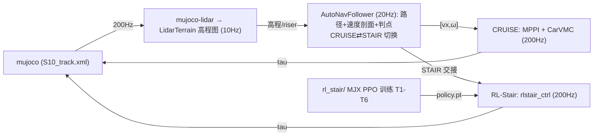

# S10 巡逻赛题 · 感知-控制工程仓库

基于山猫 S10 四足轮式机器人的**巡逻赛题**参赛方案：LiDAR 感知 + 高程地形建模 +
导航（平滑路径/速度剖面）→ 执行层 **carvmc+mppi（巡航） / rl stair（爬梯）**的
层级方案，在 MuJoCo 仿真中完成 33 航点全程巡检（历史 dial-mpc 方案已归档）。

## 赛题与计分

- 仿真环境（官方提供）：`S10_track.xml` 场景 + `track_overlay.xml` 33 个航点
  （000_start ~ 032_end），base 进入 wp0 的 0.2 m 水平半径开始计时，逐点推进，
  到达终点停止计时并打印耗时。
- 计分：总成绩 = 完成时间 ÷ 模式系数，得分越低排名越靠前，30 个定位点须全部
  完成。模式系数以官方 PDF 为准：**遥控 ÷1.0 / 自主跟随 ÷1.3 / 自主导航 ÷1.4**。
- 申报模式：**自主跟随（÷1.3）**——航点跟随 + 感知地形限速/爬坡 + roll 安全，
  不强制全局 A\*。

## 系统架构（2026-08-16）



- **感知**：mujoco-lidar 扇形射线（前下 45°）→ `LidarTerrain` 世界栅格累积
  高程图（10Hz，瓦片 res 0.05、riser 检测、运动学 fallback）；楼梯区以
  已知 riser 表提前触发 STAIR。
- **巡航（carvmc+mppi）**：MPPI（身体层轨迹优化，20Hz）+ CarVMC（200Hz）
  轮驱动/差速 + 腿=主动悬架，连续地形响应；平滑路径 + 曲率/横脊限速
  速度剖面（20Hz）。
- **爬梯（RL）**：`rl_stair/` MJX 并行 PPO（T1-T6 课程 + 域随机化 DR），
  策略导出 `deploy/policy.pt` → `rlstair_ctrl.py`（腿 PD + 轮速）部署到
  C++ MuJoCo 真实赛道；交接流程：cruise 带速接近 → carvmc+PD 抬身 →
  RL 接管爬梯 → 完成后平滑回巡航。

## 目录结构

```
DR_competition/
├── .venv/                       # 项目虚拟环境（开发机）
├── comp_env/                    # 官方比赛环境专用 venv（numpy<2 + mujoco）
├── deeprobot_competition/       # 本仓库：ROS2 工作空间
│   ├── src/S10_sdk_deploy/      # 仿真节点/感知/导航/控制器/模型
│   ├── rl_stair/                # RL 爬梯训练（MJX PPO + sim2sim 部署）
│   ├── doc/                     # v890 cruise + RL_stair 文档 + 官方材料
│   └── tmp/                     # 测试入口与结果分析脚本
```

## 环境与快速开始

要求：**Ubuntu 24.04 + ROS 2 Jazzy + NVIDIA GPU**。完整环境配置见
[doc/requirements.md](doc/requirements.md)（Ubuntu 22.04 安装）。

```bash
# 1) 虚拟环境 + ROS2 构建
cd ~/DR_competition
/usr/bin/python3 -m venv .venv
./.venv/bin/pip install "numpy<2" mujoco mujoco-lidar jax[cuda12]==0.4.38
cd deeprobot_competition && source /opt/ros/jazzy/setup.bash
colcon build --packages-up-to s10_sdk_deploy --cmake-args -DBUILD_PLATFORM=x86
source install/setup.bash

# 2) 模式 B 遥控（z 站起 / c 进 MPC / wasd 移动 / qe 转向）
export JAX_COMPILATION_CACHE_DIR=$HOME/.cache/s10_dial_mpc
S10_MPC_ENABLE=1 ~/DR_competition/.venv/bin/python \
  src/S10_sdk_deploy/interface/robot/simulation/mujoco_simulation_ros2.py

# 3) 模式 A 自动导航（无头加 S10_USE_VIEWER=0）
S10_MPC_ENABLE=1 S10_MODE=auto_nav ~/DR_competition/.venv/bin/python \
  src/S10_sdk_deploy/interface/robot/simulation/mujoco_simulation_ros2.py
```

> 官方比赛环境（真实 mesh S10_track.xml）使用专用 venv `comp_env`（numpy<2 + mujoco）。

## RL-Stair：训练 / sim2sim / 部署

### 1. 训练（MJX 并行 PPO，T0→T6 课程）

```bash
cd ~/DR_competition/deeprobot_competition
# 训练（默认 1024 env；256 可省显存；--lr 3e-4 用于精炼）
XLA_PYTHON_CLIENT_MEM_FRACTION=0.6 ~/DR_competition/.venv/bin/python \
  rl_stair/train.py --num_envs 1024 --max_iters 3000 --logdir rl_stair/logs
# 断点续训 / 指定单一阶段
... --resume rl_stair/logs/model_latest.pt [--stage T6_handoff --lr 3e-4]
# 评估各关卡 succ/progress/fall（只读，不占训练）
~/DR_competition/.venv/bin/python rl_stair/eval.py \
  --ckpt rl_stair/logs/model_latest.pt --stages T3_stairs6,T6_handoff \
  --num_envs 128 --episodes 5
```

课程（`rl_stair/configs/rl_stair_config.py`，晋级门槛 succ≥0.35 / 回退 <0.05）：

| 阶段 | 内容 |
|---|---|
| T0 | 平地热身（4.5m 达标线，vx 0.4~0.9） |
| T1a-d | 单阶 5 / 8.1 / 10 / 12.5 cm |
| T2a-e | 4 级阶梯 5 / 6.1 / 8 / 10 / 12.5 cm（T2d/e 近距 spawn 隔离抬升技能） |
| T3 | **比赛 6 级**（0.061 + 0.125×5，tread 0.4） |
| T6_handoff | 比赛 6 级 + 交接（yaw ±1.0、vx −0.5~2.5、初始姿态 DR：yaw±0.3 / squat_frac 0.35 / leg_q_jit 0.25） |

训练随机化：入梯角度 yaw ±0.7 rad、PD/扭矩/质量/摩擦/观测噪声域随机化（DR）；横脊已全部移除（用户指令：只做楼梯 + sim2sim）。

### 2. sim2sim 验证

```bash
# 精确比赛几何 box harness（等价 6 级 riser + 10m 顶平台，CPU）
~/DR_competition/.venv/bin/python rl_stair/sim2sim_exact.py \
  --ckpt rl_stair/logs/model_latest.pt --seeds 20
# 官方 S10_track.xml 真实赛道（CPU，50Hz 策略）
~/DR_competition/.venv/bin/python rl_stair/sim2sim.py \
  --ckpt rl_stair/deploy/policy.pt --x -14.4 --y 37.0 --yaw 1.5708 --vx 1.5 --steps 1500
```

- 验收口径：爬完 6 级 + 后腿登顶后再走 ~1m（base_y=41.271，即 wp7 交接点），`risers_crossed=6/6`。
- 部署参数：腿 PD 50/1（clip 48 Nm）、轮速 kp2 / vel 24（clip 13.5 Nm）；观测 53 维（`deploy/obs_np.py`，与 MJX 训练一致，diff 3.7e-9）。
- 结果：box 地形 **12/12 直立爬完 6 级**（精炼 lr 3e-4）；**真实 mesh 下策略趴地爬行**（base z 0.27~0.44 vs 直立 0.84~0.98）——sim2sim 迁移（MJX box→真实 mesh，轮驱 2.7× + mesh 接触）是当前核心瓶颈；早期"96.7% 官方验收"为平地/趴地假象已更正（`doc/figures/box_vs_real_z.png`）。

### 3. 部署（集成流 cruise→RL→cruise）

```bash
# 导出策略 → deploy/policy.pt（TorchScript；可选 --onnx）
~/DR_competition/.venv/bin/python rl_stair/export.py \
  --ckpt rl_stair/logs/model_latest.pt --out rl_stair/deploy/policy.pt
```

- 部署控制器 `rl_stair/deploy/rlstair_ctrl.py`：`obs_np(53)` → `policy.pt`（torch.jit.load）→ 腿 PD + 轮速；`S10_RL_POLICY` 可覆盖策略路径（A/B 评估）。
- 集成：`cruise_vmc_noros.py` 设 `S10_VMC_MODE=rlstair`（STAIR 区启用 RL）+ `S10_RL_ELEV=1`（高程图模式切换）。
- 交接参数：`S10_PRETRANS_Y0=32.0`（RL 接管）、`S10_PRETRANS_EXIT_Y0=40.5`（爬完回巡航）、`S10_STAIR_ENTER_DIST=5`（已知楼梯表提前触发，y≈34.5）；交接过渡用 carvmc+PD 腿覆盖（kp60/kd4，leg_err→0.122），轮保持速度/yaw 不停车。
- 端到端验收：rlstair_ctrl 驱动与 sim2sim_exact 逐位一致（17/20 @1.5 m/s）；官方环境 comp_env 复验中。

## 关键参数

| 参数 | 默认 | 说明 |
| --- | --- | --- |
| `S10_USE_VIEWER` | `1` | 0 = 无头运行 |
| `S10_MODE` | `remote` | `auto_nav` = 模式 A 自动导航 |
| `S10_MPC_ENABLE` | `0` | `1` 启用 MPC 控制 |
| `S10_LIDAR_BACKEND` | `cpu` | WSL 下勿用 taichi（core dump） |
| `S10_VMC_MODE` | `wbc` | `rlstair` = RL 爬梯模式 |
| `S10_RL_POLICY` | `deploy/policy.pt` | RL 策略路径覆盖（A/B 评估） |
| `S10_PRETRANS_Y0 / EXIT_Y0` | `32.0 / 40.5` | RL 交接进入/退出位置 |

## 手动控制（仿真窗口）

- `z`：默认位置 / `c`：RL 控制默认位置
- `w/a/s/d`：前后左右平移 / `q/e`：逆/顺时针旋转
- `Ctrl` + 右键双击 body：跟踪该 body；`Esc`：停止跟踪

## 当前进度与待办（2026-08-16）

- **巡航 carvmc+mppi（v890 稳定）**：wp0→4 ≈13.5s、wp0→6 30.5s；
  wp0→33 分段通过 18 点，卡点 = 坡底脊区 / wp17 大弯 / wp4→5 发卡+横脊。
- **RL-Stair**：MJX PPO T1-T6 训练中；box 地形 12/12 直立爬完 6 级；
  交接根因链已修复（riser 表 / PD 腿覆盖过渡 / STAIR 提前触发）。
  **核心瓶颈 = sim2sim 迁移（MJX box → 真实 mesh）**：真实 mesh 下策略
  趴地爬行（z 0.27~0.44 vs 直立 0.84~0.98），早期"96.7% 官方验收"为
  平地/趴地假象已更正（图 `doc/figures/box_vs_real_z.png`）。
- 待办：① 真实 mesh 直立爬迁移（C++ 训练 env 重构 或 更强 DR + real-mesh
  eval 闭环）；② wp6→7 全流程连续成功；③ 33 航点全程；④ 真机迁移；
  ⑤ 初赛材料（8.20 技术方案 PDF + Demo + GitHub 链接）。

## 相关文档

- **[doc/双数据管线_autonav_20260816.md](doc/双数据管线_autonav_20260816.md) —— 双数据管线（Autonav-MPPI-CarVMC / Autonav-RL）逐层详解 + 论文/公开代码支撑**
- **[doc/carvmc_方案与数据管线_20260810.md](doc/carvmc_方案与数据管线_20260810.md) —— 巡航 carvmc+mppi（v890）方案与数据管线**
- [doc/RL_stair_方案_20260814.md](doc/RL_stair_方案_20260814.md) —— RL-Stair 技能方案（定稿 v3）
- [doc/RL_stair_最终验收_20260815.md](doc/RL_stair_最终验收_20260815.md) —— RL-Stair 最终验收（含假象更正）
- [doc/RL_stair_迁移达标方案_95percent.md](doc/RL_stair_迁移达标方案_95percent.md) —— 迁移达标方案（阶段0-3）
- [doc/RL_stair_go2w_s10_参数审计_20260815.md](doc/RL_stair_go2w_s10_参数审计_20260815.md) —— go2w/S10 参数审计
- [doc/RL_stair_奖励增强_4项_20260815.md](doc/RL_stair_奖励增强_4项_20260815.md) —— 奖励增强 4 项
- [doc/requirements.md](doc/requirements.md) —— 环境安装要求
- [doc/s10_mpc_deploy.yaml](doc/s10_mpc_deploy.yaml) —— 部署配置
- `doc/比赛规则_赛道四_具身未来.md` / `赛道四_具身未来.pdf` —— 官方规则
- `doc/Airy雷达用户手册.pdf` / `Airy User Guide.pdf` / `hardware spec.pdf` —— 真机硬件资料