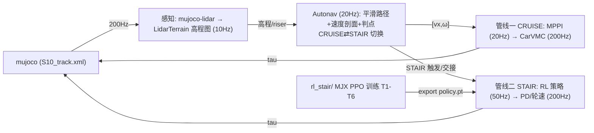

# S10 巡逻赛题 · 感知-控制工程仓库

基于山猫 S10 四足轮式机器人的**巡逻赛题**参赛方案：LiDAR 感知 + 高程地形建模 +
导航（平滑路径/速度剖面）→ 执行层 **carvmc+mppi（巡航） / rl stair（爬梯）**的
层级方案，在 MuJoCo 仿真中完成 33 航点全程巡检（历史 dial-mpc 方案已归档）。

> 完整双管线逐层详解（方法/频率/参数/论文/公开代码）见
> [doc/双数据管线_autonav_20260816.md](doc/双数据管线_autonav_20260816.md)。

## 赛题与计分

- 仿真环境（官方提供）：`S10_track.xml` 场景 + `track_overlay.xml` 33 个航点
  （000_start ~ 032_end），base 进入 wp0 的 0.2 m 水平半径开始计时，逐点推进，
  到达终点停止计时并打印耗时。
- 计分：总成绩 = 完成时间 ÷ 模式系数，得分越低排名越靠前，30 个定位点须全部
  完成。模式系数以官方 PDF 为准：**遥控 ÷1.0 / 自主跟随 ÷1.3 / 自主导航 ÷1.4**。
- 申报模式：**自主导航（÷1.4）**——Autonav 航点路径规划（平滑路径 + 速度剖面/
  判点）+ 感知地形限速/爬坡 + roll 安全，双管线执行（carvmc+mppi / rl stair）。

## 系统架构：双数据管线（2026-08-16）



| | 管线一：Autonav-MPPI-CarVMC | 管线二：Autonav-RL |
|---|---|---|
| 用途 | 巡航（平地/缓坡/横脊/弯道） | 爬梯（wp6→7 六级楼梯 + 交接） |
| 范式 | 模型驱动：采样轨迹优化 + 解析 VMC | 数据驱动：RL 策略 + 固定 PD/轮速 |
| 层级 | 感知 → Autonav → **MPPI → CarVMC** | 感知 → Autonav → **RL 策略 → PD/轮速** |
| 频率 | 10 / 20 / 20 / 200 Hz | 10 / 20 / 50 / 200 Hz |
| 当前状态 | v890 稳定（wp0→4 ≈13.5s） | box 12/12；真实 mesh 迁移瓶颈 |

两管线**共享感知层与 Autonav 层**（见下），分歧在执行层；爬梯完成/平地进入时
由 Autonav 在 CRUISE⇄STAIR 间切换，其余全部连续。

---

## 双数据管线详解

### 管线一：Autonav-MPPI-CarVMC（巡航，v890）

```
感知(10Hz) → Autonav(20Hz) → MPPI(20Hz) → CarVMC(200Hz) → tau 16 维
```

**① Autonav 层（20Hz）** —— `src/S10_sdk_deploy/s10_mpc/auto_nav.py`
Catmull-Rom 平滑路径（严格过 33 航点、C1 连续）→ 速度剖面（曲率限速
v=√(a·R)、横脊预扫描限速、高架限速）→ 单调弧长游标 + 切线投影 → 航点
严格判点；输出 [vx, ω]。
支撑：Catmull & Rom 1974；Pure Pursuit（Coulter 1992）；DWA（Fox 1997）；
TEB（Rösmann，ROS teb_local_planner）。

**② MPPI 层（20Hz，身体层）** —— `src/S10_sdk_deploy/s10_mpc/body_mppi.py`
采样式路径积分最优控制：6 状态模型 s=[x,y,yaw,vx,vy,ω]，N=4096 / H=40 /
dt=0.05（2.0s 视界）；**摩擦锥硬约束** |vx·ω|≤μ·g（采样后 clamp）；
代价 = 目标距离 + 速度偏差 + 航向偏差 + 控制平滑；softmax 加权更新 +
DBaS 自适应 σ。
支撑：Williams et al. ICRA 2016 / JGCD 2017（MPPI）；DIAL-MPC（Xue et al.，
LeCAR-Lab，本仓库 `dial-mpc/` 内置）。

**③ CarVMC 层（200Hz，执行）** —— `src/S10_sdk_deploy/s10_mpc/vmc_legs.py`
车化虚拟模型控制：**轮** = 驱动/差速转向（yaw 比例+阻尼、动态抓地钳制
μN·r）；**腿** = 主动悬架（mg/4 + roll/pitch 载荷分配 + 地形阻抗、半蹲降
质心、微 roll 内倾压弯、横脊抬轮前馈）。无门控、连续地形响应。
支撑：VMC（Pratt et al. ICRA 1997 / IJRR 2001）；WBC 载荷分配（Sentis &
Khatib 2005）；轮足高速转向（SKATER, RA-L 2024）；公开代码 go2w_rl_gym。

**结果**：wp0→4 ≈13.5s、wp0→6 30.5s 稳定（v890）；wp0→33 分段通过 18 点，
卡点 = 坡底脊区 / wp17 大弯 / wp4→5 发卡+横脊。
**入口**：`cruise_vmc_noros.py`（巡航模式）。

### 管线二：Autonav-RL（爬梯）

```
感知(10Hz) → Autonav(20Hz, CRUISE⇄STAIR) → RL 策略(50Hz) → 腿PD+轮速(200Hz) → tau 16 维
```

**① Autonav 层（20Hz，含技能切换）** —— 同管线一（平滑路径/速度剖面/判点），
并向 RL 提供导航输入：
- **已知 riser 表**（fol.STAIR_RISERS/TOPS → RL 观测 terrain ctx obs[50:54]）；
- **CRUISE⇄STAIR 切换**：高程图 riser 检测或已知表提前触发（S10_STAIR_ENTER_DIST
  =5 → y≈34.5），STAIR→CRUISE 判据 = 前方 0~3m 无 step_flag；
- **轨道航向**（TARGET_HEADING=1.5708 → heading 观测 obs[48:50]）。

> 说明：RL 观测（55 维）**不含 ref path 几何点**（爬梯段为直线任务、yaw 固定，
> 策略自控速度；nav 的 vx 指令被 rlstair_ctrl 显式忽略——代码注释
> "stair section does NOT track the nav ref_v"）。ref path 仅供管线一巡航使用。

交接流程：cruise 带速接近 → carvmc+PD 腿覆盖抬身（kp60/kd4，leg_err→0.122，
轮不停车）→ RL 接管 → 爬完（S10_PRETRANS_EXIT_Y0=40.5）平滑降回巡航。

**② RL 策略（训练，MJX 并行 PPO）** —— `rl_stair/`
PPO 非对称 actor-critic（actor 本体感知、critic 特权信息），MJX 1024 env
并行；课程 T0→T6 + 域随机化 DR（PD/扭矩/质量/摩擦/观测噪声、入梯角度）。
支撑：PPO（Schulman 2017）；legged_gym 大规模并行 RL（Rudin CoRL 2022）；
盲爬楼梯（Chamorro ICRA 2024，轮足直接对标）；DR（Tobin IROS 2017）。
公开代码：legged_gym、go2w_rl_gym。

```bash
# 训练 / 评估（仓库根目录）
XLA_PYTHON_CLIENT_MEM_FRACTION=0.6 ~/DR_competition/.venv/bin/python \
  rl_stair/train.py --num_envs 1024 --max_iters 3000 --logdir rl_stair/logs
~/DR_competition/.venv/bin/python rl_stair/eval.py \
  --ckpt rl_stair/logs/model_latest.pt --stages T3_stairs6,T6_handoff
```

课程（晋级门槛 succ≥0.35 / 回退 <0.05）：

| 阶段 | 内容 |
|---|---|
| T0 | 平地热身（4.5m 达标线） |
| T1a-d | 单阶 5 / 8.1 / 10 / 12.5 cm |
| T2a-e | 4 级阶梯 5 / 6.1 / 8 / 10 / 12.5 cm |
| T3 | 比赛 6 级（0.061 + 0.125×5，tread 0.4） |
| T6_handoff | 比赛 6 级 + 交接（yaw±1.0、vx −0.5~2.5、初始姿态 DR） |

**③ sim2sim 验证**

```bash
# 精确比赛几何 box harness（等价 6 级 riser + 10m 顶平台，CPU）
~/DR_competition/.venv/bin/python rl_stair/sim2sim_exact.py \
  --ckpt rl_stair/logs/model_latest.pt --seeds 20
# 官方 S10_track.xml 真实赛道（CPU，50Hz 策略）
~/DR_competition/.venv/bin/python rl_stair/sim2sim.py \
  --ckpt rl_stair/deploy/policy.pt --x -14.4 --y 37.0 --yaw 1.5708 --vx 1.5 --steps 1500
```

验收口径：爬完 6 级 + 后腿登顶后再走 ~1m（base_y=41.271，wp7 交接点），
risers_crossed=6/6。结果：box **12/12 直立爬完 6 级**；真实 mesh 下策略
**趴地爬行**（z 0.27~0.44 vs 直立 0.84~0.98）——sim2sim 迁移（MJX box→真实
mesh，轮驱 2.7× + 接触差异）是当前核心瓶颈；早期"96.7% 官方验收"为平地/
趴地假象已更正（`doc/figures/box_vs_real_z.png`）。

**④ 部署（集成流 cruise→RL→cruise）**

```bash
# 导出策略 → deploy/policy.pt（TorchScript）
~/DR_competition/.venv/bin/python rl_stair/export.py \
  --ckpt rl_stair/logs/model_latest.pt --out rl_stair/deploy/policy.pt
```

部署控制器 `rl_stair/deploy/rlstair_ctrl.py`：obs_np(53) → policy.pt
（torch.jit.load）→ 腿 PD（50/1，clip 48Nm）+ 轮速（kp2/vel24，clip 13.5Nm）；
S10_RL_POLICY 可 A/B 覆盖策略。集成：`cruise_vmc_noros.py` 设
`S10_VMC_MODE=rlstair` + `S10_RL_ELEV=1`。端到端验收：rlstair_ctrl 与
sim2sim_exact 逐位一致（17/20 @1.5 m/s）。

---

## 目录结构

```
DR_competition/
├── .venv/                        # 项目虚拟环境（开发机，Python 3.12）
├── comp_env/                     # 官方比赛环境专用 venv（numpy<2 + mujoco）
├── deeprobot_competition/        # 本仓库：ROS2 工作空间（git repo）
│   ├── src/S10_sdk_deploy/       # 主包：仿真/感知/导航/控制
│   │   ├── interface/robot/simulation/   # mujoco_simulation_ros2.py（仿真节点，模式 A/B 入口）
│   │   ├── perception/                   # 感知：local_map / elevation_lookup / points_to_heightmap
│   │   ├── s10_mpc/                      # ★ 导航与控制核心（见下方层级映射）
│   │   │   ├── auto_nav.py               #   AutoNavFollower（Autonav 层，20Hz）
│   │   │   ├── body_mppi.py              #   BodyMPPI（MPPI 层，20Hz）
│   │   │   ├── vmc_legs.py               #   CarVMC + LidarTerrain（CarVMC 层，200Hz）
│   │   │   ├── lidar_terrain_v2.py       #   高程图 + riser 检测（感知层）
│   │   │   └── stair_*.py                #   历史/备用楼梯控制器（已归档思路）
│   │   ├── scripts/                      # cruise_vmc_noros.py（双管线集成入口）
│   │   ├── S10_description/s10_mjcf/mjcf/# 模型与场景（S10_track.xml、new_wp30.xml、s10_mpc.xml）
│   │   └── config/ include/ third_party/ # 配置 / 头文件 / 三方库（eigen、onnxruntime、gamepad）
│   ├── rl_stair/                 # ★ RL 爬梯（管线二）
│   │   ├── train.py / ppo.py / eval.py / export.py   # MJX PPO 训练/评估/导出
│   │   ├── configs/rl_stair_config.py   # T0-T6 课程与 PPO 配置
│   │   ├── envs/s10_env.py terrain.py   # MJX 环境与地形生成
│   │   ├── deploy/rlstair_ctrl.py       # 部署控制器（策略→腿 PD + 轮速）
│   │   ├── deploy/obs_np.py             # 55 维观测编码（与训练一致）
│   │   └── sim2sim.py / sim2sim_exact.py# sim2sim 验证 harness
│   ├── dial-mpc/                 # DIAL-MPC 采样 MPC（历史主线，内置保留）
│   ├── doc/                      # 双管线/巡航/RL 文档 + figures + yaml + 官方材料
│   └── tmp/                      # 测试入口与结果分析脚本
```

**层级 → 代码位置**

| 层级/组件 | 文件 |
|---|---|
| Autonav（20Hz） | `src/S10_sdk_deploy/s10_mpc/auto_nav.py` |
| MPPI（20Hz） | `src/S10_sdk_deploy/s10_mpc/body_mppi.py` |
| CarVMC（200Hz） | `src/S10_sdk_deploy/s10_mpc/vmc_legs.py` |
| 感知（LiDAR 高程图） | `src/S10_sdk_deploy/s10_mpc/lidar_terrain_v2.py` + `perception/` |
| 双管线集成入口 | `src/S10_sdk_deploy/scripts/cruise_vmc_noros.py`（S10_VMC_MODE=cruise / rlstair） |
| RL 训练 | `rl_stair/`（train.py、ppo.py、configs/、envs/） |
| RL 部署 | `rl_stair/deploy/`（rlstair_ctrl.py、obs_np.py）+ `sim2sim*.py` |
| 仿真节点 | `src/S10_sdk_deploy/interface/robot/simulation/mujoco_simulation_ros2.py` |

## 环境与快速开始

要求：**Ubuntu 24.04 + ROS 2 Jazzy + NVIDIA GPU**。完整环境配置见
[doc/requirements.md](doc/requirements.md)（Ubuntu 22.04 安装）。

```bash
# 1) 虚拟环境 + ROS2 构建
cd ~/DR_competition
/usr/bin/python3 -m venv .venv
./.venv/bin/pip install "numpy<2" mujoco mujoco-lidar jax[cuda12]==0.4.38
cd deeprobot_competition && source /opt/ros/jazzy/setup.bash
colcon build --packages-up-to s10_sdk_deploy --cmake-args -DBUILD_PLATFORM=x86
source install/setup.bash

# 2) 模式 B 遥控（z 站起 / c 进 MPC / wasd 移动 / qe 转向）
export JAX_COMPILATION_CACHE_DIR=$HOME/.cache/s10_dial_mpc
S10_MPC_ENABLE=1 ~/DR_competition/.venv/bin/python \
  src/S10_sdk_deploy/interface/robot/simulation/mujoco_simulation_ros2.py

# 3) 模式 A 自动导航（无头加 S10_USE_VIEWER=0）
S10_MPC_ENABLE=1 S10_MODE=auto_nav ~/DR_competition/.venv/bin/python \
  src/S10_sdk_deploy/interface/robot/simulation/mujoco_simulation_ros2.py
```

> 官方比赛环境（真实 mesh S10_track.xml）使用专用 venv `comp_env`（numpy<2 + mujoco）。

## 关键参数

| 参数 | 默认 | 说明 |
| --- | --- | --- |
| `S10_USE_VIEWER` | `1` | 0 = 无头运行 |
| `S10_MODE` | `remote` | `auto_nav` = 模式 A 自动导航 |
| `S10_MPC_ENABLE` | `0` | `1` 启用 MPC 控制 |
| `S10_LIDAR_BACKEND` | `cpu` | WSL 下勿用 taichi（core dump） |
| `S10_VMC_MODE` | `wbc` | `rlstair` = RL 爬梯（管线二）；`cruise` = 巡航（管线一） |
| `S10_RL_POLICY` | `deploy/policy.pt` | RL 策略路径覆盖（A/B 评估） |
| `S10_PRETRANS_Y0 / EXIT_Y0` | `32.0 / 40.5` | RL 交接进入/退出位置 |
| `S10_STAIR_ENTER_DIST` | `5` | 已知楼梯表提前触发距离 |

## 手动控制（仿真窗口）

- `z`：默认位置 / `c`：RL 控制默认位置
- `w/a/s/d`：前后左右平移 / `q/e`：逆/顺时针旋转
- `Ctrl` + 右键双击 body：跟踪该 body；`Esc`：停止跟踪

## 当前进度与待办（2026-08-16）

- **管线一（巡航 carvmc+mppi，v890 稳定）**：wp0→4 ≈13.5s、wp0→6 30.5s；
  wp0→33 分段通过 18 点，卡点 = 坡底脊区 / wp17 大弯 / wp4→5 发卡+横脊。
- **管线二（RL 爬梯）**：MJX PPO T1-T6 训练中；box 地形 12/12 直立爬完 6 级；
  交接根因链已修复（riser 表 / PD 腿覆盖过渡 / STAIR 提前触发）。
  **核心瓶颈 = sim2sim 迁移（MJX box → 真实 mesh）**：真实 mesh 下策略
  趴地爬行（z 0.27~0.44 vs 直立 0.84~0.98），早期"96.7% 官方验收"为
  平地/趴地假象已更正（图 `doc/figures/box_vs_real_z.png`）。
- 待办：① 真实 mesh 直立爬迁移（C++ 训练 env 重构 或 更强 DR + real-mesh
  eval 闭环）；② wp6→7 全流程连续成功；③ 33 航点全程；④ 真机迁移；
  ⑤ 初赛材料（8.20 技术方案 PDF + Demo + GitHub 链接）。

## 相关文档

- **[doc/双数据管线_autonav_20260816.md](doc/双数据管线_autonav_20260816.md) —— 双数据管线逐层详解（方法/频率/参数/论文/公开代码）**
- **[doc/carvmc_方案与数据管线_20260810.md](doc/carvmc_方案与数据管线_20260810.md) —— 巡航 carvmc+mppi（v890）方案与数据管线**
- [doc/RL_stair_方案_20260814.md](doc/RL_stair_方案_20260814.md) —— RL-Stair 技能方案（定稿 v3）
- [doc/RL_stair_最终验收_20260815.md](doc/RL_stair_最终验收_20260815.md) —— RL-Stair 最终验收（含假象更正）
- [doc/RL_stair_迁移达标方案_95percent.md](doc/RL_stair_迁移达标方案_95percent.md) —— 迁移达标方案（阶段0-3）
- [doc/RL_stair_go2w_s10_参数审计_20260815.md](doc/RL_stair_go2w_s10_参数审计_20260815.md) —— go2w/S10 参数审计
- [doc/RL_stair_奖励增强_4项_20260815.md](doc/RL_stair_奖励增强_4项_20260815.md) —— 奖励增强 4 项
- [doc/requirements.md](doc/requirements.md) —— 环境安装要求
- [doc/s10_mpc_deploy.yaml](doc/s10_mpc_deploy.yaml) —— 部署配置
- `doc/比赛规则_赛道四_具身未来.md` / `赛道四_具身未来.pdf` —— 官方规则
- `doc/Airy雷达用户手册.pdf` / `Airy User Guide.pdf` / `hardware spec.pdf` —— 真机硬件资料