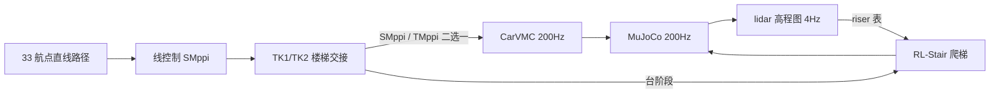

# S10 巡逻赛题 · SMppi/TMppi Cruise + RL-Stair + TK1/TK2（定稿）

> 技术路线：33 航点直线路径 + **SMppi 走线 / TMppi 原地转** + **CarVMC 巡航执行** +
> **RL-Stair 爬梯** + **TK1/TK2 楼梯交接**，纯 Python + MuJoCo，无需 ROS。
> 方案已定稿（2026-08-20），代码、参数与文档对齐。完整方案见
> [总体方案（定稿）](SMppi_TMppi_Cruise_RL-Stair_TK1_TK2/SMppi_TMppi_Cruise_RL-Stair_TK1_TK2_总方案_v3_当前版.md)。

## 1. 技术方案

| 模块 | 职责 | 关键点 |
| --- | --- | --- |
| **SMppi** | 直线巡航 | 采样规划 N=1024、H=40（2s 视界）、40Hz；终点代价 + 到点减速剖面 |
| **TMppi** | 近点转向 | 航点附近原地对准；om=K·err−KD·ω（终端阻尼，停稳不甩） |
| **TK1** | 楼梯前交接 | 对准爬升轴、限速交付 RL-Stair |
| **TK2** | 楼梯后交接 | 四轮登顶→对准下一航点→交回 SMppi/TMppi |
| **RL-Stair** | 台阶爬升 | 车载 lidar 在线 riser 表 + 预训练 policy（50Hz 推理） |
| **CarVMC** | 巡航执行（200Hz） | 轮速 PID+差速偏航+半蹲腿 PD+姿态环+地形跟踪 |

分层架构：共享 lidar 感知（4Hz 增量）→ 导航/规划同拍（40Hz）→ 双管线执行（200Hz）。
模式切换时速度、航向、姿态连续（decel 插值 + PRETRANS 站姿预过渡）。

## 2. 控制频率

| 层 | 频率 | 说明 |
| --- | --- | --- |
| MuJoCo 仿真 | 200Hz | DT=0.005，S10_track.xml |
| 执行层 CarVMC / RL-Stair | 200Hz | 每仿真步一次 |
| 导航 / 规划 / 模式 tick | 40Hz | SMppi / TMppi / TK1 / TK2 / 判点 / 模式 |
| RL policy | 50Hz | decimation=4，动作零阶保持到 200Hz PD |
| lidar 高程图 | 4Hz 增量 | 96×48 地形射线，mount+0.6m |
| MPPI 视界 | 2s | N=1024、H=40、rollout dt=0.05 |

## 3. 数据管线



**40Hz 控制合成链**（按序合成，后写覆盖先写）：

    ① 线控制：段航向 + 横向纠偏；近点直瞄航点；sqrt 刹车剖面
    ② 近点转向：TMppi 原地对准（终端阻尼）
    ③ 楼梯前：TK1 对准爬升轴、限速交付
    ④ 台阶：RL-Stair 接管（riser 表 → policy → 腿 PD + 轮速）
    ⑤ 楼梯后：TK2 登顶对准下一航点、交回 SMppi/TMppi
    ⑥ 规划二选一：SMppi（巡航）/ TMppi（近点转向）
    ⑦ 航点推进：半径判点
    ⑧ cmd{速度,转向,姿态} → CarVMC / RL-Stair → 16 维力矩 → 仿真

**感知管线**：96×48 地形射线（法向 |nz|≥0.6 滤竖直面）→ h/hmax 双栅格（0.05m）→
16×16m 瓦片 → 沿路径最高剖面 riser 检测（多级/单级）→ 在线 riser 表 → RL-Stair
实时更新爬升参考。仅用车载 lidar，无世界系 ray_cast、无避障 costmap。

## 4. 目录结构

```
deeprobot_competition/
├── SMppi_TMppi_Cruise_RL-Stair_TK1_TK2/   # ★ 当前主链路（模块化）
│   ├── cruise_main.py                      # 200Hz 主循环（40Hz 控制合成链）
│   ├── nav_waypoint.py / smppi.py / tmppi.py
│   ├── carvmc.py / stair_mode.py / perception_lidar.py
│   ├── rlstair_ctrl.py / rlstair_obs.py / policy.pt
│   ├── plot_traj_speed.py
│   ├── run_smppi_tmppi_cruise_rlstair_tk12.sh   # ★ 启动脚本
│   └── SMppi_TMppi_Cruise_RL-Stair_TK1_TK2_总方案_v3_当前版.md  # 总体方案（定稿）
├── src/S10_sdk_deploy/
│   ├── S10_description/s10_mjcf/           # S10_track.xml + meshes（官方环境）
│   └── s10_mpc/                            # auto_nav / body_mppi / lidar_terrain_v2 / vmc_legs
├── rl_stair/                               # RL-Stair 训练/评估/导出/部署 + sim2sim 验证
└── doc/                                    # 技术方案/规则/硬件/环境文档
```

## 5. 快速开始

```bash
# 主链路：wp0→33 全程（无 ROS）
cd ~/DR_competition/0810new/deeprobot_competition
bash SMppi_TMppi_Cruise_RL-Stair_TK1_TK2/run_smppi_tmppi_cruise_rlstair_tk12.sh

# 有头（MuJoCo viewer 实时跟随机器人，需 WSLg/X11）
S10_USE_VIEWER=1 bash SMppi_TMppi_Cruise_RL-Stair_TK1_TK2/run_smppi_tmppi_cruise_rlstair_tk12.sh

# RL-Stair 训练 / 评估 / 导出 / sim2sim
XLA_PYTHON_CLIENT_MEM_FRACTION=0.6 ~/DR_competition/.venv/bin/python \
  rl_stair/train.py --num_envs 1024 --max_iters 3000 --logdir rl_stair/logs
~/DR_competition/.venv/bin/python rl_stair/eval.py \
  --ckpt rl_stair/logs/model_latest.pt --stages T3_stairs6,T6_handoff
~/DR_competition/.venv/bin/python rl_stair/export.py \
  --ckpt rl_stair/logs/model_latest.pt --out rl_stair/deploy/policy.pt
```

环境：Ubuntu 24.04 + Python 3.12，numpy<2.0 + mujoco 3.11.0 + torch CPU（官方比赛口径），
详见 [doc/requirements.md](doc/requirements.md)。

## 6. 关键参数（定稿值，与启动脚本一致）

| 模块 | 关键参数 |
| --- | --- |
| SMppi | N=1024 H=40 dt=0.05 STOP_DX=3.5 A_MAX=8.0 OMAX=2.5 W_GUIDE=2.5 W_DIST=2.0 W_HEAD=2.0 MU=0.36 |
| TMppi | K=3.0 KD=1.5 OM_MAX=1.5 V_MAX=4.5 TURN_VX=0.2 |
| TK1 | VX=1.0 YAW_K=2.5 YAW_MAX=1.5 LOOKAHEAD=8.0 |
| TK2 | VX=1.2 YAW_K=2.5 YAW_MAX=1.0 |
| RL-Stair | RL_VX=2.0 WARMUP=200 ENTER_DIST=2.0 EXIT_VX=1.0 PRETRANS 3.0/1.5/3.0/2.0 |
| CarVMC | KPH=300 KDH=60 WHEEL_K=12 WHEEL_D=0.02 TERRAIN_LP=0.4 TERRAIN_LOOKAHEAD=0.35 KP_ROLL=150 KD_ROLL=20 ROLL_K=0.05 ROLL_AMP=0.10 Z_DES_OFFSET=0.26 YAW_K_WHEEL=80 WHEEL_TMAX=13.5 |
| 感知/判点 | ELEV_HZ=4 LOOKAHEAD=8.0 CLIMB_TH=0.2 WP_ADVANCE_DIST=0.6 |

## 7. 验收标准（总体方案 §6）

- 每两航点间用时 <5s；该段直线距离 >5m 放宽至 <8s；整场 ≤120s；
- 力矩合规（腿 ≤48/50 Nm、轮 ≤13.5/14 Nm、连续超限 ≤0.5s）；全程无侧翻；
- 验证流程：120s 全链连跑 + 逐腿计时 + 轨迹回放存档（见总体方案 §7）。

## 8. 相关文档

- [SMppi_TMppi_Cruise_RL-Stair_TK1_TK2_总方案_v3_当前版.md](SMppi_TMppi_Cruise_RL-Stair_TK1_TK2/SMppi_TMppi_Cruise_RL-Stair_TK1_TK2_总方案_v3_当前版.md) —— 总体方案（定稿）
- [doc/requirements.md](doc/requirements.md) —— 环境安装
- [doc/RL_stair_方案_20260814.md](doc/RL_stair_方案_20260814.md) / 最终验收 / 迁移达标 / 参数审计 / 奖励增强
- doc/比赛规则_赛道四_具身未来.md / 赛道四_具身未来.pdf —— 官方规则与计分