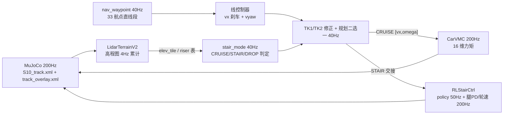

# S10 巡逻赛题 · SMppi/TMppi Cruise + RL-Stair + TK1/TK2

基于山猫 S10 四足轮式机器人的**巡逻赛题**参赛方案。当前主线（2026-08-19 模块化重构，代码对齐版）：
33 个直线航点 + **SMppi 走线 / TMppi 原地转** + **CarVMC 巡航执行** + **RL-Stair 爬梯** +
**TK1/TK2 楼梯交接**，在 MuJoCo 官方 `S10_track.xml` 中完成 wp0→wp33 全程巡检。

> 唯一方案文档：
> [SMppi_TMppi_Cruise_RL-Stair_TK1_TK2_总方案.md](SMppi_TMppi_Cruise_RL-Stair_TK1_TK2/SMppi_TMppi_Cruise_RL-Stair_TK1_TK2_总方案.md)
> （2026-08-19，与代码对齐）。历史方案（dial-mpc、旧单体 MPPI、双数据管线、costmap 避障等）
> 已从工作区与仓库中清理。

## 技能分工（用户口径）

| 技能 | 职责 | 关键点 |
| --- | --- | --- |
| **SMppi** | 直线段走线保持（BodyMPPI 采样规划） | 只做航向保持 / 快加速 / 到点减速，**不过弯**；40Hz、N=1024、H=40（2s 视界）、终点代价 |
| **TMppi** | 航点原地转向（四轮差速） | dist<0.5m 且 speed<0.8 且 无楼梯 ahead， \|yaw_err\|>10° 触发；转完交回 SMppi |
| **CarVMC** | 巡航执行器（200Hz，16 维力矩） | 轮速 PID + 差速 yaw + 半蹲腿；防打滑仅实际 vx>0.5 启用 |
| **RL-Stair** | 接管一切 riser（多级楼梯 + ≥8cm 单级台阶） | policy.pt 55 维观测→16 动作；腿 PD 50Hz + 轮速 200Hz；riser 表全部来自 lidar 在线检测 |
| **TK1** | 楼梯前交接 | 减速由 SMppi 终点代价负责，TK1 只做对准（<1s，总预算 <2s）；交付 vx≤1.5 m/s |
| **TK2** | 楼梯后交接 | 四轮上顶后对准下一航点（<1s），交回 SMppi/TMppi |
| **DROP** | 下行落差（≥8cm 跌落沿） | 不交 RL，强制 0.3 m/s 低速爬行兜底 |

## 主链路



详细状态机、时序预算、测试矩阵（T1–T8）与待确认事项见
[总方案](SMppi_TMppi_Cruise_RL-Stair_TK1_TK2/SMppi_TMppi_Cruise_RL-Stair_TK1_TK2_总方案.md)。

## 赛题与计分

- 场景：`src/S10_sdk_deploy/S10_description/s10_mjcf/mjcf/S10_track.xml`，
  33 个 `track_waypoint_000_start` ~ `track_waypoint_032_end`；base 进入 wp0 的
  0.2 m 水平半径开始计时，到 wp32 停止计时。
- 计分：总成绩 = 完成时间 ÷ 模式系数（遥控 ÷1.0 / 自主跟随 ÷1.3 / 自主导航 ÷1.4），
  得分越低越好；必须完成全部定位点。申报模式：**自主导航（÷1.4）**。
- 力矩硬约束：连续超限 >0.5 s 判不合格；仓库验收口径：腿 \|τ\|≤48 Nm、
  轮 \|τ\|≤13.5 Nm（官方阈值以组委会技术说明为准）。

## 目录结构

```
deeprobot_competition/
├── SMppi_TMppi_Cruise_RL-Stair_TK1_TK2/    # ★ 当前主链路（模块化，2026-08-19）
│   ├── cruise_main.py                       # 200Hz 主循环（状态机/线控/TK/判点/traj）
│   ├── nav_waypoint.py                      # 航点提取 + 直线段输出
│   ├── smppi.py / tmppi.py                  # SMppi 走线 / TMppi 原地转
│   ├── carvmc.py / stair_mode.py            # CarVMC 执行 / CRUISE-STAIR 门控
│   ├── perception_lidar.py                  # lidar 高程图 + riser/heading 检测
│   ├── rlstair_ctrl.py / rlstair_obs.py     # RL 控制器 / 55 维观测编码
│   ├── policy.pt                            # RL 策略（55→16，tanh）
│   ├── plot_traj_speed.py                   # 轨迹 xy-速度图
│   ├── run_smppi_tmppi_cruise_rlstair_tk12.sh   # ★ 启动脚本
│   └── SMppi_TMppi_Cruise_RL-Stair_TK1_TK2_总方案.md
├── src/S10_sdk_deploy/
│   ├── S10_description/s10_mjcf/            # S10_track.xml / track_overlay.xml / meshes
│   └── s10_mpc/
│       ├── auto_nav.py                      # 航点折线 + 模式门控（StairGate 底层）
│       ├── body_mppi.py                     # SMppi 采样内核（BodyMPPI）
│       ├── lidar_terrain_v2.py              # 高程图 + 墙通道 + riser 检测
│       └── vmc_legs.py                      # CarVMC 轮足执行（含 car_omega_limit）
├── rl_stair/                                # ★ RL-Stair 训练/评估/导出/部署
│   ├── train.py / ppo.py / eval.py / export.py
│   ├── configs/rl_stair_config.py           # T0-T6 课程 + PPO 配置
│   ├── envs/s10_env.py / terrain.py         # MJX 环境与地形
│   ├── deploy/                              # rlstair_ctrl.py / obs_np.py / elev_tile.py
│   └── sim2sim.py / sim2sim_exact.py        # 比赛赛道验证
├── doc/                                     # 官方规则/硬件资料 + RL 文档 + 环境要求
└── README.md
```

## 快速开始

要求：**Ubuntu 24.04（开发机为 WSL2）+ NVIDIA GPU**，纯 Python + MuJoCo，**无需 ROS**。
完整依赖见 [doc/requirements.md](doc/requirements.md)。

```bash
# 当前主链路：wp0→33 全程巡检（无 ROS）
cd ~/DR_competition/0810new/deeprobot_competition
bash SMppi_TMppi_Cruise_RL-Stair_TK1_TK2/run_smppi_tmppi_cruise_rlstair_tk12.sh
# 等价于：cd SMppi_TMppi_Cruise_RL-Stair_TK1_TK2 && ~/DR_competition/.venv/bin/python cruise_main.py
```

### RL-Stair 训练 / 评估 / 导出 / sim2sim

```bash
# 仓库根目录
XLA_PYTHON_CLIENT_MEM_FRACTION=0.6 ~/DR_competition/.venv/bin/python \
  rl_stair/train.py --num_envs 1024 --max_iters 3000 --logdir rl_stair/logs
~/DR_competition/.venv/bin/python rl_stair/eval.py \
  --ckpt rl_stair/logs/model_latest.pt --stages T3_stairs6,T6_handoff
~/DR_competition/.venv/bin/python rl_stair/export.py \
  --ckpt rl_stair/logs/model_latest.pt --out rl_stair/deploy/policy.pt
~/DR_competition/.venv/bin/python rl_stair/sim2sim_exact.py \
  --ckpt rl_stair/logs/model_latest.pt --seeds 20
```

## 关键参数（run_smppi_tmppi_cruise_rlstair_tk12.sh 实际值）

| 参数 | 当前值 | 说明 |
| --- | --- | --- |
| `S10_NAV_HZ` | `40` | 规划/模式/判点控制拍（40Hz，预算 25ms） |
| `VMC_MPPI_N / H / S10_MPPI_DT` | `1024 / 40 / 0.05` | SMppi 样本 / 视界步数（2s 视界） |
| `S10_MPPI_CTRL_DT` | `0.025` | 输出 slew 与 rollout dt 解耦（1/40s） |
| `S10_MPPI_A_MAX / OMAX` | `3.5 / 2.5` | 加速度 / 转向上限 |
| `S10_SMppi_STOP_DX / W_TPOS / W_TV` | `4.0 / 10.0 / 10.0` | 终点代价（到点速度自动归零） |
| `S10_TURN_ARRIVE_R / V_MAX / ERR_DEG / K` | `0.5 / 0.8 / 10 / 3.0` | TMppi 触发半径 / 释放误差 / 增益 |
| `S10_LINE_VMAX / BRAKE_DIST` | `4.0 / 3.5` | 直线速度上限 / 到点线性刹车距离 |
| `S10_VMC_OM_CAP` | `1.0` | SMppi 最终 omega 上限（TMppi 独立于它） |
| `S10_VMC_WHEEL_K / D` | `12.0 / 0.02` | 轮速 PID |
| `S10_CAR_SLIP_VX_GATE` | `0.5` | 防打滑仅实际 vx>0.5 启用 |
| `S10_ELEV_HZ / S10_LIDAR_WALL` | `4 / 1` | lidar 高程图频率 / 墙通道 |
| `S10_STAIR_SINGLE_RISE / ELEV_DROP_TH` | `0.08 / 0.08` | 单级台阶≥8cm 也交 RL / 下行落差阈值 |
| `S10_TK1_VX / YAW_DB` | `1.5 / 0.20` | TK1 交付速度 / 航向门控 |
| `S10_TK2_VX / YAW_DB` | `1.2 / 0.25` | TK2 对准速度 / 航向门控 |
| `S10_STAIR_WHEEL_CLEAR` | `0.05` | 四轮越顶容差（STAIR→CRUISE） |
| `S10_RL_WARMUP / PRETRANS` | `200 / 1` | RL 热身步 / 距离式预交接 |
| `S10_VMC_WHEEL_TMAX` | `13.5` | 轮力矩上限（Nm） |

## 当前状态与待确认（2026-08-19）

- **已落地**：SMppi/TMppi 分离（40Hz、2s 视界、终点代价）；TK1/TK2 门控（对准各 <1s）；
  RL-Stair 接管一切 riser（含 ≥8cm 单级）；DROP 慢爬兜底；避障 costmap、god-view 预扫描、
  硬编码楼梯表、抬轮前馈已全部删除。
- **待验证**：代码全部修改完成、编译通过，**尚未跑通**；测试矩阵 T1（首跑 smoke）→
  T8（RL 单级 12.5cm eval）见总方案 §10。
- **待确认事项**（总方案 §12）：
  1. 模块命名口径：SMppi=走线 / TMppi=原地转（文档与实现一致）。
  2. RL 单级 12.5cm 上步未验证（课程 T1d 曾删除）——T8 先行。
  3. 下行 riser：当前 DROP 慢爬兜底（RL 未练下行）；若要 RL 接管下行需补课程微调。
- **历史成绩（勿作为当前主链结果）**：RL-Stair 官方环境 96.7%（29/30）；
  旧 MPPI 配置 wp0→4≈13.5s / wp0→6≈30.5s。

## 相关文档

- **[SMppi_TMppi_Cruise_RL-Stair_TK1_TK2_总方案.md](SMppi_TMppi_Cruise_RL-Stair_TK1_TK2/SMppi_TMppi_Cruise_RL-Stair_TK1_TK2_总方案.md) —— 当前主线唯一方案（2026-08-19）**
- [doc/RL_stair_方案_20260814.md](doc/RL_stair_方案_20260814.md) —— RL-Stair 训练方案（v3）
- [doc/RL_stair_最终验收_20260815.md](doc/RL_stair_最终验收_20260815.md)、
  [doc/RL_stair_迁移达标方案_95percent.md](doc/RL_stair_迁移达标方案_95percent.md)、
  [doc/RL_stair_参数审计_20260815.md](doc/RL_stair_参数审计_20260815.md)、
  [doc/RL_stair_奖励增强_4项_20260815.md](doc/RL_stair_奖励增强_4项_20260815.md)
- [doc/requirements.md](doc/requirements.md) —— 环境与依赖
- [doc/比赛规则_赛道四_具身未来.md](doc/比赛规则_赛道四_具身未来.md) / 赛道四_具身未来.pdf —— 官方规则与计分
- doc/Airy User Guide.pdf / Airy雷达用户手册.pdf / hardware spec.pdf —— 硬件资料
