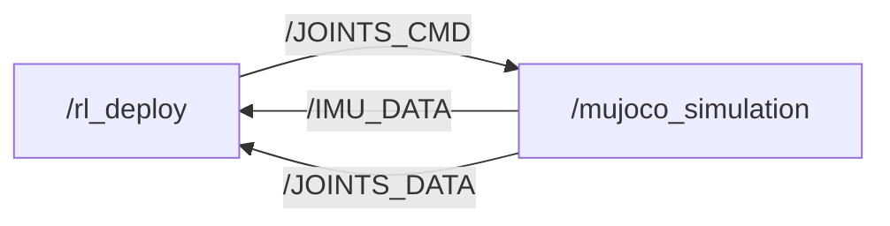

# S10 Perception Racing Contest

[](https://discord.gg/gdM9mQutC8)

## Overview

This repository provides the ROS 2 and MuJoCo simulation environment for a contest focused on racing the S10 robot around a waypoint track using perception. Participants train their own perception-based locomotion policy to control the S10 robot in the provided track scene.

The default MuJoCo scene is `S10_track.xml`, which includes:

- the unscaled S10 robot model from `S10.xml`. The corresponding URDF of S10 is `S10.urdf`.
- the scaled environment from `scene.xml`
- the visual waypoint track from `track_overlay.xml`



## Competition Task

The goal is to complete the waypoint course as quickly as possible. During the track scene, waypoint progress is checked in order. When the robot base enters a `0.2 m` horizontal radius of waypoint 0, the timer starts and that waypoint disappears. Each following waypoint disappears only after the previous one has been reached. When the final waypoint is reached, the timer stops and the elapsed simulation time is printed in the terminal.

Participants are expected to train their own policy with perception. This policy should serve as the locomotion policy for controlling the S10 robot. Participants will need to implement a simulated lidar or depth camera in MuJoCo and use that sensor input as part of their policy pipeline.

For simulation, participants are not required to build a SLAM algorithm. You may directly use the ground truth robot position from MuJoCo. Navigation is optional; if you implement navigation, the final elapsed time will be divided by `1.2` for scoring.

## Setup

Use Ubuntu 24.04 with ROS 2 Jazzy. Source ROS before building:

```bash
pip install "numpy < 2.0" mujoco
git clone https://github.com/DeepRoboticsLab/goai_embodied_future_material.git

cd goai_embodied_future_material
source /opt/ros/jazzy/setup.bash
colcon build --packages-up-to s10_sdk_deploy --cmake-args -DBUILD_PLATFORM=x86
```

Use `-DBUILD_PLATFORM=arm` when building for the S10 robot target.

## Run Simulation

Open two terminals.

Terminal 1:

```bash
export ROS_DOMAIN_ID=1
source install/setup.bash
ros2 run s10_sdk_deploy rl_deploy
```

Terminal 2:

```bash
export ROS_DOMAIN_ID=1
source install/setup.bash
python3 src/S10_sdk_deploy/interface/robot/simulation/mujoco_simulation_ros2.py
```

To load a custom MJCF, for example after adding a lidar or depth camera:

```bash
S10_MUJOCO_XML=/absolute/path/to/model.xml \
python3 src/S10_sdk_deploy/interface/robot/simulation/mujoco_simulation_ros2.py
```

## Simulator Parameters

The following parameters are defined near the top of
`src/S10_sdk_deploy/interface/robot/simulation/mujoco_simulation_ros2.py`.
Restart the simulator after changing them.

| Parameter | Default | Description |
| --- | --- | --- |
| `USE_VIEWER` | `True` | Enables or disables the MuJoCo viewer. |
| `TRACK_VIEWER` | `False` | Makes the viewer camera follow `TRACK_BODY_NAME` when the simulator starts. |
| `CAMERA_AZIMUTH` | `90` | Initial horizontal camera angle in degrees. |
| `CAMERA_ELEVATION` | `-25` | Initial vertical camera angle in degrees. |
| `CAMERA_DISTANCE` | `18.0` | Initial camera distance from the robot. |
| `TRACK_START_BASE_POS` | `[0.0, -2.5, 0.2]` | Initial robot base position in `[x, y, z]` order. |
| `TRACK_BODY_NAME` | `"base_link"` | MuJoCo body used for waypoint progress and startup camera tracking. |

## Hardware Spec (Lidar)
Please refer to the files inside this doc: /home/pb/goai_embodied_future_material/doc.

## Manual Controls

In the simulator window:

- `z`: default position
- `c`: RL control default position
- `w/a/s/d`: forward, leftward, backward, rightward
- `q/e`: rotate counterclockwise or clockwise
- `Ctrl` + right-double-click a body: start camera tracking for that body
- `Esc`: stop camera tracking and return to the free camera

Right-click the simulator window and select "always on top" if it loses focus during testing.
