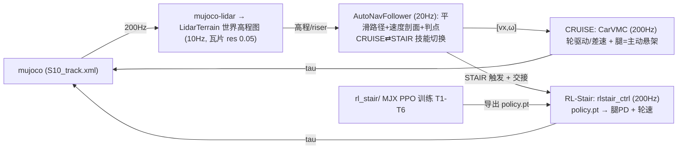

# S10 巡逻赛题 · 感知-控制工程仓库

基于山猫 S10 四足轮式机器人的**巡逻赛题**参赛方案：LiDAR 感知 + 高程地形建模 +
导航（平滑路径/速度剖面）→ **CarVMC 车化控制**（轮驱动/差速 + 腿=主动悬架）的
层级方案，其中巡航与爬梯由 **CarVMC 车化巡航 + RL-Stair 爬梯**双技能实现，
在 MuJoCo 仿真中完成 33 航点全程巡检（历史 dial-mpc 方案已归档）。

> **总方案主文档（维护入口）：[doc/方案总纲_MASTER.md](doc/方案总纲_MASTER.md)**；
> 完整工程文档见 [doc/0808.md](doc/0808.md)；参数唯一来源为
> [doc/s10_mpc_deploy.yaml](doc/s10_mpc_deploy.yaml)。

## 赛题与计分

- 仿真环境（官方提供）：`S10_track.xml` 场景 + `track_overlay.xml` 33 个航点
  （000_start ~ 032_end），base 进入 wp0 的 0.2 m 水平半径开始计时，逐点推进，
  到达终点停止计时并打印耗时。
- 计分：总成绩 = 完成时间 ÷ 模式系数，得分越低排名越靠前，30 个定位点须全部
  完成。模式系数以官方 PDF 为准：**遥控 ÷1.0 / 自主跟随 ÷1.3 / 自主导航 ÷1.4**
  （本仓库早期 README 中"导航 ÷1.2"为旧表述，已废弃）。
- 申报模式：**自主跟随（÷1.3）**——航点跟随 + 感知地形限速/爬坡 + roll 安全，
  不强制全局 A\*。

## 系统架构（2026-08-16）



- **感知**：mujoco-lidar 扇形射线（lidar_site 前下 45°，96×48 加密，RAISE_Z 抬高安装）
  → `LidarTerrain` **世界栅格累积高程图**（60×60 瓦片 res=0.05、增量更新、
  运动学 fallback、riser 检测）；楼梯区以**已知地图**（riser 表 y/top/dh）提前触发。
- **导航**：Catmull-Rom 平滑路径（切线因子）+ 曲率/横脊/高架限速速度剖面 +
  单调弧长游标/切线投影 + 航点严格判点，20Hz 输出 [vx, ω]；CRUISE/STAIR
  唯一离散门控由高程图感知确认 + 已知楼梯表提前触发。
- **巡航控制**：CarVMC（车化，200Hz）——轮=驱动+差速转向（yaw 比例+阻尼、
  动态抓地钳制按载荷），腿=主动悬架（mg/4+roll/pitch 分配+地形阻抗），
  半蹲降质心、微 roll 内倾压弯；横脊单步跨越/抬轮前馈；无门控、连续地形响应。
- **爬梯控制（RL，当前主线）**：`rl_stair/`（MJX 并行 PPO，T1-T6 课程：
  单阶→混合楼梯+双横脊→爬梯交接，入梯角度随机化 + 域随机化 DR 等）；
  策略导出 `deploy/policy.pt` 后由 `rlstair_ctrl.py`（腿 PD 50/1 +
  轮速伺服）部署到 C++ MuJoCo 真实赛道，`sim2sim_exact.py` 精确几何 harness 验收。
- **交接流程（用户设计）**：cruise 带速度/角度接近 → carvmc+PD 腿覆盖抬升
  身体（不停车、不刹 0）→ RL 直接接管爬梯（STAIR 已知地图提前触发，
  y≈34.5）→ 爬完楼梯后平滑降回巡航半蹲（S10_PRETRANS_EXIT_*）。
- **历史（已归档）**：dial-mpc MBDPI 巡航、StairWBC 位置基、NmpcWBC M1
  系列（155 实验）、DiAL 分层——实验链与结论见 `_archive_20260810/`、
  `_archive_20260815/` 与 doc/0808.md。

## 目录结构

```
DR_competition/
├── .venv/                       # 项目虚拟环境（Python 3.12.3，开发机）
├── comp_env/                    # 官方比赛环境专用 venv（numpy<2 + mujoco 3.11）
├── deeprobot_competition/       # 本仓库：ROS2 工作空间
│   ├── src/S10_sdk_deploy/      # 仿真节点/感知/导航/控制器/模型
│   ├── rl_stair/                # RL 爬梯训练（MJX PPO + sim2sim 迁移部署）
│   ├── dial-mpc/                # dial-mpc 采样 MPC 库（历史，内置保留）
│   ├── doc/                     # MASTER/0808 + RL 文档 + figures + yaml + 官方材料
│   └── tmp/                     # 核心测试入口与结果分析脚本
（refs/ 参考仓库与 _archive_* 旧归档位于仓库外，可从 GitHub 重新 clone）
```

## 环境与快速开始

要求：**Ubuntu 24.04 + ROS 2 Jazzy + NVIDIA GPU（可选，CPU 可跑但慢）**。
完整环境配置（含包版本）见 `doc/0808.md` §3；Ubuntu 22.04 安装见
[doc/requirements.md](doc/requirements.md)。

```bash
# 1) 虚拟环境（仓库根目录，注意在 deeprobot_competition 上一级）
cd ~/DR_competition
/usr/bin/python3 -m venv .venv
./.venv/bin/pip install "numpy<2" mujoco mujoco-lidar jax[cuda12]==0.4.38

# 2) 构建 ROS2 工作空间
cd ~/DR_competition/deeprobot_competition
source /opt/ros/jazzy/setup.bash
colcon build --packages-up-to s10_sdk_deploy --cmake-args -DBUILD_PLATFORM=x86
source install/setup.bash

# 3) 模式 B 遥控（窗口内 z 站起 / c 进入 MPC / wasd 移动 / qe 转向）
export JAX_COMPILATION_CACHE_DIR=$HOME/.cache/s10_dial_mpc
S10_MPC_ENABLE=1 ~/DR_competition/.venv/bin/python \
  src/S10_sdk_deploy/interface/robot/simulation/mujoco_simulation_ros2.py

# 4) 模式 A 自动导航（无头加 S10_USE_VIEWER=0）
S10_MPC_ENABLE=1 S10_MODE=auto_nav ~/DR_competition/.venv/bin/python \
  src/S10_sdk_deploy/interface/robot/simulation/mujoco_simulation_ros2.py
```

RL 训练 / 评估 / 导出 / sim2sim（仓库根目录，WSL）：

```bash
cd ~/DR_competition/deeprobot_competition
# 训练（256 env，课程 T0→T6）
XLA_PYTHON_CLIENT_MEM_FRACTION=0.6 ~/DR_competition/.venv/bin/python \
  rl_stair/train.py --num_envs 256 --max_iters 30000 --logdir rl_stair/logs
# 评估 checkpoint
~/DR_competition/.venv/bin/python rl_stair/eval.py \
  --ckpt rl_stair/logs/model_latest.pt --stages T3_stairs6,T6_handoff
# 导出 → deploy/policy.pt
~/DR_competition/.venv/bin/python rl_stair/export.py \
  --ckpt rl_stair/logs/model_latest.pt --out rl_stair/deploy/policy.pt
# 比赛赛道 wp6→7 验证（CPU mujoco，不占训练 GPU）
~/DR_competition/.venv/bin/python rl_stair/sim2sim.py --ckpt rl_stair/deploy/policy.pt
```

> 官方比赛环境（真实 mesh S10_track.xml）使用专用 venv `comp_env`
> （`pip install "numpy<2.0" mujoco`）；部署验收走 `rl_stair/sim2sim_exact.py`
> 与集成流 `cruise_vmc_noros.py`（S10_VMC_MODE=rlstair + S10_RL_ELEV=1）。

## 仿真器常用参数

| 参数 | 默认 | 说明 |
| --- | --- | --- |
| `S10_USE_VIEWER` | `1` | 0 = 无头运行 |
| `S10_MODE` | `remote` | `auto_nav` = 模式 A 自动导航 |
| `S10_MPC_ENABLE` | `0` | `1` 启用 MPC 控制 |
| `S10_MUJOCO_SCENE` | `track` | 场景（S10_track.xml） |
| `S10_LIDAR_BACKEND` | `cpu` | WSL 下勿用 taichi（core dump） |
| `S10_LIDAR_FREQ` | `10` | LiDAR 频率 (Hz) |
| `S10_VMC_MODE` | `wbc` | `rlstair` = RL 爬梯模式；`stairwbcqp` = WBC-QP |
| `S10_RL_POLICY` | `deploy/policy.pt` | RL 策略路径覆盖（A/B 评估） |
| `S10_PRETRANS_Y0/EXIT_Y0` | `32.0 / 40.5` | RL 交接进入/退出位置 |

完整环境变量表见 `doc/0808.md` §6；手动键盘控制见下文。

## 手动控制（仿真窗口）

- `z`：默认位置 / `c`：RL 控制默认位置
- `w/a/s/d`：前后左右平移 / `q/e`：逆/顺时针旋转
- `Ctrl` + 右键双击 body：跟踪该 body；`Esc`：停止跟踪
- 仿真窗口失焦时可右键选择 "always on top"

## 当前进度与待办（2026-08-16）

- **CarVMC 巡航（稳定）**：wp0→4 ≈13.5s、wp0→6 30.5s 稳定（v730 基线）；
  wp0→33 分段验证通过 18 点，卡点集中在坡底脊区、wp17 大弯与 wp4→5
  发卡+横脊复合段（限速 2.0 改善但仍需执行层 yaw 稳定性）。
- **RL-Stair 爬梯（当前主线）**：
  - MJX PPO T1-T6 训练：box 训练地形 **12/12 直立爬完 6 级**（精炼 lr 3e-4）；
    T6_handoff 初始姿态 DR 训练中（yaw±0.3 + squat_frac 0.35 + leg_q_jit 0.25）。
  - **交接根因链已修复**（8-16）：riser 顶高已知表、carvmc+PD 腿覆盖过渡
    （leg_err 0.41→0.122）、STAIR 已知地图提前触发（y≈34.5）。
  - **核心瓶颈 = sim2sim 迁移（MJX box → 真实 mesh）**：官方真实 mesh 下
    策略**趴地爬行**（base z 0.27~0.44 滑行计数，直立应为 0.84~0.98）；
    早期"29/30 = 96.7% 官方验收"经查为**平地/趴地假象**已更正（对比图
    `doc/figures/box_vs_real_z.png`）。根因 = MJX↔C++ 轮驱 2.7× 差距
    （§3.36）+ mesh 薄壳接触机制（静态 spawn 穿透，需滚动+接触力建立）。
- 待办（按优先级）：
  1. **真实 mesh 直立爬迁移**：C++ mesh 训练 env 重构（滚动起步 + cruise 式
     接触建立）或更强 DR（轮驱 0.3-1.2×/摩擦/质量）+ 真实 mesh eval 闭环；
  2. wp6→7 全流程（cruise→RL→cruise）连续成功；
  3. 33 航点全程（wp4→5 发卡 yaw 稳定、坡底脊区）；
  4. 真机迁移（vel_scale 回退 50、IMU 闭环、Orin 实测、Airy 标定）；
  5. 初赛材料（8.20 技术方案 PDF + Demo + GitHub 链接）。

详细实验记录与参数演进见 `doc/0808.md`（§9 起）、总方案 `doc/方案总纲_MASTER.md`
（维护日志）、RL 验收 `doc/RL_stair_最终验收_20260815.md` 与 `rl_stair/README.md`。

## 相关文档

- **[doc/方案总纲_MASTER.md](doc/方案总纲_MASTER.md) —— 总方案主文档（方案/数据管线/控制频率/参数表/维护日志）**
- [doc/0808.md](doc/0808.md) —— 工程总文档（环境配置/架构/参数/进度/待办）
- [doc/RL_stair_最终验收_20260815.md](doc/RL_stair_最终验收_20260815.md) —— RL 爬梯最终验收（含 96.7% 假象更正）
- [doc/RL_stair_迁移达标方案_95percent.md](doc/RL_stair_迁移达标方案_95percent.md) —— RL 爬梯迁移达标方案（阶段0-3）
- [doc/S10_轮足爬梯_全方案总文档_20260813.md](doc/S10_轮足爬梯_全方案总文档_20260813.md) —— 轮足爬梯全方案总文档
- [doc/s10_mpc_deploy.yaml](doc/s10_mpc_deploy.yaml) —— 部署配置
- [doc/requirements.md](doc/requirements.md) —— Ubuntu 22.04（非 WSL）安装要求
- `doc/figures/` —— 关键结果图（box vs real z、handoff xyz-t、wp67 轨迹）
- `doc/比赛规则_赛道四_具身未来.md`、`doc/赛道四_具身未来.pdf` —— 官方规则
- `doc/Airy雷达用户手册.pdf`、`doc/hardware spec.pdf` —— 真机硬件资料