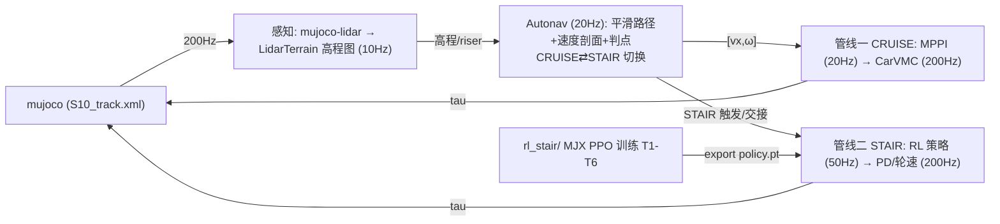

# S10 巡逻赛题 · 感知-控制工程仓库

基于山猫 S10 四足轮式机器人的**巡逻赛题**参赛方案：LiDAR 感知 + 高程地形建模 +
导航（Autonav 平滑路径/速度剖面）→ 执行层 **carvmc+mppi（巡航） / rl stair（爬梯）**，
在 MuJoCo 仿真中完成 33 航点全程巡检。

> 双管线逐层详解（方法/论文/公开代码）见 [doc/双数据管线_autonav_20260816.md](doc/双数据管线_autonav_20260816.md)。

## 赛题与计分

- 仿真环境（官方提供）：`S10_track.xml` 场景 + `track_overlay.xml` 33 个航点
  （000_start ~ 032_end），base 进入 wp0 的 0.2 m 水平半径开始计时，逐点推进，
  到达终点停止计时并打印耗时。
- 计分：总成绩 = 完成时间 ÷ 模式系数，得分越低排名越靠前，30 个定位点须全部
  完成。模式系数以官方 PDF 为准：**遥控 ÷1.0 / 自主跟随 ÷1.3 / 自主导航 ÷1.4**。
- 申报模式：**自主导航（÷1.4）**——Autonav 航点路径规划（平滑路径 + 速度剖面/
  判点）+ 感知地形限速/爬坡 + roll 安全。

## 系统架构：双数据管线（2026-08-16）



| | 管线一：Autonav-MPPI-CarVMC | 管线二：Autonav-RL |
|---|---|---|
| 用途 | 巡航（平地/缓坡/横脊/弯道） | 爬梯（wp6→7 六级楼梯 + 交接） |
| 范式 | 模型驱动：采样轨迹优化 + 解析 VMC | 数据驱动：RL 策略 + 固定 PD/轮速 |
| 频率 | 10 / 20 / 20 / 200 Hz | 10 / 20 / 50 / 200 Hz |
| 当前状态 | v890 稳定（wp0→4 ≈13.5s） | 真实 mesh wp5→wp9 打通 |

两管线共享感知层与 Autonav 层，分歧在执行层。

## 双数据管线详解

### 管线一：Autonav-MPPI-CarVMC（巡航，v890）

感知(10Hz) → Autonav(20Hz) → MPPI(20Hz) → CarVMC(200Hz) → tau 16 维

- **Autonav**：`s10_mpc/auto_nav.py`——Catmull-Rom 平滑路径 + 曲率/横脊限速
  速度剖面 + 弧长游标/切线投影 + 判点（支撑：Catmull & Rom、Pure Pursuit、
  DWA、TEB）。
- **MPPI**：`s10_mpc/body_mppi.py`——N4096/H40 2.0s 视界、摩擦锥约束、softmax
  + DBaS（支撑：Williams 2016/2017、DIAL-MPC）。
- **CarVMC**：`s10_mpc/vmc_legs.py`——轮驱动/差速 + 腿主动悬架（支撑：VMC
  Pratt 1997、WBC、SKATER）。
- 结果：wp0→4 ≈13.5s、wp0→6 30.5s 稳定；卡点 = 坡底脊区 / wp17 大弯 /
  wp4→5 发卡+横脊。

### 管线二：Autonav-RL（爬梯）

感知(10Hz) → Autonav(20Hz, CRUISE⇄STAIR) → RL 策略(50Hz) → 腿PD+轮速(200Hz)

- **Autonav**：向 RL 提供 riser 表（terrain ctx）、CRUISE⇄STAIR 切换/交接、
  轨道航向；RL 观测（55 维）不含 ref path，策略自控速度。
- **训练**：`rl_stair/` MJX 并行 PPO（T0-T6 课程 + DR），命令见下。
- **sim2sim**：`sim2sim_exact.py`（精确 box 几何，验收 = 爬完 6 级 + 后腿登顶
  +1m）/ `sim2sim.py`（官方 S10_track.xml）。
- **部署**：`export.py` → `deploy/policy.pt` → `rlstair_ctrl.py`（obs_np 55 →
  腿 PD 50/1 + 轮速 kp2/vel24）；集成 `S10_VMC_MODE=rlstair` + `S10_RL_ELEV=1`。
- 结果：真实 mesh **wp5→wp9 全流程打通**（wp7@14.99s、直立爬 6 级），最优
  迁移模型 r_heading=5 iter-40（succ 0.649）已锁定。

```bash
# 训练 / 评估 / 导出 / sim2sim（仓库根目录）
XLA_PYTHON_CLIENT_MEM_FRACTION=0.6 ~/DR_competition/.venv/bin/python \
  rl_stair/train.py --num_envs 1024 --max_iters 3000 --logdir rl_stair/logs
~/DR_competition/.venv/bin/python rl_stair/eval.py \
  --ckpt rl_stair/logs/model_latest.pt --stages T3_stairs6,T6_handoff
~/DR_competition/.venv/bin/python rl_stair/export.py \
  --ckpt rl_stair/logs/model_latest.pt --out rl_stair/deploy/policy.pt
~/DR_competition/.venv/bin/python rl_stair/sim2sim_exact.py \
  --ckpt rl_stair/logs/model_latest.pt --seeds 20
```

## 目录结构

```
DR_competition/
├── .venv/                        # 项目虚拟环境（开发机，Python 3.12）
├── comp_env/                     # 官方比赛环境专用 venv（numpy<2 + mujoco）
├── deeprobot_competition/        # 本仓库：ROS2 工作空间（git repo）
│   ├── src/S10_sdk_deploy/       # 主包：仿真/感知/导航/控制
│   │   ├── interface/robot/simulation/   # mujoco_simulation_ros2.py（仿真节点，模式 A/B 入口）
│   │   ├── perception/                   # 感知：local_map / elevation_lookup / points_to_heightmap
│   │   ├── s10_mpc/                      # ★ 导航与控制核心（见下方层级映射）
│   │   │   ├── auto_nav.py               #   AutoNavFollower（Autonav 层，20Hz）
│   │   │   ├── body_mppi.py              #   BodyMPPI（MPPI 层，20Hz）
│   │   │   ├── vmc_legs.py               #   CarVMC + LidarTerrain（CarVMC 层，200Hz）
│   │   │   ├── lidar_terrain_v2.py       #   高程图 + riser 检测（感知层）
│   │   │   ├── costmap2d.py              #   2D ESDF（MPPI 避障）
│   │   │   └── stair_*.py                #   楼梯控制器（dial / 历史）
│   │   ├── scripts/                      # cruise_vmc_noros.py / stair_dial_noros.py（集成入口）
│   │   ├── S10_description/s10_mjcf/mjcf/# 模型与场景（S10_track.xml、new_wp30.xml、s10_mpc.xml）
│   │   └── config/ include/ third_party/ # 配置 / 头文件 / 三方库
│   ├── rl_stair/                 # ★ RL 爬梯（管线二）
│   │   ├── train.py / ppo.py / eval.py / export.py   # MJX PPO 训练/评估/导出
│   │   ├── configs/rl_stair_config.py   # T0-T6 课程与 PPO 配置
│   │   ├── envs/s10_env.py terrain.py   # MJX 环境与地形生成
│   │   ├── deploy/rlstair_ctrl.py       # 部署控制器（策略→腿 PD + 轮速）
│   │   ├── deploy/obs_np.py             # 55 维观测编码（与训练一致）
│   │   └── sim2sim.py / sim2sim_exact.py# sim2sim 验证 harness
│   ├── dial-mpc/                 # dial-mpc 采样 MPC 库（MPPI 层文献/代码支撑，内置）
│   ├── doc/                      # 方案/交付/RL 文档 + figures + yaml + 官方材料
│   └── tmp/                      # 测试入口与结果分析脚本
```

**层级 → 代码位置**：Autonav=`s10_mpc/auto_nav.py`；MPPI=`s10_mpc/body_mppi.py`；
CarVMC=`s10_mpc/vmc_legs.py`；感知=`s10_mpc/lidar_terrain_v2.py`；集成入口=
`scripts/cruise_vmc_noros.py`（S10_VMC_MODE=cruise/rlstair）、`stair_dial_noros.py`；
RL 训练/部署=`rl_stair/`。

## 环境与快速开始

要求：**Ubuntu 24.04 + ROS 2 Jazzy + NVIDIA GPU**。完整环境配置见
[doc/requirements.md](doc/requirements.md)（Ubuntu 22.04 安装）。

```bash
# 1) 虚拟环境 + ROS2 构建
cd ~/DR_competition
/usr/bin/python3 -m venv .venv
./.venv/bin/pip install "numpy<2" mujoco mujoco-lidar jax[cuda12]==0.4.38
cd deeprobot_competition && source /opt/ros/jazzy/setup.bash
colcon build --packages-up-to s10_sdk_deploy --cmake-args -DBUILD_PLATFORM=x86
source install/setup.bash

# 2) 模式 B 遥控（z 站起 / c 进 MPC / wasd 移动 / qe 转向）
export JAX_COMPILATION_CACHE_DIR=$HOME/.cache/s10_dial_mpc
S10_MPC_ENABLE=1 ~/DR_competition/.venv/bin/python \
  src/S10_sdk_deploy/interface/robot/simulation/mujoco_simulation_ros2.py

# 3) 模式 A 自动导航（无头加 S10_USE_VIEWER=0）
S10_MPC_ENABLE=1 S10_MODE=auto_nav ~/DR_competition/.venv/bin/python \
  src/S10_sdk_deploy/interface/robot/simulation/mujoco_simulation_ros2.py
```

> 官方比赛环境（真实 mesh S10_track.xml）使用专用 venv `comp_env`（numpy<2 + mujoco）。

## 关键参数

| 参数 | 默认 | 说明 |
| --- | --- | --- |
| `S10_VMC_MODE` | `wbc` | `rlstair` = RL 爬梯（管线二）；`cruise` = 巡航（管线一） |
| `S10_RL_POLICY` | `deploy/policy.pt` | RL 策略路径覆盖（A/B 评估） |
| `S10_PRETRANS_Y0 / EXIT_Y0` | `32.0 / 40.5` | RL 交接进入/退出位置 |
| `S10_TK1 / S10_TK2` | `0` | 接管模式1/2（cruise→stair / stair→cruise） |
| `S10_LIDAR_WALL` | `0` | 扫墙判别（lidar 近水平射线） |
| `S10_MPPI_OBSTACLE` | `0` | MPPI 避障（costmap2d ESDF 软势） |
| `S10_REFV_SEG_LIST` | — | 分段 ref_v（如 "4:2.0"） |

## 当前进度与待办（2026-08-17）

- **组合技能交付（08-16~17）**：stair 复训 **95.0%**（190/200）；TK1/TK2 接管
  wp5→9 全通；MPPI 避障实现+单测；扫墙判别与分段 ref_v 完成。全部新能力
  env 门控默认关（见 [组合技能_交付总结](doc/组合技能_交付总结_20260816.md)）。
- **管线一（巡航）**：v890 稳定（wp0→6 30.5s）；卡点 = 坡底脊区 / wp17 大弯 / wp4→5 发卡+横脊。
- **管线二（RL 爬梯）**：真实 mesh **wp5→wp9 全流程打通**（直立爬 6 级），
  最优迁移模型已锁定。
- 待办：① wp10 微升弱轮 + wp10-33；② wp0-33 全程；③ 高速（cruise 侧根本限制）；
  ④ 真机迁移；⑤ 初赛材料（8.20）。

## 相关文档

- **[doc/双数据管线_autonav_20260816.md](doc/双数据管线_autonav_20260816.md) —— 双数据管线逐层详解（方法/论文/公开代码）**
- [doc/carvmc_方案与数据管线_20260810.md](doc/carvmc_方案与数据管线_20260810.md) —— 巡航 carvmc+mppi（v890）方案
- [doc/组合技能_交付总结_20260816.md](doc/组合技能_交付总结_20260816.md) —— 组合技能交付（TK1/2、MPPI 避障、扫墙、分段 ref_v）
- [doc/RL_stair_方案_20260814.md](doc/RL_stair_方案_20260814.md)、[最终验收](doc/RL_stair_最终验收_20260815.md)、[迁移达标](doc/RL_stair_迁移达标方案_95percent.md) —— RL-Stair
- [doc/requirements.md](doc/requirements.md) —— 环境安装；[doc/s10_mpc_deploy.yaml](doc/s10_mpc_deploy.yaml) —— 部署配置
- `doc/比赛规则_赛道四_具身未来.md` / PDF、`doc/Airy雷达用户手册.pdf` / `hardware spec.pdf` —— 官方规则与硬件资料