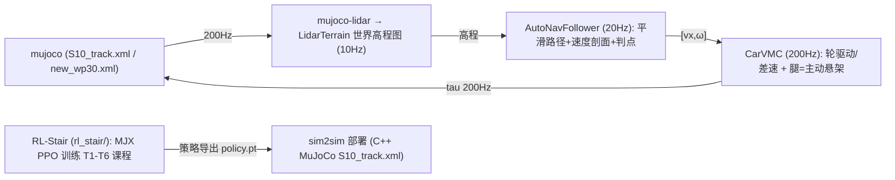

# S10 巡逻赛题 · 感知-MPC 工程仓库

基于山猫 S10 四足轮式机器人的**巡逻赛题**参赛方案：LiDAR 感知 + 高程地形建模 +
导航（平滑路径/速度剖面）→ **CarVMC 车化控制**（轮驱动/差速 + 腿=主动悬架）的
层级方案，在 MuJoCo 仿真中完成 33 航点全程巡检（历史 dial-mpc 方案已归档）。

> **总方案主文档（维护入口）：[doc/方案总纲_MASTER.md](doc/方案总纲_MASTER.md)**；
> 完整工程文档见 [doc/0808.md](doc/0808.md)；参数唯一来源为
> [doc/s10_mpc_deploy.yaml](doc/s10_mpc_deploy.yaml)。

## 赛题与计分

- 仿真环境（官方提供）：`S10_track.xml` 场景 + `track_overlay.xml` 33 个航点
  （000_start ~ 032_end），base 进入 wp0 的 0.2 m 水平半径开始计时，逐点推进，
  到达终点停止计时并打印耗时。
- 计分：总成绩 = 完成时间 ÷ 模式系数，得分越低排名越靠前，30 个定位点须全部
  完成。模式系数以官方 PDF 为准：**遥控 ÷1.0 / 自主跟随 ÷1.3 / 自主导航 ÷1.4**
  （本仓库早期 README 中"导航 ÷1.2"为旧表述，已废弃）。
- 申报模式：**自主跟随（÷1.3）**——航点跟随 + 感知地形限速/爬坡 + roll 安全，
  不强制全局 A\*。

## 已实现（2026-08-15）



- **感知**：mujoco-lidar 扇形射线（lidar_site 前下 45°，64×32 加密）→
  `LidarTerrain` SLAM 式**世界栅格累积高程图**（前方多后方少长方形投影、
  高度维度不限制、max_hang 1.5、增量更新、运动学 fallback），
  参考爬楼梯版 `perception/local_map.py` 建图方式。
- **导航**：Catmull-Rom 平滑路径（切线因子）+ 曲率/横脊/高架限速速度剖面
  + 单调弧长游标/切线投影 + 航点严格判点（S10_WP_ADVANCE_DIST=1.0），
  20Hz 输出 [vx, ω]（S10_VMC_USE_NAV=1 直通，绕开身体层 MPPI 随机性）。
- **控制（巡航）**：CarVMC（车化，200Hz）——轮=驱动+差速转向（yaw 比例+
  阻尼、动态抓地钳制按载荷），腿=主动悬架（mg/4+roll/pitch 分配+地形阻抗，
  半蹲降质心、微 roll 内倾压弯），横脊单步跨越/抬轮前馈；无门控、连续
  地形响应。wp0→4 ≈13.5s、wp0→5 稳定通过（v890）。
- **控制（爬梯，当前主线 = RL）**：`rl_stair/`（MJX 并行 PPO，T1-T6 课程，
  含混合楼梯/横脊/入梯角度随机化/域随机化 DR），策略导出后经
  `sim2sim.py` 部署到 C++ MuJoCo 真实赛道；迁移达标方案
  [doc/RL_stair_迁移达标方案_95percent.md](doc/RL_stair_迁移达标方案_95percent.md)。
- **历史（已归档）**：dial-mpc MBDPI 巡航（3.50 m/s wp0→5、new_wp30 33 点
  2.04 m/s 全通）、StairWBC/位置基/DiAL 分层方案实验链，见
  `_archive_20260810/` 与 `_archive_20260815/`。

## 目录结构

```
DR_competition/
├── .venv/                       # 项目虚拟环境（Python 3.12.3）
├── deeprobot_competition/       # 本仓库：ROS2 工作空间
│   ├── dial-mpc/                # dial-mpc 采样 MPC 库（S10 补丁内置，clone 即用）
│   ├── src/S10_sdk_deploy/      # 仿真节点/感知/导航/控制器/模型
│   ├── rl_stair/                 # RL 爬梯训练（MJX PPO + sim2sim 迁移）
│   ├── doc/                     # 0808.md + requirements.md + 部署 yaml + 官方材料
│   └── tmp/                     # 核心测试入口与结果分析脚本
（refs/ 参考仓库与 _archive_* / backups 旧归档已于 2026-08-13 清理，参考仓库可从 GitHub 重新 clone）
```

## 环境与快速开始

要求：**Ubuntu 24.04 + ROS 2 Jazzy + NVIDIA GPU（可选，CPU 可跑但慢）**。
完整环境配置（含包版本）见 `doc/0808.md` §3。

```bash
# 1) 虚拟环境（仓库根目录，注意在 deeprobot_competition 上一级）
cd ~/DR_competition
/usr/bin/python3 -m venv .venv
./.venv/bin/pip install "numpy<2" mujoco mujoco-lidar jax[cuda12]==0.4.38

# 2) 构建 ROS2 工作空间
cd ~/DR_competition/deeprobot_competition
source /opt/ros/jazzy/setup.bash
colcon build --packages-up-to s10_sdk_deploy --cmake-args -DBUILD_PLATFORM=x86
source install/setup.bash

# 3) 模式 B 遥控（窗口内 z 站起 / c 进入 MPC / wasd 移动 / qe 转向）
export JAX_COMPILATION_CACHE_DIR=$HOME/.cache/s10_dial_mpc
S10_MPC_ENABLE=1 ~/DR_competition/.venv/bin/python \
  src/S10_sdk_deploy/interface/robot/simulation/mujoco_simulation_ros2.py

# 4) 模式 A 自动导航（无头加 S10_USE_VIEWER=0）
S10_MPC_ENABLE=1 S10_MODE=auto_nav ~/DR_competition/.venv/bin/python \
  src/S10_sdk_deploy/interface/robot/simulation/mujoco_simulation_ros2.py
```

加载自定义 MJCF（如加装传感器）：

```bash
S10_MUJOCO_XML=/absolute/path/to/model.xml \
  ~/DR_competition/.venv/bin/python \
  src/S10_sdk_deploy/interface/robot/simulation/mujoco_simulation_ros2.py
```

## 仿真器常用参数

| 参数 | 默认 | 说明 |
| --- | --- | --- |
| `S10_USE_VIEWER` | `1` | 0 = 无头运行 |
| `S10_MODE` | `remote` | `auto_nav` = 模式 A 自动导航 |
| `S10_MPC_ENABLE` | `0` | `1` 启用 MPC 控制 |
| `S10_MUJOCO_SCENE` | `track` | 场景（S10_track.xml） |
| `S10_LIDAR_BACKEND` | `cpu` | WSL 下勿用 taichi（core dump） |
| `S10_LIDAR_FREQ` | `10` | LiDAR 频率 (Hz) |

完整环境变量表见 `doc/0808.md` §6；手动键盘控制见下文。

## 手动控制（仿真窗口）

- `z`：默认位置 / `c`：RL 控制默认位置
- `w/a/s/d`：前后左右平移 / `q/e`：逆/顺时针旋转
- `Ctrl` + 右键双击 body：跟踪该 body；`Esc`：停止跟踪
- 仿真窗口失焦时可右键选择 "always on top"

## 附加场景

- **new_wp30（原赛道平面版）**：原赛道全部 33 航点 XY 一致、z 全部清零的
  全平地赛道，用于隔离纯弯道动力学测试（替代旧蛇形版）。
  文件 `src/S10_sdk_deploy/S10_description/s10_mjcf/mjcf/new_wp30.xml`，
  路径图 [new_wp30_path.png](doc/new_wp30_path.png)，说明见 doc/0808.md §9.1。

## 当前进度与待办（2026-08-15）

- **CarVMC 巡航**（稳定）：wp0→4 ≈13.5s、wp0→5 稳定通过（v890）；
  wp0→33 分段验证通过 18 点，卡点集中在坡底脊区与 wp17 大弯。
- **RL-Stair 爬梯（当前主线）**：
  - MJX 并行 PPO 训练（T1-T6 课程：单阶→混合楼梯+双横脊，入梯角度随机化，
    DR 域随机化 PD/扭矩/质量/摩擦/观测噪声）——T3（比赛六级）训练可靠 0.72。
  - **sim2sim 迁移是当前瓶颈**：训练=胶囊轮/box 台阶（MJX），部署=圆柱轮/
    mesh 台阶（C++），接触/摩擦差异导致旧策略真实赛道仅 1/6 级；MJX 与
    C++ 解算器存在约 2.7x 行为差距（§3.36 验证）。
  - 执行 `doc/RL_stair_迁移达标方案_95percent.md`：阶段0 基线 → 阶段1 DR
    （已实现）→ 阶段2/3 解算器对齐验证，目标真实赛道 ≥95%（多 seed）。
- 待办：迁移达标 ≥95%、wp6→7 连续成功、33 航点全程、真机迁移（vel_scale 50、
  IMU 闭环、Orin 实测）、初赛材料（8.20 技术方案 PDF + Demo + GitHub 链接）。

详细实验记录与参数演进见 `doc/0808.md`（§9 起）与总方案 `doc/方案总纲_MASTER.md`；
RL 训练/迁移细节见 `rl_stair/README.md` 与 `doc/RL_stair_*` 文档。

## 相关文档

- **[doc/方案总纲_MASTER.md](doc/方案总纲_MASTER.md) —— 总方案主文档（方案/数据管线/控制频率/参数表/维护日志）**
- [doc/0808.md](doc/0808.md) —— 工程总文档（环境配置/架构/参数/进度/待办）
- [doc/RL_stair_迁移达标方案_95percent.md](doc/RL_stair_迁移达标方案_95percent.md) —— RL 爬梯迁移达标方案（阶段0-3）
- [doc/S10_轮足爬梯_全方案总文档_20260813.md](doc/S10_轮足爬梯_全方案总文档_20260813.md) —— 轮足爬梯全方案总文档
- [doc/s10_mpc_deploy.yaml](doc/s10_mpc_deploy.yaml) —— 部署配置
- [doc/requirements.md](doc/requirements.md) —— Ubuntu 22.04（非 WSL）安装要求
- `doc/比赛规则_赛道四_具身未来.md`、`doc/赛道四_具身未来.pdf` —— 官方规则
- `doc/Airy雷达用户手册.pdf`、`doc/hardware spec.pdf` —— 真机硬件资料
- `doc/final_wp0-6_xy_speed.png` —— 巡航结果图