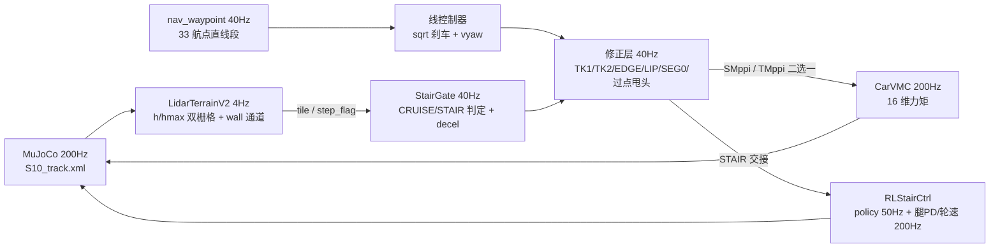

# S10 巡逻赛题 · SMppi/TMppi Cruise + RL-Stair + TK1/TK2

> 当前主线（方案 v3，2026-08-19 代码基线）：33 航点直线路径 + **SMppi 走线 / TMppi 原地转** +
> **CarVMC 巡航执行** + **RL-Stair 爬梯** + **TK1/TK2 交接**，纯 Python + MuJoCo，无需 ROS。
> 详细门控与参数见 [总方案.md](SMppi_TMppi_Cruise_RL-Stair_TK1_TK2/SMppi_TMppi_Cruise_RL-Stair_TK1_TK2_总方案.md)；

## 1. 技术方案

| 技能 | 职责 | 关键点（代码口径） |
| --- | --- | --- |
| **SMppi** | 直线走线保持 | N=1024、H=40（2s 视界）、40Hz；终点代价（STOP_DX=5.0）；A_MAX=4.5 |
| **TMppi** | 航点原地转向 | dist<0.6 且 speed<2.2 且 \|yaw_err\|>10°；om=k·err−kd·ω（KD=1.5 终端阻尼） |
| **CarVMC** | 巡航执行（200Hz） | 轮速 PID（K12/D0.02）+ 差速 yaw（K80）；半蹲腿主动悬架；压弯关闭（CAR_ROLL_K=0） |
| **STAIR（RL-Stair）** | 接管一切 riser | policy.pt 55→16 tanh，50Hz 推理；腿 PD 50/1/clip48 + 轮速 2/24/clip13.5 |
| **TK1** | 楼梯前交接 | 只做对准 <1s（减速归 decel+终点代价）；交付 vx≤1.5、\|ey\|≤0.30、圈 1.2m |
| **TK2** | 楼梯后交接 | 四轮上顶→对准下一 wp（<1s）→交回；post-stair hold 后慢速瞄准 |

分层架构：共享 lidar 感知（4Hz 增量）→ 导航/规划同拍（40Hz）→ 双管线执行（200Hz）。
切换时速度、航向、姿态连续（decel 插值 + PRETRANS 站姿预过渡），无模式跳变。

## 2. 控制频率

| 层 | 频率 | 说明 |
| --- | --- | --- |
| MuJoCo 仿真 | 200Hz | DT=0.005，S10_track.xml |
| 执行层 CarVMC / RLStairCtrl | 200Hz | 每仿真步一次 |
| 导航 / 规划 / 模式 tick | 40Hz | S10_NAV_HZ=40，每 5 步一拍（SMppi/TMppi/TK/EDGE/LIP/判点/模式） |
| RL policy | 50Hz | decimation=4，动作零阶保持到 200Hz PD |
| lidar 高程图 | 4Hz 增量 | 96×48 地形射线，mount+0.6m；wall 通道 61×13 半速 ≈2.5Hz |
| MPPI 视界 | 2s | N=1024、H=40、rollout dt=0.05；实测 plan avg≈10ms <25ms 预算 |

## 3. 数据管线



**40Hz 控制合成链**（cruise_main 内按序执行，后写覆盖先写）：

    ① 线控制器: line_head=段heading−0.4·clip(cte,±1)；dist<0.5 直瞄 wp；
       vyaw=LP(clip(2.0·err,±1.0),0.4)；vx=4.0·√clip((dist−0.2)/3.5,0,1)
    ② 过点甩头: 投影>len+0.2 且 dist<1.5 且无楼梯 → 瞄下一 wp、vx≤1.2
    ③ 航线夹角门: |riser爬升轴−线段heading|≤0.45 才放行台阶类门控
    ④ TK1: 交付圈(ad≤1.2)内 vx≤1.5；|ey|>0.30 → vyaw=clip(2.5·ey,±1.5)
    ⑤ TK2: |err|>0.25 → vyaw=clip(2.5·err,±1.5)、vx≤1.2
    ⑥ post-stair: 0.6s 直线(vx≤0.2)；1.0s 硬停；慢速瞄准(vx≤1.0, om=clip(0.5·err,±0.2))
    ⑦ LIP 骑坎锁存: 前轮−最低轮≥0.08 → vx=1.2 冲量+正对航向；过点 0.3m 或 25s 释放
    ⑧ decel: vx 向 2.0 插值（圈内航线对齐 1.2）；楼梯 2m 内全局 ≤1.5
    ⑨ EDGE 探针: 前方 1.5m 升 0.08~0.25 且平顶 → vx≤0.6；≥0.10 加锁存+前轮抬轮
    ⑩ STOP_DX 硬刹车: dist≤5.0 → v_ref 线性归零
    ⑪ 规划二选一: TMppi(dist<0.6, speed<2.2, |err|>10°) / SMppi(其余)
    ⑫ omcap: TMppi=min(1.5,1.8/|vx|)；SMppi=min(1.0,1.8/|vx|)
    ⑬ SEG0 段首纠偏 / 大偏航纠偏(cte>0.8 平顶 / >1.2 低台) / TK 直接对准(om≤1.5)
    ⑭ cmd{vx,omega,roll_tar,pitch_tar} → STAIR?RLStairCtrl:CarVMC → tau(16) → mj_step

**感知管线**：96×48 地形射线（法向 |nz|≥0.6 滤竖直面）→ h=min-z / hmax=max-z 双栅格
（0.05m，x∈[-25,40] y∈[-5,55]）→ 16×16m tile + step_flag → 扫描窗口 v2
（s_cur+0.1 → min(s_cur+8.0, 下一wp)，下限 s_cur+1.2）沿路径最高剖面检测：
多级 riser（跳变≥0.10、≥2 级、跨度≤3m、总爬升≥0.2）/ 单级 ≥0.10 / 下行 ≥0.10 →
stair_rises_s / stair_ahead_dist / decel_request / drop（仅用于 STAIR 单级入口确认）。
riser_table：hmax 跳变 0.05~0.16m，台面顶=跳变后 0.30m 窗内 max；单级台面补虚拟第二级。

**RL 观测/执行管线**：obs(55)=angvel·0.25(3)|gravity(3)|cmd(2)|leg_err(12)|leg_vel·0.05(12)|
last_action(16)|heading(2)|terrain_ctx(4)|rough(1) → policy(torch.jit, CPU) → a(16) tanh →
腿 PD(50·(a·0.7−err)−1·vel, ±48) + 轮速 PD(2·(a·24−qd), ±13.5)；前 200 步站姿锁腿热身。

## 4. 状态机与门控（摘要，全表见总方案 §5）

- **CRUISE→STAIR**：ad≤1.2 且（riser≥2 级，或单级 riser 且 drop 可见）且距航线 ≤1.0
  且最低轮心 z≤1.2 且前轮未上台且重入保护（s_cur>出口 s+2.0）且 TK1 门（ey≤0.30、
  vx≤1.5、航线夹角≤0.45）。
- **STAIR→CRUISE**：四轮 z ≥ max(tops)+0.02 且 s_cur>末级 riser+0.8 且 vx≤1.0、
  |pitch|≤0.3、|roll|≤0.25、|vy|≤0.8；兜底=沿爬升轴前进 1.2m（单级）/span+1.0m（多级）。
- **drift-abort**：STAIR 中 |cte|>1.2 且 >1s → 强退 CRUISE。
- **航点推进**：距 wp≤0.5（WP_ADVANCE_DIST）或过点兜底（投影>len−0.5 且 lat<0.8；
  投影>len+0.8 无条件）；对准门 |yaw−下一段|≤0.25 且 |ω|≤0.3（楼梯顶/悬停死锁跳过）。
- **安全网**：|roll|>0.9 或 z<0.12 终止；90s 无推点卡死超时；5s 位移<0.3m 卡死脱困
  （倒车 0.5→沿当前航向 0.8 前插）。roll 门控与 DROP 保护族已按方案 v3 删除。

## 5. 目录结构

```
deeprobot_competition/
├── SMppi_TMppi_Cruise_RL-Stair_TK1_TK2/   # ★ 当前主链路（模块化）
│   ├── cruise_main.py                      # 200Hz 主循环（40Hz 控制合成链）
│   ├── nav_waypoint.py / smppi.py / tmppi.py
│   ├── carvmc.py / stair_mode.py / perception_lidar.py
│   ├── rlstair_ctrl.py / rlstair_obs.py / policy.pt
│   ├── plot_traj_speed.py
│   ├── run_smppi_tmppi_cruise_rlstair_tk12.sh   # ★ 启动脚本
│   └── SMppi_TMppi_Cruise_RL-Stair_TK1_TK2_总方案.md
├── src/S10_sdk_deploy/
│   ├── S10_description/s10_mjcf/           # S10_track.xml + meshes（官方环境）
│   └── s10_mpc/                            # auto_nav / body_mppi / lidar_terrain_v2 / vmc_legs
├── rl_stair/                               # RL-Stair 训练/评估/导出/部署 + sim2sim 验证
└── doc/                                    # 技术方案/规则/硬件/环境文档
```

## 6. 快速开始

```bash
# 主链路：wp0→33 全程（无 ROS）
cd ~/DR_competition/0810new/deeprobot_competition
bash SMppi_TMppi_Cruise_RL-Stair_TK1_TK2/run_smppi_tmppi_cruise_rlstair_tk12.sh

# RL-Stair 训练 / 评估 / 导出 / sim2sim
XLA_PYTHON_CLIENT_MEM_FRACTION=0.6 ~/DR_competition/.venv/bin/python \
  rl_stair/train.py --num_envs 1024 --max_iters 3000 --logdir rl_stair/logs
~/DR_competition/.venv/bin/python rl_stair/eval.py \
  --ckpt rl_stair/logs/model_latest.pt --stages T3_stairs6,T6_handoff
~/DR_competition/.venv/bin/python rl_stair/export.py \
  --ckpt rl_stair/logs/model_latest.pt --out rl_stair/deploy/policy.pt
```

环境：Ubuntu 24.04 + Python 3.12，numpy<2.0 + mujoco 3.11.0 + torch CPU（官方比赛口径），
详见 [doc/requirements.md](doc/requirements.md)。

## 7. 关键参数（run_smppi_tmppi_cruise_rlstair_tk12.sh 实际值）

| 参数 | 值 | 说明 |
| --- | --- | --- |
| S10_NAV_HZ / WP_ADVANCE_DIST | 40 / 0.5 | 控制拍 / 判点半径 |
| VMC_MPPI_N/H, S10_MPPI_DT/CTRL_DT | 1024/40, 0.05/0.025 | SMppi 样本/视界（2s）/slew 解耦 |
| S10_MPPI_A_MAX / OMAX / W_GUIDE / W_HEAD | 4.5 / 2.5 / 1.5 / 2.0 | 加速度钳/转向上限/guide/航向权重 |
| S10_SMppi_STOP_DX / W_TPOS / W_TV | 5.0 / 10 / 10 | 终点代价 |
| S10_TURN_ARRIVE_R / V_MAX / K / KD / OM_MAX | 0.6 / 2.2 / 3.0 / 1.5 / 1.5 | TMppi 触发/终端阻尼 |
| S10_LINE_VMAX / BRAKE_DIST / YAW_GAIN / CTE_K | 4.0 / 3.5 / 2.0 / 0.4 | 线控制器 |
| S10_ELEV_HZ / ELEV_LOOKAHEAD / WP_CLIP_MIN | 4 / 8.0 / 1.2 | lidar 频率 / 扫描窗口 v2 |
| S10_STAIR_SINGLE_RISE / ELEV_DROP_TH / CLIMB_TH | 0.10 / 0.10 / 0.2 | riser/drop 检测阈值 |
| S10_TK1_LOOKAHEAD / ENTER_DIST / VX / YAW_DB | 8.0 / 1.2 / 1.5 / 0.30 | TK1 |
| S10_TK2_YAW_DB / VX / STAIR_WHEEL_CLEAR / EXIT_VX | 0.25 / 1.2 / −0.02 / 1.0 | TK2/退出 |
| S10_POSTSTAIR_HOLD_DIST / VX / T | 0.9 / 1.0 / 2.0 | post-stair 慢速瞄准 |
| S10_VMC_OM_CAP / OM_ABS_MAX / WHEEL_K / D / TMAX | 1.0 / 1.6 / 12 / 0.02 / 13.5 | CarVMC |
| S10_CAR_ROLL_K / VMC_Z_DES_OFFSET | 0 / 0.26 | 压弯关闭 / 站高偏移 |

## 8. 当前状态（方案 v3，2026-08-19）

- 已落地：SMppi 减速强化（A_MAX 4.5 / STOP_DX 5.0）、高程扫描窗口 v2、TMppi 终端阻尼
  （KD=1.5）、LIP 锁存、EDGE 探针、SEG0、大偏航纠偏、TK1/TK2、post-stair、过点甩头。
- 已删除（用户指示）：roll 门控、DROP 保护族、平台高度分档限速与判点半径放大；
  卡死脱困前插改为沿当前航向（方案 v3：无航点坐标干预、无世界 ray_cast）。
- 验证状态：py_compile / 整链 import / 模型加载通过；最新集成轮次已首过 wp14（round275）；
  测试矩阵 T1~T8 与全程 33 点连跑待跑（见总方案 §10）。
- 待确认：S10_MPPI_MU 未显式设置（生效 μ=0.75，0.36 标定待确认）；RL 单级 12.5cm 上步
  未验证（T8 先行）；下行 riser 不再限速，是否交 RL 待定。

## 9. 相关文档

- [SMppi_TMppi_Cruise_RL-Stair_TK1_TK2_总方案.md](SMppi_TMppi_Cruise_RL-Stair_TK1_TK2/SMppi_TMppi_Cruise_RL-Stair_TK1_TK2_总方案.md) —— 工程口径方案（门控/参数/数据管线全表）
- [doc/requirements.md](doc/requirements.md) —— 环境安装
- [doc/RL_stair_方案_20260814.md](doc/RL_stair_方案_20260814.md) / 最终验收 / 迁移达标 / 参数审计 / 奖励增强
- doc/比赛规则_赛道四_具身未来.md / 赛道四_具身未来.pdf —— 官方规则与计分