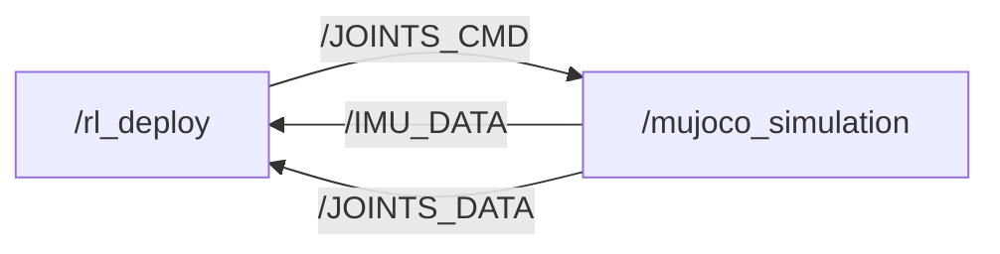

# S10 巡逻赛题 · 感知-MPC 工程仓库

基于山猫 S10 四足轮式机器人的**巡逻赛题**参赛方案：LiDAR 感知 + 高程地形建模 +
dial-mpc 采样 MPC 控制，在 MuJoCo 仿真中完成 33 航点全程巡检。

> 完整工程文档见 [doc/0806.md](doc/0806.md)；参数唯一来源为
> [doc/s10_mpc_deploy.yaml](doc/s10_mpc_deploy.yaml)。

## 赛题与计分

- 仿真环境（官方提供）：`S10_track.xml` 场景 + `track_overlay.xml` 33 个航点
  （000_start ~ 032_end），base 进入 wp0 的 0.2 m 水平半径开始计时，逐点推进，
  到达终点停止计时并打印耗时。
- 计分：总成绩 = 完成时间 ÷ 模式系数，得分越低排名越靠前，30 个定位点须全部
  完成。模式系数以官方 PDF 为准：**遥控 ÷1.0 / 自主跟随 ÷1.3 / 自主导航 ÷1.4**
  （本仓库早期 README 中"导航 ÷1.2"为旧表述，已废弃）。
- 申报模式：**自主跟随（÷1.3）**——航点跟随 + 感知地形限速/爬坡 + roll 安全，
  不强制全局 A\*。

## 已实现（2026-08-06）



- **感知**：Airy-96 LiDAR 仿真（120×48 线 @10Hz，前下 45° 安装）→ 世界对齐
  高程瓦片 `perception/local_map.py`（8×8m 锚定 / 输出 60×60@0.1m，跨帧累积 +
  空洞填补 + 运动学地面注入）→ 纯 jnp 查图 `elevation_lookup.py`（零 retrace）。
- **控制**：dial-mpc MBDPI（Nsample 2048 / H14 / Ndiffuse 1，≈17Hz on RTX 4090），
  CRUISE/STAIR 双模式；模式 B 遥控（4.5 m/s 竞速档）+ 模式 A 自动导航
  （pursuit + 弯道/坡度/台阶限速 + 脱困）。
- **爬坡**：reward 层前瞻抬轮 + MARG stumble + 抬腿伸展引导（r_ext）+ 锁轮推身
  （lockpush）+ 机身逐级抬升（r_clear），wp7 连续台阶可爬 3~4 级（实验链 64）。
- **工程**：JAX 编译缓存（冷启动 ≈4.3s）、文档化环境变量覆盖、`doc/0806.md`
  完整记录赛程/规则/参数/实验链。

## 目录结构

```
DR_competition/
├── .venv/                       # 项目虚拟环境（Python 3.12.3）
├── dial-mpc/                    # dial-mpc 采样 MPC 库（含 S10 补丁）
├── deeprobot_competition/       # 本仓库：ROS2 工作空间
│   ├── src/S10_sdk_deploy/      # 仿真节点/感知/控制器/模型
│   └── doc/                     # 0806.md + 部署 yaml + 官方材料
└── refs/                        # 参考仓库（go2w_rl_gym、unitree_mujoco）
```

## 环境与快速开始

要求：**Ubuntu 24.04 + ROS 2 Jazzy + NVIDIA GPU（可选，CPU 可跑但慢）**。
完整环境配置（含包版本）见 `doc/0806.md` §3。

```bash
# 1) 虚拟环境（仓库根目录，注意在 deeprobot_competition 上一级）
cd ~/DR_competition
/usr/bin/python3 -m venv .venv
./.venv/bin/pip install "numpy<2" mujoco mujoco-lidar jax[cuda12]==0.4.38

# 2) 构建 ROS2 工作空间
cd ~/DR_competition/deeprobot_competition
source /opt/ros/jazzy/setup.bash
colcon build --packages-up-to s10_sdk_deploy --cmake-args -DBUILD_PLATFORM=x86
source install/setup.bash

# 3) 模式 B 遥控（窗口内 z 站起 / c 进入 MPC / wasd 移动 / qe 转向）
export JAX_COMPILATION_CACHE_DIR=$HOME/.cache/s10_dial_mpc
S10_MPC_ENABLE=1 ~/DR_competition/.venv/bin/python \
  src/S10_sdk_deploy/interface/robot/simulation/mujoco_simulation_ros2.py

# 4) 模式 A 自动导航（无头加 S10_USE_VIEWER=0）
S10_MPC_ENABLE=1 S10_MODE=auto_nav ~/DR_competition/.venv/bin/python \
  src/S10_sdk_deploy/interface/robot/simulation/mujoco_simulation_ros2.py
```

加载自定义 MJCF（如加装传感器）：

```bash
S10_MUJOCO_XML=/absolute/path/to/model.xml \
  ~/DR_competition/.venv/bin/python \
  src/S10_sdk_deploy/interface/robot/simulation/mujoco_simulation_ros2.py
```

## 仿真器常用参数

| 参数 | 默认 | 说明 |
| --- | --- | --- |
| `S10_USE_VIEWER` | `1` | 0 = 无头运行 |
| `S10_MODE` | `remote` | `auto_nav` = 模式 A 自动导航 |
| `S10_MPC_ENABLE` | `0` | `1` 启用 MPC 控制 |
| `S10_MUJOCO_SCENE` | `track` | 场景（S10_track.xml） |
| `S10_LIDAR_BACKEND` | `cpu` | WSL 下勿用 taichi（core dump） |
| `S10_LIDAR_FREQ` | `10` | LiDAR 频率 (Hz) |

完整环境变量表见 `doc/0806.md` §7；手动键盘控制见下文。

## 手动控制（仿真窗口）

- `z`：默认位置 / `c`：RL 控制默认位置
- `w/a/s/d`：前后左右平移 / `q/e`：逆/顺时针旋转
- `Ctrl` + 右键双击 body：跟踪该 body；`Esc`：停止跟踪
- 仿真窗口失焦时可右键选择 "always on top"

## 附加场景

- **new_wp30（全平地连续弯道）**：30 航点、z=0 全平地，弯型复刻 wp0→wp4
  （直道 + 85.6°/66.7°/55° 连续弯，单元镜像蛇形），用于巡航提速压力测试。
  文件 `src/S10_sdk_deploy/S10_description/s10_mjcf/mjcf/new_wp30.xml`，
  路径图 [new_wp30_path.png](doc/new_wp30_path.png)，说明见 doc/0806.md §13.12。

## 当前进度与待办

- 模式 B（遥控）：稳定，4.5 m/s 竞速档已调优。
- 模式 A（自动导航）：wp0→wp6 稳定（34~38s）；**阻塞点 = wp7 连续台阶区**
  （4~5 级 0.13m 台阶），实验链 64 已可爬 3~4 级，稳定性收敛中。
- 待办：wp7 台阶区收敛、33 航点全程跑通、真机迁移（vel_scale 回退 50、
  IMU 闭环、Orin 实测）、A\* 全局规划（可选）。

详细实验记录与参数演进见 `doc/0806.md`（链 1~67）。

## 相关文档

- [doc/0806.md](doc/0806.md) —— 工程总文档（环境配置/架构/参数/进度/待办）
- [doc/s10_mpc_deploy.yaml](doc/s10_mpc_deploy.yaml) —— 部署配置
- `doc/比赛规则_赛道四_具身未来.md`、`doc/赛道四_具身未来.pdf` —— 官方规则
- `doc/Airy雷达用户手册.pdf`、`doc/hardware spec.pdf` —— 真机硬件资料
