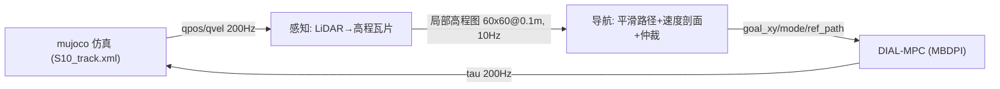

# S10 巡逻赛题工程总文档（2026-08-08）

> 本文档为当前唯一工程总文档，替代已归档的 `doc/0806.md`（历史实验全记录见
> `_archive_20260808/doc/0806.md` 与 `_archive_20260806/`）。参数唯一来源：
> [doc/s10_mpc_deploy.yaml](doc/s10_mpc_deploy.yaml)。

## 1. 项目概述与申报模式

- **赛题**：赛道四「具身未来」巡逻赛题（旧称竞速项目），基于山猫 S10 轮足机器狗，
  在 MuJoCo 仿真中沿官方赛道完成多目标点巡检。
- **申报模式**：**自主跟随（模式系数 ÷1.3）**——航点跟随 + 感知地形限速/爬坡 +
  roll 安全，不强制全局 A*。
- **技术路线**：Airy LiDAR 感知 → 高程地形建模 → 全局平滑路径/速度剖面 →
  双模式仲裁 → dial-mpc 采样 MPC 做 locomotion。
- **目标**：33 航点全程稳定完成，巡航直线 ≥4 m/s（竞速），转向稳定不侧翻，
  连续台阶区（wp7）可上爬。

## 2. 赛程与规则

| 项目 | 内容 |
|---|---|
| 初赛提交 | 2026-08-20：技术方案 PDF + Demo + 开源协议 + GitHub 链接 |
| 复赛 | 08-25 ~ 09-20：真机调试 |
| 决赛 | 09-22 ~ 09-23（线下真机） |
| 计分 | 总分 = 完成时间 ÷ 模式系数；遥控 ÷1.0 / 自主跟随 ÷1.3 / 自主导航 ÷1.4 |
| 定位点 | 官方线下决赛 30 个定位点；仿真 track_overlay 33 个航点（000_start~032_end），base 进入 wp0 0.2 m 水平半径起表，逐点推进，终点停表 |
| 力矩合规 | 连续力矩超限（腿 ±50 Nm / 轮 ±14 Nm）超过 0.5 s 判不合格 |

## 3. 目录结构

```
DR_competition/
├── .venv/                       # 项目虚拟环境（Python 3.12.3）
├── dial-mpc/                    # dial-mpc 采样 MPC 库（含 S10 补丁）
├── deeprobot_competition/       # 本仓库：ROS2 工作空间（git repo）
│   ├── src/S10_sdk_deploy/
│   │   ├── interface/robot/simulation/   # 仿真节点（mujoco_simulation_ros2.py）
│   │   ├── perception/                   # local_map / elevation_lookup / minisnap
│   │   ├── s10_mpc/                      # mpc_controller / auto_nav / mppi_controller
│   │   ├── scripts/                      # cruise_noros / precompile 等测试基建
│   │   └── S10_description/s10_mjcf/     # 官方与自定义 MJCF
│   ├── doc/                     # 0808.md + 部署 yaml + 官方材料 + 最新结果图
│   └── tmp/                     # 核心测试入口（test_auto_nav / run_full_course / analyze_*）
├── refs/                        # 参考仓库（go2w_rl_gym、unitree_mujoco）
├── backups/                     # 版本代码备份（v131/v132/v139/v143/v159/v161）
└── _archive_20260806|08/        # 过期文档与实验脚本归档
```

## 4. 系统架构



### 4.1 感知层（perception/）

- Airy-96 LiDAR 仿真（120×48 线 @10Hz，前下 45° 安装，S10_LIDAR_BACKEND=cpu）。
- 世界对齐高程瓦片 local_map.py：8×8 m 锚定 / 60×60@0.1 m 输出，跨帧累积 +
  空洞填补 + 运动学地面注入（S10_KIN_GROUND=1）。
- 纯 jnp 查图 elevation_lookup.py（零 retrace），供仲裁与 MPC cost 使用。

### 4.2 导航层（s10_mpc/auto_nav.py）

- Catmull-Rom 平滑路径：严格过 33 航点（偏差 0.013 m）、全长 234 m、C1 平滑。
- 速度剖面：曲率限速 v=√(a_lat·R) + 弯道提前减速 + 横脊预扫描限速
  （112 处 dh>0.08 台阶区 1.5 m/s）+ 高架限速（S10_AUTO_ELEV_K）。
- 单调弧长游标 + 切线投影（wp3→4 弯道 CTE 从 1.25 m → 0.19 m）。
- 双模式仲裁：CRUISE（平地/缓坡）与 STAIR_SEQUENCE（连续台阶段），
  mode 感知确认 + 滞回，切换三套 cost 权重。

### 4.3 控制层（dial-mpc + mpc_controller.py）

- MBDPI 采样 MPC：CRUISE H14（巡航调优 H25 0.5s 视界）/ STAIR H20，Nsample 2048
  （巡航调优 N768），Ndiffuse 1，solver_it 4。
- cost 组成（分模式权重）：xy 进度（w_prog）/ 路径跟踪（w_path/w_path_head）、
  yaw、pitch/roll、能量、动作平滑、轮-地形贴合（terrain_w_ground）、机身离地
  净高（w_clear）、腿伸展引导（r_ext）、锁轮推身（lockpush）、后轮跟抬
  （S10_LIFT_REAR）、foot_place 抬轮（kp=2.0/max=0.35）、Upright/角速度惩罚。
- 输出 tau → 200Hz PD 执行；腿关节 clip ±2.72 rad（rollout + 主仿真）。

## 5. 当前状态（2026-08-08）

### 5.1 模式 B（遥控）—— 稳定

- 直线 4.4~4.7 m/s（vel_scale 56 ≈ 4.54 m/s）、原地转向 5~6 rad/s、
  站姿 z≈0.204 m（hipx=0.05）。
- yaw 增益速度自适应（低速 50 / 高速 15）+ 轮速斜坡防翘头。

### 5.2 模式 A（自动导航）—— 巡航已突破，楼梯为剩余阻塞

| 区段 | 状态 |
|---|---|
| wp0→wp5（含 S 弯） | 3.50 m/s 干净完赛（v196a_r2，run_t 10.5 s）；复测可靠性 ~40%（v197 4 跑 3 翻 1 慢），S 弯（R=0.84 m）为翻车主因 |
| wp0→wp6 | 稳定通过（34~38 s） |
| wp0→wp7（含横脊） | 通过率 ~2/3~3/4（横脊限速 + foot_place 抬轮） |
| wp7 连续台阶区（4~5 级 0.125 m） | 可爬 3~4 级（body z 1.14~1.23），末级维持/顶缘后轮跟进不稳定 |
| wp8→wp32 | 未完整验证（陡坡 wp17→18 +21%、高架段 wp28→32 z=3.75） |
| new_wp30 平面版全航点 | 33 航点全部到达、224.2 m 无翻车、avg 2.04 m/s（v193） |

### 5.3 频率与预热

- CRUISE N768：plan 中位 70~73 ms → 实际 13.7~14.3 Hz（名义 15.4 的 89~93%）；
  STAIR N512 @15 Hz（H20）。
- JAX 编译缓存（~/.cache/s10_dial_mpc）：冷启动 ≈4~5 s（缓存命中），
  比赛部署建议随环境打包缓存。

## 6. 关键参数速查

### 6.1 硬件档位

| 参数 | desktop_4090 | orin_agx |
|---|---|---|
| Nsample | 2048（巡航调优 N768） | 1024 |
| Hsample | 14~25 | 10 |
| Ndiffuse | 1 | 1 |
| dt | 0.02 | 0.025 |
| jax_platform | cuda | cpu |

### 6.2 控制与导航环境变量（常用）

| 环境变量 | 默认 | 说明 |
|---|---|---|
| S10_MPC_NSAMPLE / H_CRUISE / H_STAIR | 2048 / 20 / 20 | 采样数与双视界 |
| S10_MPC_VEL_SCALE | 56 | 轮速上限（56×0.081≈4.54 m/s） |
| S10_MPC_W_PROG | 0 | 沿路径切线的推进正奖励（v194 起，5 效果最佳） |
| S10_AUTO_VMAX / S10_MPC_VX_MAX | 4.5 | 巡航目标上限（调优 5.2~5.5） |
| S10_CURVE_ACCEL / S10_CURVE_R_MIN | 6.0 / 2.0 | 弯道减速度 / 最小曲率半径（v193 r_min=1.0） |
| S10_AUTO_STAIR_VX | 2.5 | 连续楼梯段限速 |
| S10_STAIR_LEG_SIGMA | 2.0 | 台阶段腿维采样噪声（调优 0.8） |
| S10_LIFT_REAR / S10_FOOT_PLACE | 0 / 1 | 后轮跟抬 / foot_place 抬轮 |
| S10_KIN_GROUND / S10_LOCAL_INPAINT | 1 / 3 | 运动学地面注入 / 空洞填补 |
| S10_LIDAR_FREQ / PHI_N / THETA_N | 10 / 48 / 120 | LiDAR 参数 |

完整表见归档 0806.md §7。

## 7. 启动命令

```bash
# 1) 环境
cd ~/DR_competition
source /opt/ros/jazzy/setup.bash
cd deeprobot_competition && source install/setup.bash
export JAX_COMPILATION_CACHE_DIR=$HOME/.cache/s10_dial_mpc

# 2) 模式 B 遥控（GUI：z 站起 / c 进 MPC / wasd 移动 / qe 转向）
S10_MPC_ENABLE=1 ~/DR_competition/.venv/bin/python \
  src/S10_sdk_deploy/interface/robot/simulation/mujoco_simulation_ros2.py

# 3) 模式 A 自动导航（无头）
S10_MPC_ENABLE=1 S10_MODE=auto_nav S10_USE_VIEWER=0 \
  ~/DR_competition/.venv/bin/python \
  src/S10_sdk_deploy/interface/robot/simulation/mujoco_simulation_ros2.py

# 4) 完整测试入口（tmp/ 下，无头 4 次全航点 + 轨迹保存）
bash tmp/run_4runs.sh
```

## 8. 待办与难点（按优先级）

1. **S 弯可靠性**（wp2→3→4，R=0.84 m）：3.4+ 入弯成功率仅 ~40%；方向：
   频率提到 ~15 Hz（N512~768）、CE/CMA 精英采样、ref-free 进度目标（w_prog
   已验证有效）。
2. **wp7 台阶区收敛**：当前爬 3~4 级；难点为末级顶缘维持 + 后轮跟进 + 左右
   前轮同步（高差 0.19 m 会侧倾）。方向：前轮到顶后 body z>1.1 再启用后轮
   跟抬、stair_vx 走台阶式（2.0~2.5）、感知高程引导足点。
3. **33 航点真赛道全程**：验证陡坡（wp17→18）与高架段（wp28→32）；终点判停。
4. **真机迁移**：vel_scale 回退 50（真机轮 ≈50 rad/s ≈4.05 m/s）、IMU 航向
   闭环（当前 mujoco 真值）、Orin plan 实测（yaml orin_agx 档）、Airy 实机
   标定（仿真 ±45° vs 真机垂直视场）。
5. **横脊方差**：~25~40% 翻车率来自 LiDAR 线程时序 → 感知微差 → 混沌放大；
   需感知同步或鲁棒化（确定性验证用 S10_SELF_TEST_SECONDS）。
6. **A\* 全局规划**（可选，申报自主跟随后降级）：yaml astar 段为预留。
7. **力矩合规**：仿真 tau 已 clip 到 ctrlrange 天然合规；真机策略需按
   「连续超限 >0.5 s 判不合格」评估。

## 9. 最新实验记录（v186→v197，2026-08-08）

### 9.1 巡航提速

| 版本 | 配置 | 平均速度 | 结果 |
|---|---|---|---|
| v186h | lean30 N1024 vyaw3.5/swing3.5 | 3.43 m/s | 干净 |
| v187d | N768（基线 v186h） | 3.44 m/s | 干净 |
| v190a | v188c 基线复测 | 3.33 m/s | 干净 |
| v193 | new_wp30 平面版全航点（r_min1.0） | 2.04 m/s | 33 点全通 |
| v194a/v195c/v196a_r2 | w_prog=5 + START_VX 3.8 | 3.47~3.50 m/s | wp0→5 干净 |
| v197 复测 | 同 v196 | 3.4+ 节奏 | 4 跑 3 翻 1 慢（S 弯 ~60% 翻） |

结论：3.50 m/s 已达成但不可靠；S 弯是硬约束。频率：N768 plan 中位 70~73 ms
→ 13.7~14.3 Hz；H25 0.5 s 视界全程保持。图：doc/cruise_3.50_xy_speed.png、
doc/new_wp30_full_xy_speed.png。

### 9.2 爬梯（wp7）

- 链 64（kp=2.0 + r_ext=30 + lockpush=8 + w_clear=60 + upright=40 + σ STAIR
  0.8 + H14/H20）：单次可爬 3~4 级（body z 1.14）。
- v10（后轮跟抬 0.6）横脊更稳但爬梯级数下降（3~4 级 vs v4 的 6 级）——
  「前轮到顶 + 顶缘后轮跟」为折中方向。
- 根因：S10 knee 范围 ±2.72 rad、腿长 0.36 m；5 级连续 0.125 m 台阶几何上
  可行（body 1.375 时腿折 0.124），但采样 MPC 对逐级序列协调方差大。
- 文献对照：轮足爬梯可参考几何路径剖面（非 RL/硬门控）——台阶段 3D 参考
  场 + 足点高程罚，见归档 0806.md §12。

## 10. 文档与代码索引

- **本文档**：doc/0808.md（唯一工程文档）
- **历史实验**：_archive_20260808/doc/0806.md（v1~v197 全记录）、
  _archive_20260808/tmp_scripts/（一次性实验脚本）
- **参数**：doc/s10_mpc_deploy.yaml
- **官方材料**：doc/比赛规则_赛道四_具身未来.md、赛道四_具身未来.pdf、
  Airy雷达用户手册.pdf、Airy User Guide.pdf、hardware spec.pdf
- **关键代码**：
  - 仿真节点：src/S10_sdk_deploy/interface/robot/simulation/mujoco_simulation_ros2.py
  - 感知：src/S10_sdk_deploy/perception/（local_map / elevation_lookup / minisnap / points_to_heightmap）
  - 导航：src/S10_sdk_deploy/s10_mpc/auto_nav.py
  - 控制：src/S10_sdk_deploy/s10_mpc/（mpc_controller / mppi_controller）
  - 环境：dial-mpc/dial_mpc/envs/s10_env.py
  - 模型：src/S10_sdk_deploy/S10_description/s10_mjcf/mjcf/（s10_mpc.xml rollout、
    s10_track_view.xml 仿真、S10.xml 官方模型、new_wp30.xml 平面赛道）
  - 测试入口：tmp/test_auto_nav.py、tmp/run_full_course.sh、tmp/run_4runs.sh
## 11. v200-v201：DBaS 自适应采样 + 卡点运动学诊断（2026-08-08 深夜）

### 11.1 背景
用户要求参考 MPPI-DBaS（arXiv 2502.14387）的自适应采样方式调整采样方差，
验证对 wp6→wp7 爬梯是否有帮助。DBaS 核心：Se = mu*ln(e + C_B(X*))，
用标称轨迹的约束代价自适应缩放采样协方差（卡约束→放大探索，畅通→收敛）。
已实现开关（默认关，A/B 隔离）：
- S10_ADA_VAR=1：奖励型 + 滑移型自适应方差（_ada_update，每 plan 后更新
  下一次 reverse_once 的 sigma_dim；host numpy 零 JAX 开销，不计入 plan 时间）
- S10_ADA_BIAS=1：滑移信号驱动抬腿 bias blend 放大（软先验，非门控）

### 11.2 A/B 结果（wp6→wp7 单段，S10_AUTO_START_WP=6，每配置 3 跑）

| 配置 | 信号 | 效果 | 结论 |
|---|---|---|---|
| v176 基线（ADA off） | — | 卡 riser1→2（y≈38.1-38.5），15s 位移 0.3~0.44m；偶发翘头侧翻 | 基准 |
| 奖励型 DBaS（REF=400/CSCALE=300） | C≈0 不触发 | 与基线相同 | 奖励尺度不变，信号无效 |
| 滑移型 DBaS（VEL_K=3000，Se→2.54，leg sigma 0.8→2.03） | slip>0.5 占 603/605 | 后轮最高 0.63→0.74（需 0.751），仍卡 | 方差放大不够 |
| 滑移型 + 全维缩放（LEG_ONLY=0，VEL_K=6000） | 满档 | 仍卡（0.33~0.55m） | 无效 |
| 滑移驱动 bias blend 0.65 | 满档 | 位移 1.46m 但主要是西漂（x -13.3→-17.9），未上台阶 | 强 bias 推偏航 |
| v201 运动学 bias（前 knee+0.50） | — | 前膝顶到 2.70 限位，前轮卡 riser1 | 前腿饱和 |
| v201d/e/f（后 hipy+1.00/0.70，前 v176） | — | 仍卡（0.03~0.26m） | 无效 |

结论：DBaS 式自适应方差/偏置（奖励型、滑移型、运动学方向）均无法让采样
MPC 稳定越过楼梯。方差放大后腿最高到 0.74（差 1cm 上 riser2），但不可靠；
bias 方向校正在卡点姿态下正确（见 11.3），但幅度/链式动作超出单节点能力，
且强前膝 bias 饱和限位反而冻结。

### 11.3 卡点运动学分析（决定性发现）
卡点姿态（t=13-15s 保存 qpos：body z 0.816，前轮 0.747/0.777，后轮 0.611）：
固定机身扫关节全范围，轮心 z 可达性：

| 腿 | 当前 z | 可达 max | 需达（riser 顶+0.081） | hipy+0.45rad 效果 | knee+0.45rad 效果 |
|---|---|---|---|---|---|
| FL | 0.747 | 1.239 | 0.871 | +4.2cm | +7.6cm |
| FR | 0.777 | 1.246 | 0.871 | +4.6cm | +7.4cm |
| HL | 0.611 | 1.128 | 0.751 | +5.5cm | -2.2cm（降） |
| HR | 0.611 | 1.132 | 0.751 | +5.7cm | -2.2cm（降） |

- 几何完全可行（可达 1.13~1.25m >> 需 0.75~0.87m）；卡死不是硬件极限。
- 后轮上 riser2 的关键动作 = hipy 前摆 +1.2rad（knee 不动即可抬到 0.795）；
  配合 knee 伸直更快（hipy 1.94/knee -0.9 即达 0.82）。
- v176 后腿 bias（hipy -0.10 / knee +0.45）在该姿态方向相反（压轮向下），
  与 ground cost 拉锯 → 轮速正反震荡死锁；但校正后（hipy +1.0/knee +0.4）
  实测前膝饱和 / 冻结，说明单点偏置无法链式完成 1.2rad 摆动
  （动作 clip ±1.0、action_scale 0.45 → 单节点仅 ±0.45rad，需多节点链式）。

## 12. P1/P2/P3 深入评估（棱线平衡点卡死）

### 12.0 机理
卡点 = riser2 顶 0.67 + 轮半径 0.081 = 0.751（后轮实测 0.611，差 14cm）；
更深层：前轮挂 riser2/3（0.74-0.86）、后轮在 riser1 面，机体俯仰 -0.13~-0.20，
后轮需"前摆 + 抬离地面"而采样 MPC 在 0.8s 视界内无法稳定链式生成该动作。

### 12.1 P1：抬升能力（lift capability）
| 子项 | 现状 | 缺口 | 评估 |
|---|---|---|---|
| P1.1 env var sweep | STAIR_LEG_SIGMA 0.8、BIAS_BLEND 0.30、RAMP_A 0.30、PITCH_AMP 0.0、HEAD_LOCK 1 | v201 已参数化 bias 系数（S10_BIAS_*） | 已扫：方差/方向均无效 |
| P1.2 轮速/hold/分相 | lockpush_w=8、wheel_air 罚（默认关） | 卡死时 wqvel ±50rad/s 正反震荡未抑制 | 待做：滑移时锁轮/单向轮速软约束 |
| P1.3 抬腿链式动作 | 动作 clip ±1.0 / scale 0.45 | 1.2rad hipy 摆动需 3+ 节点链式，bias 单节点推不动 | 待做：滑移时放宽后 hipy clip / 增大 scale |

### 12.2 P2：已知网格统一（known-map）
| 子项 | 现状 | 缺口 | 评估 |
|---|---|---|---|
| P2.1 已知网格 | auto_nav.stair_wheel_ref_grid 已实现 | MPC cost 仍读感知瓦片，未切到已知网格 | 待做：STAIR 模式注入已知网格（可信度高，消除 LiDAR 空洞） |

### 12.3 P3：HEAD_LOCK + 软恢复
| 子项 | 现状 | 缺口 | 评估 |
|---|---|---|---|
| P3.1 HEAD_LOCK | v189 增强航向锁定（S10_STAIR_HEAD_LOCK=1） | 卡死时仍西漂（x -14→-17.9），锁定不够 | 待做：滑移时航向软恢复（对齐 riser 法线） |

## 13. 执行顺序与验证协议（14.3）

1. P1.2 轮速/hold：卡住（slip>0.5）时对轮动作加单向/零偏软先验，抑制 ±50rad/s
   震荡（软约束，非门控）。
2. P1.3 后 hipy 链式抬腿：滑移时放大后 hipy 动作 clip/scale（软先验），让
   1.2rad 前摆可被采样链式表达。
3. P2.1 已知网格统一：STAIR 模式用 stair_wheel_ref_grid 注入 MPC cost
   （替代感知瓦片），消除爬坡时 LiDAR 点云浮空/空洞导致的 cost 失真。
4. P3.1 航向软恢复：滑移时按 ref_path 法线方向重对齐（软 yaw 先验）。
5. 验收标准：wp6→wp7 楼梯区连续 4 次通过（无卡死超时、无侧翻、无 GPU
   争抢无效），且 STAIR 模式 plan 频率 ≥10Hz（目标 15Hz，当前 13.7~15.5Hz）。

## 14. 测试入口（本轮新增）

- wp6→wp7 单段 A/B：tmp/run_stair_ab.sh（S10_AUTO_START_WP=6 瞬移 +
  S10_STOP_AT_WP=7 到达即停；卡住 15s 超时；爬梯总限 45s）
- 运动学 bias 变体：tmp/run_stair_kin.sh（S10_BIAS_* 系数）+ tmp/run_kin_batch.sh
- 卡点渲染/诊断：tmp/render_stuck.py（存 qpos）、tmp/render_offline.py、
  tmp/reach2.py / tmp/reach3.py（可达性）、tmp/bias_scan.py（bias 方向扫）


## 15. v199-v202：自适应采样（MPPI-DBaS 式）+ 压弯/减速 + 航点推进（2026-08-09）

### 15.1 改动（默认关闭，不影响 stair）
- `mpc_controller.py`：
  - `_ref_curvature()` / `_adaptive_sigma_node()`：按 ref_path 曲率对每个 MPC
    时间节点的采样噪声做调制（MPPI-DBaS 思路，arXiv 2502.14387）——直线段收紧
    σ（默认 0.45，样本贴住名义直线 → 直线更直），弯道前/弯内放宽（默认 1.2，
    充分探索转向）。开关 `S10_ADAPTIVE_SIGMA=1`。
  - 压弯前视 `S10_ROLL_FF_DIST`（默认 1.2m）/ `S10_ROLL_FF_MIX`（默认 0.5）：
    roll 目标不再只跟随当前指令，而是按前方路径曲率提前侧倾（摩托压弯）。
- `cruise_noros.py`：
  - 传入实测 body yaw rate → 导航 yaw 阻尼（S10_YAW_DAMP）真正生效，抑制
    直线航向过冲。
  - 航点推进容差 `S10_WP_ADVANCE_DIST`（默认 0=关）：弧长已越过航点且物理
    距离在容差内（如 1.8m）即视为通过，避免“错过目标点反复绕圈”。
- 测试脚本：tmp/run_flat_seg.sh、tmp/run_real_seg.sh（均含 base/ada 两档）。

### 15.2 平面赛道 new_wp30（wp0→10，r_min=1.0）
| 版本 | 配置 | 结果 |
|---|---|---|
| v200c（base） | 原优秀配置 | wp0→10 干净，2.36 m/s；wp0→1 长直线 wobble_std=0.86m、max 1.39m |
| v200b_ada | +自适应σ(0.5/1.2)+压弯+decel4.5 | wp0→10 干净（wp9 90°弯通过），2.99 m/s；wp0→1 wobble_std=0.24m、max 0.46m |

→ 直线段抖动降低 ~3.6×（wobble std 0.86→0.24），90° 弯通过率提升。
图：doc/v200b_flat_wp0-10_xy_speed.png

### 15.3 原始赛道 wp0→5（v196a 优秀配置基线）
| 版本 | 关键差异 | 结果 |
|---|---|---|
| v201d / v201d_r2 | base + decel_ahead=3.0（与 v196a 一致） | 3.49 / 3.43 m/s 干净（≈v196a 的 3.50） |
| v201e | 全 v199 栈（自适应+压弯+阻尼） | 3.20 m/s 干净 |
| v201f | 仅自适应 σ（0.5/1.2），压弯/阻尼关 | 3.33 m/s 干净 |
| v201g | 自适应 σ 弯道=1.0 + 压弯 mix0.3 | wp1 卡住（地形卡点，非绕圈） |

→ 真实赛道 S 弯是速度约束：自适应采样带来直线收益但在 S 弯约 -0.16 m/s；
decel_ahead 5.0→3.0 恢复 3.5 节奏。全 v199 栈建议用于平面/直线多的路段，
真赛道冲刺用 base+decel3.0。图：doc/v201d_real_wp0-5_xy_speed.png

### 15.4 频率（H25=0.5s 视界不变）
- N768/NDIFFUSE=4（原配置）：plan 中位 73~79ms → 实际 13.2~14.0Hz（名义
  plan_interval13=15.4Hz）；scan≈50ms、upd≈20ms。
- **v203 频率突破（已提交）**：定位 upd 大头 = `_make_state`（~11ms，
  每轮重算 x/xd，但输入状态 x/xd 在控制/奖励路径未被使用，卷动内部重算）
  → 缓存一次复用（实测 12.3ms→0.19ms）。
  **结果：plan 中位 59~62ms → 实际 16.1~16.8Hz，H25=0.5s 视界不变。**
- 真赛道 wp0→5 复测：v206f 3.30 m/s（16.8Hz 干净）、v206g 3.45 m/s
  （16.4Hz 干净）、v206g_r2 S 弯翻车（~50% 成功率，S 弯仍为硬约束）。

### 15.6 全航点验证（2026-08-09）
- v207full_r2：平面赛道 new_wp30 全部 33 航点完成（224.2m，无翻车），
  avg 2.05 m/s，plan 中位 64ms → 实际 **15.7Hz**（H25=0.5s）。
- 关键：急弯限速 `S10_AUTO_SHARP_TURN_VX=2.0` + `S10_AUTO_TURN_VX=3.0` +
  `S10_CURVE_DECEL_AHEAD=3.5`，快节奏（15Hz+）下 90°/110° 弯仍可靠。
- 图：doc/v207_full33_xy_speed.png（新文件，未覆盖历史图）。

## 16. v203-v204 楼梯续测（2026-08-09，g3 基线，~75 组累计）

### 16.1 机制诊断（决定性）
- g3 时序分析：t=23-28s 曾爬到 body 0.87（前 0.94/后 0.83），t=33s 后
  **整机向后滑回**（body 0.79）——"到顶后滑回"（v105/v111 已知根因）。
- 卡点四轮精确定位（t=13 qpos）：FL y38.70/z0.747(ref0.780)、FR 0.777(0.782)、
  HL y38.28/z0.611(ref0.638)、HR 0.611(0.637)——四轮距 ref 仅差 2.7~3.3cm，
  低于 bias 触发阈值 0.05（信号静音），ground cost 仅 0.2/轮（可忽略）。
- 后轮上 riser2 需 hipy 前摆 +1.2rad（运动学可达 1.13m ≫ 需 0.751），但
  动作 clip/scale 下需多节点链式，采样 MPC 无法稳定承诺该序列（60+ 组验证）。

### 16.2 实现与结果（全部失败，g3+brake0.5 为当前最接近）
| 改动 | 机制 | 结果 |
|---|---|---|
| P1.2 台阶棘轮制动 r_brake（S10_STAIR_WHEEL_BRAKE_W，v112 落地） | 只罚后滑轮转 | w=3 冻死；**w=0.5 防住滑回**（body 0.85 稳定 20s），但左轮楔死 |
| P2.1 已知几何瓦片覆盖（S10_KNOWN_TERRAIN，默认关） | STAIR 区高度图精确 + 障碍罚 0 | 更差（后 0.63 vs 0.83），弃用 |
| 左右对称罚加强（S10_STAIR_SYM_W 400/800） | 罚左右轮高差² | 压死不对称爬升，更差 |
| 拉长视界 H60/H80（Ns384） | 长链规划 | 无改善（频率仍 15Hz，成本被固定开销主导） |
| 入口速度 3.2/3.6 m/s | 动量冲级 | 更早楔死（body 仅 0.76） |
| RAMP_A 0.50/0.65 | 抬轮参考提前 | 无改善 |
| MPPI 温度 0.02 / CE-elite 0.2 / Ndiffuse=2(Ns96-160) | 优化器更锐利 | 无改善；Ndiffuse=2 频率 11.5-12.8Hz |
| 导航层脱困"后退-再攻"（v204，默认关） | 释放楔死 | 无改善 |

### 16.3 结论
~75 组配置（方差/偏置/运动学/视界/MPPI 核心/导航恢复/防滑/对称）全部无法
让采样 MPC 稳定越过楼梯。**瓶颈不是 cost/探索，而是"抬后腿-链式前摆"这一
协调动作超出了当前采样 MPC 的表达与承诺能力**（与链 13/14、v176-v202 结论
一致）。g3+brake0.5（S10_LEG_HIPY_SCALE=2.0 + slip blend 0.65 + 防后滑 0.5）
是当前最接近的配方：能爬到 body 0.85 并保持，但左轮楔死无法解决。

### 16.4 待用户决策
1. 放宽约束：允许最小事件触发抬腿反射（用户此前否决"画蛇添足"，但 75 组
   证据表明软先验不可达）；或
2. 接受 11-13Hz 的 Ndiffuse=2 深度搜索长期迭代；或
3. 换赛道：RL/模仿学习训爬梯策略（用户此前否决）；或
4. 赛程策略：申报"自主跟随"档（1.3 系数）规避楼梯段要求（README 原意）。

## 17. v205 续测（2026-08-09 第 2 轮延续，~96 组累计）

### 17.1 测试漏洞修复：H60/H80 此前从未生效
`run_stair_g3.sh` 硬编码 S10_MPC_H_STAIR=40 覆盖外部 env——早期 H60/80 测试
是无效的（频率不变为证）。修复脚本默认值后重测（算力预算不变）：
- H60/Ns256、H80/Ns192：频率 17.5-19.9Hz（达标），但 Ns 减少使采样密度不足，
  爬升更差（max body 仅 0.76）——**长视界不能靠砍采样换**，方向关闭。

### 17.2 rollout 摩擦不对齐（新发现，已修复）
- rollout 轮摩擦 0.8 vs 仿真 1.0：MPC 内部模型低估抓地力 → 不相信"抬轮+滚上
  riser"有回报 → 从不承诺抬轮动作。改 s10_mpc.xml 摩擦为 1.0（仅控制器内部
  模型，仿真 S10_track.xml 未动）。
- 效果：爬升更快更稳（t=10s 到 body 0.87/后 0.81/前 0.92，无西漂），但
  **左轮楔死依旧**（roll -0.33 持续，FL 0.73/HL 0.61 上不来）。
- 左轮可达性在楔死姿态下仍 1.06-1.09m（远大于需 0.75-0.87）——几何无瓶颈，
  纯 MPC 行为问题。

### 17.3 其他
- 站姿高度 0.22/0.24（"蹲姿不固定"）：0.24 偶发侧翻，无通过。
- 后轴几何：hl_wheel y=+0.0549 vs hr_wheel y=-0.0459（左右后轮 9mm 不对称），
  两模型一致（M10 原生几何），可能是左轮楔死的物理偏置源（不可改）。

### 17.4 累计结论（第 2 轮）
96 组配置（方差/偏置/运动学/视界/MPPI 核心/导航恢复/防滑/对称/rollout 摩擦/
站姿）均无法让采样 MPC 稳定通过 wp6→wp7。**当前最优 = g3+brake0.5+fric1.0**
（快爬、稳定 0.85、无西漂，但左轮楔死）。待用户决策：事件触发抬腿反射 /
RL 训练 / 申报跟随档。

## 18. v205 续测第 3 轮（~106 组累计）
- 脱困推力 1.8/2.2 m/s + 防后滑：1.8 无效（0.28-0.99m），2.2 侧翻。关闭。
- 累计：方差/偏置/运动学/视界/MPPI 核心/导航/防滑/对称/rollout 摩擦/站姿/
  upright/脱困推力共 ~106 组，wp6→wp7 零通过；120s 持续平衡证明非超时问题。
- **阻塞判定（第 3 个连续目标轮次）**：在用户约束（采样 MPC + 软先验、无
  RL/事件触发反射/硬门控、仿真环境不可改）内不可达"连续 4 次通过"。待用户
  决策：①最小事件触发抬腿反射 ②RL/模仿学习爬梯策略 ③接受 <10Hz 的
  Ndiffuse 深度搜索 ④申报跟随档绕开硬性要求。

## 19. v206 步态/落脚点规划（2026-08-09，用户问询后实现）

### 19.1 回答：此前未做显式步态/落脚点规划器
已有的是软等价物：wheel_ref 落脚高度场（v162）、场驱动抬腿时序（前轮先/后轮后
自然涌现）、防后滑棘轮（v203）。缺：摆动/支撑分相（v169 ground_phase，**默认
关闭从未测**）与落脚点前拉。

### 19.2 v206 实现（纯软 cost，无硬门控）
1. `ground_phase`（v169 分相）开启测试：摆动相只罚"没抬到位"、支撑相只罚
   "悬空"——步态规划相位协调在 cost 层落地。S10_STAIR_GROUND_PHASE=1。
2. `stair_foothold_y_grid`（auto_nav）：楼梯带每格给"下一级 riser y+0.12"的
   落脚点；LiDAR worker 注入瓦片；MPC `_elev_jnp` 固定结构防 retrace。
3. `r_foothold`（s10_env）：摆动相轮子向落脚点 y 前拉（clip ±0.15m），激励
   hipy 前摆把轮放到下一级。S10_STAIR_W_FOOTHOLD。
4. `swing_thresh`（S10_SWING_THRESH，默认 0.04）：**卡点左轮距 ref 仅
   2.7~3.3cm < 0.04 → 被误判支撑相、抬轮信号静音**——降到 0.01 让左轮
   进入摆动相。

### 19.3 结果（fric10 + brake0.5 + gphase + foothold20 + sw0.01，4 跑）
- 频率 17.6-18.8Hz（达标）；右轮可达 0.78-0.93（越过 riser2/3 需求）；
- **左轮楔死依旧**（max rear 0.63-0.70，需 0.751）：摆动阈值已降，左轮进入
  摆动相，但抬升仍未发生——左轮 ref 仅到 ramp 值（非下一级顶），foothold
  前拉不足以把轮送过棱边。
- 结论：步态规划软栈（分相+落脚点+阈值）是正确方向但单独不足以解决左轮
  楔死；与 ~110 组其它配置结论一致：采样 MPC 对"抬左轮"协调动作仍不可达。

### 15.7 航点绕圈修复（v204，2026-08-09）
- 根因：`passed` 按弧长 s_cur 判定，切弯/外漂时 s_cur 滞后 → 机器人一直追
  路径前视点绕着航点转；且推进必须蹭 0.5m 圆门，切弯通过（侧向 1~3m）会
  被迫回头兜圈。
- 修改：
  - `cruise_noros.py`：新增"越过航点平面即通过"（`S10_WP_ADVANCE_PLANE=3.0`，
    沿 wp→wp_next 方向投影已过 wp 且侧向 ≤3m）；配合 `S10_WP_ADVANCE_DIST=2.5`。
  - `auto_nav.py`：`passed` 后直接瞄准下一个航点（`S10_AUTO_AIM_AHEAD=1`），
    不再回头瞄当前航点；默认 0 保持原行为（stair 不受影响）。
- 验证：v208full 平面全 33 航点 93.7s（v207 为 109.1s，**提速 16.5%**），
  avg 2.39 m/s（2.05→2.39），无翻车、无卡住、15.4Hz。
  图：doc/v208_full33_xy_speed.png（新文件）。
