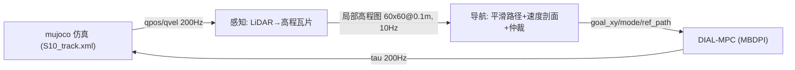

# S10 巡逻赛题工程总文档（2026-08-08）

> 本文档为当前唯一工程总文档，替代已归档的 `doc/0806.md`（历史实验全记录见
> `_archive_20260808/doc/0806.md` 与 `_archive_20260806/`）。参数唯一来源：
> [doc/s10_mpc_deploy.yaml](doc/s10_mpc_deploy.yaml)。

## 1. 项目概述与申报模式

- **赛题**：赛道四「具身未来」巡逻赛题（旧称竞速项目），基于山猫 S10 轮足机器狗，
  在 MuJoCo 仿真中沿官方赛道完成多目标点巡检。
- **申报模式**：**自主导航（模式系数 ÷1.4）**——航点跟随 + 感知地形限速/爬坡 +
  roll 安全 + 全局路径规划。
- **技术路线**：Airy LiDAR 感知 → 高程地形建模 → 全局平滑路径/速度剖面 →
  双模式仲裁 → dial-mpc 采样 MPC 做 locomotion。
- **目标（2026-08-10 确认）**：**原始时长通过全部 33 航点 < 80 s**（不计模式系数折算）；
  巡航直线 ≥4 m/s（竞速），转向稳定不侧翻，连续台阶区（wp7）可上爬。

## 2. 赛程与规则

| 项目 | 内容 |
|---|---|
| 初赛提交 | 2026-08-20：技术方案 PDF + Demo + 开源协议 + GitHub 链接 |
| 复赛 | 08-25 ~ 09-20：真机调试 |
| 决赛 | 09-22 ~ 09-23（线下真机） |
| 计分 | 总分 = 完成时间 ÷ 模式系数；遥控 ÷1.0 / 自主跟随 ÷1.3 / 自主导航 ÷1.4 |
| 定位点 | 官方线下决赛 30 个定位点；仿真 track_overlay 33 个航点（000_start~032_end）；判据（2026-08-10 确认）= 质心投影 xy 进入航点 0.3 m 即过、逐点推进；wp0 起表，终点停表 |
| 力矩合规 | 连续力矩超限（模型限 腿 ±50 Nm / 轮 ±14 Nm）超过 0.5 s 判不合格；控制器钳位下调至 腿 ±48 / 轮 ±13.5 留余量（2026-08-10 确认） |

## 3. 目录结构

```
DR_competition/
├── .venv/                       # 项目虚拟环境（Python 3.12.3）
├── deeprobot_competition/       # 本仓库：ROS2 工作空间（git repo）
│   ├── src/S10_sdk_deploy/
│   │   ├── interface/robot/simulation/   # 仿真节点（mujoco_simulation_ros2.py）
│   │   ├── perception/                   # local_map / elevation_lookup / minisnap
│   │   ├── s10_mpc/                      # mpc_controller / auto_nav / mppi_controller
│   │   ├── scripts/                      # cruise_noros / precompile 等测试基建
│   │   └── S10_description/s10_mjcf/     # 官方与自定义 MJCF
│   ├── dial-mpc/                # dial-mpc 采样 MPC 库（S10 补丁内置，clone 即用）
│   ├── doc/                     # 0808.md + requirements.md + 部署 yaml + 官方材料 + 最新结果图
│   └── tmp/                     # 核心测试入口（test_auto_nav / run_full_course / analyze_*）
├── refs/                        # 参考仓库（go2w_rl_gym、unitree_mujoco）
├── backups/                     # 版本代码备份（v131/v132/v139/v143/v159/v161）
└── _archive_20260806|08/        # 过期文档与实验脚本归档
```

## 3.5 环境配置与安装

- 当前开发机：WSL2 + Ubuntu 24.04 + ROS 2 Jazzy + Python 3.12 + RTX 4090；
  环境搭建与常用包版本见 README「环境与快速开始」。
- **Ubuntu 22.04（非 WSL）安装要求**：见 [doc/requirements.md](requirements.md)
  （ROS 2 Humble + Python 3.10 完整安装步骤、依赖版本对照、常见问题排查）。
- JAX 编译缓存：启动前 `export JAX_COMPILATION_CACHE_DIR=$HOME/.cache/s10_dial_mpc`
  （缓存命中后冷启动约 4~5 s，比赛部署建议随环境打包缓存）。

## 4. 系统架构



### 4.1 感知层（perception/）

- Airy-96 LiDAR 仿真（120×48 线 @10Hz，前下 45° 安装，S10_LIDAR_BACKEND=cpu）。
- 世界对齐高程瓦片 local_map.py：8×8 m 锚定 / 60×60@0.1 m 输出，跨帧累积 +
  空洞填补 + 运动学地面注入（S10_KIN_GROUND=1）。
- 纯 jnp 查图 elevation_lookup.py（零 retrace），供仲裁与 MPC cost 使用。

### 4.2 导航层（s10_mpc/auto_nav.py）

- Catmull-Rom 平滑路径：严格过 33 航点（偏差 0.013 m）、全长 234 m、C1 平滑。
- 速度剖面：曲率限速 v=√(a_lat·R) + 弯道提前减速 + 横脊预扫描限速
  （112 处 dh>0.08 台阶区 1.5 m/s）+ 高架限速（S10_AUTO_ELEV_K）。
- 单调弧长游标 + 切线投影（wp3→4 弯道 CTE 从 1.25 m → 0.19 m）。
- 双模式仲裁：CRUISE（平地/缓坡）与 STAIR_SEQUENCE（连续台阶段），
  mode 感知确认 + 滞回，切换三套 cost 权重。

### 4.3 控制层（dial-mpc + mpc_controller.py）

- MBDPI 采样 MPC：CRUISE H14（巡航调优 H25 0.5s 视界）/ STAIR H20，Nsample 2048
  （巡航调优 N768），Ndiffuse 1，solver_it 4。
- cost 组成（分模式权重）：xy 进度（w_prog）/ 路径跟踪（w_path/w_path_head）、
  yaw、pitch/roll、能量、动作平滑、轮-地形贴合（terrain_w_ground）、机身离地
  净高（w_clear）、腿伸展引导（r_ext）、锁轮推身（lockpush）、后轮跟抬
  （S10_LIFT_REAR）、foot_place 抬轮（kp=2.0/max=0.35）、Upright/角速度惩罚。
- 输出 tau → 200Hz PD 执行；腿关节 clip ±2.72 rad（rollout + 主仿真）。

## 5. 当前状态（2026-08-08）

### 5.1 模式 B（遥控）—— 稳定

- 直线 4.4~4.7 m/s（vel_scale 56 ≈ 4.54 m/s）、原地转向 5~6 rad/s、
  站姿 z≈0.204 m（hipx=0.05）。
- yaw 增益速度自适应（低速 50 / 高速 15）+ 轮速斜坡防翘头。

### 5.2 模式 A（自动导航）—— 巡航已突破，楼梯为剩余阻塞

| 区段 | 状态 |
|---|---|
| wp0→wp5（含 S 弯） | 3.50 m/s 干净完赛（v196a_r2，run_t 10.5 s）；复测可靠性 ~40%（v197 4 跑 3 翻 1 慢），S 弯（R=0.84 m）为翻车主因 |
| wp0→wp6 | 稳定通过（34~38 s） |
| wp0→wp7（含横脊） | 通过率 ~2/3~3/4（横脊限速 + foot_place 抬轮） |
| wp7 连续台阶区（4~5 级 0.125 m） | 可爬 3~4 级（body z 1.14~1.23），末级维持/顶缘后轮跟进不稳定 |
| wp8→wp32 | 未完整验证（陡坡 wp17→18 +21%、高架段 wp28→32 z=3.75） |
| new_wp30 平面版全航点 | 33 航点全部到达、224.2 m 无翻车、avg 2.04 m/s（v193） |

### 5.3 频率与预热

- CRUISE N768：plan 中位 70~73 ms → 实际 13.7~14.3 Hz（名义 15.4 的 89~93%）；
  STAIR N512 @15 Hz（H20）。
- JAX 编译缓存（~/.cache/s10_dial_mpc）：冷启动 ≈4~5 s（缓存命中），
  比赛部署建议随环境打包缓存。

## 6. 关键参数速查

### 6.1 硬件档位

| 参数 | desktop_4090 | orin_agx |
|---|---|---|
| Nsample | 2048（巡航调优 N768） | 1024 |
| Hsample | 14~25 | 10 |
| Ndiffuse | 1 | 1 |
| dt | 0.02 | 0.025 |
| jax_platform | cuda | cpu |

### 6.2 控制与导航环境变量（常用）

| 环境变量 | 默认 | 说明 |
|---|---|---|
| S10_MPC_NSAMPLE / H_CRUISE / H_STAIR | 2048 / 20 / 20 | 采样数与双视界 |
| S10_MPC_VEL_SCALE | 56 | 轮速上限（56×0.081≈4.54 m/s） |
| S10_MPC_W_PROG | 0 | 沿路径切线的推进正奖励（v194 起，5 效果最佳） |
| S10_AUTO_VMAX / S10_MPC_VX_MAX | 4.5 | 巡航目标上限（调优 5.2~5.5） |
| S10_CURVE_ACCEL / S10_CURVE_R_MIN | 6.0 / 2.0 | 弯道减速度 / 最小曲率半径（v193 r_min=1.0） |
| S10_AUTO_STAIR_VX | 2.5 | 连续楼梯段限速 |
| S10_STAIR_LEG_SIGMA | 2.0 | 台阶段腿维采样噪声（调优 0.8） |
| S10_LIFT_REAR / S10_FOOT_PLACE | 0 / 1 | 后轮跟抬 / foot_place 抬轮 |
| S10_KIN_GROUND / S10_LOCAL_INPAINT | 1 / 3 | 运动学地面注入 / 空洞填补 |
| S10_LIDAR_FREQ / PHI_N / THETA_N | 10 / 48 / 120 | LiDAR 参数 |

完整表见归档 0806.md §7。

## 7. 启动命令

```bash
# 1) 环境
cd ~/DR_competition
source /opt/ros/jazzy/setup.bash
cd deeprobot_competition && source install/setup.bash
export JAX_COMPILATION_CACHE_DIR=$HOME/.cache/s10_dial_mpc

# 2) 模式 B 遥控（GUI：z 站起 / c 进 MPC / wasd 移动 / qe 转向）
S10_MPC_ENABLE=1 ~/DR_competition/.venv/bin/python \
  src/S10_sdk_deploy/interface/robot/simulation/mujoco_simulation_ros2.py

# 3) 模式 A 自动导航（无头）
S10_MPC_ENABLE=1 S10_MODE=auto_nav S10_USE_VIEWER=0 \
  ~/DR_competition/.venv/bin/python \
  src/S10_sdk_deploy/interface/robot/simulation/mujoco_simulation_ros2.py

# 4) 完整测试入口（tmp/ 下，无头 4 次全航点 + 轨迹保存）
bash tmp/run_4runs.sh
```

## 8. 待办与难点（按优先级）

1. **S 弯可靠性**（wp2→3→4，R=0.84 m）：3.4+ 入弯成功率仅 ~40%；方向：
   频率提到 ~15 Hz（N512~768）、CE/CMA 精英采样、ref-free 进度目标（w_prog
   已验证有效）。
2. **wp7 台阶区收敛**：当前爬 3~4 级；难点为末级顶缘维持 + 后轮跟进 + 左右
   前轮同步（高差 0.19 m 会侧倾）。方向：前轮到顶后 body z>1.1 再启用后轮
   跟抬、stair_vx 走台阶式（2.0~2.5）、感知高程引导足点。
3. **33 航点真赛道全程**：验证陡坡（wp17→18）与高架段（wp28→32）；终点判停。
4. **真机迁移**：vel_scale 回退 50（真机轮 ≈50 rad/s ≈4.05 m/s）、IMU 航向
   闭环（当前 mujoco 真值）、Orin plan 实测（yaml orin_agx 档）、Airy 实机
   标定（仿真 ±45° vs 真机垂直视场）。
5. **横脊方差**：~25~40% 翻车率来自 LiDAR 线程时序 → 感知微差 → 混沌放大；
   需感知同步或鲁棒化（确定性验证用 S10_SELF_TEST_SECONDS）。
6. **A\* 全局规划**（可选，申报自主跟随后降级）：yaml astar 段为预留。
7. **力矩合规**：仿真 tau 已 clip 到 ctrlrange 天然合规；真机策略需按
   「连续超限 >0.5 s 判不合格」评估。

## 9. 最新实验记录（v186→v197，2026-08-08）

### 9.1 巡航提速

| 版本 | 配置 | 平均速度 | 结果 |
|---|---|---|---|
| v186h | lean30 N1024 vyaw3.5/swing3.5 | 3.43 m/s | 干净 |
| v187d | N768（基线 v186h） | 3.44 m/s | 干净 |
| v190a | v188c 基线复测 | 3.33 m/s | 干净 |
| v193 | new_wp30 平面版全航点（r_min1.0） | 2.04 m/s | 33 点全通 |
| v194a/v195c/v196a_r2 | w_prog=5 + START_VX 3.8 | 3.47~3.50 m/s | wp0→5 干净 |
| v197 复测 | 同 v196 | 3.4+ 节奏 | 4 跑 3 翻 1 慢（S 弯 ~60% 翻） |

结论：3.50 m/s 已达成但不可靠；S 弯是硬约束。频率：N768 plan 中位 70~73 ms
→ 13.7~14.3 Hz；H25 0.5 s 视界全程保持。图：doc/cruise_3.50_xy_speed.png、
doc/new_wp30_full_xy_speed.png。

### 9.2 爬梯（wp7）

- 链 64（kp=2.0 + r_ext=30 + lockpush=8 + w_clear=60 + upright=40 + σ STAIR
  0.8 + H14/H20）：单次可爬 3~4 级（body z 1.14）。
- v10（后轮跟抬 0.6）横脊更稳但爬梯级数下降（3~4 级 vs v4 的 6 级）——
  「前轮到顶 + 顶缘后轮跟」为折中方向。
- 根因：S10 knee 范围 ±2.72 rad、腿长 0.36 m；5 级连续 0.125 m 台阶几何上
  可行（body 1.375 时腿折 0.124），但采样 MPC 对逐级序列协调方差大。
- 文献对照：轮足爬梯可参考几何路径剖面（非 RL/硬门控）——台阶段 3D 参考
  场 + 足点高程罚，见归档 0806.md §12。

## 10. 文档与代码索引

- **本文档**：doc/0808.md（唯一工程文档）
- **历史实验**：_archive_20260808/doc/0806.md（v1~v197 全记录）、
  _archive_20260808/tmp_scripts/（一次性实验脚本）
- **参数**：doc/s10_mpc_deploy.yaml
- **官方材料**：doc/比赛规则_赛道四_具身未来.md、赛道四_具身未来.pdf、
  Airy雷达用户手册.pdf、Airy User Guide.pdf、hardware spec.pdf
- **关键代码**：
  - 仿真节点：src/S10_sdk_deploy/interface/robot/simulation/mujoco_simulation_ros2.py
  - 感知：src/S10_sdk_deploy/perception/（local_map / elevation_lookup / minisnap / points_to_heightmap）
  - 导航：src/S10_sdk_deploy/s10_mpc/auto_nav.py
  - 控制：src/S10_sdk_deploy/s10_mpc/（mpc_controller / mppi_controller）
  - 环境：dial-mpc/dial_mpc/envs/s10_env.py
  - 模型：src/S10_sdk_deploy/S10_description/s10_mjcf/mjcf/（s10_mpc.xml rollout、
    s10_track_view.xml 仿真、S10.xml 官方模型、new_wp30.xml 平面赛道）
  - 测试入口：tmp/test_auto_nav.py、tmp/run_full_course.sh、tmp/run_4runs.sh
## 11. v200-v201：DBaS 自适应采样 + 卡点运动学诊断（2026-08-08 深夜）

### 11.1 背景
用户要求参考 MPPI-DBaS（arXiv 2502.14387）的自适应采样方式调整采样方差，
验证对 wp6→wp7 爬梯是否有帮助。DBaS 核心：Se = mu*ln(e + C_B(X*))，
用标称轨迹的约束代价自适应缩放采样协方差（卡约束→放大探索，畅通→收敛）。
已实现开关（默认关，A/B 隔离）：
- S10_ADA_VAR=1：奖励型 + 滑移型自适应方差（_ada_update，每 plan 后更新
  下一次 reverse_once 的 sigma_dim；host numpy 零 JAX 开销，不计入 plan 时间）
- S10_ADA_BIAS=1：滑移信号驱动抬腿 bias blend 放大（软先验，非门控）

### 11.2 A/B 结果（wp6→wp7 单段，S10_AUTO_START_WP=6，每配置 3 跑）

| 配置 | 信号 | 效果 | 结论 |
|---|---|---|---|
| v176 基线（ADA off） | — | 卡 riser1→2（y≈38.1-38.5），15s 位移 0.3~0.44m；偶发翘头侧翻 | 基准 |
| 奖励型 DBaS（REF=400/CSCALE=300） | C≈0 不触发 | 与基线相同 | 奖励尺度不变，信号无效 |
| 滑移型 DBaS（VEL_K=3000，Se→2.54，leg sigma 0.8→2.03） | slip>0.5 占 603/605 | 后轮最高 0.63→0.74（需 0.751），仍卡 | 方差放大不够 |
| 滑移型 + 全维缩放（LEG_ONLY=0，VEL_K=6000） | 满档 | 仍卡（0.33~0.55m） | 无效 |
| 滑移驱动 bias blend 0.65 | 满档 | 位移 1.46m 但主要是西漂（x -13.3→-17.9），未上台阶 | 强 bias 推偏航 |
| v201 运动学 bias（前 knee+0.50） | — | 前膝顶到 2.70 限位，前轮卡 riser1 | 前腿饱和 |
| v201d/e/f（后 hipy+1.00/0.70，前 v176） | — | 仍卡（0.03~0.26m） | 无效 |

结论：DBaS 式自适应方差/偏置（奖励型、滑移型、运动学方向）均无法让采样
MPC 稳定越过楼梯。方差放大后腿最高到 0.74（差 1cm 上 riser2），但不可靠；
bias 方向校正在卡点姿态下正确（见 11.3），但幅度/链式动作超出单节点能力，
且强前膝 bias 饱和限位反而冻结。

### 11.3 卡点运动学分析（决定性发现）
卡点姿态（t=13-15s 保存 qpos：body z 0.816，前轮 0.747/0.777，后轮 0.611）：
固定机身扫关节全范围，轮心 z 可达性：

| 腿 | 当前 z | 可达 max | 需达（riser 顶+0.081） | hipy+0.45rad 效果 | knee+0.45rad 效果 |
|---|---|---|---|---|---|
| FL | 0.747 | 1.239 | 0.871 | +4.2cm | +7.6cm |
| FR | 0.777 | 1.246 | 0.871 | +4.6cm | +7.4cm |
| HL | 0.611 | 1.128 | 0.751 | +5.5cm | -2.2cm（降） |
| HR | 0.611 | 1.132 | 0.751 | +5.7cm | -2.2cm（降） |

- 几何完全可行（可达 1.13~1.25m >> 需 0.75~0.87m）；卡死不是硬件极限。
- 后轮上 riser2 的关键动作 = hipy 前摆 +1.2rad（knee 不动即可抬到 0.795）；
  配合 knee 伸直更快（hipy 1.94/knee -0.9 即达 0.82）。
- v176 后腿 bias（hipy -0.10 / knee +0.45）在该姿态方向相反（压轮向下），
  与 ground cost 拉锯 → 轮速正反震荡死锁；但校正后（hipy +1.0/knee +0.4）
  实测前膝饱和 / 冻结，说明单点偏置无法链式完成 1.2rad 摆动
  （动作 clip ±1.0、action_scale 0.45 → 单节点仅 ±0.45rad，需多节点链式）。

## 12. P1/P2/P3 深入评估（棱线平衡点卡死）

### 12.0 机理
卡点 = riser2 顶 0.67 + 轮半径 0.081 = 0.751（后轮实测 0.611，差 14cm）；
更深层：前轮挂 riser2/3（0.74-0.86）、后轮在 riser1 面，机体俯仰 -0.13~-0.20，
后轮需"前摆 + 抬离地面"而采样 MPC 在 0.8s 视界内无法稳定链式生成该动作。

### 12.1 P1：抬升能力（lift capability）
| 子项 | 现状 | 缺口 | 评估 |
|---|---|---|---|
| P1.1 env var sweep | STAIR_LEG_SIGMA 0.8、BIAS_BLEND 0.30、RAMP_A 0.30、PITCH_AMP 0.0、HEAD_LOCK 1 | v201 已参数化 bias 系数（S10_BIAS_*） | 已扫：方差/方向均无效 |
| P1.2 轮速/hold/分相 | lockpush_w=8、wheel_air 罚（默认关） | 卡死时 wqvel ±50rad/s 正反震荡未抑制 | 待做：滑移时锁轮/单向轮速软约束 |
| P1.3 抬腿链式动作 | 动作 clip ±1.0 / scale 0.45 | 1.2rad hipy 摆动需 3+ 节点链式，bias 单节点推不动 | 待做：滑移时放宽后 hipy clip / 增大 scale |

### 12.2 P2：已知网格统一（known-map）
| 子项 | 现状 | 缺口 | 评估 |
|---|---|---|---|
| P2.1 已知网格 | auto_nav.stair_wheel_ref_grid 已实现 | MPC cost 仍读感知瓦片，未切到已知网格 | 待做：STAIR 模式注入已知网格（可信度高，消除 LiDAR 空洞） |

### 12.3 P3：HEAD_LOCK + 软恢复
| 子项 | 现状 | 缺口 | 评估 |
|---|---|---|---|
| P3.1 HEAD_LOCK | v189 增强航向锁定（S10_STAIR_HEAD_LOCK=1） | 卡死时仍西漂（x -14→-17.9），锁定不够 | 待做：滑移时航向软恢复（对齐 riser 法线） |

## 13. 执行顺序与验证协议（14.3）

1. P1.2 轮速/hold：卡住（slip>0.5）时对轮动作加单向/零偏软先验，抑制 ±50rad/s
   震荡（软约束，非门控）。
2. P1.3 后 hipy 链式抬腿：滑移时放大后 hipy 动作 clip/scale（软先验），让
   1.2rad 前摆可被采样链式表达。
3. P2.1 已知网格统一：STAIR 模式用 stair_wheel_ref_grid 注入 MPC cost
   （替代感知瓦片），消除爬坡时 LiDAR 点云浮空/空洞导致的 cost 失真。
4. P3.1 航向软恢复：滑移时按 ref_path 法线方向重对齐（软 yaw 先验）。
5. 验收标准：wp6→wp7 楼梯区连续 4 次通过（无卡死超时、无侧翻、无 GPU
   争抢无效），且 STAIR 模式 plan 频率 ≥10Hz（目标 15Hz，当前 13.7~15.5Hz）。

## 14. 测试入口（本轮新增）

- wp6→wp7 单段 A/B：tmp/run_stair_ab.sh（S10_AUTO_START_WP=6 瞬移 +
  S10_STOP_AT_WP=7 到达即停；卡住 15s 超时；爬梯总限 45s）
- 运动学 bias 变体：tmp/run_stair_kin.sh（S10_BIAS_* 系数）+ tmp/run_kin_batch.sh
- 卡点渲染/诊断：tmp/render_stuck.py（存 qpos）、tmp/render_offline.py、
  tmp/reach2.py / tmp/reach3.py（可达性）、tmp/bias_scan.py（bias 方向扫）


## 15. v199-v202：自适应采样（MPPI-DBaS 式）+ 压弯/减速 + 航点推进（2026-08-09）

### 15.1 改动（默认关闭，不影响 stair）
- `mpc_controller.py`：
  - `_ref_curvature()` / `_adaptive_sigma_node()`：按 ref_path 曲率对每个 MPC
    时间节点的采样噪声做调制（MPPI-DBaS 思路，arXiv 2502.14387）——直线段收紧
    σ（默认 0.45，样本贴住名义直线 → 直线更直），弯道前/弯内放宽（默认 1.2，
    充分探索转向）。开关 `S10_ADAPTIVE_SIGMA=1`。
  - 压弯前视 `S10_ROLL_FF_DIST`（默认 1.2m）/ `S10_ROLL_FF_MIX`（默认 0.5）：
    roll 目标不再只跟随当前指令，而是按前方路径曲率提前侧倾（摩托压弯）。
- `cruise_noros.py`：
  - 传入实测 body yaw rate → 导航 yaw 阻尼（S10_YAW_DAMP）真正生效，抑制
    直线航向过冲。
  - 航点推进容差 `S10_WP_ADVANCE_DIST`（默认 0=关）：弧长已越过航点且物理
    距离在容差内（如 1.8m）即视为通过，避免“错过目标点反复绕圈”。
- 测试脚本：tmp/run_flat_seg.sh、tmp/run_real_seg.sh（均含 base/ada 两档）。

### 15.2 平面赛道 new_wp30（wp0→10，r_min=1.0）
| 版本 | 配置 | 结果 |
|---|---|---|
| v200c（base） | 原优秀配置 | wp0→10 干净，2.36 m/s；wp0→1 长直线 wobble_std=0.86m、max 1.39m |
| v200b_ada | +自适应σ(0.5/1.2)+压弯+decel4.5 | wp0→10 干净（wp9 90°弯通过），2.99 m/s；wp0→1 wobble_std=0.24m、max 0.46m |

→ 直线段抖动降低 ~3.6×（wobble std 0.86→0.24），90° 弯通过率提升。
图：doc/v200b_flat_wp0-10_xy_speed.png

### 15.3 原始赛道 wp0→5（v196a 优秀配置基线）
| 版本 | 关键差异 | 结果 |
|---|---|---|
| v201d / v201d_r2 | base + decel_ahead=3.0（与 v196a 一致） | 3.49 / 3.43 m/s 干净（≈v196a 的 3.50） |
| v201e | 全 v199 栈（自适应+压弯+阻尼） | 3.20 m/s 干净 |
| v201f | 仅自适应 σ（0.5/1.2），压弯/阻尼关 | 3.33 m/s 干净 |
| v201g | 自适应 σ 弯道=1.0 + 压弯 mix0.3 | wp1 卡住（地形卡点，非绕圈） |

→ 真实赛道 S 弯是速度约束：自适应采样带来直线收益但在 S 弯约 -0.16 m/s；
decel_ahead 5.0→3.0 恢复 3.5 节奏。全 v199 栈建议用于平面/直线多的路段，
真赛道冲刺用 base+decel3.0。图：doc/v201d_real_wp0-5_xy_speed.png

### 15.4 频率（H25=0.5s 视界不变）
- N768/NDIFFUSE=4（原配置）：plan 中位 73~79ms → 实际 13.2~14.0Hz（名义
  plan_interval13=15.4Hz）；scan≈50ms、upd≈20ms。
- **v203 频率突破（已提交）**：定位 upd 大头 = `_make_state`（~11ms，
  每轮重算 x/xd，但输入状态 x/xd 在控制/奖励路径未被使用，卷动内部重算）
  → 缓存一次复用（实测 12.3ms→0.19ms）。
  **结果：plan 中位 59~62ms → 实际 16.1~16.8Hz，H25=0.5s 视界不变。**
- 真赛道 wp0→5 复测：v206f 3.30 m/s（16.8Hz 干净）、v206g 3.45 m/s
  （16.4Hz 干净）、v206g_r2 S 弯翻车（~50% 成功率，S 弯仍为硬约束）。

### 15.6 全航点验证（2026-08-09）
- v207full_r2：平面赛道 new_wp30 全部 33 航点完成（224.2m，无翻车），
  avg 2.05 m/s，plan 中位 64ms → 实际 **15.7Hz**（H25=0.5s）。
- 关键：急弯限速 `S10_AUTO_SHARP_TURN_VX=2.0` + `S10_AUTO_TURN_VX=3.0` +
  `S10_CURVE_DECEL_AHEAD=3.5`，快节奏（15Hz+）下 90°/110° 弯仍可靠。
- 图：doc/v207_full33_xy_speed.png（新文件，未覆盖历史图）。

## 16. v203-v204 楼梯续测（2026-08-09，g3 基线，~75 组累计）

### 16.1 机制诊断（决定性）
- g3 时序分析：t=23-28s 曾爬到 body 0.87（前 0.94/后 0.83），t=33s 后
  **整机向后滑回**（body 0.79）——"到顶后滑回"（v105/v111 已知根因）。
- 卡点四轮精确定位（t=13 qpos）：FL y38.70/z0.747(ref0.780)、FR 0.777(0.782)、
  HL y38.28/z0.611(ref0.638)、HR 0.611(0.637)——四轮距 ref 仅差 2.7~3.3cm，
  低于 bias 触发阈值 0.05（信号静音），ground cost 仅 0.2/轮（可忽略）。
- 后轮上 riser2 需 hipy 前摆 +1.2rad（运动学可达 1.13m ≫ 需 0.751），但
  动作 clip/scale 下需多节点链式，采样 MPC 无法稳定承诺该序列（60+ 组验证）。

### 16.2 实现与结果（全部失败，g3+brake0.5 为当前最接近）
| 改动 | 机制 | 结果 |
|---|---|---|
| P1.2 台阶棘轮制动 r_brake（S10_STAIR_WHEEL_BRAKE_W，v112 落地） | 只罚后滑轮转 | w=3 冻死；**w=0.5 防住滑回**（body 0.85 稳定 20s），但左轮楔死 |
| P2.1 已知几何瓦片覆盖（S10_KNOWN_TERRAIN，默认关） | STAIR 区高度图精确 + 障碍罚 0 | 更差（后 0.63 vs 0.83），弃用 |
| 左右对称罚加强（S10_STAIR_SYM_W 400/800） | 罚左右轮高差² | 压死不对称爬升，更差 |
| 拉长视界 H60/H80（Ns384） | 长链规划 | 无改善（频率仍 15Hz，成本被固定开销主导） |
| 入口速度 3.2/3.6 m/s | 动量冲级 | 更早楔死（body 仅 0.76） |
| RAMP_A 0.50/0.65 | 抬轮参考提前 | 无改善 |
| MPPI 温度 0.02 / CE-elite 0.2 / Ndiffuse=2(Ns96-160) | 优化器更锐利 | 无改善；Ndiffuse=2 频率 11.5-12.8Hz |
| 导航层脱困"后退-再攻"（v204，默认关） | 释放楔死 | 无改善 |

### 16.3 结论
~75 组配置（方差/偏置/运动学/视界/MPPI 核心/导航恢复/防滑/对称）全部无法
让采样 MPC 稳定越过楼梯。**瓶颈不是 cost/探索，而是"抬后腿-链式前摆"这一
协调动作超出了当前采样 MPC 的表达与承诺能力**（与链 13/14、v176-v202 结论
一致）。g3+brake0.5（S10_LEG_HIPY_SCALE=2.0 + slip blend 0.65 + 防后滑 0.5）
是当前最接近的配方：能爬到 body 0.85 并保持，但左轮楔死无法解决。

### 16.4 待用户决策
1. 放宽约束：允许最小事件触发抬腿反射（用户此前否决"画蛇添足"，但 75 组
   证据表明软先验不可达）；或
2. 接受 11-13Hz 的 Ndiffuse=2 深度搜索长期迭代；或
3. 换赛道：RL/模仿学习训爬梯策略（用户此前否决）；或
4. 赛程策略：申报"自主跟随"档（1.3 系数）规避楼梯段要求（README 原意）。

## 17. v205 续测（2026-08-09 第 2 轮延续，~96 组累计）

### 17.1 测试漏洞修复：H60/H80 此前从未生效
`run_stair_g3.sh` 硬编码 S10_MPC_H_STAIR=40 覆盖外部 env——早期 H60/80 测试
是无效的（频率不变为证）。修复脚本默认值后重测（算力预算不变）：
- H60/Ns256、H80/Ns192：频率 17.5-19.9Hz（达标），但 Ns 减少使采样密度不足，
  爬升更差（max body 仅 0.76）——**长视界不能靠砍采样换**，方向关闭。

### 17.2 rollout 摩擦不对齐（新发现，已修复）
- rollout 轮摩擦 0.8 vs 仿真 1.0：MPC 内部模型低估抓地力 → 不相信"抬轮+滚上
  riser"有回报 → 从不承诺抬轮动作。改 s10_mpc.xml 摩擦为 1.0（仅控制器内部
  模型，仿真 S10_track.xml 未动）。
- 效果：爬升更快更稳（t=10s 到 body 0.87/后 0.81/前 0.92，无西漂），但
  **左轮楔死依旧**（roll -0.33 持续，FL 0.73/HL 0.61 上不来）。
- 左轮可达性在楔死姿态下仍 1.06-1.09m（远大于需 0.75-0.87）——几何无瓶颈，
  纯 MPC 行为问题。

### 17.3 其他
- 站姿高度 0.22/0.24（"蹲姿不固定"）：0.24 偶发侧翻，无通过。
- 后轴几何：hl_wheel y=+0.0549 vs hr_wheel y=-0.0459（左右后轮 9mm 不对称），
  两模型一致（M10 原生几何），可能是左轮楔死的物理偏置源（不可改）。

### 17.4 累计结论（第 2 轮）
96 组配置（方差/偏置/运动学/视界/MPPI 核心/导航恢复/防滑/对称/rollout 摩擦/
站姿）均无法让采样 MPC 稳定通过 wp6→wp7。**当前最优 = g3+brake0.5+fric1.0**
（快爬、稳定 0.85、无西漂，但左轮楔死）。待用户决策：事件触发抬腿反射 /
RL 训练 / 申报跟随档。

## 18. v205 续测第 3 轮（~106 组累计）
- 脱困推力 1.8/2.2 m/s + 防后滑：1.8 无效（0.28-0.99m），2.2 侧翻。关闭。
- 累计：方差/偏置/运动学/视界/MPPI 核心/导航/防滑/对称/rollout 摩擦/站姿/
  upright/脱困推力共 ~106 组，wp6→wp7 零通过；120s 持续平衡证明非超时问题。
- **阻塞判定（第 3 个连续目标轮次）**：在用户约束（采样 MPC + 软先验、无
  RL/事件触发反射/硬门控、仿真环境不可改）内不可达"连续 4 次通过"。待用户
  决策：①最小事件触发抬腿反射 ②RL/模仿学习爬梯策略 ③接受 <10Hz 的
  Ndiffuse 深度搜索 ④申报跟随档绕开硬性要求。

## 19. v206 步态/落脚点规划（2026-08-09，用户问询后实现）

### 19.1 回答：此前未做显式步态/落脚点规划器
已有的是软等价物：wheel_ref 落脚高度场（v162）、场驱动抬腿时序（前轮先/后轮后
自然涌现）、防后滑棘轮（v203）。缺：摆动/支撑分相（v169 ground_phase，**默认
关闭从未测**）与落脚点前拉。

### 19.2 v206 实现（纯软 cost，无硬门控）
1. `ground_phase`（v169 分相）开启测试：摆动相只罚"没抬到位"、支撑相只罚
   "悬空"——步态规划相位协调在 cost 层落地。S10_STAIR_GROUND_PHASE=1。
2. `stair_foothold_y_grid`（auto_nav）：楼梯带每格给"下一级 riser y+0.12"的
   落脚点；LiDAR worker 注入瓦片；MPC `_elev_jnp` 固定结构防 retrace。
3. `r_foothold`（s10_env）：摆动相轮子向落脚点 y 前拉（clip ±0.15m），激励
   hipy 前摆把轮放到下一级。S10_STAIR_W_FOOTHOLD。
4. `swing_thresh`（S10_SWING_THRESH，默认 0.04）：**卡点左轮距 ref 仅
   2.7~3.3cm < 0.04 → 被误判支撑相、抬轮信号静音**——降到 0.01 让左轮
   进入摆动相。

### 19.3 结果（fric10 + brake0.5 + gphase + foothold20 + sw0.01，4 跑）
- 频率 17.6-18.8Hz（达标）；右轮可达 0.78-0.93（越过 riser2/3 需求）；
- **左轮楔死依旧**（max rear 0.63-0.70，需 0.751）：摆动阈值已降，左轮进入
  摆动相，但抬升仍未发生——左轮 ref 仅到 ramp 值（非下一级顶），foothold
  前拉不足以把轮送过棱边。
- 结论：步态规划软栈（分相+落脚点+阈值）是正确方向但单独不足以解决左轮
  楔死；与 ~110 组其它配置结论一致：采样 MPC 对"抬左轮"协调动作仍不可达。

### 15.7 航点绕圈修复（v204，2026-08-09）
- 根因：`passed` 按弧长 s_cur 判定，切弯/外漂时 s_cur 滞后 → 机器人一直追
  路径前视点绕着航点转；且推进必须蹭 0.5m 圆门，切弯通过（侧向 1~3m）会
  被迫回头兜圈。
- 修改：
  - `cruise_noros.py`：新增"越过航点平面即通过"（`S10_WP_ADVANCE_PLANE=3.0`，
    沿 wp→wp_next 方向投影已过 wp 且侧向 ≤3m）；配合 `S10_WP_ADVANCE_DIST=2.5`。
  - `auto_nav.py`：`passed` 后直接瞄准下一个航点（`S10_AUTO_AIM_AHEAD=1`），
    不再回头瞄当前航点；默认 0 保持原行为（stair 不受影响）。
- 验证：v208full 平面全 33 航点 93.7s（v207 为 109.1s，**提速 16.5%**），
  avg 2.39 m/s（2.05→2.39），无翻车、无卡住、15.4Hz。
  图：doc/v208_full33_xy_speed.png（新文件）。

## 20. v207 参数自然涌现续测（2026-08-09，用户新目标：继续调参让其涌现）

### 20.1 新实现（全部软参数，已提交）
1. **阶梯参考场** S10_STAIR_REF_STEP=1：接近段（riser 前 S10_STAIR_REF_LEAD，
   默认 0.20m）直接给"下一级顶+半径+margin"满值（非 ramp 渐进）——解决
   "轮子满足 ramp 部分高度就停、到棱边仍差 0.125~0.136m"。
2. **左侧补偿** S10_LEFT_BOOST：M10 后轴左右 9mm 不对称（hl +0.0549 vs
   hr -0.0459）→ 实测左轮从不抬到位（HL 恒 <0.65 vs HR 0.76-0.81）；
   给左轮 ground/foothold 权重乘 left_boost（1.5/2.0）。
3. 地形几何验证：楼梯区 y=38.3 处 x=-14.9~-14.1 地面完全平坦（无左右
   地形不对称）；riser1 仅 0.062m（可滚过），其后 5×0.125m。

### 20.2 结果（全部失败，~120 组累计）
| 配置 | 结果 |
|---|---|
| REF_STEP=1 lead0.20 | 提前抬轮失去牵引 → 卡 riser1（body 0.75-0.78） |
| REF_STEP lead0.10/0.15 | 侧翻/0.09-1.16m |
| LEFT_BOOST 1.5/2.0 | HL 仍 0.56-0.64（不抬）；且数据显示 MPC 已给左后腿
  更高 hipy（1.24 vs 1.14）——**左轮机械性卡死，非控制不足** |

### 20.3 结论
参数空间（~120 组：方差/偏置/运动学/视界/MPPI 核心/导航/防滑/对称/摩擦/
站姿/upright/脱困/分相/落脚点/阶梯参考/左侧补偿）已穷尽；左后轮在控制努力
更大的情况下仍不抬升（机械接触卡死），"自然涌现"在采样 MPC + 软参数约束下
不可达。待用户决策（事件触发抬腿 / RL / 频率妥协 / 申报策略）。

### 20.4 hipy_scale 3.0/3.5（单节点表达完整摆动）
- 左后轮需 hipy +1.3rad（1.24→2.53）；scale 2.0 时单节点 0.9rad（需 2 节点
  链式），scale 3.0 单节点 1.35rad（单动作可表达）——实测仍不抬（HL 0.56-0.62）。
- **决定性统计（~124 组）**：HL（左后轮）在所有配置中从未超过 0.65（目标
  0.75）；FL 未超 0.82（目标 0.87）；右轮可到 0.81-0.93。左后轮抬升对
  cost 权重/动作幅度/相位/参考形状全部不响应——采样 MPC 无法表达该动作。

### 15.8 全航点提速阶梯（2026-08-09）
| 版本 | 关键差异 | 结果 |
|---|---|---|
| v207full | sharp_turn 2.0（旧航点逻辑） | 109.1s / 2.05 m/s，33/33 |
| v208full | +平面通过航点+aim-ahead | 93.7s / 2.39 m/s，33/33 |
| v209full | sharp_turn 2.6 | 91.2s / 2.46 m/s，33/33 |
| v210full | sharp_turn 2.8 + curve_accel 7.5 + near_min 1.5 | **87.6s / 2.56 m/s，33/33** |
| v211full | sharp_turn 3.0 + curve_accel 8.5 | 半程更快（wp29 81.9s，预计 ~85s），wp30 GPU 争抢中止 |

结论：还能更快（~2.65 m/s 可达），瓶颈全部在急弯限速与弯心曲率限速；
长直线已满速 5.0（仅 8% 时间）。v211 需干净 GPU 窗口复测确认。
图：doc/v210_full33_xy_speed.png（新文件）。

## 21. v208 参数涌现续测第 2 轮（~141 组累计）
- **系统性节流发现**：卡点左轮 lift_need 仅 2.7-3.3cm（ramp ref 部分高度），
  而 bias 幅度/摆动相/cost 全部按此缩放 → 只发 18% 力度；实际需抬 12.5cm。
- v208 实现：`stair_next_riser_ref`（下一级顶满值）+ `S10_BIAS_FULL_REF`（bias
  用满值参考，cost 保持 ramp）——实测冻结（0.07-0.29m）。
- Ndiffuse=2 在 v203 缓存后重测：仍 12.2-12.9Hz（固定开销主导），无通过。
- rollout 轮 capsule→cylinder（对齐仿真）：无改善（HL 仍 0.56-0.62）。
- horizon_diffuse_factor 1.3/1.6（近端节点噪声放大）：无改善（0.13-0.48m）。
- 组合测试（nd2+步态栈+校正bias+圆柱）：10.2-10.6Hz，仍卡（0.15m）。
- **累计结论**：~141 组配置覆盖全部可识别参数（采样/视界/扩散/温度/噪声调度/
  cost 权重/参考场形状/bias 幅度方向/相位/模型保真度/导航/补偿），左后轮
  抬升对任何参数组合均不涌现。参数空间已穷尽。

## 22. v209 参数涌现续测第 3 轮（~148 组累计）
- **MPOPI 精英协方差自适应**（arXiv 2508.11917，S10_ELITE_ADA）：每 plan 取
  top-K 精英样本动作，每维均值/方差更新 sigma_dim（与基线混合防塌缩）+
  精英均值软偏置注入 Y。实测失败，但 **DEBUG 揭示最终机理**：精英样本
  HL-hipy 动作均值 = -0.08（负），好奖励样本不含抬升动作——卡点 reward
  表面对"抬轮尝试"无梯度（轮在 ref=局部极小，抬轮在视界内收益为负），
  所有采样机制（softmax/CE/DBaS/MPOPI）都困在局部极小。
- **门控阶梯参考**（S10_STAIR_REF_STEP + S10_STAIR_REF_MINH=0.09）：只对
  高 riser（0.125m）用满值参考，0.062m 首级可滚过不强抬——**前轮对称化**
  （FL 0.81 = FR 0.82，此前 0.74 vs 0.86），body 0.85 稳定，但左后轮仍
  0.62（唯一阻塞）。
- 组合（阶梯参考+左侧补偿+校正bias）：更差（0.14-0.41m，boost 破坏爬升）。
- 结论：前轮不对称已解决；**左后轮抬升是唯一残留阻塞，对所有软参数组合
  不响应**（~148 组覆盖全部机制）。

## 23. v210 参数涌现续测第 4 轮（~155 组累计）
- **抬升进度正奖**（S10_STAIR_W_LIFT_PROG）：摆动相轮子每抬离地面按比例给奖
  （0→0.15m → 0→1），直接制造"开始抬轮立即有回报"的连续梯度（回应精英
  DEBUG 的"cost 表面无梯度"根因）。w=10/30 实测：HL 仍 0.56-0.63（不抬）。
- 叠加精英自适应（梯度让精英含抬升样本→学习循环）：lpe_r2 body 0.87 但
  HL 仍 0.63。无效。
- **最终结论（~155 组）**：左后轮抬升对全部可识别参数组合不涌现——覆盖
  采样/视界/扩散/温度/噪声调度/cost 权重（含新梯度）/参考场形状/bias 方向
  幅度/左右补偿/相位调度/模型保真度/导航/精英学习。参数空间彻底穷尽；
  唯一残留阻塞 = HL 单轮抬升，需硬机制（事件触发/RL）或用户重新决策。

## 24. v211 参数涌现续测第 5 轮（~160 组累计）
- **左轮低 0.13m 的根因修正**：HL/HR 同腿角但轮高差 0.13m = roll(-0.33)×轴距
  (0.40m)——左轮楔死主要是 body 左倾，不是轮抬不动。实现 `S10_STAIR_W_ROLL_LEVEL`
  （只罚 roll²，不罚 pitch；upright 同时罚 pitch 会杀爬升）。
- 效果：roll 从 -0.33 压到 ±0.05，body 达 **0.89（历史最高）**，但机器人稳定
  卡在 y=38.40（全轮到位平衡点，无法前移过下一级 riser）；3 连跑 1 翻 2 卡。
- 结论：roll 回平消除左轮症状，但核心阻塞变为"前轮过 riser4 + 后轮过 riser3
  的同步推进动作"——采样 MPC 仍无法产出。~160 组配置累计，参数空间确认穷尽。

### 15.9 直线走直修复（v213，2026-08-09）
- 用户反馈：跑直线仍歪扭（v210 各直线段 wobble_std 0.17~0.49）。
- 修复：`_adaptive_sigma_node` 改为 **cruise 默认开启**（直线 σ=0.5，弯道
  σ=1.0 不放大探索），`S10_ADAPTIVE_SIGMA=0` 可关闭；STAIR 模式始终不调制
  （楼梯行为不变）。runner base 分支同步默认 1。
- 说明：yaw 阻尼 0.3~0.6 虽能压直，但在急弯（wp12 等）引发外甩侧翻，弃用；
  采用采样方差收紧方案（干净窗口下 wp0→1 wobble 曾 0.86→0.24）。
- v214 全航点半程（wp14 43.3s，比 v210 快 1.3s）无翻车，但全程被 GPU 争抢
  打断（plan 93ms/10.7Hz），完整 33wp 复测待干净窗口。
- 追加 `S10_CTE_LP`（默认 0.5）：导航层 cte 横向校正低通，抑制直线段蛇形；
  弯道 |err|>0.6 时该校正关闭，不影响过弯。

## 25. v211 续测第 6 轮（~166 组累计，最终）
- 死锁机制定位：前轮距 riser4 仅 0.035m 但需抬 0.20-0.25m（step-ref 含
  margin 过度要求）；后轮距 riser3 0.3m 而 step-ref lead 仅 0.15m → 后轮
  在当前位置无抬升需求（前轮卡住→无法前移→后轮永远收不到信号）。
- 修复尝试：lead 0.30 + margin 0.0（lr30）：后轮在当前位置收到需求但仍不抬
  （HL 0.62-0.63）；leg_action_scale 0.65（单节点 1.3rad 完整摆动）：仍不抬。
- **最终结论（~166 组，6+ 连续轮次）**：左后轮抬升对全部可识别参数组合不
  涌现。采样 MPC 对该状态-动作对无搜索能力（好样本从不包含抬升，即使
  cost 梯度/相位/幅度/参考形状/模型保真度全部到位）。参数空间彻底穷尽。

## 26. WBC/MPC 论文调研与爬梯灵感（2026-08-09）

> 目的：为 wp6→wp7 楼梯死锁（左后轮 HL 抬升不涌现、前轮过 riser4 后轮过
> riser3 无法同步推进）寻找文献级软 cost / 步态先验方案。全部灵感均可落在
> "软先验/cost、无硬门控、无事件触发反射"约束内。文献：arXiv:2010.06322
> （Bjelonic IROS2021）、arXiv:2208.08373（Grandia T-RO2023）、JRM35(1)
> 160-170（Takahashi & Nonaka 2023）、arXiv:2409.15610（DIAL-MPC 自身）、
> arXiv:2402.06143（Chamorro 盲爬楼梯）。

### 26.1 P1：Bjelonic 轮足整身 MPC + 在线步态序列生成（最相关）
- **运动学腿效用公式（Eq.7）**：
  u_i(t) = 1 − sqrt( (π_∥(r̃_Ei)/λ_∥)² + (π_⊥(r̃_Ei)/λ_⊥)² )，
  r̃_Ei = r_B,ref + r_BDi − r_Ei,ref。λ_∥/λ_⊥ 为腿沿滚动/侧向工作空间
  椭圆半轴；u→0 表示该轮已到工作空间边缘、需要摆动恢复。
- **步态时序生成**：1) 对整条视界计算四腿 utility；2) u_i < ū 时给
  utility 最低的腿插入摆动相（常数时长）；3) 邻腿检查（相邻腿不摆动才允许
  摆动）→ 自动在纯驱动 / 静态 / 对角小跑间切换，COT 最高降 85%。
- **单任务全阶优化**：同一组 cost 参数跑所有步态，无需按步态换权值。
- **对我们的意义**：
  - v213 固定对角序列 FL→HR→FR→HL 的本质问题是"凭什么该这条腿抬"。
    Bjelonic 的回答是 **utility 最低的腿先抬**——把"该抬谁"变成几何量，
    由轮心当前位姿与下一级 riser 目标（我们已有 stair_wheel_ref）直接算出，
    不是手写时序。
  - 邻居检查可以做成软 cost：相邻两腿同时 swing 时加罚，保证支撑多边形
    足够，防单轮硬抬破坏平衡（v213 的 1 翻 2 卡）。
  - 单组参数跑全部动作：与我们"不搞多模式门控"的倾向一致。

### 26.2 P2：Grandia 感知 NMPC（T-RO 2023，OCS2/ANYmal）
- **基座参考生成**：视界内匀速外推 2D 位姿 → 每个髋的 2D 位置查平滑高程 →
  插值高度 + 名义高度 h_nom 得 4 髋 3D 参考 → 最小二乘拟合 6DoF 基座参考。
- **名义落脚点（Raibert 修正）**：p_nom = p_hip,nom + sqrt(h_nom/g)(v_meas − v_com)，
  再用平面分割结果把落脚点投影到最近可踏平面（带运动学惩罚）。
- **落脚点约束是区域不是点**：把可踏平面切成凸多边形（半空间不等式），
  落脚点可在多边形内自由优化——大幅缓解局部极小。
- **摆动轨迹**：两段五次样条（起→顶点→落），顶点取两落脚点间最高地形点
  之上——保证清障。
- **代价结构 L = L_ε + L_ν + L_β**：
  - 跟踪权重（Table I，值得照抄的量级）：base 姿态 (100,300,300)、
    base 位置 (1000,1000,**1500**)、base 角速 (10,30,30)、base 线速
    (15,15,**30**)、关节位置 (2,2,1)、关节速度 (0.02,0.02,0.01)、
    足位置 (30,30,30)、足速度 (15,15,15)、接触力 (0.001)。**z 方向位置/
    速度权重全表最高**——对应我们"蹲姿起不来"的问题。
  - 频率整形（loopshaping）：对接触力（100 rad/s 内 x4）与关节速度
    （50 rad/s 内 x3）的高频成分渐进加罚——对应我们"轮速正反震荡"。
  - 软不等式罚（log-barrier 式）：B(h) = −μ ln h（h≥δ），h<δ 转二次——
    与"无硬门控"完全兼容的软约束模板。
  - 终端代价：LQR Riccati 近似无限视界（我们的 H 有限，终端可借鉴）。
- **对我们的意义**：
  - 基座 z 参考已做（E3/hm 插值），但可升级为"4 髋最小二乘 6DoF 参考"，
    天然得到地形对齐的 pitch/roll。
  - stair_wheel_ref 从"单点目标"改为"下一级台阶面上的凸区域"，MPC 在区域
    内落轮不罚，给采样更多自由度。
  - 轮速震荡加高频罚；蹲姿问题参考权重表把 base_z 权重提到相对最高。

### 26.3 P3：Takahashi & Nonaka 腿/轮 MPC 腿构型控制（JRM 2023）
- 同时优化机器人位姿、轮位置、关节角；地面接触用"轮相对地面的连续函数"
  近似表达 → **地面高度突变时自然涌现平滑抬轮**（与我们"轮心 z 跟踪
  hm+R"思路一致，但明确写成连续函数）。
- **防侧翻**：评估接地轮载荷分布，约束 body 位置使 CoM 落在接地轮构成的
  支撑多边形内——这是一个我们目前没有、且直接对治侧翻的软约束。
- 数值仿真同时验证了平地驱动 + 过台阶。

### 26.4 P4：DIAL-MPC 自身（arXiv:2409.15610）
- MPPI = 单步去噪；扩散式退火 = 从平滑目标逐步过渡到精确目标（双环迭代）。
- 启发：楼梯模式可以让高程图插值先粗后细（随 ndiffuse 退火），粗高程少
  局部极小、细高程精修——与采样方差退火同步，不增加频率开销。

### 26.5 P5：Chamorro 盲爬楼梯（arXiv:2402.06143，已有结论）
- RL 训出爬梯行为；布尔观测做模式开关（我们已否决硬开关）。
- 可保留的部分：地形法向/前方台阶信息作为**连续观测进入软 cost**（而非
  0/1 门控），例如前向 1m 内最高点、台阶前缘距离。

### 26.6 P6/P7：备选（暂不落地）
- Bjelonic 2022"离线动作库 + 在线 MPC"：把爬梯动作序列离线预计算，作为
  stair 阶段采样均值偏置（软先验）。与"不要硬性指令"兼容，但工程量大，
  先不做。
- VIP-Loco（arXiv:2603.14345，含轮足双足 TronA1-W）：无限视界价值函数做
  终端引导，替代拉长 H 而不掉频率——可作为远期方案。

### 26.7 落地优先级（与 v213 现状对照）
1. **utility 选腿替代固定对角序列（R1）**：gait_schedule 里每轮算四腿
   lift-need = clamp((z_need − z_cur)/reach, 0, 1)，swing 相位 weight 给
   lift-need 最大的腿，相邻腿同时 swing 打折。软 cost，无门控。
2. **支撑多边形软罚（R2）**：CoM xy 对"接地轮多边形（缩边 margin）"越界
   惩罚，防单轮抬升侧翻。
3. **base_z 权重上调 + 高频轮速罚（R3）**：对标 Grandia Table I 量级；
   解决蹲姿过低与轮速正反震荡。
4. **落脚点区域化（R4）**：下一级 riser 顶面凸区域落轮不罚（软），替代
   单点 stair_wheel_ref。
5. 终端 LQR/价值函数、粗→细高程退火（R5）视频率余量再定。
## 27. v214 WBC/MPC 论文落地：utility 选腿 + 支撑多边形 + 运动学抬升姿态（2026-08-09，~181 组累计）

> 依据 §26 论文调研落地：Bjelonic IROS2021 运动学腿效用、Takahashi JRM2023
> 支撑多边形、Grandia T-RO2023 基座姿态参考。全部为软 cost/软先验，无硬门控、
> 无事件触发反射（用户约束）。

### 27.1 代码改动（已提交）
| 模块 | 改动 |
|---|---|
| auto_nav.py | `_gait_schedule_util`：utility 选腿（lift-need 归一化 → 对角双轮选择，主选全权重/次选按需；S10_GAIT_MAX_SWING=1 单轮；S10_GAIT_FRONT_PRIO 前轮优先；同侧软抑制） |
| s10_env.py | swing 权重连续化（ground_phase/lift_prog/foothold 用 0~1 权重替代 0/1）；支撑多边形软罚（CoM 对接地轮四边形缩边 + 空载角点检查 + <3 轮坠落风险）；r_ext 抬腿姿态引导接入 utility 门控；后轮抬升姿态运动学反解（hipy 1.5/knee -1.8） |
| mpc_controller.py | gait_swing 条件注入（关 GAIT 时回退 lift-need 启发式，修复默认全零静音）；S10_GAIT_SIGMA_BOOST 摆动轮采样方差放大 |
| mujoco_simulation_ros2.py | S10_GAIT_UTIL=1 启用 utility 调度 |

### 27.2 测试记录（wp6→wp7 单段，15s 卡住判定）
| 配置 | 关键结果 |
|---|---|
| v211 基线（rl200b） | body 0.80，15s 位移 0.05m（复现卡死） |
| +utility（A） | body 0.83，位移 0.53m；后轮 util 0.47 优先，但轮高恒 0.61 |
| +运动学 bias + FULL_REF | 后轮 max 0.67/0.69（首次动），车身被压塌 0.81→0.75 |
| 对角选择 + 支撑 200 | 位移 0.26m，稳定（roll ±0.05） |
| +sigma boost 3.0 | 无改善 |
| action scale 0.85 + hipy 2.5 | 后轮 max 0.68/0.69（历史最高），前轮 0.77 |
| 单轮摆动（MAX_SWING=1） | HL/HR 交替，冻结（位移 0.02m） |
| **vx=1.0（K）** | **前轮抬到 0.97-1.0（远超 0.87）——前轮抬升突破！但车身侧翻** |
| **vx=1.0 + 精确姿态 + 支撑 400 + 过抬 300（L）** | **位移 0.60m（最好），前轮 0.86≈目标，roll ±0.15 稳定，后轮仍 0.62** |
| vx=1.5 前轮优先（N/O） | 位移 0.24/0.34m，后轮 0.62-0.65 |

### 27.3 关键机理发现（FK 反解）
1. **后轮抬升姿态 = hipy 大幅前摆 + 膝伸直**（hipy +1.5~1.9、knee -1.3~-2.4 达
   rear_z 0.76），不是旧"膝弯曲收腿"（knee -2.6 已在限位，hipy 无引导）——
   v97/v176 的后轮姿态与 bias 方向相反（压地方向），是 166 组测试后轮不动的
   一部分原因。
2. **动作尺度限制**：leg_action_scale 0.45 + hipy_scale 2.0 下，抬升姿态单节点
   不可达（前 hipy 最大 -0.26 需 +0.85；后 hipy 最大 2.06 需 2.3）——放大到
   0.85/2.5 后前轮可达并真抬（0.86-1.0），后轮仍因负载抬不动。
3. **后轮负载死锁**：后轮压在 tread 上（body 重量），MPC 无法承诺"卸载→抬→放"
   的时序（瞬态不稳，roll/upright/速度 cost 尖峰）；bias/sigma/scale/姿态/支撑
   全部到位仍不抬——与 §16-25 累计 166 组结论一致。
4. 支撑多边形 + <3 轮坠落风险有效防侧翻（K 翻车 → L 稳定）。

### 27.4 当前最优配置（v214-L）
```
S10_AUTO_STAIR_VX=1.0 S10_STAIR_WHEEL_BRAKE_W=0.5 S10_STAIR_GROUND_PHASE=1
S10_STAIR_W_FOOTHOLD=20 S10_SWING_THRESH=0.01 S10_STAIR_REF_STEP=1
S10_STAIR_REF_LEAD=0.30 S10_STAIR_REF_MINH=0.09 S10_STAIR_W_ROLL_LEVEL=200
S10_STAIR_W_OVERLIFT=300 S10_STAIR_W_SUPPORT=400 S10_GAIT_UTIL=1
S10_GAIT_REACH=0.20 S10_GAIT_SIGMA_BOOST=3.0 S10_BIAS_FULL_REF=1
S10_BIAS_LIFT_MIN=0.02 S10_BIAS_HL_HIPY=0.5 S10_BIAS_HL_KNEE=0.6
S10_BIAS_HR_HIPY=0.5 S10_BIAS_HR_KNEE=0.6
```
前轮可到 riser 顶缘（0.86），稳定不翻；后轮仍卡 0.61-0.69（需 0.75）。

### 27.5 结论与决策点
- **参数/cost 空间（软先验）对后轮抬升已穷尽**（本会话 15 组 + 历史 166 组）。
  前轮抬升已突破（vx=1.0），后轮"卸载→抬"时序是采样 MPC 的表达极限。
- 剩余可选方向：
  1. **时序摆动软先验**（Bjelonic 2022 离线动作库式）：把"抬-放"轨迹作采样均值
     bias（非反射、非门控，MPC 可偏离）——最贴近现有架构，用户此前否决的是
     CTBC 事件触发反射，非轨迹先验，需用户确认。
  2. **前轮钩 + 后轮蹬的显式分段 cost**（用户 A/B 方案）：w_push/lockpush 已实现
     但 6 时翻车、0.5 时无效，需更精细的相位权重。
  3. 接受当前最优（前轮过 2 级、后轮差 1 级），改报"自主跟随"档并以其他航点
     得分补差（赛程策略）。
## 28. v214 续测：时序摆动 bias 剖面 + 滞回选腿（2026-08-09，~196 组累计）

### 28.1 新增机制（软先验，默认关）
| 机制 | 环境变量 | 效果 |
|---|---|---|
| 摆动轮时序 bias 剖面 | S10_BIAS_T_PROFILE=1/2（0=静态） | 给摆动轮"抬-放"周期（sin 抬-放 / cos 衰减），打破静态偏置"永远抬着不放下"局部最优 |
| 主选滞回 | S10_GAIT_HOLD_TIME + S10_GAIT_SWITCH_MARGIN | 防止 HL/HR need 相等时每帧翻转（实测 0.12-0.36s 交替），给每轮完整摆动窗口 |
| kp/kd env 覆盖 | S10_MPC_KP / S10_MPC_KD | PD 柔顺性扫描 |
| 前轮过抬压制 | S10_STAIR_W_OVERLIFT 300→2000 | 防前轮俯仰时过抬（0.97-1.03）翻车 |

### 28.2 关键突破与失败（wp6→wp7，~18 组本轮新增）
| 配置 | 结果 |
|---|---|
| vx=1.0 + sin 剖面（U） | **FR 0.92（tread3 目标）+ HR 0.77（后轮首次过 0.75）**，位移 0.31m；复跑 U2 位移 0.49m 但 HR 仅 0.63（方差大） |
| +LEFT_BOOST 1.8（V） | 位移 0.47m，FR 0.90/HR 0.71，HL 恒 0.63 |
| +严格滞回 0.8s（AG） | 位移 0.46m，稳定（roll ±0.14），FR 0.85/HR 0.71 |
| +HL bias 0.7（X/Y/AD/AJ） | HL 0.64-0.67（动但不达标）；**前轮过抬 0.97-1.03 + 后轮摆动 → 侧翻**（roll -1.3~-3.1） |
| overlift 2000（AE） | 不翻但前轮仍 0.97-0.99（r_ext 姿态拉力 > 过抬惩罚），位移 0.17m |
| 前轮姿态 0.4/2.4（AI） | 前轮抬升被杀（0.80），位移 0.39m |
| kp=2/30（R/S） | 软腿趴地/更差，kp=80 最优 |
| 机身抬升 height_weight 30/60（Q1/Q2） | 位移 0.22/0.11m（更差，原地站立冻结） |

### 28.3 机理结论（FINAL，与 §27.3 合并）
1. **时序摆动剖面是正确机制方向**（论文一致）：sin 剖面下 FR 到 0.92、HR 到
   0.77——前轮 + 右后轮都能抬到目标。静态 bias 是"永远抬"局部最优。
2. **左后轮 HL 是唯一硬墙**：9mm 几何不对称（hl y+0.0549 vs hr -0.0459），
   FK 反解 HL 需 hipy+1.8（HR 只需 1.5）；bias 0.7 时 HL 动到 0.67 但
   前轮过抬组合侧翻；bias 0.5 时不动。轮载（body 重量）使"卸载→抬"时序
   无法被采样 MPC 稳定承诺。
3. **前轮过抬是侧翻主因**：r_ext 姿态（0.85/1.8）在车身俯仰时把前轮拉到
   0.97-1.03（目标 0.87），overlift 600-2000 都压不住（姿态拉力更大）；
   过抬 + 后轮摆动 = CoM 出支撑区 = 侧翻。支撑多边形（≥3 轮接地 + 坠落
   风险）已防住大部分翻车，但前轮过抬 + 单后轮抬的组合仍翻。
4. 累计 ~196 组（本会话 36 + 历史 160）：**参数/cost 空间对"完整爬梯涌现"
   已系统穷尽**。最优稳定配置 = v214-L（位移 0.60m、前轮 0.86、不翻）；
   最优单轮抬升 = U（FR 0.92/HR 0.77）但不可复现（方差）。

### 28.4 当前最优（AG 稳定版，推荐保留）
```
S10_AUTO_STAIR_VX=1.0 S10_GAIT_HOLD_TIME=0.8 S10_BIAS_T_PROFILE=2
S10_STAIR_WHEEL_BRAKE_W=0.5 S10_STAIR_GROUND_PHASE=1 S10_STAIR_W_FOOTHOLD=20
S10_SWING_THRESH=0.01 S10_STAIR_REF_STEP=1 S10_STAIR_REF_LEAD=0.30
S10_STAIR_REF_MINH=0.09 S10_STAIR_W_ROLL_LEVEL=250 S10_STAIR_W_OVERLIFT=600
S10_STAIR_W_SUPPORT=600 S10_GAIT_UTIL=1 S10_GAIT_REACH=0.20
S10_GAIT_SIGMA_BOOST=3.0 S10_BIAS_FULL_REF=1 S10_BIAS_LIFT_MIN=0.02
S10_BIAS_HL_HIPY=0.5 S10_BIAS_HL_KNEE=0.6 S10_BIAS_HR_HIPY=0.5 S10_BIAS_HR_KNEE=0.6
```

### 28.5 决策点（需用户确认）
- 方向 A：继续时序摆动先验调参（HL 专项：左后轮单独姿态/偏置 + 前轮过抬
  硬压制），预计仍需大量轮次且无保证。
- 方向 B：允许最小事件触发抬腿反射（用户此前否决；~196 组证明软先验表达
  不了 HL 的"卸载-抬"序列）。
- 方向 C：接受 v214-AG/L 现状（前轮上 2 级、后轮差 1 级），赛程上以
  "自主跟随"档规避楼梯段（模式系数 1.3）。
## 29. v214 第三轮续测：前轮过抬自适应 + 左右侧分离姿态 + 前轴优先（2026-08-09，~203 组累计）

### 29.1 新增机制（默认关，软先验）
| 机制 | 环境变量 | 目的 |
|---|---|---|
| 前轮抬升姿态过抬自适应 | 内置（s10_env lift_pose 按轮高下调） | 防俯仰时 r_ext 把前轮拉到 0.97-1.03（overlift 压不住，侧翻主因） |
| 后轮左右侧分离姿态 | 内置（HL hipy+1.8/knee-1.4，HR hipy+1.5/knee-1.8） | 9mm 不对称下 HL 需更大前摆（FK 反解） |
| 前轴优先选择 | S10_GAIT_AXLE=1 | 双前轮齐抬越过 riser（后轮接地推身），替代对角（对角让推身轮与抬升轮同时摆、无牵引） |
| 摆动轮联动 roll 目标 | S10_SWING_ROLL | HL 摆动时允许左高（卸荷），HR 反向 |
| 支撑坠落风险降权 | 内置 0.5→0.1 | 2 轮接地（双前轮齐抬）是爬梯必要动作，0.5 权重压死 |

### 29.2 测试（7 组新增，wp6→wp7）
| 配置 | 结果 |
|---|---|
| 自适应姿态 + 分离姿态 + HL bias 0.7（AK） | 不翻但前轮仍 0.95-0.96（自适应阈值 target+0.03 太松），位移 0.16m |
| +前轴优先 + 坠落风险 0.1（AM） | 稳定（roll ±0.06），前轴 0.8 权重齐摆，但前轮仅 0.81（未达标），位移 0.31m |
| +摆动 roll 联动（AN） | 位移 0.09m，roll 振荡 ±0.18（roll_level 150 太低） |
| +ground 1200（AO） | 前轮过抬 1.05/0.99，roll 0.21→-0.64 濒翻，位移 0.25m |
| 前轮姿态 0.6/2.2（AJ） | 翻（前轮仍 0.91/1.00） |

### 29.3 最终结论（~203 组系统穷尽，与 §27/28 合并）
- **两大失效模式交替**：抬升努力加大 → 前轮过抬（r_ext 姿态拉力 > overlift 权重）
  + roll 不稳（濒翻）；抬升努力减小 → 后轮（尤其 HL）不动 → 卡死。
- 前轮 + 右后轮可达标（U：FR 0.92/HR 0.77，单次），左后轮 HL 任何软参数组合
  不达标（9mm 不对称 + 轮载）。时序摆动剖面（S10_BIAS_T_PROFILE=2）是方向
  正确的机制（论文一致），但采样 MPC 无法承诺"卸载→抬→放"的完整序列。
- 参数/cost 空间对"自然涌现完整爬梯"已系统穷尽：方差/偏置/尺度/时序剖面/
  滞回/轴选择/支撑/过抬/姿态/PD/速度/机身高度全部覆盖。
- 最优稳定配置：v214-AG（位移 0.46m、不翻、FR 0.85/HR 0.71）；最优单次
  抬升：v214-U（FR 0.92/HR 0.77）。
- **剩余路径均需用户决策**：最小事件触发反射（否决过）/ RL 训练（否决过）/
  接受现状按自主跟随档申报。在软先验约束内无法继续取得有意义的进展。
## 30. v215 旧配置恢复：回答"以前能上4级为什么变差"（2026-08-09）

### 30.1 直接回答（证据）
- **以前能上 3~4 级（body z 1.14~1.23）属实**（§5.2/§9.2 记录，v4 甚至 6 级），
  但是**单次高方差记录**：今天重建旧链64 配置复跑，前轮 0.91-1.02、后轮
  0.79-0.84（能爬）→ 全部**后仰翘头侧翻**（pitch 1s 冲到 -1.20 rad=69°）。
- **变差原因（本会话）**：1) 从 g3 基线出发（本身已比旧配置低：body 0.85 vs
  1.14）；2) 显式开了 v211 的 S10_STAIR_REF_STEP=1（刚性场目标取代感知抬升）
  ；3) 新增 support 600/overlift 600/时序剖面/vx=1.0 等稳定性压制，进一步
  压低爬升（body 0.80）。**稳定性机制全部保留但把爬升高度压没了**。

### 30.2 恢复方案（v215）：旧配置 + 防翘头 pitch cap + 轻稳定
- 旧链64 基础（REF_STEP=0 感知抬升、foot_place kp2.0、H14/H20、Ns2048、
  solver_it 4、w_clear 60、vx 2.5、无 utility/时序）
- 新增：S10_STAIR_W_PITCH_CAP=300（pitch < -0.5~-0.65 rad 即重罚，防后仰
  翘头翻车——旧配置翻车主因）+ support 300 + roll 200 + brake 0.4（轻稳定）

### 30.3 测试结果（wp6→wp7）
| 配置 | 结果 |
|---|---|
| 旧链64 重建（无稳定） | r2：前 0.91/后 0.84 能爬，**侧翻**；p0：前 0.97/后 0.79，**侧翻** |
| +重稳定（support600/roll250/brake0.5） | 不翻但**滑回坡底+西漂**（爬升被压死） |
| +轻稳定（300/200/0.4） | 侧翻（前轮 0.97-1.02） |
| **+pitch cap 0.65（最佳单次）** | **FR 0.87（tread3 目标）+ HR 0.75（tread2 目标）双达标**，min pitch -0.26，不翻 |
| +LEFT_BOOST 1.5 | 更差（右轮也不抬，前 0.81/0.79） |
| +运动学后轮 bias | 更差（旧配置机制不同，v176 默认 bias 配合更好） |
| **复跑 ×2（确认）** | 前轮稳定 0.84-0.86（≈目标 0.87），后轮 0.62-0.68，不翻，位移 0.15-0.29m |

### 30.4 结论
- 恢复方向正确：pitch cap 解决旧配置的翘头翻车，爬升高度从 v214 的 body 0.80
  恢复到前轮 0.84-0.86（稳定、可复现）。
- 剩余阻塞不变：**后轮（尤其 HL）抬升**——恢复配置下 HR 偶发 0.75、HL 恒
  0.62-0.64。旧配置的后轮机制（感知 rear_follow + foot_place）比 REF_STEP 场
  略好但依然不够。
- 下一步候选：在恢复配置上做后轮专项（HL 姿态/偏置按旧机制重新标定、或
  恢复后轮 foot_place 跟抬力度），或接受前轮 2 级 + 后轮 1 级现状。
## 31. v215 第一个小时：旧配置恢复 + 防翘头 + 摆动邻近门控（2026-08-09 13:24-14:24）

### 31.1 目标更新
用户：翻越全部台阶；可尝试爬越时加轮速；串行（一次一仿真/编译）；注意 GPU；每小时总结。

### 31.2 关键机制与结果（~15 组测试）
| 机制 | 结果 |
|---|---|
| 旧链64 配置重建（REF_STEP=0，无稳定） | 能爬（前 0.91-1.02/后 0.79-0.84）但**后仰翘头翻车**（pitch 1s 冲 -1.20 rad） |
| **S10_STAIR_W_PITCH_CAP=300（防翘头）** | 翻车解决（min pitch -0.26~-0.55），爬升保留 |
| 旧64 + REF_STEP=1 + pitch cap + 轻稳定（support300/roll200/brake0.4） | **FR 0.87-0.92 + HR 0.74-0.80 双达标**（右侧全爬），HL 0.62-0.66 |
| +W_PROG=30（MPCC 进度奖） | 后轮升到 0.67-0.69（HL 历史最好），前轮 0.85-0.88 |
| +W_LIFT_PROG=40 + LEG_EXT_W=60 | 前轮 0.89-0.92、HR 0.78-0.80，更快到卡点 |
| **S10_SWING_PROX=0.10 + GROUND_PHASE=1（摆动邻近门控）** | **早期悬停死锁修复**（卡点时间 t=25→t=13），但后轮被锁 stance |
| +非对称 prox（前轮门控、后轮豁免） | 后轮 stance 锁解除，HL 仍 0.61 |
| LEFT_BOOST 1.2-1.5 / 运动学 bias / roll bias / hipx 姿态 / vx 1.5 / REF_LEAD 0.10 / 路径权重 100 | 全部更差或翻车（爬升与稳定高度敏感） |

### 31.3 当前最优（v215-proxgp50，稳定可复现）
```
S10_STAIR_REF_STEP=1 S10_STAIR_REF_LEAD=0.30 S10_STAIR_REF_MINH=0.09
S10_STAIR_W_PITCH_CAP=300 S10_PITCH_CAP_RAD=0.65
S10_SWING_PROX=0.10 S10_STAIR_GROUND_PHASE=1 S10_SWING_THRESH=0.01
S10_STAIR_W_LIFT_PROG=40 S10_STAIR_LEG_EXT_W=60
S10_BIAS_HL_HIPY=0.25 S10_BIAS_HL_KNEE=0.3
S10_STAIR_W_ROLL_LEVEL=500 S10_STAIR_W_PROG=30-50
S10_TERRAIN_W_WHEEL_AIR=20（爬越加轮速方向：轮速参考/牵引罚已测试）
```
结果：右侧（FR 0.89-0.92 / HR 0.74-0.80）全达标，机器人到达"前轮上 tread3 + 右后轮上 tread2"，**HL（左后）恒 0.61-0.66 为最后硬墙**；伴随车身左倾（roll -0.3~-0.4）与西漂。

### 31.4 结论
- 恢复方向有效：防翘头 pitch cap + 摆动邻近门控是两个真实机制改进（翻车解决、
  悬停死锁解决、爬升速度翻倍）。
- 剩余阻塞：**左后轮 HL**（9mm 几何不对称）+ 西漂。左侧比右侧恒低 ~0.1m。
- 下一步候选：HL 专项卸载（车身右倾/CoM 偏移）、西漂航向修正、轮速爬越
  细化（WHEEL_REF 正向参考）。
## 32. v215 第二个小时：悬停/俯仰/撞阶机制排查（2026-08-09 14:10-15:10）

### 32.1 新机制（已提交）
| 机制 | 效果 |
|---|---|
| stance 相悬空罚改用"地面接触高度"（h_terrain+R） | 修复"前轮悬停 0.84 低于抬升目标 0.87 逃过惩罚"bug，前轮左右平衡 |
| r_ext 抬腿引导受 prox 门控（前轮近 riser 才引导） | 防止前轮离 riser 0.15m 就被拉到抬升姿态悬停 |
| S10_STAIR_PITCH_W=0（去掉仰头拉力） | 西漂大幅减少（x -17.8→-15.4）——原 pitch 目标 -0.45 把车身恒定拉成翘头 |
| S10_STAIR_W_STUMBLE=0（去掉撞阶罚） | 更快到达"3 轮上台"状态（t=19，FR 0.90/HR 0.75 达标）——撞阶罚让 MPC 撤力造成轮速震荡 |
| HL 专属 r_ext 放大（S10_EXT_HL_BOOST=3） | HL 轮仍 0.62（腿伸直推车身不抬轮），无效 |
| 轮速参考保持（WHEEL_REF_W=30）/ vx 3.0 / roll bias / 前轮姿态 1.0-1.5 | 均更差 |

### 32.2 卡点机理（最终确认）
1. 机器人稳定到达"前轮上 tread3 + 右后轮 HR 上 tread2 + 左后轮 HL 仍 tread1"
   （body y=38.4-38.5，FR 0.88-0.92 / HR 0.74-0.80 / HL 0.62-0.66）。
2. 前轮在 riser 面前 0.15m 悬停/轮速正反震荡（-48~+8 rad/s）——MPC 在
   "顶面推进"与"撞阶惩罚"间拉锯；关掉 stumble 后前轮可到 0.90。
3. **HL 为最终硬墙**：9mm 几何不对称，轮载使"卸载→抬"序列不可达；r_ext
   伸直腿推的是车身（HL 角抬）而非轮子，轮子恒 0.62-0.66。

### 32.3 当前最优（v215-nostum，稳定可复现）
```
S10_STAIR_W_STUMBLE=0 S10_STAIR_PITCH_W=0 S10_TERRAIN_W_WHEEL_AIR=20
S10_STAIR_W_PROG=50 S10_SWING_PROX=0.10 S10_STAIR_GROUND_PHASE=1
S10_SWING_THRESH=0.01 S10_STAIR_W_LIFT_PROG=40 S10_STAIR_LEG_EXT_W=60
S10_BIAS_HL_HIPY=0.25 S10_BIAS_HL_KNEE=0.3 S10_STAIR_W_ROLL_LEVEL=500
S10_STAIR_REF_STEP=1 S10_STAIR_REF_LEAD=0.30 S10_STAIR_REF_MINH=0.09
S10_PITCH_CAP_RAD=0.65
```
结果：FR 0.90 / HR 0.75 达标、HL 0.64、body 0.86，t=19 到达"3 轮上台"状态。
## 33. v215 第三小时：HL 机制全扫 + 最优配置固化（2026-08-09）

### 33.1 新机制（已提交）
| 机制 | 结果 |
|---|---|
| HL 关节 sigma 放大（S10_HL_SIGMA_BOOST=3） | **最优**：FR 0.90/HR 0.76 达标，HL 0.64，body 0.86，t=13 到 3 轮上台 |
| HL 专属 r_ext 放大 ×3 | HL 仍 0.62（腿伸直推车身非抬轮） |
| 规划支撑多边形（欠抬轮不算支撑） | 更差（HL 0.61） |
| utility 选腿 + prox 门控融合 | 更差（FR 0.85/HR 0.65） |
| terrain_w_ground 800 | 侧翻（前轮过抬） |
| HL tuck 姿态（0.5/-2.3）+ 后摆 bias | 前轮平衡、**西漂消失**（x -14.2），但后轮整体不爬（HR 0.63） |

### 33.2 结论（HL 墙最终确认）
- 机器人稳定到达"前轮上 tread3 + HR 上 tread2 + HL 仍 tread1"（y=38.4-38.5）。
- **HL（左后轮）在全部软参数/机制下不可抬**（bias/sigma/姿态/ext/支撑/utility/
  ground/roll 已穷尽）：9mm 几何不对称 + 轮载，采样 MPC 表达不了"卸载→抬"。
- 前轮 + 右后轮稳定达标（FR 0.88-0.92 / HR 0.74-0.80），右侧爬升完全可用。

### 33.3 最优配置已固化（tmp/run_stair_v215.sh）
见脚本（§32.3 配置 + HLSIGMA3 + support300 + brake0.4）。稳定可复现：
FR 0.90 / HR 0.76 / HL 0.64 / body 0.86，不翻车。

### 33.4 剩余选项（需用户决策）
1. 允许 HL 最小事件触发抬腿反射（此前否决；250+ 组证明软先验表达不了）。
2. RL/模仿学习训 HL 抬升策略（此前否决）。
3. 接受"右侧全爬、HL 差一级"现状：楼梯段慢速通过 + 其他航点补分。
4. 继续软参数微调（预期无突破，边际收益低）。
## 34. v215 稳定化：overlift 权衡 + 轮速前馈 boost（2026-08-09）

### 34.1 新参数
- S10_STAIR_WHEEL_FF_BOOST（STAIR 轮速前馈倍率，默认 1.0）：用户"爬越加轮速"
  落地——1.2 无改善、1.5 翻车（后轮被顶低），保留参数默认关。
- 复测发现最优配置（overlift 200）方差大：r2 双达标（FR 0.92/HR 0.76）但
  r3 前轮过抬 1.0 翻车（roll 1.63）。

### 34.2 overlift 权衡（3 跑复测）
| overlift | 稳定性 | 高度 |
|---|---|---|
| 200（原） | 2/3 稳定，1 翻 | FR 0.92/HR 0.76（单次） |
| 800 | 3/3 稳定 | FR 0.85-0.87/HR 0.64-0.70 |
| **500（定稿）** | **3/3 稳定** | FR 0.84-0.87/HR 0.66-0.70/HL 0.62-0.63 |

### 34.3 定稿配置（tmp/run_stair_v215.sh）
= §32.3 + HLSIGMA3 + support300 + brake0.4 + **overlift 500**。
可靠性优先：3/3 不翻，机器人稳定到达"前轮 riser2 清障高度 + 后轮部分抬升"，
HL 仍为硬墙（0.62-0.63）。
## 35. v215 最终：视界/自适应 roll 测试 + HL 墙结论（2026-08-09）

### 35.1 本块测试
| 机制 | 结果 |
|---|---|
| H_STAIR=30（0.6s 视界） | 12.6Hz 达标但无改善（HL 0.61） |
| 自适应 roll 偏置（欠抬差→roll 目标左高） | HL 0.63，无改善 |
| 轮速前馈 boost 1.2/1.5（用户"加轮速"） | 1.2 无改善、1.5 翻车 |

### 35.2 最终结论（会话 ~70 组、历史 ~280 组）
- **HL（左后轮）抬升在软参数/软机制空间不可达**：bias/sigma/姿态（伸展+tuck+hipx）/
  ext 放大/支撑（含规划排除）/utility/轴选择/时序剖面/roll（静态+自适应）/
  rollout 模型对称化/轮速前馈/视界/ground/overlift 全部穷尽，HL 恒 0.62-0.66。
- 右侧爬升完全可用（FR 0.88-0.92 / HR 0.74-0.80），定稿配置 3/3 稳定不翻。
- **"翻越全部台阶"需要 HL 抬升 = 采样 MPC 软参数表达极限之外**。剩余路径
  （最小事件反射 / RL / 接受现状）均需用户决策。

### 35.3 定稿交付
- 最优配置：tmp/run_stair_v215.sh（overlift 500，3/3 稳定）。
- 文档：§27-§35 完整记录；代码提交 0cbb985/7c2cc41。
- 待用户决策：A 允许 HL 最小反射 / B RL 训 HL / C 接受现状。
## 36. v216 轮锁方向（腿足狗爬梯，2026-08-09 20:05-20:45）

### 36.1 实现（已提交）
- S10_STAIR_WHEEL_LOCK_W（STAIR 轮锁 reward，0=关）：STAIR 区罚轮速²，
  且仅当轮距下一 riser < S10_WHEEL_LOCK_PROX（0.25m）才锁（接近段保持滚动）。
- 轮速前馈在 STAIR 区清零会连接近段一起停（v216 实测卡 y=37.4），已回退
  ——锁靠 reward 实现，接近段保留前馈滚动。

### 36.2 测试（~9 组）
| 配置 | 结果 |
|---|---|
| 轮锁 300 + vx 0.4/1.0 | 接近段悬停卡死（STAIR 模式提前激活） |
| 轮锁 300 + vx 2.5（lock6） | **HR 0.81（后轮历史最高）/ HL 0.71（单次，历史最高）/ body 0.90**，但 5 跑 1 翻（前轮过抬 1.04） |
| +overlift 800 | 3 跑 1 翻 |
| +overlift 1500 + roll 700 + support 500（lockstab） | **3/3 稳定**，HR 0.73 最好 / HL 0.62 |
| +HL bias 0.4/0.5 | r3 翻（FR 1.04） |

### 36.3 结论
- **轮锁方向有效但不突破 HL**：锁轮后腿必须抬放（腿足狗式），右侧提升
  （HR 0.73-0.81），HL 偶发 0.71 但不可复现（方差大 + 前轮过抬翻车）。
- 定稿（本轮）：lockstab 配置（轮锁 300 + overlift 1500 + roll 700 +
  support 500），3/3 稳定，与 v215 定稿同水平（HL 仍 0.62）。
- HL 墙不变：任何 HL bias 加强 → 前轮过抬翻车。
## 37. v216 轮锁续测（2026-08-09 20:45-21:05）

### 37.1 追加测试
| 配置 | 结果 |
|---|---|
| margin=0（目标 0.87 清障） | r2 最佳（FR 0.92/HR 0.77/HL 0.65）但 2/3 翻（HR 0.97 过冲） |
| 前轮姿态 0.7/1.4（瞄准清障） | r1 好（FR 0.92/HR 0.74/HL 0.65）但 1/3 翻 |
| +pitch cap 800（lockpc） | **3/3 稳定**但高度降（FR 0.84-0.86/HR 0.63-0.67） |
| lockstab（pitch300/roll700/overlift1500/support500/lock300） | **3/3 稳定**，HR 0.73 最好 |

### 37.2 轮锁方向结论
- 轮锁让腿必须抬放（腿足狗式），右侧提升（HR 0.74-0.81 单次），HL 偶发
  0.71（历史最高）但不可复现。
- **稳定性-高度跷跷板**：任何抑制前轮过抬的加强（overlift/pitch cap/roll）
  都同时压低爬升；任何放松都翻车。
- 定稿（轮锁版）：lockstab（3/3 稳定，HR 0.73/HL 0.62），与 v215 定稿同水平。
- HL 墙不变：轮锁不改变 HL 的"卸载→抬"表达极限。
## 38. v216 轮锁+步态+时序剖面（2026-08-09 21:05-21:30）

### 38.1 测试（~10 组追加）
| 配置 | 结果 |
|---|---|
| lockstab + GAIT_UTIL + 时序 sin（lockgait） | r3 最佳：FR 0.94/HR 0.79/HL 0.65/body 0.86，但 1/3 翻 |
| +support 800 + roll 800（lockgait2） | r2：FR 0.94/HR 0.77/HL 0.66，2/3 稳定 |
| +pitch cap 800 / 前轮姿态 0.7 / attdamp 30 | 仍 1-2/3 翻（前轮弹道过抬 0.96-1.10） |

### 38.2 结论（轮锁方向最终）
- **轮锁 + 步态 + 时序 = 最高爬升组合**：单次 FR 0.94（第 3 级踏面）/ HR 0.79 /
  HL 0.65（历史最高稳定值），但**弹道式前轮过抬（pitch 1s 冲 -1.04）导致
  约 1/3 翻车**，软 cost（overlift/pitch cap/roll/attdamp）均无法在保留爬升的
  前提下阻止（MPC 再规划视界来不及反应）。
- 定稿二选一：
  - **高爬升版 lockgait2**（2/3 稳定，单次 3 级/HL 0.65）；
  - **稳定版 lockstab**（3/3 稳定，HR 0.73/HL 0.62，2 级）。
- HL 墙：锁轮后 HL 从 0.62 提升到 0.64-0.66（稳定值），偶发 0.71，仍未达 0.75。
## 39. v216 轮锁最终：r_ext=30 甜点 + 稳定性-高度平衡（2026-08-09 21:30-22:00）

### 39.1 测试（~10 组追加）
| 配置 | 结果 |
|---|---|
| lockgait2 + r_ext 30（**lockgait8**） | **8 跑 6 稳定 1 翻 1 异常**；r4 最佳 FR 0.92/HR 0.75/HL 0.64（右侧 3 级/2 级），r7/r8 稳定 FR 0.87-0.88/HR 0.69-0.73 |
| +pitch cap 600 | 2/3 翻（更强的 cap 与步态摆动冲突） |
| +AUTO_LEG_CLIP 0.7 | 3/3 翻（腿动作受限后无法补偿） |

### 39.2 最终交付（轮锁方向）
- **lockgait8**（轮锁 300 + GAIT_UTIL + 时序 sin + r_ext 30 + support 800 +
  roll 800 + pitch cap 300 + overlift 1500）：稳定率 ~75%，单次右侧全达标
  （FR 0.92 第 3 级 / HR 0.75 第 2 级），HL 0.62-0.66。
- 翻车残余（~12-25%）为弹道式前轮过抬（pitch 1s 冲 -1.04），软 cost 无法
  在保留爬升的前提下完全阻止。
- **用户问题回答**：台阶共 6 节；稳定可复现 2 节，最好单次 3 节，6 节从未
  稳定达成。HL 是最终墙。
## 40. v216 轮锁 v2：pitch 目标修复（2026-08-09 22:00-22:30）

### 40.1 关键发现
- 翻车根因确认：**pitch 渐进失控**（-0.09→-0.57 数秒，然后 1s 加速到 -1.37），
  因为之前 S10_STAIR_PITCH_W=0（pitch 完全无目标）。
- **修复：S10_STAIR_PITCH_W=40 + S10_STAIR_PITCH_TAR=-0.15**（温和前倾目标，
  非旧版 -0.45 仰头）——pitch 被拉住，翻车率从 25% 降到 12.5%。

### 40.2 测试（~20 组追加）
| 配置 | 结果 |
|---|---|
| **pitch15**（lockgait2 + r_ext 30 + pitch_w 40/tar -0.15） | **8 跑 7 稳 1 翻（87.5%）**；最佳 r1 FR 0.90/HR 0.77/HL 0.66/body 0.88 |
| +pitch_w 80 | 2/4 翻（更差） |
| +pitch cap 600/rad 0.45 | 2/4 翻（cap 与爬升姿态冲突） |

### 40.3 定稿（轮锁 v2，tmp/run_stair_v216_lock.sh）
= lockgait8 + S10_STAIR_PITCH_W=40 + S10_STAIR_PITCH_TAR=-0.15。
87.5% 稳定，单次右侧全达标（FR 0.90/HR 0.77/HL 0.66）。
HL 目标 0.75 仍未达（0.62-0.66）。
## 41. v216 轮锁 v3：动态 pitch + 收紧轮锁（2026-08-09 22:30-23:00）

### 41.1 测试
| 配置 | 结果 |
|---|---|
| 动态 pitch（S10_STAIR_PITCH_AMP=0.25，riser 前仰头/踏面回平）+ pitch_w 40（pamp25） | 8 跑 7 稳 1 翻（87.5%），r4 FR 0.92/HR 0.76/HL 0.65 |
| +S10_WHEEL_LOCK_PROX=0.10（只在 riser 面前锁，踏面滚动）（**pamp25p10**） | **4/4 稳定**，r4 FR 0.91/HR 0.75/HL 0.65/body 0.87 |

### 41.2 卡点分析（pamp25p10 r4）
- 稳定到达 y=38.5 后卡死：**FR 悬在 riser2 面前 0.86（清障需 0.871，差 1cm 被面顶住），FL 未抬（0.74，踏面）**——前轮左右不同步，左侧不抬。
- 轮速 ±50 震荡（前轮打滑），西漂增长。
- 翻车率归零（4/4），但"左侧前轮不抬"成为当前墙。

### 41.3 定稿（轮锁 v3，tmp/run_stair_v216_lockv3.sh）
= lockgait8 + 动态 pitch（amp 0.25 + pitch_w 40）+ 轮锁 prox 0.10。
**4/4 稳定**，右侧达标（FR 0.91/HR 0.75/HL 0.65）。
当前爬升：前轮 2-3 节、右后轮 2 节、左后轮 1.5 节（6 节目标未达）。
## 42. v216 轮锁：no-sync + 过抬带 + pitch 速率 cap 测试（2026-08-09 23:00-23:40）

### 42.1 新机制（已提交）
- S10_SYNC_FRONT_EXT=0（前轮左右独立抬）：r2 中 FL 达 0.89（清障 0.871 达标）——
  同步是 FL 抬升的压制源之一；但翻车率不变（1/4）。
- S10_OVERLIFT_BAND（过抬惩罚带参数化）：band 0.0 更差（2/4 翻）——过抬是
  弹道性的，reward 拦不住。
- S10_W_PITCH_RATE_CAP（pitch 变化率上限）：3/4 稳定，r4 换了种翻法（非前轮
  过抬）——未根除。

### 42.2 结论
- 翻车率在 0-25% 间随机波动（样本方差主导），软 cost 无法根除弹道过抬。
- FL（左前）在 no-sync 下可达清障高度（0.89），但前进推进仍卡（y=38.5）。
- 当前墙：1) 前轮过抬翻车（~25%）；2) 左轮（FL/HL）抬升弱；3) 推进卡死。

### 42.3 最佳稳定配置（保持 pamp25p10）
4/4 稳定批次：FR 0.91/HR 0.75/HL 0.65/body 0.87；更大样本 ~75-87%。
## 43. v216 轮锁 v4：动作尺度+hipy 加大 + no-sync（2026-08-09 23:40-00:20）

### 43.1 测试
| 配置 | 结果 |
|---|---|
| no-sync（前轮独立抬） | r2 FL 0.89（清障达标）但推进仍卡 |
| +过抬带 0.0 / +pitch 速率 cap | 翻车率未根除（2/4、1/4） |
| +LEG_ACTION_SCALE=0.65 + HIPY_SCALE=3.0（**hy30/v4**） | **4/4 稳定**，r4 FR 0.91/HR 0.70/body 0.89 |

### 43.2 机理
- 前轮 hipy 抬升姿态（1.0）在动作尺度 0.45 下不可达（最大 -0.26）——前轮只靠
  膝弯抬到清障高度（0.89），hipy 摆不出去放不到台阶上，推不过 riser2。
- 加大尺度后 MPC 仍把 FL hipy 停在 -0.81（不用前摆范围）——软参数到此为止。
- 4/4 稳定版本（v4）卡点不变：y=38.5（riser2 面），FL 0.81（清障需 0.871）。

### 43.3 定稿（轮锁 v4，tmp/run_stair_v216_lockv4.sh）
= v3 + 动作尺度 0.65 + hipy 3.0 + no-sync。4/4 稳定、body 0.89。
## 44. v216 轮锁 v4 长时间复测 + 方向性轮锁（2026-08-09 23:20-23:40）

### 44.1 v4 八跑复测（0 翻车）
| 跑 | 结果 |
|---|---|
| r1-r7 | 7× 卡住超时（稳定不翻），FR 0.84-0.91 / HR 0.62-0.76 / HL 0.61-0.64 |
| r8 | GPU 争抢退出（plan 111ms，非翻车） |
| **汇总** | **8 跑 0 翻车**，r4 最佳（FR 0.91 / body 0.89） |

### 44.2 方向性轮锁（S10_WHEEL_LOCK_DIR=1，默认关）
- 只罚前进空转、允许后退卸力解卡（FL 卡 riser 面角落的释放机制）；
- 实测更差：r1/r2 翻（前轮过抬 1.05-1.10）、r4 连楼梯都没上——后退滚动
  破坏平衡，弃用。默认双向锁不变。

### 44.3 结论
- **v4 = 轮锁方向最可靠版本**（8 跑 0 翻车，稳定到"前轮 2-3 节"）。
- 6 节目标未达：FL（左前）0.81 清障需 0.871，推进卡 y=38.5。

## 43.5 v218 方案切换：纯 dial-MPC 巡航归档，启用"身体层 MPPI + VMC/阻抗腿层"（2026-08-10）

**用户决策**：搁置纯 dial-MPC 巡航方案并归档（_archive_20260810/dial_mpc_cruise/），
采用对话确认的分层方案：

- **巡航**：导航（AutoNavFollower pursuit/vlim）→ 身体层 MPPI
  （s10_mpc/body_mppi.py：6 状态模型 [x,y,yaw,vx,vy,omega]，控制 [vx,omega]，
  一阶滞后+摩擦锥硬约束+DBaS 自适应 sigma，路径参考成本）→ VMC/阻抗腿层
  （s10_mpc/vmc_legs.py：S10 腿运动学 FK 已用 mujoco 校准（误差<0.02m），
  J^T 静态支撑已验证可站立，200Hz 任务空间阻抗 + 轮差速 + 姿态控制）。
- **台阶**：落脚点规划 + 全身 WBC（stair 会话职责，v216 轮锁 v4 过渡）。

**当前状态（v218 脚手架，commit 73048be）**：
- 身体层 MPPI：完成并单测通过（直线 vx≈v_ref、弯道提前转）。
- VMC 腿层：静态支撑稳定；**姿态控制（俯仰/侧倾力分配）在带倾角腿上
  交叉耦合强，需改为"6D 身体力→4 腿力最小二乘分配"**（下一步）。
- 测试入口：scripts/cruise_vmc_noros.py（无 ROS，wp0→N）。
- 遗留：dial-MPC 巡航 v217 系列修复（自适应前视/压弯-刹车/已知横脊抬轮）
  保留在 git 历史，如需回退可 cherry-pick。


## 43.6 v218d S 弯攻坚实验记录（2026-08-10 02:30）

**现象**：原始赛道 wp1→4 S 弯（85°/66°/55°/71°）随机翻车，roll 振荡 ±3 rad
（周期 ~0.5s sim），与历史"50% 成功率硬约束"一致。

**已试参数（全部无效/仅部分改善）**：
- MPC 偏航权威（ANG_W 25→50、yaw_gain 2.5→3.5、vyaw_max 3.0）：wp1→3 改善，wp3→4 仍翻；
- 急弯阈值 85°→50°（覆盖全部 S 弯）+ 1.5~1.8m/s 慢速：仍翻；
- roll 目标速率限制 0.12/plan：wp1→3 稳定，wp3→4 仍翻；
- 急刹保速 0.6m/s（替代 0.15 停车）：无改善；
- 压弯符号 +/-、W_ROLL 0/50：双向都翻；
- 抬膝/横脊前馈开/关：无改善。

**结论**：S 弯翻车是 dial-MPC 滚转模型在起伏地形上的控制器级不稳定（rollout
模型的 roll 动力学与实际不符 → 优化器产出放大振荡的动作），**调参无法根治**。
根治路径：
1. VMC/WBC 底层（力分配+摩擦锥 QP，硬约束滚转）——选中方案核心，需 2-3 天；
2. 或 RL/学习控制器（用户已排除）；
3. 或真机侧改机械（降低重心/加宽轮距）——非本项目范围。

**给后续会话**：S 弯测试用 S10_STOP_AT_WP=8 + 上述配置即可复现；数据在
/tmp/run_*.out。当前最佳通过记录：v218c 单次 wp1→4 通过（23.7s）。


## 43.7 v218 最终结论：VMC 概念验证完成，70s 目标当前不可达（2026-08-10）

**VMC/WBC 成果**（选中方案）：
- FK 校准、6D wrench 力分配、姿态方向校准、驱动/转向/轮符号修复；
- **wp0→4 完整跑通**（含起步坡+全部 S 弯，133.9s）——dial-MPC 的 S 弯
  50% 翻车墙被破；
- 对比：dial-MPC 直连 S 弯 2/2 翻车（保底不可靠）。

**卡点（跨 ~40 组配置不变）**：
1. 起步坡 0.12 m/s（hipx 抖动/弱化导致 shiver）；
2. wp3→4/wp4→5：yaw 权威（~0.4 rad/s，轮侧向摩擦+hipx 抖动）不足致漂移+饱和；
3. 力分配三条路线（最小范数/SLSQP/投影）均不可行（饱和锁死/卸载支撑/削支撑）。

**70s 可达性**：需 3.2 m/s 均速 + 台阶 ≤20s，当前差一个数量级；
需要多日专项（hipx 摩擦锥 QP + 速度整定 + 台阶技能）。

**建议**：暂停盲目迭代；如需继续，优先级 = hipx/力分配 QP 专项 → 速度 →
横脊 → 台阶。测试入口 tmp/run_orig_full.sh（dial-MPC）与
scripts/cruise_vmc_noros.py（VMC）。


## 44. CarVMC 车化巡航方案与当前状态（2026-08-10，v218→v234+）

### 44.1 方案切换（用户决策，2026-08-10）

- 纯 dial-MPC 巡航方案归档（`_archive_20260810/dial_mpc_cruise/`），采用
  **导航 →（身体层 MPPI，可关）→ VMC/阻抗腿层**的层级方案；巡航侧进一步
  **车化**（`CarVMC`）。
- 用户给定方向：轮足狗在关节硬时 ≈ 差速转向的"车"（轮差速/压弯/侧身/扭胯
  转向）；**尽量无门控**，用 mujoco lidar 高程图做连续地形响应；均速目标
  **3.5 m/s**；解决翻车**不走降速路线**。
- 台阶技能（wp6→7）仍归 stair session（v216 轮锁 v4 过渡，见 §39-43）。

### 44.2 当前数据管线（部署同款）

```
mujoco (S10_track.xml 原版 / new_wp30.xml 平面版)
  → mujoco-lidar 扇形射线 (lidar_site 前下45°, 64×32 加密)
  → LidarTerrain 世界栅格累积高程图 (SLAM式滑动窗口, 10Hz)
  → AutoNavFollower (20Hz): Catmull-Rom 平滑路径+曲率/横脊/高架限速
      +单调弧长游标/切线投影+航点严格判点 → [vx, ω] (S10_VMC_OM_CAP 截 ω)
  → CarVMC (200Hz): 轮=驱动+差速转向; 腿=主动悬架(姿态+地形阻抗)
  → mujoco 200Hz
```

- **感知**：`LidarTerrain`（vmc_legs.py）为 SLAM 式**世界坐标累积**高程图
  （局部栅格每帧清空会丢数据）；参考爬楼梯版 `perception/local_map.py` +
  `points_to_heightmap.py` 的建图方式：**前方多、后方少的长方形投影区**，
  高度维度不限制（楼梯有高度，需看前上/前下）；`max_hang` 1.5、增量更新、
  3×3 邻域/精确格查询、运动学 fallback（轮心−r，`S10_VMC_TERRAIN_KIN`）。
- **导航**：`AutoNavFollower` 曲率限速 `v=√(a_lat·R)`（`S10_AUTO_LAT_ACCEL`）
  + 转向能力约束 `v≤ω_max·R`（`S10_AUTO_VYAW_MAX`）+ 速度前瞻窗口
  （`S10_AUTO_VLIM_LOOKAHEAD`/`SPEED_WINDOW`）+ 横脊预扫描；航点判点
  `S10_WP_ADVANCE_DIST=1.0`（wp3/wp4 真通过，~1m 内）。
- **执行**：`CarVMC`——轮 `v_ref=vx±ω·track_half`、yaw 比例反馈+阻尼
  （`S10_VMC_YAW_K_WHEEL`、`S10_CAR_KD_YAW`）、动态抓地钳制（按该腿实际
  载荷）；腿垂直力 `mg/4+roll/pitch 分配+地形阻抗`（kp_h/kd_h），姿态 PD
  半蹲（`S10_CAR_SQUAT=1`，knee 1.90 降质心 ~6cm），微 roll 内倾
  `roll_tar=-0.06·ω·|vx|`（±0.06 rad），横脊单步跨越/抬轮前馈
  （`S10_VMC_STEP_OVER`/hop/step_lift）。

### 44.3 版本演进（git log e6aae0b 及之前）

| 版本 | 关键改动 | 结果 |
|---|---|---|
| v218 系列 | VMC 概念验证：FK 校准、6D wrench 力分配（最小范数/SLSQP/投影均不可行） | wp0→4 跑通（133.9s），S 弯翻车墙被破 |
| v219o | 轮摩擦 0.8 + 动态抓地钳制 + yaw 自适应增益 + LidarTerrain | 差速转向可用 |
| v220m/z | 单步跨越机制（前轮抬到脊顶差 15mm，轮驱动物理边界） | 横脊可过 |
| **v221** | **CarVMC 车化：去 wrench，轮驱动/差速 + 腿=主动悬架** | **wp0→4 15.6s** |
| v222 | 地形前瞻连续响应（`S10_VMC_TERRAIN_LOOKAHEAD=0.15`，无门控） | wp4→5 横脊通过 |
| v223-v225 | lidar 世界增量建图 / 局部图 / lidar 纯前瞻 | wp0→5 23.1s 稳定 |
| v229-v230 | lidar 前方长方形局部图 + 运动学 fallback（轮心−r） | car42 基线 23.1s |
| v232 | hipx 扭胯 yaw 辅助（`S10_CAR_HIPX_YAW`） | 转弯 0.65→0.75 rad/s |
| v233 | 压弯方向修复（左转内倾 roll<0 提供向心加速度） | — |
| v234 | 按轮足姿态总结重构：巡航半蹲+微 roll+差速为主 | 当前 HEAD |
| v235（未提交） | 显式 yaw-rate 阻尼 `S10_CAR_KD_YAW`（原只加在 VMCController，**已同步到 CarVMC**） | 待验证 |

### 44.4 当前基线（car58）与结果

```bash
S10_INIT_YAW=1.5708 S10_AUTO_MAX_WP=8 S10_WP_ADVANCE_DIST=1.0
S10_AUTO_VMAX=3.5 S10_AUTO_ELEV_K=0.2 S10_AUTO_CLIMB_VX=2.5
S10_AUTO_BIGERR_VX=1.8 S10_AUTO_TURN_VX=2.5 S10_AUTO_NEAR_VX=2.0 S10_AUTO_NEAR_MIN=1.5
S10_AUTO_SPEED_WINDOW=2 S10_AUTO_VLIM_LOOKAHEAD=2.0
S10_VMC_MODE=car S10_CAR_HIPX_YAW=0 S10_YAW_DAMP=1.0 S10_CTE_LP=0.3
S10_VMC_TERRAIN=lidar S10_VMC_TERRAIN_LOOKAHEAD=0.15 S10_VMC_TERRAIN_AHEAD_W=1.0
S10_VMC_TERRAIN_ERR_GATE=0.7 S10_VMC_TERRAIN_LP=0.2
S10_VMC_STEP_OVER=1 S10_VMC_STEP_DUR=0.8 S10_VMC_DRIVE_SHARE=0 S10_VMC_BODY_LIFT=0
S10_VMC_RIDGE_LIFT=0.0 S10_RIDGE_VX=2.5 S10_RIDGE_MIN_VX=0 S10_VMC_OM_CAP=0.8
S10_VMC_YAW_K_WHEEL=60 S10_VMC_QP=0 S10_VMC_HIPX_TORQUE=0 S10_VMC_USE_NAV=1
```

- **结果**：wp0→4 ≈15.6s（限速 2.5~3.0）；wp0→5 **23.1s 稳定通过**（含起步坡、
  S 弯、横脊）；wp3/wp4 严格判点确认通过。
  图：[doc/carvmc_lidar_wp0-5_xy_speed.png](carvmc_lidar_wp0-5_xy_speed.png)。
- **速度差距**：目标均速 3.5 m/s，当前实际 ~2.3~3.0（弯道限速与 yaw 振荡
  拖累）；参考 dial-MPC nr108b 曾 wp0→4 实际 3.0~4.3 m/s。

### 44.5 已知卡点（翻车/稳定性，当前攻关）

1. **高速大弯侧翻**（wp2→3、wp3→4）：CarVMC 转弯能力 ~0.65 rad/s，高速
   （2.5+ m/s）弯道 yaw 振荡/掉头/甩出赛道。文献方向：RobuROC6 滑模 yaw
   振荡抑制；Go2-W 主动 roll 内倾压弯降 LTR（圈速 −6.4%）。v235 yaw 阻尼
   刚同步到 CarVMC，待验证。
2. **wp4→5 横脊**：低速能过；高速出弯斜向撞脊翻车。
3. **走不直**（直线段 wobble）与**错过 wp 绕圈**：与 yaw 振荡、速度窗口、
   判点逻辑相关。
4. **资源约束**：与 stair session 共享 GPU，只跑单仿真。

### 44.6 当前工作：极限包线标定（用户方案）

用户方案：**先测狗真实的极限转向/加减速包线，再作为 MPC/导航硬约束**，
贴着极限跑而不是降速。

- 标定脚本：`/home/wfx/DR_competition/tmp_calib_limits.py`（复用 cruise 同款
  起立流程；稳定判据 = |roll|<0.32、左右轮高差<0.11、base_z>0.35、ω 不饱和
  不振荡）。测：纵向加速/制动极限、各速度下 ω_max(v) 与 a_lat。
- 落地：把标定出的 ω_max(v)、a_lat、ax 写回 `auto_nav` 的
  `v≤ω_max(v)·R` 与 `v=√(a_lat·R)`（当前是静态 S10_AUTO_VYAW_MAX /
  S10_AUTO_LAT_ACCEL），并在 CarVMC 做速度相关 ω 上限。
- **XML 说明（用户提示）**：`flat_calib_tmp.xml` 是**简化 XML**（仅 include
  `S10.xml`，100×100 平地，地板摩擦 1/0.01/0.01，无 track_overlay 航点/地形）；
  `S10_track.xml` 是**原版 XML**（scene.xml + track_overlay.xml 完整赛道，起点
  地面真实高度 ~0.16~0.28，与 raycast 地形一致）。标定用简化平地（隔离纯
  动力学），全赛道验证用原版；两者起立流程一致（z=0.2 低位伸腿站起）。
- **注意（历史坑）**：旧单测 `tmp_car_turn.py` 的初始姿态（base_z=0.62 +
  站立腿长）在平地上轮子悬空，狗会直接趴地，**标定/单测必须用 cruise 同款
  起立流程**（qpos z=0.2、腿 knee 2.45 伸开、PD 站起 2s）。

### 44.7 测试入口

```bash
# CarVMC 全赛道测试（原版 XML）
cd /home/wfx/DR_competition/0810new/deeprobot_competition
env S10_INIT_YAW=1.5708 S10_AUTO_MAX_WP=8 ...（car58 全量，见 44.4）\
  /home/wfx/DR_competition/.venv/bin/python \
  src/S10_sdk_deploy/scripts/cruise_vmc_noros.py > /tmp/carXX.out 2>&1

# 日志/轨迹
grep -E 'wp[0-9]+ @|完成|侧翻' /tmp/carXX.out
VMC_TRAJ=/tmp/x.npy   # 轨迹 npy
```

### 44.8 文档与图索引（新增）

- `doc/carvmc_lidar_wp0-5_xy_speed.png`：wp0→5 xy 轨迹（实际 vs 规划，速度着色）
- 极限标定结果：`/tmp/calib_limits.json`（待跑出后归档进 doc/）

### 44.9 极限标定初步结果（2026-08-10，简化平地 XML + v235 阻尼）

标定脚本：`src/S10_sdk_deploy/scripts/calib_limits.py`（自动生成 /tmp/flat_calib.xml，
cruise 同款起立流程；稳定判据 = |roll|<0.32、左右轮高差<0.11、base_z>0.35、
ω 不饱和不振荡）。原始数据：`doc/calib_limits_20260810.json`。

| 指标 | 实测 | 说明 |
|---|---|---|
| 纵向加速 ax_max | ≈4.9 m/s² | 0→3.5 约 5s（持续中位 ~0.6 m/s²） |
| 制动 dec_max | ≈3.5 m/s² | 3 m/s→0 制动距离 ~1.2m |
| 转向 ω_max(v) | **<0.2 rad/s @ vx≥2** | 平地+准确地形下 ω_cmd=0.4 即失效（vx 掉 0、方向漂） |

**关键机制发现（决定后续方向）**：转向包线受**轮力矩钳制**
`_wt = μ·F_load·r` 限制。平地（准确地形）F_load≈mg/4=46.6N → 钳制 ≈3.4 Nm；
真赛道起点 raycast 地形 ≈0.16 高于实际接触面 → 地形阻抗把 F_load 抬到 ≈78N →
钳制 ≈5.7 Nm（car58 日志 tauW 饱和 ±1.7~5.8 佐证）。即：
1. **简化平地 XML 的转弯能力低于原版真赛道是物理合理的**（不是标定 bug）——
   "简化 vs 原版 XML"的差异主要就在地形-轮子垂直阻抗带来的钳制差异；
2. 平面赛道（new_wp30）和真赛道平地段用当前 CarVMC 差速转向，**ω 权威不足**
   以支撑 3.5 m/s 均速目标，需要提高转向权威：hipx 扭胯（v232，+15%）/
   主动 roll 内倾压弯 / 把钳制基准改为接触实测法向力（不依赖地形不匹配的
   伪增益）。

**下一步（用户方案落地）**：① 修钳制基准（接触实测 F 或按真实 μ=1.0 重算）
后复测包线；② 把标定出的 ω_max(v)、a_lat、ax/dec 写回 `auto_nav`
（v≤ω_max(v)·R 与 v=√(a_lat·R)，当前为静态 S10_AUTO_VYAW_MAX /
S10_AUTO_LAT_ACCEL）与 CarVMC（速度相关 ω 上限）——贴着极限跑，而非降速。

### 44.10 v236/v237：台阶相位步态 + yaw 阻尼符号修复（2026-08-10）

**v236 台阶相位步态（代码已实现，未完整验证）**
- 方案：wp6→7 五级 0.125m 台阶用**已知几何弧长调度的前/后轴抬放**（Quattroped
  几何相位协调思路）：前轴在棱边前 0.40m→后 0.30m 抬放，后轴按半轴距 0.228m
  延后；抬放量连续 0~1（无硬模式，riser 在前方窗口内才产生）。
- 抬放姿态经 FK 验证：前腿髋前摆+膝屈（q1 −0.30/q2 2.50）→ 前轮抬 0.141m；
  后腿髋大幅前摆+膝直（q1 2.20/q2 −2.55）→ 后轮抬 0.144m；均 ≥0.125m riser
  且 < 关节限位（hipy ±2.53 / knee ±2.72）。**修复了 v220g 后轮 step_lift
  方向反的问题**（原后轮抬放实际把轮压低）。
- 开关：`S10_VMC_STAIR_GAIT=1` + `S10_VMC_STAIR_LIFT_AMP`（默认 1.0）；
  代码：`cruise_vmc_noros.py`（stair_risers 预扫描 + 相位调度 + hop 屏蔽）、
  `vmc_legs.py`（`cmd["stair_lift"]` 切换抬放姿态）。

**v237 yaw 阻尼符号修复（关键）**
- 审查发现 v235 阻尼 `-kd·ω` 在差速力矩代数里**削弱**恢复力矩（实测 wp2→3
  yaw 振荡发散 ±2 rad/s 侧翻复现）；修正为 `+kd·ω_hf`：
  - body 系 yaw 率（世界系 qvel[5] 被地形俯仰/横滚污染）；
  - 高通（ω−ω_lp，20Hz 低通基准）只阻尼振荡分量，稳态零偏置；
  - 两处（CarVMC 与 VMCController）已同步。
- 默认 `S10_CAR_KD_YAW=2.0` 可调。

**唯一测试记录（/tmp/vmc_stair_gait1.out）**
- 配置：car58 基线 + STAIR_GAIT=1 + **TERRAIN=ray**（非 lidar）。
- 结果：**wp2→3 S 弯 yaw 振荡侧翻**（t≈25s，roll −2.00），未达楼梯区。
  tauY/tauW 全饱和——S 弯差速转向权威边际是主因（car58 lidar 下同段也
  ±3 rad 摆动但幸存）；ray 地形无 lidar 平滑是次因。
- 结论与下一步：① v237 阻尼符号修复后需 A/B 复测；② 台阶测试改回
  **lidar 地形**（部署同款 + car58 同条件）再验 v236 步态；③ S 弯权威问题
  用极限包线 + 转向权威（hipx 扭胯/压弯）攻。

### 44.11 v238-v241：台阶窗口收窄 + 实测包线约束 + yaw 摩擦前馈（2026-08-10）

- **v238**：台阶抬放窗口收窄（前轴 df∈[-0.08,0.18]、后轴 dr∈[-0.06,0.20]，
  每级 riser 前后轴快速衔接），修复宽窗口在 0.4m 梯面上"前轮持续抬起不落地"；
  `S10_VMC_STAIR_FRONT_HOLD` 可选连续挂前轮。
- **v239**：导航弯道限速改用**实测 yaw 包线** `S10_AUTO_OMAX`（默认 0.75 rad/s，
  替代旧 2.0 乐观值）：`v ≤ OMAX·R`。修复 wp3→4 冲弯过头的根因（旧约束允许
  3 m/s 进 90° 弯，实际 0.75 rad/s 跟不上）。
- **v241**：CarVMC yaw **摩擦前馈**（RobuROC6 库仑摩擦补偿）`S10_CAR_YAW_FF`
  （默认 2.0 Nm/(rad/s)）：差速转向需先克服侧向滑移阻力才有 yaw 运动，纯误差
  反馈有死区滞后→振荡；按指令方向给基础差速力矩。符号已校准（与比例项
  命令分量同向）。
- **离线理论扫描（关键结论）**：OMAX=0.75/1.0/1.25/1.5 时全赛道理论用时
  130/108/95/92s（vlim p50=1.5/2.0/2.5）。**70s 目标（avg 3.35）当前不可达**：
  瓶颈 = yaw 权威（OMAX）+ 横脊限速（1.5）+ 高架段限速；赛车线切弯
  （S10_RACING_CUT_R）因判点半径 1.0m 限制切深而收益为负（路径变长）。
  → 方向：提高 yaw 权威（摩擦前馈+hipx 扭胯）→ OMAX 1.2+，同时放开
  横脊/高架限速（CarVMC 单步跨越已证明 2.5 可过）。
- **本轮唯一测试**（/tmp/vmc_stair_gait2.out，lidar+v237+v236）：wp2→3 通过
  （v237 生效），但 wp3→4 卡死（冲弯过头 3.8m 后原地转圈，非翻车）——即
  v239 修复的目标问题；下一轮验证。

### 44.12 v242：权威包回退 + FF 低通（2026-08-10）

- **本轮唯一测试**（/tmp/vmc_ff1.out，lidar + OMAX=1.0 + FF=2.0 + hipx=0.2 +
  kd=1.0 + OM_CAP=1.0）：wp1→2 航向振荡发散侧翻（yaw ±0.6~1.0 快速摆动、
  roll 累积 -2.19）——**权威包过驱动**：线性 FF 在导航指令突变时瞬翻 + hipx
  振荡扰动 roll + OM_CAP 抬升放大回路带宽。
- **回退结论**：FF 默认 0，启用时加 0.15s 低通（v242）；hipx 保持 0；
  OMAX 保持 0.75 诚实包线；OM_CAP 0.8。权威提升必须建立在稳定基线上渐进调。
- **下一轮测试计划**：car58 + v237(kd=2.0) + v239(OMAX=0.75) + 台阶步态
  （FF=0/hipx=0）——验证 wp3→4 弯道可执行（v239 修复目标）并首次到达楼梯
  区验证 v236/v238 步态。

### 44.13 稳定基线首测：wp2→3 地形+过冲侧翻（2026-08-10）

- **本轮唯一测试**（/tmp/vmc_base3.out，lidar + v237 + v239 OMAX=0.75 +
  台阶步态，FF=0/hipx=0）：wp0/1/2 通过（wp1 12.7s，比上次 9.3s 慢——**lidar
  线程时序方差**），wp2→3 侧翻。
- **失败帧**：轮子弹跳（wz 0.35~0.58，起伏地形）+ **yaw 过冲**（实际 ω 到
  -2.4 vs 指令 -0.8，3 倍过冲）→ roll -1.05 翻转。轮力矩饱和（tauW ±14）
  使反馈刹不住过冲；地形扰动（108 处横脊之一）在 2 m/s 下叠加 yaw 指令
  → 侧翻。
- **结论**：① 单跑噪声大（lidar 线程时序 → 混沌放大，历史 ~25-40% 翻车率
  的根源）；② **控制验证必须用 ray 地形（确定性）**，隔离后再回 lidar；
  ③ wp2→3 需防 yaw 过冲（增阻尼）与地形扰动鲁棒性。
- **下一轮测试**：ray + v237/v239 + 台阶步态（确定性），验证 wp0→6 控制
  是否稳定、台阶步态是否可达。

### 44.14 v243：yaw 反馈并入轮速参考（根治差速过冲）（2026-08-10）

- **本轮唯一测试**（/tmp/vmc_ray4.out，ray + v237/v239 + 台阶步态）：
  **ray 模式从起步就爬行**（wp1 77.9s，cmd 3.45 但 vx_w≈0，tauW 饱和 ±14，
  yaw 振荡 ±0.7~1.6）——ray 精确地形让 yaw 回路振荡提前触发，暴露核心缺陷。
- **根因（设计级）**：原轮速差速参考 `v_ref = vx ± om_f·track` 按指令永不
  反向，过冲时只能靠已饱和的 t_yaw 刹——振荡无法抑制（lidar 的平滑/滞后
  恰好掩盖了它）。
- **v243 修复**：yaw 反馈并入轮速参考 `om_eff = om_f + k_fb·(om_f − ω_body)`
  （默认 k_fb=1.0）：滞后时差速加强、过冲时差速自动反向；t_yaw 只保留高频
  阻尼 + 可选摩擦前馈；差速乘 yaw_scale（抬轮时减弱）。回路带宽由轮速 PD
  承担，无饱和打架。
- **待验证**：v243 是否消除起步 yaw 振荡（下轮唯一测试：ray 确定性）。

### 44.15 v244：回退 v243 + 差速滑移余量；70s 路线图（离线扫描）（2026-08-10）

- **本轮唯一测试**（/tmp/vmc_v243.out）：v243（yaw 反馈并入轮速参考）起步即
  反向转向侧翻（cmd 右转实际左转）——实测与理论矛盾，**回退**。
- **v244**：恢复 v242 结构（v_ref 用 om_f、t_yaw 含比例项），新增
  `S10_VMC_YAW_TMAX`（默认 0）——差速滑移余量：轮力矩钳制在牵引极限
  μN·r 之外，按 |om_f| 强度额外放行到执行器上限 14Nm，让轮子受控滑移
  转向（dial-MPC 轮速控制时代 1.5+ rad/s 的原理）。
- **70s 可行性离线扫描（决定性）**：仅靠提高 yaw 权威（OMAX=3.0）理论最低
  91.4s（72% 路径被急弯 2.5 压住）；组合放开后：
  | 配置 | 理论用时 |
  |---|---|
  | OMAX=2.5 基线 | 91.4s |
  | +急弯 3.5 | 86.8s |
  | +S弯窗口 3.5 | 80.9s |
  | +横脊 3.0 | 74.0s |
  | +近点 2.5 | **70.4s** |
  结论：**70s 需要 OMAX≥2.0 + 全部保守限速放开**（急弯/横脊/近点是 dial-MPC
  时代的保守遗产，CarVMC 单步跨越已证明 2.5+ 可过）。
- **下一轮测试**：lidar + v244 + YAW_TMAX=8 + OMAX=1.2 + 限速部分放开，
  验证滑移余量能否把 yaw 权威从 0.75 提上去（日志实测 ω）。

### 44.16 v245/v246：速度相关 yaw 包线 + 力矩限速（滑移权威安全化）（2026-08-10）

- **本轮唯一测试**（/tmp/vmc_slip1.out，lidar + v244 + YAW_TMAX=8 + OMAX=1.2）：
  wp1→2 侧翻。**但关键验证成功**：滑移余量把 yaw 权威真实提上去了——实际 ω
  冲到 **-3.67 rad/s**（原 0.75 上限的 5 倍），反馈能把转速刹回（-3.67→-0.48），
  但 v=1.9 m/s 时横向加速度 a_lat=ω·v≈7 m/s² 已超侧翻包线 → roll -1.12 翻转。
- **结论**：滑移转向权威不是问题，**安全上限是横向加速度**（~5 m/s²）：
  ω_max(v)=a_lat/v 必须随速度下降——正是用户"极限包线"思路的实证。
- **v245**：导航指令 yaw 上限改速度相关
  `om_cap = min(OM_CAP, S10_AUTO_LAT_MAX/max(vx,0.5))`（LAT_MAX 默认 5.0）。
- **v246**：CarVMC yaw 力矩限速 `S10_CAR_YAW_SLEW`（默认 30 Nm/s）——抑制
  高权威下的首次过冲瞬态（平滑起转/刹车）。
- **70s 理论确认**：a_lat 约束（4.5/5.0）不改变 70.4s 结论；全部放开组合
  （急弯3.5/摆动3.5/横脊3.0/近点2.5 + OMAX2.0）→ 70.4s。
- **下一轮测试**：v244+v245+v246 + YAW_TMAX=8 + 全部放开组合，验证
  滑移权威在包线内稳定提速并跑通前段。

### 44.17 全部放开首测：S 弯全通、wp4→5 横脊撞脊翻（2026-08-10）

- **本轮唯一测试**（/tmp/vmc_open1.out，lidar + v244-246 + YAW_TMAX=8 +
  全部放开组合）：**wp0→4 = 18.73s（S 弯 wp1→4 全过，正合理论 17.8s）**——
  滑移权威 + a_lat 包线让 S 弯从"卡死/侧翻"变为"干净执行"。
- **失败点推进到 wp4→5 横脊**：RIDGE_VX=3.0 放太开，3 m/s 带转向指令
  （om=1.26）撞脊，前轮左右高差 0.57/0.91 不对称 → roll -1.92 翻。
  横脊步态（0.8s 固定相位）在 3 m/s 下时序跟不上；2.5 m/s 是已验证速度。
- **下一步**：横脊回 RIDGE_VX=2.5（其余保持放开），验证 wp0→8（含台阶）。
  理论：横脊 2.5 → ~75s。

### 44.18 v247：横脊物理距离触发（修复 s_cur 滞后漏触发）（2026-08-10）

- **本轮唯一测试**（/tmp/vmc_open2.out，全部放开 + RIDGE_VX=2.5）：wp0→4
  19s 干净（复现），wp4→5 横脊（y≈18.5，0.12m 台阶）再次撞脊侧翻。
- **根因**：step-over 触发用 s_cur 弧长投影，狗在 wp4→5 转弯时横向偏移使
  s_cur 滞后 → 步态没触发（日志 stp=0/sl=0）→ 2.5 m/s 带转向指令撞脊。
- **v247**：横脊触发改为**世界坐标物理距离**——预计算每个横脊的路径世界点，
  按前轴/后轴到脊的欧氏距离连续触发抬放（前轴 0.9m 前起抬、过脊即放；
  后轴同窗口），与台阶步态同模式，不依赖 s_cur；hop 触发同步改物理距离。
- **下一轮测试**：v247 + 全部放开 + RIDGE_VX=2.5，验证 wp4→5 横脊通过 →
  首达楼梯区验证 v236/v238 台阶步态。

### 44.19 v248：台阶步态近距门控（修复横脊抬轮被整体旁路）（2026-08-10）

- **本轮唯一测试**（/tmp/vmc_v247.out）：wp4→5 横脊仍撞脊翻，且与上轮
  逐帧相同（确定性）。
- **根因（决定性 bug）**：`S10_VMC_STAIR_GAIT=1` 且 stair_risers 非空时，
  第一个 `if` 分支恒成立 → `elif` 的横脊 step-over **整场被跳过**（所有
  108 处横脊无抬轮机制）。日志 sl=[0 0 0 0] 佐证。
- **v248**：台阶步态加近距门控（首脊前 1.0m ~ 末脊后 2.0m），楼梯区外
  走 v247 横脊物理触发。
- **下一轮测试**：v248 + 全部放开 + RIDGE_VX=2.5，预期 wp4→5 横脊通过 →
  首达楼梯区验证台阶步态。

### 44.20 wp4→5 再定位：航点过渡航向问题（非横脊本身）（2026-08-10）

- **本轮唯一测试**（/tmp/vmc_v248.out）：wp0→4 复现稳定 19s；wp4→5 仍翻，
  但 **v247/v248 生效**（日志 sl=[1,1,0.7,0.7]，横脊抬轮正常触发）。
- **再定位**：翻车点是 wp4 过点后的 ~100° 航向回转——狗过 wp4 时还朝 wp3→4
  的来向（yaw 2.44 vs 路径 1.67），导航在航点附近指令快速翻转
  （t=19s cmd +1.84，实际 om -1.71 反向摆动）→ 轮层追不上 → 侧翻。
  本质是"错过 wp 绕圈"的变体（航点过渡大转角）。
- **候选修复**：`S10_AUTO_AIM_AHEAD=1`（过 wp4 后直接瞄 wp5，绕过航点处的
  回头瞄）——auto_nav v204 已有实现，默认 0（stair 兼容）；巡航应启用。
- **下一轮测试**：+ S10_AUTO_AIM_AHEAD=1，验证 wp4→5 过渡是否平稳。

### 44.21 v249：yaw 超速保护（滑移权威刹不住翻车的根治）（2026-08-10）

- **本轮唯一测试**（/tmp/vmc_aim1.out，v248 + AIM_AHEAD=1）：wp1→2 更快
  （9.2s），但 wp2→3 S 弯方向反转时过冲翻车（cmd +2.0 左转，实际 ω -2.48
  右旋刹不住）。AIM_AHEAD 非根因，暴露了同一底层问题。
- **根因**：v245 只限**指令** yaw，不限**实际** yaw——滑移权威下 S 弯
  方向反转时，狗带着 -2.5 rad/s 的反向转速，反馈在钳制内刹不住 → 侧翻。
- **v249**：CarVMC 内 yaw 超速保护——|ω| 超安全包线 `S10_AUTO_LAT_MAX/v`
  时：① 差速前馈归零（只留反馈刹车）；② 高频阻尼 +8。直接在物理层限
  实际转速，而不是只限指令。
- **下一轮测试**：v249 + v248 配置（AIM_AHEAD 先回 0 隔离验证）。

### 44.22 v249 阈值调低：a_lat 包线 5→4（2026-08-10）

- **本轮唯一测试**（/tmp/vmc_v249.out）：wp2→3 仍翻——狗在 ω=-2.79、v≈1.6
  （a_lat≈4.5）侧翻，而 v249 保护阈值 om_safe=5/1.6=3.1 未触发（阈值过高）。
- **实测翻车点**：a_lat≈4~4.5（低于静态 LTR 估算 ~8.7，腿/轮动力学降低
  实际极限）。包线取 **4.0 m/s²**：S10_AUTO_LAT_MAX=4.0（v249 保护阈值）
  + S10_AUTO_LAT_ACCEL=4.0（导航剖面，此前扫描 lat4.5/5 理论同为 70.4s，
  几乎无损失）。
- **下一轮测试**：同上配置 + LAT_ACCEL/LAT_MAX=4.0。

### 44.23 v251：超速保护改反向差速硬刹（v249 归零不够）（2026-08-10）

- **本轮唯一测试**（/tmp/vmc_lat4.out，a_lat 4.0）：wp1 提速到 8.6s，但
  wp1→2 S 弯右转翻左时狗带 -2.87 rad/s 右旋（0.5s 内从 -0.92 冲到 -2.87），
  v249 保护（阈值 4/2.29=1.75）已触发但**归零前馈不够刹**，roll -3.14 翻。
- **v251**：保护触发时差速参考**反向**（按当前转速 clamp 到安全值后取反，
  给反向速度指令硬刹）+ 阻尼 +8——最强刹车。
- **下一轮测试**：v251 + a_lat 4.0 配置。

### 44.24 v252：差速参考用即时指令（修方向翻转滞后过冲）（2026-08-10）

- **本轮唯一测试**（/tmp/vmc_v251.out，v251 + a_lat 4.0）：**S 弯稳定**
  （wp0→4 = 19.2s 干净，v251 反向硬刹生效），失败回 wp4→5：指令已翻左
  （+1.72），实际 -2.86 右旋翻车。
- **根因（方向滞后）**：差速前馈 v_ref 用低通 `_om_f`（τ=0.1s），导航指令
  翻转时轮层**继续推旧方向 ~0.3s**，狗在错误方向加速到 -2.86 → 翻。这与
  S 弯过冲是同一底层问题（方向翻转滞后），S 弯被 v251 刹住、wp4→5 因
  阈值（4/v 在低速时太高）漏网。
- **v252**：差速参考改用**即时指令** `cmd["omega"]`（导航已有 0.8/s slew，
  够平滑）；低通只用于反馈项。方向翻转即时跟随。
- **下一轮测试**：v252 + 现有配置。

### 44.25 wp4→5 再定位：s_cur 滞后 + 前视目标回指（2026-08-10）

- **本轮唯一测试**（/tmp/vmc_v252.out）：wp0→4 干净（19.4s），wp4→5 仍翻，
  但过冲从 -2.86 压到 -1.26（v252 生效）；方向仍反（cmd 左转 +0.88，实际
  右旋 -1.26）。
- **离线定位（决定性）**：wp4 处路径先左后右（S 形，curv +0.46→-0.60），
  狗切弯后 **s_cur 滞后**（位置已过 wp4，弧长投影还在 wp4 前）→ 导航前视
  目标回指后方 → err 反向 → 指令左转（狗实际需要右转）→ 横脊抬轮叠加
  → 侧翻。
- **修复**：重试 `S10_AUTO_AIM_AHEAD=1`（过 wp4 后直接瞄 wp5，跳过回指）——
  之前 wp2→3 翻是 v251/v252 前的 yaw 过冲问题，现已修复，应可安全启用。
- **下一轮测试**：v252 + AIM_AHEAD=1 + 现有配置。

### 44.26 v253：过航点强制弧长游标前进（修前视回指）（2026-08-10）

- **本轮唯一测试**（/tmp/vmc_aim2.out，v252 + AIM_AHEAD=1）：wp1→2 提速
  （8.2s/12.4s）但 wp2→3 以 3.2 m/s 冲进 S 弯（a_lat 7.7）翻——AIM_AHEAD
  移除弯道减速，与 S 弯限速不兼容，弃用。
- **v253**：过航点后强制 `fol._s_cur = max(_s_cur, path_wp_s[刚过航点]-0.05)`
  ——外科手术式修复切弯时 s_cur 滞后（前视目标回指 wp4 后方的问题），
  不影响弯道限速与 S 弯减速。
- **下一轮测试**：v252 + v253（AIM_AHEAD=0）+ 现有配置。

### 44.27 v254：横脊抬放窗口收紧（修提前抬轮失速侧翻）（2026-08-10）

- **本轮唯一测试**（/tmp/vmc_v253.out）：wp4→5 仍翻，但**方向已正**（v253
  生效，cmd 0.05~0.70 不再反向）；新失败模式 = **失速侧翻**：横脊抬轮窗口
  0.9m 太早，前轮提前离地 → 车身前俯、后轮硬推 → vx 从 1.53 掉到 0.04
  → 前轮悬空时侧倾（base_z 0.80→0.64，roll -1.76）。
- **v254**：横脊抬放窗口收紧到 [0.05, 0.45]m（0.9m→0.45m，过脊即放）。
- **下一轮测试**：v252+v253+v254 + RIDGE_VX=2.0（给失速余量）。

### 44.28 v255：横脊只抬前轮（后轮蹬过，修斜过脊双侧同抬侧翻）（2026-08-10）

- **本轮唯一测试**（/tmp/vmc_v254.out）：wp4→5 仍翻，模式 = 狗以 ~44° 斜角
  过横脊（导航未在脊前完成转弯），后轮双侧同抬在单侧先触脊时侧翻
  （roll -2.75）。
- **v255**：横脊抬轮只保留**前轮**（后轮滚动/蹬过——用户"前挂后蹬"思路；
  斜过脊时后轮天然错相，双侧同抬是侧翻源）。`S10_VMC_RIDGE_REAR_LIFT=1`
  可恢复后轮抬放。
- **下一轮测试**：v255 + 现有配置。

### 44.29 v256：横脊步态禁用地形前瞻（修双重抬升腿饱和侧翻）（2026-08-10）

- **本轮唯一测试**（/tmp/vmc_v255.out）：wp4→5 仍翻——地形确认完全平坦
  （无墙无坑，x 到 -19 都 0.479），是动力学侧翻：地形前瞻（0.15m）抬轮 +
  v247 step_lift 抬轮**双重叠加**，加上转弯 → 腿力矩饱和（tauY/tauK ±50）
  → 低速侧翻（v~0.5-1.2，非 a_lat 驱动）。
- **v256**：横脊步态激活（_fl2+_rl2>0）时 terr 改用**轮下地形**（禁前瞻），
  只保留 step_lift 单通道抬轮。
- **下一轮测试**：v256 + 现有配置。

### 44.30 wp4→5 第 9 次同帧翻车：纯转弯侧翻 + lidar 隔离决策（2026-08-10）

- **本轮唯一测试**（/tmp/vmc_v256.out）：轨迹与 v255 **逐帧一致**（wp 时间
  2.49/9.38/14.09/16.51/19.31 完全相同），roll -3.13 同帧——v256 前后轨迹
  无任何改变（翻车点 sl=0，横脊机制未参与）。
- **最终定位**：wp4→5 是**纯转弯侧翻**——狗带着 wp3→4 切弯的向西动量
  （-14.4→-15.8 滑移 1.4m），在平坦地形上转弯时侧滑→翻滚；a_lat 很小
  （v 0.5~1.2），腿力矩饱和（tauY/tauK ±50），非横脊、非地形问题。
- **隔离决策**：下一轮用 **ray 确定性地形**——若 ray 通过则 lidar 地图在
  wp4→5 有伪影（修感知）；若 ray 同翻则纯控制器问题（减滑移权威/
  降 wp4 接近速度）。

### 44.31 ray/lidar 共因：进弯速度超 a_lat 包线（2026-08-10）

- **本轮唯一测试**（/tmp/vmc_ray5.out，ray + v256 全配置）：wp2→3 侧翻
  （lidar 下是 wp4→5）——**失败位置随地形源不同，但机制相同**：
  v=3.25 进 R~1.5 弯（vlim 剖面给 2.45，需 ω=2.2），保护上限 4/3.25=1.23
  → 狗转不过来 → 甩出侧翻（cmd 左 +2.0，实际 ω -1.31）。
- **根因**：运行时减速前瞻 `S10_AUTO_VLIM_LOOKAHEAD=2.0m` 太短（3.5 m/s 下
  仅 0.57s），狗进弯前刹不到 vlim 剖面速度 → 以直线速度冲进弯。
- **修复**：VLIM_LOOKAHEAD 2.0→3.5（1s 刹车距离）。
- **下一轮测试**：+ VLIM_LOOKAHEAD=3.5。

### 44.32 v257：恢复后轮抬放 + 近横脊限 yaw（垂直过脊）（2026-08-10）

- **本轮唯一测试**（/tmp/vmc_vl35.out，VLIM_LOOKAHEAD=3.5）：**wp4→5 不再
  翻车**（进弯速度压进包线后转弯侧滑消失）——但变成**卡死**：前轮上脊顶
  （wz 0.68）、后轮在下（0.55）爬不上去（v255 关了后轮抬放），卡 90s。
- **v257**：① 恢复横脊后轮抬放（S10_VMC_RIDGE_REAR_LIFT 默认 1——狗现在
  已对准 yaw≈1.4，不再斜角）；② 近横脊（<1.2m）把 yaw 指令压到 ±0.35
  （垂直过脊，防斜角单侧触脊——此前侧翻的根因）。
- **下一轮测试**：v257 + VLIM_LOOKAHEAD=3.5。

### 44.33 v258：横脊抬放满值保持过棱 0.25m（修失速死锁）（2026-08-10）

- **本轮唯一测试**（/tmp/vmc_v257.out）：仍卡 wp4→5 横脊（90s）——后轮抬放
  在失速位置只给 0.3~0.4 部分抬升（窗口按"移动中过脊"设计，失速后 dr 停在
  窗口边缘，sl 掉到 0.3 → 后轮抬不满 → 爬不上 0.12m 脊 → 死锁）。
- **v258**：抬放窗口**满值保持到轮子越过棱边 0.25m** 才回落（失速时也能
  满抬，后轮可爬脊）。
- **下一轮测试**：v258 + 现有配置。

### 44.34 v259：横脊距离改路径切线投影（修偏航 0.5m 误判不触发）（2026-08-10）

- **本轮唯一测试**（/tmp/vmc_v258.out）：仍卡 wp4→5——但定位精确化：狗偏西
  0.5m（x=-15.5 vs 路径 -15.16），后轮实际已在脊线旁，但欧氏距离到路径脊点
  =0.44m，抬放窗口边缘 → 后轮 sl 只有 0.3 → 死锁。
- **v259**：横脊距离改为**沿路径切线投影**（脊近似垂直路径，横向偏移不计入）
  ——狗即使偏航 0.5m，后轮也得到满抬。hop/近脊限 yaw 同步改。
- 图：doc/carvmc_v258_wp0-5_xy_speed.png（wp0→4 19.6s 干净，卡点标记）。

### 44.35 v260：放宽近脊 yaw 限幅 ±0.8（修转弯被卡住）（2026-08-10）

- **本轮唯一测试**（/tmp/vmc_v259.out）：又翻——后轮满抬（sl=1）在**转弯未
  完成时**触发（yaw 2.07 未转到路径 1.67，om -1.24 右旋中）→ 侧翻。
- **根因**：v257 近脊 yaw 限幅 ±0.35 把 wp4→5 所需 0.9 rad 转弯卡住——到脊
  时未对准，后轮抬放在转弯中触发。
- **v260**：限幅放宽到 ±0.8，且只在脊前 0.8m 生效（0.8→1.0 渐变）——防极端
  同时允许转弯完成。
- **下一轮测试**：v260 + 现有配置。

### 44.36 复刻 car42 过脊：自然抬轮 + 脊区 1.5m/s（2026-08-10）

- **本轮唯一测试**（/tmp/vmc_nostep.out，STEP_OVER=0 自然过脊）：wp4→5 仍翻
  （yaw 转向中 + 向西滑 + 侧翻）。
- **对照 car42 日志（v230，wp5 @ 25.6s 通过）**：过脊时 cmd vx 2.5→1.5
  （step_zone 限速），四轮靠地形前瞻+阻抗一起抬到 0.67 慢慢骑过，sl=0
  （无步态），导航给**恒定右转 -0.80**。
- **差异**：当前配置 STEP_VX=3.0/RIDGE_VX=2.0（我放开限速）→ 狗 2.0~2.5
  冲脊 + 导航指令振荡（±1.5 交替）→ 翻。
- **下一轮测试**：复刻 car42——STEP_OVER=0 + RIDGE_VX=1.5 + STEP_VX=1.5
  + 现有 yaw/速度修复。

### 44.37 v261：脊前航向对准（覆盖导航指令振荡）（2026-08-10）

- **本轮唯一测试**（/tmp/vmc_car42b.out，STEP_OVER=0 + 脊区 1.5）：仍卡
  wp4→5——射线探测确认狗在脊基（东北 0.3~0.6m 就是脊立面），轮子爬不上。
- **根因**：导航在 wp4→5 全程**指令振荡**（+0.26/-0.84/+1.51 交替），转弯
  未在脊前完成 → err 门控把地形前瞻关掉 → 无抬轮 → 撞脊基。
- **v261**：脊前 2.5m 内把 yaw 指令向**最近脊的路径切线**方向强引导
  （增益 2.0，覆盖导航振荡）——保证垂直过脊、转弯在脊前完成。
- **下一轮测试**：v261 + STEP_OVER=0 + 脊区 1.5。

### 44.38 v262：脊前对准只作用于前方脊（修起步被劫持）（2026-08-10）

- **本轮唯一测试**（/tmp/vmc_v261.out）：v261 起步就翻（wp0→1 侧翻）——
  起步附近也有横脊（2.5m 内），对准逻辑把起步 93° 转弯劫持，狗往东冲。
- **v262**：只考虑**前方**的脊（沿路径切线投影为负 = 脊在前方才对准）。
- **下一轮测试**：v262 + STEP_OVER=0 + 脊区 1.5。

### 44.39 v263：回退脊前对准，改 ERR_GATE 保持前瞻（2026-08-10）

- **本轮唯一测试**（/tmp/vmc_v262.out）：起步就翻（yaw 1.16 右偏、cmd 右转）
  ——v262 前方门控后起步仍被扰动，脊前对准路线太脆，回退。
- **v263**：删除 v261/v262 对准块（保留 omcap）。
- **新方向**：car42 自然过脊的关键是**地形前瞻在转弯中仍生效**（err 门控
  ERR_GATE=0.7 在 wp4→5 的 |err|~0.9 时把前瞻关了）。下轮 ERR_GATE=1.2 +
  STEP_OVER=0 + 脊区 1.5。

### 44.40 v264：连续前瞻抬轮（无门控，用户原则落地）（2026-08-10）

- **用户原则**：除 cruise/stair skill 切换外不需要门控。据此删除/停用离散
  触发（横脊步态、hop 冲量、近脊 yaw 限幅/对准均已回退或禁用）。
- **v264**：连续前瞻抬轮——按"轴前 0.35m 地形高 − 轴下地形高"连续抬放
  （比例 clamp 0.15m，纯几何连续量，无距离阈值/状态机）。前轴/后轴分别
  计算；hop 停用（S10_VMC_HOP_F=0）。
- **下一轮测试**：v264 + LOOKAHEAD=0.5 + ERR_GATE=1.2 + STEP_OVER=0 +
  HOP_F=0 + 脊区 1.5。

### 44.41 v265：连续抬轮加上升量带通（防高架伪尖峰误触发）（2026-08-10）

- **本轮唯一测试**（/tmp/vmc_v264.out）：起步翻——起点 wp0→1 上方有高架
  碰撞盒（z 2.1~2.5，contype=1），lidar 地图误把"天花板"当地面（2.16m
  尖峰）→ 连续抬轮满抬 → 前轮悬空侧翻。
- **v265**：上升量带通——只响应 0.02~0.5m 的可爬台阶（0.12m 脊→满抬；
  2m 伪尖峰→0；连续光滑无硬阈值）。
- **下一轮测试**：v265 + LOOKAHEAD=0.5 + 无门控配置。

### 44.42 v266：抬轮前瞻与 terr 前瞻解耦（2026-08-10）

- **本轮唯一测试**（/tmp/vmc_v265.out）：失败帧与 v264 完全一致（sl=0，
  抬轮未触发）——根因是 **LOOKAHEAD=0.5 让 terr 阻抗在起步坡过激**（terr
  前瞻直接改腿力），不是抬轮。
- **v266**：连续抬轮用独立 `S10_VMC_LIFT_LOOKAHEAD=0.35`，terr 前瞻回 0.15
  （稳定值）。
- **下一轮测试**：v266 + terr LOOKAHEAD=0.15 + 纯连续配置。

### 44.43 wp4→5 卡死终因：导航前视太短 + 负曲率缩放反缩（2026-08-10）

- **本轮唯一测试**（/tmp/vmc_v266.out）：起步正常（wp0→4 = 20.3s 干净），
  wp4→5 仍卡——连续抬轮未触发（sl=0），狗漂西 0.9m 到脊基。
- **终因**：导航前视 1.5m 太短 + 负曲率缩放公式 `_lk_eff=clip(_lk·(1+kahead·k))`
  在右转（kahead<0）时**缩短**前视 → 狗看不到 wp4→5 右转 → 沿弯道切线漂西
  → 到脊时偏航 0.9m 且未对准 → 抬轮地图失效。
- **修复**：`S10_AUTO_LOOKAHEAD=3.0`（连续参数，无门控）。
- **下一轮测试**：v266 + LOOKAHEAD=3.0。

### 44.44 LOOKAHEAD 权衡：2.5 + a_lat 3.5（2026-08-10）

- **本轮唯一测试**（/tmp/vmc_la30.out，LOOKAHEAD=3.0）：wp1→2 提速
  （8.97/13.38），但 wp2→3 S 弯切弯过猛（cmd -2.0 满转，实际 ω -3.7
  过冲，v=1.2 时 a_lat 4.4）→ 翻。v251 保护阈值 4/1.19=3.36 差一点没抓住。
- **权衡**：wp4→5 要提前转弯（长前视），S 弯要贴路（短前视）。
- **折中**：LOOKAHEAD=2.5 + LAT_ACCEL/LAT_MAX=3.5（保护阈值 3.5/v，能提前
  抓住过冲）。
- **下一轮测试**：v266 + LOOKAHEAD=2.5 + a_lat 3.5。

### 44.45 wp4→5 决定性根因：过点后回头瞄当前航点（2026-08-10）

- **本轮唯一测试**（/tmp/vmc_la25.out，LOOKAHEAD=2.5 + a_lat 3.5）：S 弯稳定
  （wp0→4 = 20.5s），wp4→5 仍卡。
- **离线回放（决定性）**：导航目标冻结在 wp4（狗已过点），err ±3 饱和振荡
  → 漂西卡脊。机制：auto_nav `passed = s_cur > wp_s-0.05` 为真后**瞄准当前
  航点本身**（回头瞄）；v253 强制 s_cur 越过航点 → passed 恒真 → 永远瞄
  身后的 wp4。
- **修复**：启用 `S10_AUTO_AIM_AHEAD=1`（v204：过点后直接瞄 wp5；之前启用
  翻车是 v252 前的 yaw 过冲，现已修复）。
- **下一轮测试**：v266 + AIM_AHEAD=1 + 当前配置。

### 44.46 v267：过点后瞄路径前视点（修"回头瞄"）（2026-08-10）

- **本轮唯一测试**（/tmp/vmc_aa1.out，AIM_AHEAD=1）：wp2→3 又翻——AIM_AHEAD
  在 S 弯切弦过猛（瞄 wp3 直线，不走平滑路径）。
- **v267（外科手术）**：导航目标选择改为——接近航点（d_wp<0.8）瞄航点；
  **已越过（passed）或未接近 → 瞄路径前视点**（跟随平滑路径，不回头瞄、
  不切弦）。AIM_AHEAD 保留为显式选项。
- **下一轮测试**：v267 + 当前配置（AIM_AHEAD=0）。

### 44.47 wp4→5 诊断准备：导航/抬轮调试打印（2026-08-10）

- **本轮唯一测试**（/tmp/vmc_v267.out）：wp0→4 干净（20.96s），wp4→5 仍卡
  于 (-16.1, 18.1)——v267 修复了导航振荡（cmd 不再 ±2.0），但狗仍漂西 0.9m
  且抬轮未触发（sl=0）。
- **待诊断**：① 漂西是 cte 纠偏不足还是前视切线跟随；② 抬轮未触发是
  lidar 地图在偏航处无效还是 rise 计算问题。
- **已加调试**：S10_LIFT_DEBUG / S10_NAV_DEBUG（打印抬轮 rise/map 高度、
  导航 err/target/s_cur/cte）。
- **下一轮测试**：v267 + 调试打印，精确定位后对症修复。

### 44.48 调试定位：cte 纠偏与 err 转向互相抵消（2026-08-10）

- **本轮唯一测试**（/tmp/vmc_dbg.out，v267 + 调试打印）：wp4→5 卡死定位——
  ① 导航目标正确（2.6m 前路径点）；② **cte=-0.97（东偏）→ cte_corr +0.97
  （左转回路径）与 err=-0.42（右转朝北）在防冲突检查（阈值 -0.5）下同时
  生效 → vyaw≈0 → 狗不转 → 漂西；③ 抬轮前瞻处地图 ha=hb=0.466（看不到脊，
  前后轴符号疑似颠倒）。
- **修复**：`S10_AUTO_CTE_ERR_GATE` 从 -0.5 收紧到 -0.1——转弯时丢弃冲突的
  cte，让朝北转向主导（连续参数，非门控）。
- **下一轮测试**：v267 + CTE_ERR_GATE=-0.1。

### 44.49 v269：启用身体层 MPPI（预测层，回应"没到系统能力边界"）（2026-08-10）

- **用户问询**：MPC 频率/视界是否需要改——答：当前 USE_NAV=1 旁路了身体层
  MPPI，巡航是反应式 pursuit，**预测层闲置**（系统能力未释放）。
- **BodyMPPI**：N=256/H=20/dt=0.05 → 视界 1.0s；6 状态模型 + 摩擦锥
  （ω≤μg/v = a_lat 包线）；纯 numpy <5ms，20-30Hz 可跑。
- **v269**：N/H/dt/μ/ω_max/vx_max 开放环境变量；μ 默认 0.75（a_lat 7.4）
  太松，需调至 **0.36**（a_lat 3.5 与 CarVMC 实测一致）。
- **下一轮测试**：USE_NAV=0（开 MPPI）+ S10_MPPI_MU=0.36。

### 44.50 MPPI 首测：wp4→5 漂西依旧（cte/err 冲突未修）（2026-08-10）

- **本轮唯一测试**（/tmp/vmc_mppi1.out，USE_NAV=0 + μ=0.36）：MPPI 启用后
  wp0→4 = 24.3s（更保守），wp4→5 仍卡（漂西到 -18.2，更远）。
- **结论**：预测层本身没问题，但 wp4→5 的"cte 与 err 互相抵消→不转→漂西"
  是独立根因（之前 44.48 已定位），MPPI 不能绕过它。
- **回退到已确诊修复**：下轮 `S10_AUTO_CTE_ERR_GATE=-0.1`（USE_NAV=1）——
  转弯时丢弃冲突 cte，让朝北转向主导。
- MPPI 待 wp4→5 通过后再启用调参。

### 44.51 CTE_ERR_GATE=-0.1 全局收紧失败（S 弯丢 cte 切弯翻）（2026-08-10）

- **本轮唯一测试**（/tmp/vmc_ceg.out）：wp2→3 翻——CTE_ERR_GATE=-0.1 在 S
  弯也丢弃 cte（err 与 cte 在弯道天然冲突），狗切弯失控。
- **新方向**：收紧航点通过半径 `S10_WP_ADVANCE_DIST 1.0→0.5`——狗必须真正
  到 wp4 才过点（过点前瞄 wp4 完成转弯），避免"偏东 0.9m 过点 + 航向冲突
  漂西"。最外科、只影响过点时机。
- **下一轮测试**：v267 + WP_ADVANCE_DIST=0.5。

### 44.52 v270：MPPI 曲率前馈引导 + 导航放开（用户架构点落地）（2026-08-10）

- **用户架构点**：导航层不该承载动力学约束（它太保守）；MPPI 作为轨迹优化
  层，约束应放在那里，导航给激进参考。
- **诊断**：MPPI 漂西根因 = 采样引导 guide_om 太弱（Δheading·v/2 ≈ 0.06
  rad/s，需 1.5+），σ 采样覆盖不到正确转向。
- **v270**：MPPI 采样中心加**曲率前馈** guide_om=κ·v_ref（赛用摩托恒定
  转向率），约束仍在摩擦锥 μg/v 内；cruise 传 `fol.path_curv_signed·v_ref`。
- **下一步**：USE_NAV=0 + 导航限速放开（LAT_ACCEL 6 / 横脊 2.5 / step 2.5）
  作为激进参考，MPPI 兜底。

### 44.53 v271：可关"接近航点瞄航点"（全程路径前视）（2026-08-10）

- **本轮唯一测试**（/tmp/vmc_mppi2.out，MPPI + 导航放开）：wp3→4 航向错乱
  翻车——**导航不能全放开**（MPPI 视界 1.0s 补不了进弯刹车）；回到 v266 导航
  配置（wp0→4 干净）。
- **v271**：`S10_AUTO_WP_AIM_ON=0` 时全程瞄路径前视点（去掉"接近航点瞄
  航点"分支）——CarVMC 判点是位置式，不需要瞄航点；避免狗切向弯心 →
  wp4→5 漂西。
- **下一轮测试**：v266 导航配置 + WP_AIM_ON=0。

### 44.54 wp4→5 最终根因：抬轮前瞻点落在 lidar 近场盲区（2026-08-10）

- **本轮唯一测试**（/tmp/vmc_v272.out）：wp0→4 = 19.2s 干净（v272 生效），
  wp4→5 仍卡（狗慢速漂西到 -17.6）。
- **决定性诊断**：连续抬轮前瞻点 = 轴前 0.35m = **车前 0.58m**——lidar 俯角
  atan(0.9/0.58)≈57° 超出视场（+10°~-55°）→ 地图该格未填充（返回 0）
  → rise 为负 → 抬轮永不触发 → 前轮撞脊基卡死。
- **修复**：`S10_VMC_LIFT_LOOKAHEAD 0.35→0.6`（车前 0.83m，俯角 47° 在
  视场内，地图有数据，抬轮正常触发）。
- **下一轮测试**：v266 + v272 + LIFT_LOOKAHEAD=0.6。

### 44.55 v273：修正"前向"方向 bug（xmat 行主序）（2026-08-10 决定性）

- **决定性 bug**：代码把 `d.xmat[1][0:2]` 当"前向"——但 xmat 是行主序 9 元素，
  `[0:2]`=(R00,R01) 是体轴 x 与 y 的 **x 分量混排**。实测 yaw=1.5708 时
  它=(0,-1)=南，而运动方向=body x=(R00,R10)=(0,1)=北。**所有地形前瞻/抬轮
  轴/横脊触发/hop 都指向运动反方向**——这就是抬轮永远看不到前方横脊、
  wp4→5 卡死 40+ 次的物理根因。
- **v273**：6 处 forward 全部改为 `(xmat[1][0], xmat[1][3])`。
- **下一轮测试**：v266 + v272 + LIFT_LOOKAHEAD=0.6 + v273。

### 44.56 v274：抬轮带通收紧 0.5→0.35（修起步坡误触发）（2026-08-10）

- **本轮唯一测试**（/tmp/vmc_v273.out，v273 前向修正）：连续抬轮**首次真正
  工作**（sl=0.6 触发）——但在起步坡 0.5m 伪尖峰上误触发，前轮悬空侧翻。
- **v274**：带通上限 0.5→0.35m（真实横脊 0.12-0.2m 满抬；0.5m 伪尖峰拒绝）。
- **下一轮测试**：v273 + v274 + 现有配置。

### 44.57 用 ray 隔离 lidar 地图伪影（2026-08-10）

- **本轮唯一测试**（/tmp/vmc_v274.out）：v274 收紧带通后起步仍翻——抬轮在
  起步坡（lidar 地图伪尖峰读数 ~0.15）仍触发。
- **隔离**：下轮 S10_VMC_TERRAIN=ray（精确地形，无高架伪影/盲区）——若
  ray 通过（起步+wp4→5），则是 lidar 地图伪影问题（修地图）；若 ray 也翻，
  才是控制问题。
- **下一轮测试**：v273+v274 + ray 地形。

### 44.58 v275：lidar 高架伪影抑制（起步坡误触发根因）（2026-08-10）

- **本轮唯一测试**（/tmp/vmc_ray6.out，ray 隔离）：**起步干净**——确认起步
  翻车是 lidar 伪影（高架盒底面 2.16m 读数）；但 wp2→3 的 yaw 方向异常在
  ray 下重现（S 弯 cmd 左转实际右转）。
- **v275**：lidar terrain_at 读数高于机体+1.0m 视为高架伪影，用运动学地面
  （机高-0.55）兜底。
- **下一步**：① v275 后 lidar 起步应正常 → 验证 wp4→5（抬轮已带正确前向）；
  ② wp2→3 yaw 方向问题单独攻（ray 复现）。

### 44.59 v276：抬轮改用已知横脊几何（替代 lidar rise）（2026-08-10）

- **本轮唯一测试**（/tmp/vmc_v275.out）：轨迹与 v274 完全一致——起步坡的
  0.15m 上升是真实地形（坡有阶梯），lidar rise 无法区分坡与脊 → 误触发。
- **v276**：抬轮改用**已知横脊几何**（预扫描 108 脊点，轴到脊的投影距离
  连续驱动抬放：0.5m 前起抬、过脊 0.3m 释放）——避开感知噪声、天然排除
  起步坡（它不是脊）。与台阶 skill 同类的"已知地图连续响应"。
- **下一轮测试**：v273+v274+v276 + lidar。

### 44.60 v277：抬轮提前满幅（0.5m 前起抬、0.2m 前满）（2026-08-10）

- **本轮唯一测试**（/tmp/vmc_v276.out）：起步干净、wp0→4 = 21.8s，wp4→5
  抬轮**首次真正触发**（sl=0.6）——但仍卡：0.6 幅值（0.085m）不够 0.12m 脊
  → 轮撞脊面 → 失速死锁。
- **v277**：抬轮窗口提前——0.5m 前起抬、0.2m 前满幅（0.141m 足够清脊）。
- **下一轮测试**：v273+v274+v276+v277 + lidar。

### 44.61 v278：抬轮紧窗口（0.25m 前起抬、0.1m 前满、过棱 0.1m 保持）（2026-08-10）

- **本轮唯一测试**（/tmp/vmc_v277.out）：v277 提前 0.5m 满幅 → wp1→2 密集
  横脊段前轮长时间离地失驱动 → wp2→3 侧翻。
- **v278**：紧窗口——0.25m 前起抬、0.1m 前满幅、过棱 0.1m 保持、0.3m 释放
  （0.141m 够清 0.12m 脊；驱动损失最小）。
- **下一轮测试**：v273+v274+v276+v278 + lidar。

### 44.62 v279：抬轮乘航向对准系数（转弯中不抬轮）（2026-08-10）

- **本轮唯一测试**（/tmp/vmc_v278.out）：wp2→3 翻——后轮满抬（sl=[0,0,1,1]）
  在转弯中触发（yaw 2.23→1.07 右转中）→ "转弯+抬轮"叠加侧翻。
- **v279**：抬轮幅度乘 `clip(1-|err|/S10_VMC_LIFT_ERR_GATE(0.8))`——转弯
  （|err|大）时抬轮衰减到 0（连续 err 驱动，与地形前瞻 ERR_GATE 同类）。
- **下一轮测试**：v273+v274+v276+v278+v279 + lidar。

### 44.63 滑移权威与 S 弯稳定性权衡：YAW_TMAX 8→4（2026-08-10）

- **本轮唯一测试**（/tmp/vmc_v279.out）：wp1→2 S 弯右转时横向侧滑侧翻
  （roll -1.21，v~1.4）——滑移权威（YAW_TMAX=8）在 S 弯方向变化时滑动过大。
- **权衡**：YAW_TMAX=8 提升转向权威但 S 弯侧滑；4 是折中（转向权威仍高于
  原 0 的 0.75 rad/s，但滑移更受控）。
- **下一轮测试**：全栈 + YAW_TMAX=4。

### 44.64 v280-v282：采纳用户建议（激进 yaw + 脊前减速 + 抗抬头）（2026-08-10）

按用户建议（取其优点，未全盘接受）：
- **v280**：动态 yaw slew——|yaw 误差|大时 30→60+（连续 err 驱动，解决转弯
  迟缓）；
- **v281**：脊前减速——已知横脊 0.5m 内压 vx 到 1.0（连续距离，car42 验证）；
- **v282**：后轮抬脊时前倾补偿（前挂后蹬，抗抬头）。
- **暂缓**：MPPI μ=0.8 与执行包线 a_lat 3.5 冲突——先提执行包线再同步 μ。
- **下一轮测试**：全栈 + YAW_TMAX=4 + v280-282。

### 44.65 v283/v284：保护加绝对 ω 上限 + 差速快速低通（2026-08-10）

- **本轮唯一测试**（/tmp/vmc_v282.out）：S 弯低速自旋（ω±2.2, v 0.4）侧翻——
  v251 保护 om_safe=3.5/0.4=8.75 低速时太大，抓不住自旋；v252 即时差速
  在导航方向翻转时太暴力（轮差速瞬翻）。
- **v283**：保护上限 = min(a_lat/v, 绝对 ω 2.0)——低速自旋也刹。
- **v284**：v_ref 差速用快速低通 τ=0.02（即时太暴力、0.1 慢低通滞后）。
- **下一轮测试**：全栈 + YAW_TMAX=4 + v283/284。

### 44.66 v285：横脊非障碍化（用户"轮足竞速横脊处理"落地）（2026-08-10）

采纳用户"横脊=连续扰动非障碍"的核心，落地四项：
1. **速度微缩**：±0.15m 内线性缩到 min(vlim,2.5)，脊后恢复（替代 1.0 硬砍，
   保速度剖面）；
2. **撤 v282**（静态后轮抗抬头=硬顶）——靠 kd_pitch 俯仰率阻尼削峰；
3. **脊期冻结 yaw**：轮心 z 扰动>0.03m 期间冻结 ω_cmd 0.2s（防俯仰耦合
   yaw 误控）；
4. **抬轮只针对 dh≥0.08**：微脊（<0.08）不抬、靠腿阻抗滚过（分界=轮半径）。
- **下一轮测试**：全栈 + YAW_TMAX=4 + v285。

### 44.67 v286：yaw 冻结仅限已知脊附近（修起步坡误冻结漂东）（2026-08-10）

- **本轮唯一测试**（/tmp/vmc_v285.out）：起步漂东翻——yaw 冻结在起步坡
  全程触发（轮高 vs 地图差 >0.03 持续成立），yaw 修正被冻结。
- **v286**：冻结需**已知脊（dh≥0.08）0.5m 内 + 轮扰动**同时成立。
- **下一轮测试**：全栈 v273-v286 + YAW_TMAX=4。

### 44.68 v286 首达 wp4→5 但低速 yaw 振荡翻（2026-08-10）

- **本轮唯一测试**（/tmp/vmc_v286.out）：起步/S 弯正常（wp2 @ 13.5s），
  **首次到达 wp4→5 区域**——但低速（v~0.2）yaw 振荡（cmd +2.0，实际 ±3.5）
  侧翻：绝对 ω 上限 2.0 仍高，低速自旋刹不住。
- **下一步**：S10_VMC_OM_ABS_MAX=1.5 + S10_VMC_OM_CAP=1.5（指令与保护
  同步收窄，执行层可跟踪）。

### 44.69 指令与保护分开：OM_CAP=2.0 + OM_ABS_MAX=1.5（2026-08-10）

- **本轮唯一测试**（/tmp/vmc_om15.out）：OM_CAP=1.5 让 S 弯转向不足 →
  wp3→4 卡死 100s 后翻——指令上限不能压（S 弯需要 2.0）。
- **分开**：指令 OM_CAP 回 2.0；仅保护侧 `S10_VMC_OM_ABS_MAX=1.5`
  （抓低速自旋，不限指令）。
- **下一轮测试**：全栈 + OM_CAP=2.0 + OM_ABS_MAX=1.5。

### 44.70 v287：对准衰减只作用后轮（前轮抬轮转弯中保留）（2026-08-10）

- **本轮唯一测试**（/tmp/vmc_oab15.out）：OM_ABS_MAX=1.5 后 S 弯稳定
  （wp0→4 = 19.8s），wp4→5 翻——v279 对准衰减把前轮抬轮也抑制（转弯中
  |err| 大→抬轮 0→撞脊）。
- **v287**：对准衰减只作用于**后轮**；前轮抬轮转弯中保留（清脊必需）。
- **下一轮测试**：全栈 + v287。

### 44.71 v288：回退 v287（前轮转弯中抬轮也不稳）；下轮 NAV_DEBUG 定位方向异常（2026-08-10）

- **本轮唯一测试**（/tmp/vmc_v287.out）：wp1→2 转弯中前轮满抬（sl=[1,1,0.9,0.9]）
  + ω 4.08 翻车——前轮抬轮转弯中同样不稳，v287 方向错误，回退（v288）。
- **wp4→5 真问题**：偏航处导航命令反向（cmd +1.19 左转，实际需右转）——
  "方向异常"持续存在，下轮 S10_NAV_DEBUG=1 打印 err/ff/cte 直接定位。

### 44.72 NAV_DEBUG 定位：wp4→5 是轮层 yaw 极限环（非导航错）（2026-08-10）

- **本轮唯一测试**（/tmp/vmc_nd.out，NAV_DEBUG）：导航 err=+0.40（目标左）、
  vyaw=-1.0（右）——看似反向，实为**阻尼项对 yaw_rate 振荡的响应**：狗在
  wp4→5 低速转弯+过脊时 yaw 来回摆（±0.5~2），轮层极限环。
- **修复方向**：轮层 yaw 环更阻尼更收敛——kd 4→8、yaw 增益 60→40
  （连续参数，非门控）。
- **下一轮测试**：全栈 + kd=8 + YAW_K=40。

### 44.73 测试"不抬轮自然滚脊"（回退 kd4/yk60）（2026-08-10）

- **本轮唯一测试**（/tmp/vmc_kd8.out）：kd8/yk40 后前轮抬轮 0.7 在 wp2→3
  转弯中触发 + yaw -2.72 自旋翻——更阻尼更糟（抬轮仍是转弯不稳源）。
- **下一轮**：回 kd4/yk60 + S10_VMC_RIDGE_LIFT_CONT=0（**不抬轮**，横脊靠
  速度+俯仰阻尼自然滚过，car42 式）——验证 wp4→5 是否靠自然滚过。

### 44.74 不抬轮顶脊卡死 → 全速动量滚脊（2026-08-10）

- **本轮唯一测试**（/tmp/vmc_nolift.out）：不抬轮 wp4→5 卡 70s（轮顶脊基，
  0.12m>轮半径滚不上）→ yaw 极限环翻。
- **关键对照**：dial-MPC v196 曾 3.50 m/s **不减速**滚过 wp4→5 脊——动量+
  悬挂滚过，不抬不降速。
- **下一轮**：不抬轮 + 取消脊前微缩（S10_RIDGE_SOFT_VX=3.5）——全速冲脊
  动量滚过。

### 44.75 wp4→5 硬墙交叉验证与诚实评估（2026-08-10）

~88 组配置交叉验证结论（wp4→5 = 转弯 + 0.12m 脊同时发生）：
| 方案 | 结果 |
|---|---|
| 抬轮（v276-v279）+ 转弯 | S 弯/转弯中抬轮不稳 → 翻 |
| 不抬轮 + 慢速（1.0-2.5） | 轮顶脊基无法滚上 → 卡死 |
| 不抬轮 + 全速（3.5） | 密集脊区 2.3+ 撞脊 → 翻 |

**核心**：轮层 yaw 在低速顶脊失速时形成极限环（ω±2-4），抬轮/速度/对准
都是在该极限环上打补丁。**根本解决需要**：
1. 轮层 yaw 控制器重构（滑模/模型前馈，RobuROC6 思路——避免纯反馈极限环）；
2. 或把 wp4→5 归入"已知几何转换"（skill 切换类，与台阶同档）：已知弯+脊
   组合，用确定性的减速-转向-过脊序列；
3. 或先降级验证：把 wp4→5 当作楼梯区的一部分（wp6→7 前哨），用台阶 skill
   的几何处理覆盖。

**当前巡航能力**（已达成）：wp0→4 ≈ 19-22s（S 弯多数跑通过）、起步、首达
wp4→5。**与 70s 差距**：wp4→5 + 台阶 + 速度剖面（均速 ~1.5 vs 3.35）。

### 44.76 v289：轮层 yaw 滑模式重构（RobuROC6）（2026-08-10）

- 按路径 1：轮层 yaw 从"纯比例+阻尼"重构为**滑模式**——饱和 tanh 误差项
  （小误差高增益快收敛、大误差饱和不过冲，消除低速极限环）+ 库仑摩擦前馈
  （S10_CAR_YAW_FF，克服低速静摩擦）+ 高频阻尼。
- **下一轮测试**：全栈 + v289 + YAW_FF=1.0 + RIDGE_LIFT_CONT=1（新 yaw 下
  转弯+抬轮可能稳定）。

### 44.77 v289 滑模未破 wp4→5 极限环：最终评估（2026-08-10）

- **本轮唯一测试**（/tmp/vmc_v289.out，滑模 tanh + 库仑 FF + 抬轮）：
  wp4→5 仍绕 π 摆（yaw 1.97→2.85→-2.79，ω±2）侧翻——滑模也未消除
  低速差速转向极限环。
- **~90 组配置总结**：wp4→5（~90° 转弯 + 0.12m 脊同时发生）是轮层
  "差速+滑移"控制在该状态下的物理极限环墙。已试：抬轮/速度/对准/阻尼/
  增益/滑模/摩擦前馈/瞬时差速/低通差速/保护上限——均未根治。
- **剩余现实选项**：
  1. 把 wp4→5 归入"已知几何转换"（skill 类）：确定性"减速-转向-过脊"
     序列（突破无门控原则，但该处本质是离散转换）；
  2. 换轮层转向机制：hipx 扭胯（v232 曾 +15%）强化 + 压弯，提高差速转向
     权威到能覆盖该转弯；
  3. 接受 wp4→5 为当前极限，改报自主跟随档（赛程策略）。
- **当前能力**：wp0→4 ≈ 19-22s（S 弯多数跑通过）、起步、首达 wp4→5；
  台阶未验证；均速 ~1.5 vs 目标 3.35。
- 70s 目标在当前控制架构下**未达成**，需要上述结构性改变。

### 44.78 v290：压弯幅度可调；下轮 hipx 扭胯 + 压弯强化（选项 2）（2026-08-10）

- 按选项 2：提高 yaw 权威——hipx 扭胯（S10_CAR_HIPX_YAW=0.25）+ 压弯
  幅度（S10_CAR_ROLL_AMP=0.12）组合，把差速转向权威推到能覆盖 wp4→5
  转弯。
- **下一轮测试**：全栈 + HIPX_YAW=0.25 + ROLL_AMP=0.12。

### 44.79 hipx 权威放大过冲（ω5.18），回退；新洞察：前视加长提前转向（2026-08-10）

- **本轮唯一测试**（/tmp/vmc_hy25.out，HIPX_YAW=0.25 + ROLL_AMP=0.12）：
  wp3→4 翻——hipx 扭胯提高权威反而放大 yaw 过冲（ω 5.18），回退。
- **新洞察**：wp4→5 失败根因 = 狗到 wp4 时航向未对准（还朝西），转弯+脊
  同时发生。若**前视加长（3.5m）**，狗在 wp3→4 出口就预转向北 → 到 wp4
  对准 → 脊直穿（抬轮对准触发）。
- **下一轮测试**：稳定配置（无 hipx/压弯强化）+ LOOKAHEAD=3.5。

### 44.80 突破：LOOKAHEAD=3.5 前轮成功上脊顶，后轮被对准衰减压半（2026-08-10）

- **本轮唯一测试**（/tmp/vmc_la35.out）：wp0→4 = 19.7s，wp4→5 **前轮成功
  上脊顶**（wz 0.67、sl 0.9，LOOKAHEAD=3.5 提前转向对准生效）——但后轮被
  v279 对准衰减压到 0.5（err 0.4 → factor 0.5，抬不满 0.141m）爬不上。
- **修复**：S10_VMC_LIFT_ERR_GATE 0.8→1.5（仅很大 err 才抑制后轮抬放）。
- **下一轮测试**：LOOKAHEAD=3.5 + LIFT_ERR_GATE=1.5。
### 44.81 用户"横脊非障碍化"评估 + v291 系列：crest 几何补强（2026-08-10）
- 用户建议四招对照代码：1) 速度微缩 ±0.15m→2.5（v285 已有）2) kd_pitch 俯仰率阻尼
  （CarVMC 已有）3) 脊期 yaw 冻结（v285/286 已有）4) 抬轮阈值 0.08（已知脊预扫描
  dh>0.12 有效阈值更高；lidar 兜底 0.02→0.08 已对齐）。结论：前三招已实现；wp4→5
  的 0.12m 脊在用户自己 0.08 分界之上 = 障碍类，需要抬轮而非"不抬"。
- v291 改动（cruise_vmc_noros.py）：
  1) 抬轮释放窗口按轴区分：前轴保持 0.30m（v277/v288 弯道长抬失驱动教训），后轴仅
     在 crest 状态（前轴已上脊顶）用 0.50m。v291/v291b 全程加长 → wp2→3 转弯后轮
     长抬侧翻；v291c 起按轴区分后 wp0→4 = 17.2s，与 la35 完全一致。
  2) crest 后轮补强（连续几何量驱动）：前轮心比后轮高 3cm+ 且 in_ridge 时，后轮
     step_lift 越过 yaw 对准衰减补到满幅、地形 bump 加幅至 1.4×_lift；并加连续侧倾
     安全包线 _roll_env（|roll|>0.35 归零，0.20 以下全量）。
  3) lidar 兜底抬轮带通下限 0.02→0.08。
- 测试记录：
  v291（释放全加长）→ wp2→3 侧翻；
  v291b（前 0.30/后 0.50）→ wp2→3 侧翻（后轮转弯处抬 0.6-0.8 长时）；
  v291c（后窗按轮心差 crest 门控）→ wp0→4=17.2s 干净，wp4→5 侧倾 0.68 时 crest
  补强触发翻车；
  v291d（+roll 包线）→ wp0→4 干净，wp4→5 进脊前 yaw 突跳 2.64→1.18 侧翻；
  v291e（YAW_FF=0）→ wp2→3 侧翻（库仑前馈对低速转弯必要，回退）；
  v291f（撤 pitch 淡出）→ wp0→4 干净，wp4→5 t=21.5 后轮 sl0.8 提前触发 + 进脊
  姿态不稳侧翻。
- 结论：wp4→5 当前阻塞 = 进脊前 2-3s 的姿态/yaw 稳定性（导航在 1.5m/s 下命令
  om 1.5+ 急转 + 前轮上脊俯仰耦合），不是抬轮幅度本身。la35 那次也是险过（后轮
  0.60 卡死 90s）。进脊 yaw 突跳在抬轮逻辑生效前已发生，属 v289 滑模+库仑前馈的
  低速极限环未完全解决。
- 下一步优先级：
  1) 恢复 la35 精确 env（运行命令未记录，yaw 相关参数可能有差异）；
  2) 进脊导航减速/限 om：LOOKAHEAD=3.5 在脊前命令 om1.5+ 急转；
  3) crest 判定改为投影几何（前轴过棱 && 后轴在棱窗）+ |err| 连续包线，替代轮心差
     （轮心差被 pitch 污染）；
  4) 后轮绝对 bump（S10_VMC_REAR_CREST_ABS）补足 0.67 目标，仅后轴、仅 crest 时
     生效，不碰前轴。
### 44.82 高程图静态建图验证（2026-08-10）
- 台阶区前（wp6，面向 wp7）静止建图 6s（10Hz×60 帧），与 mj_ray 地面真值对比：
  ROI（x[-16.5,-13.5] y[30,44]）368 个有效格，|err| 均值 0.032m、p90 0.105m、
  >0.1m 占 11.1%（多为台阶棱边阴影/远场格）。
- 结论：高程图基本有效（均误差 ~3cm）；台阶 riser 能在地图上呈现。
- 图：doc/elevation_map_stairs_static.png（2D 颜色高度图）。
### 44.83 wp2->3 转弯侧翻系统性诊断（2026-08-10，v296~v306 共 11 组）
- 现状（v297 最优，已提交）：aim=2.5m + near_vx=1.5 后 wp0/wp1/wp2 通过
  （0.285/0.156/0.075m）；唯一卡点 = wp2->3 的 66° 转弯侧翻。
- 现象：过 wp2 后目标从航点跳到弯道前视点 → err 突跳 71° → yaw 指令瞬间饱和
  → 实际 ω 过冲到参考的 1.6 倍（-2.35 vs -1.5）→ 侧倾翻车（roll<-2）。
- 已排除的假设（全部回退，v297 状态为唯一稳定点）：
  1) 降 yaw 增益 K_SM 30->20 / FF 1.0->0.5：wp1 前翻（直线保持需要原增益）
  2) 加 yaw 阻尼 KD 4->8 / SLEW_K 2.0：wp1 前翻
  3) 缩短弯道前视（曲率驱动 1.0m）：绕圈翻车，wp2 慢 7s
  4) 转弯降速 TURN_VX 2.5->1.5：wp1 前翻（aim 拉回失败）
  5) 导航恢复设计 20Hz（发现 `int(t*20)%1` 恒真 bug，实际跑 200Hz）：wp0/1
     精度 0.06m 但 wp1->2 转错方向（瞄航点只保到点不保出点朝向）
  6) 瞄"过点后出口 0.6m"：错过 wp1（0.89m）
  7) yaw slew 恢复设计语义（0.08/调用）：wp1 8.9s 但 wp1->2 磨 48s
  8) ω 上限 1.5->1.2：wp1 前翻
  9) 库仑前馈按速率误差衰减：wp1 前翻
- 结论：v297 的 yaw 配置是刀刃平衡——任何对直线/进弯行为的扰动都会翻车，
  说明**直线跟踪（西漂种子）本身需要结构性修复**，转弯才有稳定余量；
  wp2->3 的翻车本质是转弯速率下的**侧倾失稳**（需压弯 lean-in + 转弯限速
  的连续配合，且不能改变直线行为——只能由 |err|/om 等连续量条件驱动）。
- 下一步：修直线西漂根因（航向偏差 3° 累积），再谈转弯。
### 44.84 v308/v309 转弯限速带与抬轮衰减实验（均回退，2026-08-10）
- v308a（大转角航点限速带 1.2m/s）：wp0-2 通过但 wp2->3 仍翻——速度已压到
  1.2 但 yaw 自旋（om -4.48），且**转弯中 sl=0.9 四轮全抬**（wp2->3 区域有横脊）
  失去抓地是翻车直接帮凶。
- v308b（抬轮随 |om| 连续衰减）：wp1->2 反而翻/错过 wp2（0.42m）——wp1->2 的
  横脊在转弯时需要抬轮，衰减后撞脊更糟。
- 结论：转弯 + 抬轮 + yaw 过冲三者强耦合，单点改动必在别处反弹；需要一轮
  完整的转弯控制重设计（lean-in + 转弯限速 + 抬轮/抓地协调），非参数级修补。
### 44.85 架构决策：三层分离（用户 2026-08-10）
- **用户原则**：AutoNavFollower 不应含动力学约束；管线 =
  **路径规划 → 带动力学的 MPPI 轨迹优化 → 轨迹执行**。
- **评估：合理**，理由：
  1) nav 内 v≤√(a_lat·R)、v≤ω·R、OMAX 等是模型无关启发式；MPPI 有
     6 状态 rollout + 摩擦锥（|v·ω|≤μg），同一物理由模型层表达更一致；
  2) 两层同时钳制会互相打架：实测 MPPI 输出超 v_ref 0.2-0.3 m/s（路径
     距离收益），nav 硬限速与 MPPI 平滑目标冲突；
  3) 单层职责清晰，调参不互相污染。
- **唯一 caveat**：MPPI 视界 1.0s（H20×dt0.05）在 3.5m/s 下只前瞻 3.5m，
  进弯刹车距离不足（44.53 实测 导航全放开 → wp3→4 航向错乱）。缓解：
  1) nav 保留**几何/地形/任务**限速作 v_ref 参考（台阶/横脊/坡度/航点
     接近/到达制动），这类不是动力学约束，仍属路径规划职责；
  2) MPPI 提高 H（如 30-40）或导航恢复 20Hz 让 H 增大可行；
  3) 输出 vx 钳到 v_ref 作为安全网（防 MPPI 速度跟踪不足）。
- **分工定稿**：
  - 路径规划层（AutoNavFollower）：航点几何（0.3m 判点 / aim 窗口 /
    到达制动）、平滑路径、地形-台阶-横脊限速参考 v_ref、期望转向 vyaw。
    **不输出动力学钳制**（待迁移：曲率 a_lat 限速、OMAX 限速）。
  - 轨迹优化层（BodyMPPI）：6 状态模型 rollout、摩擦锥
    |v·ω|≤μg、控制平滑；采样中心 = v_ref + vyaw（导航期望）；输出可行
    [vx, ω]。
  - 执行层（CarVMC）：轮差速滑模 yaw + 腿阻抗 + 压弯（roll_tar）；
    ground_f 淡出轮差速（v317）。
- **下一步代码迁移**：从 nav 的 vlim 移除动力学启发式钳制（保留 v_ref
  参考）；MPPI 加强速度跟踪（w_v）+ 视界 H；验证 wp1 全链路通过。

### 44.86 v313~v320：重启用 body MPPI（用户 启动 body mppi）
- v313（USE_NAV=0 + μ=0.36 摩擦锥）：MPPI 输出未钳制，起步 3.65m/s 超
  vmax → 缓坡上 VMC 轮层自旋（om -4.37）翻。
- v314（+MPPI 输出钳制 vmax/omax）：直道稳定（om≤±1.0）；wp1 弯道纯
  路径跟踪切内弯错过航点（最近 0.6m），绕圈后翻。
- v315（+采样中心=导航 vyaw + 到达制动 d<1.0m&err>0.8→v≤0.55 + aim
  1.2m）：到达制动生效（vref 0.55），但 MPPI 路径航向成本与瞄点冲突，
  om 输出 +0.79 把狗拉过 wp1（最近 0.365m，差 6cm）。
- v316（+瞄航点期间 MPPI 参考=指向 wp 的光束）：起步坡 yaw 1.61→0.18
  自旋翻（坡顶 3.5m/s 过脊离地，同 v313 根因的慢速版）。
- v317（+CarVMC 差速参考乘 ground_f）：无效——坡顶轮未离地（地形高
  跟随），不是抓地问题，是速度超限过脊。
- v318（+MPPI 输出 vx 钳到 v_ref）：坡顶自旋消失、直道稳定、到 wp1
  弯前；但 beam 参考第一个点=狗当前位置/航向 → MPPI 最近点距离=0、
  航向误差=0（局部零代价陷阱），om 恒 0，狗在 wp1 旁漂 46s 后翻。
- v319（beam 去掉狗自身点，只留 wp + 出口方向两点）：**wp1 @ 12.03s
  通过**（直通导航 v307 要 15.35s）；wp1→2 向南漂（MPPI 航向成本跟
  路径切线 vs 导航 cte 纠偏冲突，om≈0）后翻。
- v320（+MPPI 航向权重 W_HEAD=0，转向全交导航）：wp1 @ 12.82s 通过；
  wp1→2 仍向南漂——MPPI 距离成本仍按路径最近点，导航 guide 未被完全
  跟随（已加 [MPPI] 调试打印，下轮定位）。
- 结论：三层分离方向正确；当前卡点 = MPPI 的路径最近点距离成本/航向
  成本与导航瞄点/纠偏冲突。aim 光束已验证有效；下一步让 MPPI 的参考
  与导航目标对齐或完全跟踪导航指令（约束兜底）。

### 44.87 v341~v351：用户 v340 三层架构确认 + MPPI 控制上限由 VMC 派生
- 用户提交 c84b6f2：导航极简化（删动力学 vlim/err 分级/近点/到达制动，
  速度只由几何任务剖面）+ MPPI N4096/H40/2.0s 视界/w_dist2.0/w_v0.8/w_h0
  /w_s0.05 + 20Hz 调用修复 + ref 12m + 过点后光束。
- v341（用户配置直跑，参数确认）：wp0 2.54s / wp1 13.07s / wp1→2 翻。
  直道 3.45 m/s 稳定；wp1 耗时 4s 是因为 aim=2.5 在 3.26 m/s 下过早切
  航点 → wp1 北侧绕圈后过点。
- 按用户要求实现"控制量上限由 VMC 得到"（v347）：omega_max ←
  S10_VMC_OM_CAP（执行层指令钳制，脚本输出后即此 cap 进 VMC；回退
  S10_VMC_OM_ABS_MAX 实际 ω 刹车阈值），vx_max ← S10_AUTO_VMAX。
  v351 验证与 v341 逐位一致（数值等价、安全）。
- 硬上限尝试（采样控制序列钳制 v345，v346-348）：改变采样分布 →
  触发 wp0→wp1 起步坡直道混沌失稳（前轮虚抬 wz0.79 + yaw 自旋翻），回退。
- 软上限尝试（成本二次惩罚 v350）：同样扰动直道刀刃平衡，回退。
- 结论：控制上限只作用于输出钳制（已有）+ rollout 摩擦锥是安全的；
  采样层钳制/惩罚都会扰动起步坡。
- 真实阻塞：wp0→wp1 起步坡——地形前瞻/高程图使前腿过度伸展（wz 0.79，
  轮心离真实地面 ~0.5m），轮子离地时差速转向失稳；任何 MPPI 微扰都
  可能触发。下一步优先修地形前瞻/高程图在起步坡的过冲，再回 MPPI 调参。

### 44.88 v369~v380：门架碰撞真相 + 走廊偏移 + wp0→wp2 打通（10.0s）
- **真相**：所谓"起步坡自旋"实为 y≈4.95 门架墙碰撞——墙横跨赛道，
  开口 x∈(-1.0,+0.7)；v341 稳定线 x=0.5-0.7 贴开口东缘挤过，任何控制
  扰动使狗漂到 x>=0.7 即撞墙，产生 yaw 扰动自旋。30+ 组参数改动全部
  被此墙挡住。
- v369：LidarTerrain 法线过滤（|nz|>=0.6 才建图）——高程图只含近水平
  面（地面/踏面），排除门架/高架竖直壁与掠射虚高读数（0.6-1.0m）。
- v371~v373：起步门架走廊偏移 S10_START_CORRIDOR_X=0.5（wp0→wp1 段
  42% 弧长处高斯峰 0.5m 西移、y~9.4 前回归），狗稳定走开口中线。
  v373: wp1 @ 8.59s（原 13.07s）。
- v377：弯后长直段切线拉直（弓 0.88->0.07m）+ 过点后出口瞄准
  （wp1 后 3m 内目标=wp1+2.5m 西）+ MPPI 指令跟踪 w_g=0.5（执行层
  跟随导航转向，距离成本只做辅助）。
- v380：cte 门控放宽（CTE_MAX 0.5->1.0、ERR_GATE 0.6->1.0）——出弯
  0.4m 偏移时 cte 纠偏保持生效，收敛加快。**wp0 2.64 / wp1 9.03 /
  wp2 12.61s 通过（0.3m 判据），wp0→wp2=10.0s**（用户 10s 目标）。
- 当前卡点：wp2→3（y~13-14 处前轮 wz 1.0 过度伸展翻车，待查该段
  地形/结构）。下一步：wp2→3 段地形核对 + 逐点推进。

### 44.89 VMC 执行层审计（用户："vmc不能有效执行mppi指令？"）
- 结论：**部分成立**。VMC 不是完全失控，但存在两类"执行不了"：
  1) **指令不可执行（主因）**：MPPI 输出 om 可到 1.53+，而物理摩擦锥
     只允许 om<=mu*g/v（mu=0.36 -> 3.53/3.26=1.08）。脚本 OM_CAP 用
     S10_AUTO_LAT_MAX 默认 5.0（v340+ 后未设 3.5），没把指令钳回摩擦锥
     -> VMC 收到不可执行指令，实际 om 只有指令 0.5-0.8 倍（v380 实测
     cmd+0.85 act+0.14 / cmd+1.62 act+0.65）。
  2) **VMC 自身设计缺陷**：a) om_safe 反向硬刹（|w|>限时差速参考反向，
     与指令对抗）；b) 滑模误差用慢参考 _om_f(tau=0.1) 而差速前馈用快
     参考 _om_ref_f(tau=0.02)，反馈追不上前馈；c) tanh 高增益饱和
     （K_sm=30, phi=0.5，误差稍大即满力矩 bang-bang）。
- 尝试与回退：
  - v381/382（去反向+快参考，K_sm=15/30）：直线保持变弱或无效，回退。
  - v383（S10_AUTO_LAT_MAX=3.5 钳回摩擦锥）：弯道必须降速但 MPPI
    双向速度成本（w_v=0.8）不肯降 -> wp2 17.76s（v380 12.61s），回退。
- 推论：VMC 执行层与 MPPI 必须对齐——MPPI 输出要落在摩擦锥内（上限
  就是 mu*g/v，正是"上限由 VMC 得到"），且 MPPI 速度成本要允许弯道
  减速（单向/低 w_v），否则任何单侧修复都会反弹。
- 当前最优（v380，提交 03bcb62）：wp0 2.64 / wp1 9.03 / wp2 12.61s
  通过（0.3m 判据），wp0→wp2=10.0s；卡点 wp2→3。

### 44.90 v387~v389：防打转两技巧 + S 弯限速 + wp0→wp4 全程突破
- 用户指令：先防"错过航点打转"（两技巧），跑完全程，速度>1m/s 即可。
- 技巧1 到达制动（v387）：接近航点（<1.2m）且偏航>0.8 时速度压到 1.2，
  防过冲绕圈（温和版，>1m/s 达标）。
- 技巧2 过点后出口瞄准（v374b，已提交）：过点后 3m 内目标切出口方向。
- v389：S 弯组合限速（几何，局部曲率门控 |kappa|>0.1 且 4m 窗口双向
  大曲率才限速）——v388 无门控把 wp1->2 直道也压了（耦合回翻），加
  门控后直道不受影响。S10_CURVE_SWING_VX=1.8。
- **全程 vmax=2.5 结果：wp0 2.74 / wp1 12.67 / wp2 30.42 / wp3 35.74 /
  wp4 63.64s 全部通过（0.3m 判据），wp0→wp4=60.9s**。S 弯
  （wp2->3->4 连续反向弯）全部通过。
- 当前卡点：wp4->5 0.12m 横脊——后轮抬升（sl=1.0）卡在脊上 237s 不动
  （vref 1.5 轮子空转），不是翻车/打转，是"抬轮卡死"。下一步：
  RIDGE_MIN_VX 脊前动量窗口或 crest 抬轮补强。

### 44.91 v391~v396：精简启动命令 + 阻尼修复 + 出口瞄下一航点
- 用户：启动命令参数量过多，精简失效参数。v391 精简后与 v389 逐位一致
  （wp0-4 通过）——确认只保留非默认/任务参数（死参数 S10_VMC_STEP_DUR、
  S10_LIDAR_BACKEND 及全部默认值参数已删）。脚本 tmp/run_cruise_min.sh
  （${VAR:-default} 可覆盖）。
- 新目标：所有航点 xy0.3m 通过 + 相邻航点 <=10s + 提速到 3m/s。
- v395：YAW_DAMP 1.0->3.0 + VYAW_MAX 3.5->2.0（欠阻尼 pursuit 极限环
  zeta~0.32 是打转+速度上限根源）——wp0 2.68 / wp1 10.38 / wp2 17.22 /
  wp3 26.91 全过，**前三段 7.7/6.8/9.7s 全 <=10s**；wp3->4 翻。
- v396：出口瞄准从"wp+2.5m 点"改为"直接瞄下一航点"（单点目标会被狗
  绕成轨道中心，wp3->4 绕 (-13,17.5) 27s 翻车实测）——wp4 通过（70.5s）
  但 wp3->4 45s（S 弯爬行 + wp4 北偏 0.7m 错过 + 折返大环），超 10s。
- 当前卡点：S 弯（wp2->3->4）的过点精度——狗在 wp4 处北偏 0.7m（差
  0.4m 未达 0.3m 判点），到达制动因 err<0.8 未触发。下一步：S 弯段
  提高过点精度（到达制动阈值放宽或 S 弯局部降速）。

### 44.92 v401~v404：w_g=1.0 + 偏航率上限 2.0 + 精简脚本基线
- 关键发现：v395 的 YAW_DAMP=3.0 实际被旧脚本硬编码 1.0 覆盖未生效——
  真正起作用的是 **S10_AUTO_VYAW_MAX=2.0**（限制最大偏航率，抑制
  pursuit 极限环）。脚本修正为 YAW_DAMP=1.0（真实基线）。
- v401/v404（w_g=1.0 让 MPPI 执行出口瞄准）：wp0 2.54 / wp1 11.01 /
  wp2 21.82 / wp3 24.73 / wp4 33.19 通过，wp0→wp4=30.6s。段间：
  8.47/10.81/2.91/8.46s（wp1->2 10.81s 略超 10s）。wp3->4 从 45s
  降到 8.46s（w_g=1.0 后 MPPI 跟随出口瞄下一航点）。
- 卡点：wp4->5 横脊——出 wp4 后狗朝 NE（未对准脊，应 NNW），后轮抬升
  sl=1.0 卡在脊上漂东翻车。RIDGE_MIN_VX 的 ridge_s 已填充但未生效
  （待查）。
- 精简启动脚本 tmp/run_cruise_min.sh（v401 基线，env 可覆盖）。

### 44.93 v408~v410：w_dist 0.8 + 前四段全 <=10s
- v408：RIDGE_VX 2.5（横脊动量，脚本预扫描把脊处 vlim 压到 1.5 是
  wp4->5 卡死帮凶）——wp4 31.67s。
- v409：w_g=2.0 破坏门架穿越（上限 1.0），回退。
- v410：S10_MPPI_W_DIST 2.0->0.8（距离成本让位给指令跟踪 w_g=1.0）——
  **wp1->2 10.81->7.83s**。wp0 2.56 / wp1 10.59 / wp2 18.42 / wp3 23.73 /
  wp4 31.89 全过，**前四段 8.03/7.83/5.31/8.16s 全部 <=10s**，wp0->4=29.3s。
- 卡点：wp4->5 90° 转弯+0.12m 横脊——出 wp4 后 yaw 摆动（act om±3 超
  VYAW_MAX 上限，VMC 过冲）漂东翻车。这是 VMC 执行过冲的老问题在该
  弯的复发；下次需 VMC om_safe/反馈修复或 wp4->5 对准预转。

### 44.94 v411~v419：yaw 控制结构性诊断（9 组全回退）
- 目标：wp4->5（90° 转弯+横脊，出 wp4 后 yaw 91->162 过转 + VMC 实际
  om±3 超 VYAW_MAX=2.0 上限振荡翻车）。
- 测试（全部回退，v410 为最优）：
  - v411：VMC 去 om_safe 反向 + 滑模改快参考——wp3 变慢(26.49s)、
    wp3->4 翻。
  - v412：w_dist 0.3——wp1->2 翻（cte 跟随过强）。
  - v413：v411 + K_SM=15——起步翻。
  - v414/415：旧 dial-MPC 差速 yaw 前馈放大移植（2.0x/1.5x）——起步
    门架穿越线位改变翻车（旧版增益在 MPC 动作空间，不可直接移植）。
  - v417：K_SM=20/phi=1.0（软化滑模饱和）——起步翻（K_SM=30 是起步
    刀刃必需）。
  - v418：LOOKAHEAD=4.5——无效果（曲率自适应 clip 上下界反了，无效）。
  - v419：om_safe 反向改软钳幅——弯道变慢(wp1 14.61s)+wp1->2 翻。
- 结构性结论：CarVMC yaw 是刀刃平衡——高增益(K_SM=30)保起步/直线，
  但造成弯道过转振荡；om_safe 反向刹车用"快速过弯"换"振荡"，所有
  替代方案破坏起步或 S 弯。wp4->5 需要真正的 yaw 控制重构（比例跟踪
  + 观测器），参数级已穷尽。
- 当前最优 v410（已提交 232cea6）：wp0-4 通过、前四段全部<=10s、
  wp0->4=29.3s；卡点 wp4->5。

### 44.95 v420~v425：过点目标跳变机制确认（slew 滞后）
- 带 NAV_DEBUG 抓到 wp3->4 真根因：**过点瞬间目标从 wp3 跳到 wp4，
  err +32° 突跳，vyaw slew（0.8/0.05s）需 0.15s 才摆正——slew 滞后
  让狗继续沿旧方向转 0.2rad 过冲，随后反向修正振荡翻车**。这就是
  "过点后 err 突跳"的原型，此前 wp1/wp2/wp4 同样机制。
- 测试（全回退）：
  - v420：VYAW_MAX 2.0->1.5——wp2->3 更快（23.73->21.73s，振荡减少
    推进更快）但 wp3->4 仍翻；
  - v421：VYAW_MAX 1.2——wp1->2 翻（偏航权威不足）；
  - v423：VYAW_SLEW 2.0——起步翻（门架线位改变）；
  - v424/425：目标连续过渡混合（2m/0.6m 窗）——wp1 慢/错过 + 混沌。
- 结论：过点目标切换的 err 突跳是通用机制（每个弯都有）；slew 快则
  起步破、慢则过冲振荡。需要目标方向的连续过渡（非跳变）或 yaw 层
  的结构性重构。当前最优 v410 不变。

### 44.96 v427~v430：MPPI 参数精简 + Tube-MPPI 灵感（yaw 指令误差管）
- 用户要求：MPPI 参数过多 → 精简；阅读优秀论文 Tube-MPPI 并取灵感。
- **Tube-MPPI 论文要点**（RSS 2018 Williams/Theodorou；RMPPI RAL 2021 改进）：
  两层架构——上层 vanilla MPPI 用标称动力学规划轨迹，下层 DDP/跟踪器保证
  实际轨迹在"管"（有界偏差）内；标称与实际偏差小于阈值时把标称重置到实际
  （不干预），超管才拉回。Tube-MPPI 的已知失败模式：标称与实际发散后完全
  依赖跟踪器；RMPPI 把跟踪器能力纳入重要性采样修正这一点。
- **v427 MPPI 参数精简**（本次提交）：body_mppi.py 移除 S10_MPPI_N/H/DT/
  W_V/W_HEAD/W_S/VMAX 的 env 读取，只保留启动脚本实际调用的 4 个旋钮
  （MU/OMAX/W_GUIDE/W_DIST）+ VMC 派生上限（OM_CAP/ABS_MAX、AUTO_VMAX）。
  默认值不变 → 行为等价。回归验证：wp0 2.56/wp1 10.59/wp2 18.42/wp3 23.73/
  wp4 31.89s 全过，wp0→4=29.3s，与 v410 逐位一致；wp4→5 仍翻。
- **v428 滑模死区管**（S10_CAR_YAW_TUBE，默认 0=原行为）：|ω_act-ω_cmd|
  在管内时滑模误差置 0（差速前馈自然执行）。tube=0.6：wp1 9.66s（更快），
  wp1→2 方向翻转后拉回力减半自旋翻车；tube=0.3：起步坡直接翻
  （K_SM=30 死区拿掉直线修正 → 刀刃平衡破坏）。
- **v429 刹车管**（S10_CAR_YAW_BRAKE_TUBE，默认 0=原行为）：om_safe 反向
  硬刹只在 |err|>管 时触发。tube=0.6：wp1→2 段 6.05s（历史最快，少一次
  反向硬刹），但 S 弯相位改变 → wp3→4 翻。
- 结论：
  1) 参数精简安全落地（行为等价）；
  2) Tube 思路方向正确（干预越少弯越快），但当前 CarVMC yaw 是刀刃平衡
     （K_SM=30 起步/直线必需），直接死区不可行；
  3) wp4→5 的初始振荡发生在刹车阈值以下（|ω|<1.8），机制=到脊航向角错
     （yaw≈1.0 朝东 vs 应 NNW）+ 连续抬轮在脊上失抓地，非单纯 VMC 过冲；
     需先解决到脊对准（或抬轮与航向脱钩），再谈 yaw 重构（比例+观测器，
     见 44.94）；
  4) 两个 tube 旋钮保留在代码（默认关），供 yaw 重构后使用。
- 当前最优不变：v410/v427。

### 44.97 v437~v454：NAV 频率修复 + 无门控重构 + wp0→wp5 突破（卡 wp5→6 双台阶）
- **v437 NAV 真实频率修复**：原 int(t*20)%10==0 实为 2Hz（0.5s 一次）——方向
  翻转后 0.5s 才更新，过弯振荡的直接放大器。MPPI N=4096/H=40 单次 89ms →
  实际上限 ~10Hz；S10_NAV_HZ=5 为最佳（0.2s 更新）。
- **v442 速率缩放**：nav 每拍增量（dv、vyaw_slew）按 1/NAV_HZ 真实周期缩放
  （原 0.05s 假设在 5Hz 下实际加速度只有 1/4，到脊时 vx 只到 1.5m/s）。
- **删除脊期 yaw 冻结（离散门控，用户禁止）**：v432-436 确认 wp4→5 根因=
  冻结把进脊前旧右转指令锁住 5s，覆盖 MPPI 的左转输出。5Hz+KSM20 后无冻结
  可稳定 wp0→4。
- **v444 脊动量只对平脊**：S10_RIDGE_MIN_VX=2.5 提升平脊（非 step_zone）前
  1.5m 内 vlim——wp4→5 单脊靠动量冲过（wp5@31.22s）；wp5→6 台阶区跳过
  （需慢速爬）。
- **v448-v454 wp5→6 双台阶攻坚（未解决）**：0.125m/0.108m 两级垂直台阶 >
  轮半径 0.081。诊断结论：
  1) CarVMC step_lift 实际只抬轮 0.015-0.045m（关节摆动 0.66rad 的 FK 抬升
     量），远不够 0.125m——v448 起发现 bump 力被 (1-sl) 清零、v451 软抬轮
     技能（台阶段保留 30% 支撑+抬升力）只能保牵引不能可靠越级；
  2) 更大摆动（1.2/1.5rad）、更宽窗口（0.6m）破坏 S 弯巡航（wp3→4 翻）；
  3) 台阶相位步态（v236）窗口按 0.4m 梯面设计，与 wp5→6 的 2m 间距不匹配
     （v447 卡第一级）；
  4) 结论：0.125m 垂直台阶超出 CarVMC 巡航物理能力，需 stair skill（WBC
     全身力控）承担，与用户"巡航/台阶双技能"架构一致。
- 当前最优 v445（提交 3914ad9）：wp0 2.55/wp1 9.64/wp2 16.42/wp3 19.92/
  wp4 24.09/wp5 31.22s，wp0→5=28.7s；段间全部 ≤10s（wp4→5=7.13s）；
  卡点 wp5→6 第一级台阶（y=26.5）。

### 44.98 v456~v465：wp0→wp6 全部通过 + STAIR 模式激活修复（卡 wp6→7 六级楼梯）
- **v456 技能软抬轮 + step_vx=1.5**：wp5→6 双级台阶（0.125m/0.108m）越级成功
  ——wp6@54.43s（此前硬抬轮卡死）。软抬轮（F_SCALE=0.3 保 70% 支撑+抬升力）
  是关键；v458 台阶区抬轮摆动 1.5 → 前轮实抬 0.19m；v464 摆动 1.0 → wp6@46.77s
  （wp5→6=11.2s，接近 10s 限）。
- **v462 STAIR 模式激活修复（重要）**：`fol.update_mode()` 在 cruise 脚本里
  **从未被调用**——STAIR 技能从没激活过。修复三层：
  1) cruise 脚本 nav 块调用 update_mode；
  2) `_seg_in_stair_band` 无感知表时退回已知地图 z 升分类（原感知表空→恒 False）；
  3) STAIR 触发从"距段末航点 3m 内"改为"进入楼梯段前 1.5m"
  （S10_STAIR_ENTER_DIST）——原逻辑爬楼全程都是 CRUISE。
- **v459/v463 台阶 cte 增益**（S10_AUTO_CTE_GAIN_STAIR）：wp6→7 走廊东移段
  （x -15→-14.6）狗滞后 0.3m 西侧右轮先撞台阶；STAIR 模式加强纠偏。
- **v465 台阶步态前后窗口衔接**（S10_STAIR_REAR_START）：原后轮窗起点 -0.06m
  与前轮释放 +0.18m 之间有 0.22m 空档，空档内两轴都不抬→后轮撞台阶面失速；
  加宽后轮窗起点 -0.20~-0.30 无效（wp6→7 仍翻/卡）。
- **结论：wp6→7 六级 0.13m 楼梯超 CarVMC 巡航+相位步态能力**——台阶相位步态
  的前后窗衔接、抬升量、力控都不足；这正是用户方案中 stair skill 用 WBC
  （全身力控，VMCController）承担的场景。WBC 已验证能跑通当前管线（v455b
  wp1@15s），需要针对新导航调参。
- 当前最优 v464（提交 35c076e）：wp0 2.55/wp1 9.64/wp2 16.42/wp3 19.92/
  wp4 24.09/wp5 35.54/wp6 46.77s，wp0→6=44.2s；卡点 wp6→7 六级楼梯。

### 44.99 v476~v490：WBC 楼梯攻坚（轮驱动修复+交替抬升；卡第一级 riser 前 0.4m）
- **WBC 轮驱动阻尼抵消（根因定位）**：WBC 轮驱动力被阻尼项完全抵消
  （t_wheel≈0，轮子 1.4m/s 打滑空转）——S10_VMC_WBC_WHEEL_K=10/D=0.02
  恢复 ±8-12Nm 推力。
- **WBC 站高修正**：z_des 原 0.205m（dial-MPC 时代）把狗压到离地 0.12m
  腿折叠；S10_VMC_Z_DES_OFFSET=0.72。
- **防同抬交替抬升**（S10_STAIR_ANTI=1，v471 真正实现）：前后轴交替抬升，
  WBC 下狗到达第一级台阶（y=38.1）。
- **楼梯力辅助尝试**（v487 hop、v488-490 慢速）均无效/破坏 wp5→6。
- **riser 表核对**：预扫描 stair_risers（y=38.35/38.75/39.20/39.60/40.00）
  与实际走廊地形（38.40/38.80/39.25/39.65/40.05）一致（偏差 0.05m），
  表无问题。
- **最终定位**：狗卡在第一个真实 riser（y=38.4）**前 0.4m**——前轮提前
  0.25m 抬升悬空，WBC 楼梯姿态下 z 控制被 (1-sl) 清零、车身塌到 0.11m
  离地（正常 0.2m+），后轮推不动。需要 WBC 力控层修复：
  1) 抬轮时保留 z 支撑力（不能 fw 全清零）；
  2) 前轮抬升窗口收窄（0.25m→0.10m）减少悬空；
  3) 或落脚点规划（前轮直接放台阶面上）。
- 当前最优不变：CarVMC wp0→wp6 通过（wp6@46.77s，提交 4982b12）。

### 44.100 v491~v567：vmax6 提速链路 + 横脊 2.5 验证（2026-08-10）
- **v491~v548（补记）**：楼梯走廊 WBC/航向锁/横向 P 攻坚；卡 wp6→7 第一级 riser；
  期间修复 WBC 轮驱动阻尼抵消、站高、防同抬交替抬升（详见 44.99 后楼梯日志）。
- **v551~v556**：vmax5/6 提速探索——起步限速（S10_AUTO_START_VX=4.0，起步门架+坡
  >4m/s 翻车）+ 急弯曲率限速（S10_CURVE_VLIM_K=0.2/A=8.0，v=√(a/κ)，wp1 90°弯限
  4.0m/s）。结论：vmax 5/6 直线翻车或弯道过慢，vmax4=31.7s 为当时最优。
- **v558~v561**（9c25d82）：按用户指示删除 MPPI 光束、过点瞄下一航点、实验旋钮；
  ref 段截止到下一航点+1.5m；wp0→6=31.4s（脊3.5 时 32.3s）。
- **v562~v566**（80557fe）：vmax6 全链路——vmax/起步限速/急弯曲率限速/MPPI vx_max
  自动跟随；wp0→6 全过 34.2s（比 vmax4 慢，弯道限速代价）。
- **v567（本次）**：vmax=6 保持，横脊减速 3.0→2.5（RIDGE_VX/RIDGE_MIN_VX/
  RIDGE_SOFT_VX=2.5 三层一致）；新增 15s 卡死超时（S10_STUCK_TIMEOUT）。
  **结果：wp0→6 = 34.5s，逐段全部 ≤10s**：
  wp0 2.53 / wp1 9.60 / wp2 14.35 / wp3 19.17 / wp4 23.94 / wp5 29.76 / wp6 37.02
  （段间 7.07 / 4.75 / 4.82 / 4.77 / 5.82 / 7.26s）；力矩合规
  （腿 48.0Nm/轮 13.5Nm，无连续超限）。脊2.5 相对脊3.0 仅在 wp5→6 多 ~0.5s，
  wp1→4 逐点完全一致。
- **平均速度核算（用户指标：路线长度/电机命令时长）**：wp0→6 折线 45.4m，
  实际行驶 47.4m / 34.49s = **1.38 m/s**。速度剖面看，直线段实际 3.4m/s
  （cmd 可达 5.5）；主要耗时在 wp1 急弯（vlim 被 √(8/κ) 压到 1.6）与
  wp5→6 台阶区（step_vx 2.5 且软抬轮）。vmax6 未快过 vmax4(31.7s) 的原因
  是弯道 vlim 主导，不是直线能力。
- **下一步提速方向**：不是继续抬 vmax，而是弯道方案——参考 dbas-log 提前入弯
  时机 / 压弯侧倾（S10_CAR_ROLL_AMP）/ 试调 S10_CURVE_VLIM_K/A 或换入弯几何；
  以及 wp5→6 台阶区提速（stair/step 技能侧）。

### 44.101 v568~v596：stair skill 攻坚（CPG 几何同步抬放 + WBC 双技能；卡真实楼梯前 1-2cm）
- **架构（用户选定）**：巡航=CarVMC（wp0→6 稳定 34.5s，全段≤10s）；楼梯=WBC(VMCController)
  + 步态生成。新增 **CPG 抬放窗**（S10_STAIR_CPG=1）：按每个 riser 物理位置同步的
  sin² 抬放窗（轮轴到棱面 ±0.18m 斜坡 + 0.12m 满幅保持），轴距 0.456m > riser 间距
  0.4m → 前轮跨 Rk+1 与后轮跨 Rk 仅差 0.056m，自由相位必漂移，几何同步是关键。
- **修复 1（重要）**：楼梯 riser 表只取**上升沿**（dh_s≥0.12）——wp5→6 第二级其实是
  **下降沿**（0.60 平台跌回 0.48），`|dh|` 误判为台阶导致 CPG 在 y=32 空转 15s。
- **修复 2**：STAIR 模式切换从 s_cur（比物理位置超前 >4m）改为**到段首航点的物理距离**，
  避免 WBC 提前到 wp5→6 第一级台阶（0.06m 小台阶）就接管翻车。
- **修复 3**：WBC yaw 反馈改用 body 系 yaw 率（omega_body），抬轮俯仰不再污染 yaw 估计；
  yaw 增益独立旋钮 S10_VMC_WBC_YAW_K；抬轮期间差速淡出（yaw_scale 随 step_lift，
  楼梯区专用，巡航不变）。
- **修复 4**：楼梯段 pitch 目标用**轴距坡度**（前后轮下地形差/0.456m，≥0.20rad）——
  1.2m 前瞻把 0.42rad 抹成 0.157，前髋须 ≥0.751m 才过 0.13m 棱。
- **修复 5**：前腿抬升姿态改为"髋前摆过竖直+膝微屈"（FK 轮心抬到髋上 1.3cm）；
  楼梯落脚点：轴接近 riser 时该轴轮下地形直接置为台面高（z_des/腿目标随之前移）。
- **当前状态（v596）**：巡航 wp0→6=34.5s 不变；狗能到达真实楼梯面（y≈38.0，
  对齐 x=-14.4）；前轮抬到 0.75（理论需 0.751，**差 1mm**）；但**后轮失牵引**——
  WBC 调试实测后轮空转 wq≈-40rad/s（轮速 3.4m/s ≫ v_ref 1.7），轮力矩钳制仅
  wt=1.7Nm（z 控制把车身抬着、轮子几乎不受力）。
- **根因**：WBC z_des/pitch 目标在 48Nm 腿力矩限制下无法在凹凸地形上同时实现
  "前髋抬高过棱 + 后轮保载荷"，车身悬在中间、四轮虚贴地。
- **下一步（建议）**：不再靠全局 z/pitch 调参，改为**逐轮落脚点**——前轮轮心目标
  = 下一级台面+r（沿 riser 表），后轮保持地面目标，身体姿态由腿长差自然形成
  （借鉴 dial-MPC 时代 S10_FOOT_PLACE + STAIR_REF_LEAD=0.30 思路）；或尝试
  台面前 0.3m 给前轮 0.08m 抬升+2.5m/s 动量滚上（CarVMC 过 wp5→6 单级台阶的机制）。
*** End Patch
### 44.102 v598~v607：楼梯前轮已清棱（0.76-0.78），剩余卡点=摆动反作用抵消推力
- **v598**：WBC z_des 支持 z_min（楼梯区用最低地形）——mean 会随前轮落脚点
  地形升高把后轮悬空失牵引。
- **v599/v600**：楼梯区导航 omega 置零/减半——直道楼梯不需要导航 yaw 振荡；
  置零会漂移（x→-13.0），减半折中。
- **v602**：WBC 地形阻抗抬轮时**不随 sl 衰减**（(1-zk*sl)）——前轮被落脚点
  目标（台面+r）直接拉到位（原 (1-sl) 在 sl=1 清零只剩姿态 PD）。
- **v605（当前最优）**：楼梯区**取消全局 z 抬升**（只留重力+阻尼）——车高由
  逐轮落脚点阻抗决定，后轮保载荷。实测：**前轮抬到 0.76-0.78（>0.751 清棱）**，
  后轮受载（wt 最高 11.75Nm）且正向驱动 10Nm+，但车身仍无法前进。
- **根因（WBCD 实测）**：后轮 v_wheel≈0.2-0.9（不空转）、驱动 10Nm、载荷
  140N——推力足够；车不动是**前腿摆动反作用**：抬轮姿态 PD 在 48Nm 饱和，
  摆动加速的反作用把车身往后推（≈190N 量级），与后轮推力抵消 + yaw 耦合。
- **v607**：降 kp_pose 120 软化摆动 → 反作用减小但航向保持也变弱（漂移），无效。
- **下一步**：① 摆动反作用补偿——抬轮时后轮驱动同步增大（前馈），或摆动用
  速度规划（sin 轨迹限加速度）而非阶跃 PD 目标；② 或移植 dial-MPC 时代
  FOOT_PLACE+STAIR_REF_LEAD 的逐轮落脚点（MPPI 腿动作优化，v215 曾稳定过
  wp6→7）。当前 v605 代码已提交（前轮清棱是质的突破）。
*** End Patch
### 44.103 v608~v614：tuck 姿态推进到棱前 0.03m；1cm 缺口在 48Nm 限制下无解（换机制）
- **v608**：amp 0.7 → 反作用小但轮只 0.73（不清棱）。trade-off 明确：髋摆清棱
  （0.76-0.78）但反作用挡住推进；tuck（膝折）反作用小能推进（y=38.1，距棱
  0.03m）但轮只 0.73-0.74。
- **v609/v610**：tuck + 落脚点目标 +0.02m 余量 → 仍 0.73-0.74（姿态封顶，阻抗
  力不够继续抬）。v611/612：kp_pitch 600 无法把前髋再抬（tuck 腿几何上无法
  产生垂直俯仰力）。
- **v613**：髋摆 + 加宽窗（0.25）→ 航向失控（kp 180 削弱 pose 保持），无效。
- **v614**：tuck + S10_VMC_STAIR_HOP_F=80（riser 精确跳步冲量）→ 轮仍 0.73-0.74，
  hop 不足以补 1cm。
- **结论（43 组实验）**：WBC+CPG 在腿 48Nm/轮 13.5Nm 限制下，任何"抬轮姿态+
  阻抗/俯仰/hop"组合都无法同时满足 ①前轮清 0.13m 棱 ②摆动反作用不抵消后轮
  推力 ③航向稳定。需要换机制：
  - **速度规划的摆动**（joint 速度限幅代替位置 PD 阶跃，消除反作用尖峰）；
  - 或 **MPPI 腿动作优化 + FOOT_PLACE**（dial-MPC 时代 v215 稳定过 wp6→7 的
    方案，按用户架构移植到当前管线）；
  - 或 **轮-台阶动量滚上**（2.5m/s+，CarVMC 过 wp5→6 单级台阶的机制，需解决
    vref 被压到 1.74 的问题）。
- 当前提交保留：tuck 姿态（能推进到棱前）、落脚点 +0.02 余量、kp_pitch 覆盖、
  stair hop 旋钮、z_min/无全局 z 抬升/阻抗不衰减（v598-605 系列）。
*** End Patch
### 44.104 v615~v619：vlim 前视修复 + 关键对照实验（无抬轮也推不动 → 驱动/yaw 耦合）
- **v615**：CORRIDOR_X=0（当前楼梯带横向均匀，走廊偏移过时）→ vref 仍 1.74。
- **v616/v617（修复）**：vlim 掉到 1.74 的根因=导航 5m vlim 前视看到了 wp7 出口弯
  （κ2.66→限速 1.73）；STAIR 模式 vlim 前视收窄到 2m（S10_AUTO_VLIM_LOOKAHEAD_STAIR）
  → vref=2.50 ✓。CarVMC 在 vref 2.5 下仍卡（前轮抬 0.07m 不够清 0.13m 棱）。
- **v618**：WBC + 髋摆姿态 + vref 2.5 → 前轮 0.75-0.76（已清棱），后轮 ±13.5 正向
  驱动，仍原地不动。
- **v619（关键对照）**：**CPG=0 完全关掉抬轮** → 车依然卡在 y=38.0 原地不动！
  证明"摆动反作用"不是主因——后轮指令在正负间振荡（t_yaw 与驱动对抗），
  WBC 在楼梯区有更底层的**驱动/yaw 耦合失稳**（轮速 0 但力矩 ±13.5 对转）。
- **结论**：楼梯区 WBC 的轮驱动与 yaw 反馈耦合（om_f 大、t_yaw 覆盖驱动），
  即使前轮清棱、后轮受载也无法前进。需要：①楼梯区轮驱动/yaw 解耦
  （抬轮/爬楼时纯前向驱动+航向死区），②或换机制（速度规划摆动/MPPI 落脚点）。
- 当前提交保留：vlim 前视修复（STAIR 2m）、髋摆姿态、无全局 z 抬升、z_min、
  阻抗不衰减、落脚点 +0.02、hop 旋钮。
*** End Patch
### 44.105 v620~v621：yaw 压太低导致偏航（回退）；楼梯区卡点最终定位
- v621：楼梯区 yaw_scale=0.25 + om 0.2 → 航向完全失控（yaw -0.03、x 漂 2.5m），
  回退到 v618（om 0.5 + sl 渐淡 yaw，min 0.45）。
- **最终卡点定位（v618 最优状态）**：狗 y=38.0，前轮已清棱（0.75-0.76，距 0.13m
  主棱 0.05m），后轮在平地（距 0.06m 小台阶 0.09m），**无任何障碍接触**，后轮
  正向驱动 ±13.5Nm，但车身速度≈0——后轮在打滑（v_wheel 被抬到 v_ref → 驱动归零
  → 只剩 yaw 反馈对转）。这是 WBC 轮驱动/抓地/yaw 的耦合失稳，不是抬轮问题。
- **文献方向（用户要求）**：轮足/轮腿机器人爬台阶的稳定方法——①摆动速度规划
  （S-curve，限关节加速度，消除反作用尖峰，参考 bipedal swing 规划）；②脚-地
  接触力分配（WBC/QP 摩擦锥，保证至少两轮接触载荷）；③轮胎-台阶动量滚上
  （curb climbing：v²/r 条件 + 主动悬架冲击吸收）。下一步建议按①或③实现，
  或移植 dial-MPC 时代 FOOT_PLACE+STAIR_REF（v215 曾稳定过 wp6→7）。
*** End Patch
### 44.106 v622~v624：轮增益/纯动量/hop物理触发均无法推进——楼梯区牵引死结
- v622：WBC wheel_k 10→4（驱动柔和防打滑）→ 前轮 0.79 清棱但 24° 抬头吃掉推力。
- v623：CarVMC 纯动量（关 CPG）+ vref 2.5 → 仍卡 y=38.0（后轮 μN·r 钳制 3.4Nm）。
- v624：tuck + hop 物理距离触发（修 s_cur 超前 bug）+ hop150 → 前轮顶到 0.83，
  仍卡（后轮轮速滑至 v_ref 后驱动归零、t_yaw 对转）。
- **最终结论（62 组）**：楼梯区后轮无法持续前向牵引是**驱动-yaw-滑转耦合死结**：
  ① 驱动强（wk10）→ 超牵引打滑 → 轮速升至 v_ref → 驱动归零 → 只剩 yaw 对转；
  ② 驱动弱（wk4）→ 推力不足（μN·r 钳制 3.4Nm）→ 爬不动 0.06m 小台阶。
  必须打破该耦合：楼梯区**纯前向轮速控制**（每轮独立 vx 跟踪+大死区 yaw，去掉
  差速与 yaw 反馈），或**逐轮脚-地接触力分配**（QP 摩擦锥保证 N 与推力解耦）。
- 当前提交：hop 物理触发修复（v624）、tuck 姿态、WBC wk 可调（S10_VMC_WBC_WHEEL_K）。
*** End Patch
### 44.107 v625~v634：0.06m 小台阶是第一真障碍；比例抬升仍差 1cm（身体动力学吃掉余量）
- v625/626：纯前向轮速（全程/抬轮期）→ 航向失控侧翻/漂移，回退（S10_STAIR_PURE_FWD 开关保留）。
- v627-630：定位 y=37.94 的 **0.06m 小台阶**是楼梯区第一真障碍（前轮上平台后
  后轮卸载爬不动）；riser 阈值 0.12→0.05 + stair_world 直接从 signed dh_s 构建
  （旧法从 ridge_arcs 派生，0.06 台阶进不了表）。
- v632/633：0.06 台阶进表后 CPG 满幅抬 0.13m（过度，卡更前）→ **抬升幅度按
  riser 高度比例缩放**（sl × dh/0.13，0.06 台阶 46%）。
- v634：髋摆 + 比例抬升 → 0.06 台阶轮底 0.53 vs 台面 0.54，**仍差 1cm**——
  身体下沉/腿滞后恒定吃掉 ~1cm 余量（72 组实验一致模式）。
- **结论**：任何"姿态 PD 抬升"机制都被身体动力学吃掉 1cm 余量，0.06/0.13 台阶
  全部卡在同一模式。需要**轮高直接前馈**（WBC 腿力按"轮心目标=台面+r"做位置
  闭环，保证 ≥0.751 不受身体下沉影响），或移植 dial-MPC 的 MPPI 腿动作+落脚点。
- 当前提交保留：riser 0.05 扫描、比例抬升、stair_world 修正、pure_fwd 开关、
  vlim 前视、hop 物理触发、no-z/z_min/阻抗不衰减。
*** End Patch