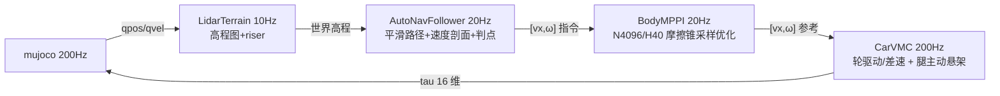
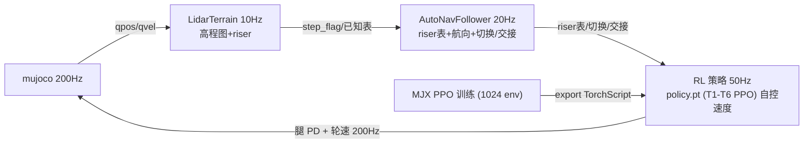

# S10 双数据管线：Autonav-MPPI-CarVMC 与 Autonav-RL（2026-08-16）

> 本文档定义 S10 轮足机器狗的两套完整数据管线（巡航 / 爬梯），逐层说明
> 方法、输入输出、频率、关键参数，并给出每层级的**论文与公开代码支撑**。
> 口径：导航（Autonav）之后是执行层 **carvmc+mppi（巡航）/ rl stair（爬梯）**。

## 0. 总览

| | 管线一：Autonav-MPPI-CarVMC | 管线二：Autonav-RL |
|---|---|---|
| 用途 | 巡航（平地/缓坡/横脊/弯道，v890 稳定） | 爬梯（wp6→7 六级楼梯 + 交接） |
| 范式 | **模型驱动**：采样轨迹优化 + 解析控制 | **数据驱动**：RL 策略 + 固定 PD/轮速部署 |
| 层级 | 感知 → Autonav → MPPI → CarVMC | 感知 → Autonav → RL 策略 → PD/轮速执行 |
| 频率 | 感知 10Hz / Autonav 20Hz / MPPI 20Hz / CarVMC 200Hz | 感知 10Hz / Autonav 20Hz / 策略 50Hz / 执行 200Hz |
| 主要代码 | auto_nav.py / body_mppi.py / vmc_legs.py | auto_nav.py / rl_stair/（train/ppo/deploy） |
| 当前状态 | wp0→4 ≈13.5s、wp0→6 30.5s 稳定 | box 12/12 直立爬完 6 级；真实 mesh 迁移瓶颈 |

两管线**共享感知层与 Autonav 层**，分歧在执行层：巡航用 MPPI+CarVMC（可解释、连续地形响应），
爬梯用 RL（在台阶这种"姿态-载荷-接触-步态"强耦合问题上有能力上限优势）。

---

## 1. 共享感知层（10Hz）

- **方法**：mujoco-lidar 扇形射线（前下 45°，96×48 加密）→ `LidarTerrain`
  世界栅格累积高程图（60×60 瓦片 res=0.05、增量更新、运动学 fallback、
  riser 检测 step_flag）；楼梯区另以**已知 riser 表**（y/top/dh）提前触发 STAIR。
- **输入**：MuJoCo 射线命中（qpos/qvel）；**输出**：世界系高程图 + riser 标志。
- **支撑**：栅格累积建图（SLAM 式高程图，对照 OctoMap / ETH elevation mapping
  [Fankhauser & Hutter, "A Universal Grid Map Library", ICRA 2016]）；LiDAR 感知
  在轮足机器狗上作为地形输入的公开实践见 go2w_rl_gym 与 LeCAR-Lab 系列。

---

## 2. 管线一：Autonav-MPPI-CarVMC（巡航）

### 2.1 Autonav 层（20Hz）

**方法**：Catmull-Rom 平滑路径（严格过 33 航点，偏差 0.013m、全长 234m、C1 连续）
→ 速度剖面（曲率限速 v=√(a_lat·R)、横脊预扫描限速、高架限速）→ 单调弧长游标 +
切线投影（抑制过弯切角误差）→ 航点严格判点（S10_WP_ADVANCE_DIST=1.0）。
输出 [vx, ω] 指令。

**论文支撑**：

| 环节 | 论文 |
|---|---|
| 路径平滑（Catmull-Rom） | E. Catmull, R. Rom, "A Class of Local Interpolating Splines", 1974；应用例：TD-RRT* + Catmull-Rom 平滑（IEEE 2022） |
| 前视跟踪（goal-point） | R. C. Coulter, "Implementation of the Pure Pursuit Path Tracking Algorithm", CMU-RI-TR-92-01, 1992 |
| 局部避障/速度空间（DWA 思想） | D. Fox, W. Burgard, S. Thrun, "The Dynamic Window Approach to Collision Avoidance", IEEE RAM 4(1), 1997 |
| 时间弹性带（TEB，ROS 局部规划） | C. Rösmann et al., "Trajectory modification considering dynamic constraints…", 2012/2017 |
| 曲率限速 v=√(a·R) | 赛车/运动规划常识，见 Williams 2016（MPPI）中弯道速度建模 |

**公开代码**：ROS 2 `teb_local_planner`（rst-tu-dortmund/teb_local_planner）、Nav2、
Autoware 局部规划器。本仓库：`src/S10_sdk_deploy/s10_mpc/auto_nav.py`。

### 2.2 MPPI 层（20Hz，身体层轨迹优化）

**方法**：采样式路径积分最优控制（Model Predictive Path Integral）。状态模型
s=[x,y,yaw,vx,vy,ω]，控制 [vx,ω] 2 维；N=4096 条轨迹、H=40、dt=0.05（2.0s 视界）；
**摩擦锥硬约束** |vx·ω| ≤ μ·g（采样后 clamp ω，速度越高转向上限越小）；代价 =
到目标距离 + 速度偏差 + 航向偏差 + 控制平滑，softmax 加权平均更新；
DBaS 自适应 σ（代价高放大采样噪声，低收敛）。纯 numpy、CPU、20Hz。

**论文支撑**：

- G. Williams et al., "Aggressive Driving with Model Predictive Path Integral Control", ICRA 2016 —— MPPI 原论文（采样轨迹 + 路径积分更新）。
- G. Williams et al., "Model Predictive Path Integral Control: From Theory to Parallel Computation", JGCD 2017 —— 理论分析 + GPU 并行。
- H. Xue et al., "Full-Order Sampling-Based MPC for Torque-Level Locomotion Control via Diffusion-Style Annealing"（DIAL-MPC, LeCAR-Lab）—— 采样 MPC 在腿足机器人扭矩级控制的应用；本仓库早期主线即基于它，`dial-mpc/` 已内置。
- 采样 MPC/DBaS 自适应：经典 MPPI 的 σ 自适应变体（Derivative-based adaptive sampling）。

**公开代码**：LeCAR-Lab/dial-mpc（本仓库内置 `dial-mpc/`）、gnestlinger/MPPI（教学实现）。
本仓库：`src/S10_sdk_deploy/s10_mpc/body_mppi.py`。

### 2.3 CarVMC 层（200Hz，执行）

**方法**：车化虚拟模型控制（Virtual Model Control）。**轮** = 驱动/差速转向
（yaw 比例+阻尼、动态抓地钳制按载荷 μN·r）；**腿** = 主动悬架
（mg/4 静态分配 + roll/pitch 载荷转移 + 地形阻抗、半蹲降质心、微 roll 内倾压弯、
横脊单步跨越/抬轮前馈）。无离散门控、连续地形响应。

**论文支撑**：

| 环节 | 论文 |
|---|---|
| 虚拟模型控制 VMC | J. Pratt, P. Dilworth, G. Pratt, "Virtual Model Control of a Bipedal Walking Robot", ICRA 1997；扩展：Pratt et al., IJRR 2001 |
| 任务空间/载荷分配（WBC 思想） | L. Sentis, O. Khatib, "Synthesis of Whole-Body Behaviors through Hierarchical Control of Behavioral Primitives", IJRR 2005 |
| 轮足差速/高速转向 | SKATER（wheeled-bipedal，高速转向 + WBC + 离心力补偿），IEEE RA-L 2024；轮足四足全向控制见 go2w_rl_gym |
| 轮足机器狗开源汇总 | XinLang2019/awesome-wheeled-legged（轮足四足公开代码/文献清单） |

**公开代码**：Unitree Go2W（ShengqianChen/go2w_rl_gym，训练+部署全链路）；
awesome-wheeled-legged 汇总。本仓库：`vmc_legs.py`（CarVMC/LidarTerrain）、
`cruise_vmc_noros.py`。

### 2.4 数据流（管线一）

---

## 3. 管线二：Autonav-RL（爬梯）

### 3.1 Autonav 层（20Hz，含 CRUISE⇄STAIR 切换）

同管线一（Catmull-Rom + 速度剖面 + 判点），并向 RL 策略提供导航输入：
- **已知 riser 表**（fol.STAIR_RISERS/TOPS → `set_risers` → RL 观测 terrain ctx
  obs[50:54]：前/后轴到下一级 riser 距离 + 高度差）；
- **CRUISE→STAIR**：高程图 riser 检测（`_elev_stair_ridge_ahead` 沿航向扫描
  step_flag 0.5~4m → decel_request 限速 1.2）或**已知 riser 表提前触发**
  （S10_STAIR_ENTER_DIST=5 → y≈34.5）；
- **STAIR→CRUISE**：`_elev_region_passed`（前方 0~3m 无 step_flag）优先，
  固定坐标（y>40.5）仅无高程图时兜底；
- **轨道航向**（TARGET_HEADING=1.5708 → heading 观测 obs[48:50]，爬梯段固定航向）。

> **说明（2026-08-16 代码核实）**：RL 观测（55 维）**不含 ref path 几何点**——
> 观测 = 角速度/重力/cmd[vx,yaw]/关节误差/关节速度/last action/heading/terrain
> ctx/rough。爬梯段为直线任务（yaw 固定），策略自控速度：rlstair_ctrl 的
> `compute_tau(..., cmd, ...)` 显式忽略 nav 的 vx（代码注释 "stair section does
> NOT track the nav ref_v"）。ref path（path_pts）仅供管线一巡航使用。

交接：cruise 带速/角度接近 → carvmc+PD 腿覆盖抬身（kp60/kd4，leg_err→0.122，
轮不停车）→ RL 接管 → 爬完（S10_PRETRANS_EXIT_Y0=40.5）平滑降回巡航半蹲。

### 3.2 RL 策略层（训练，MJX 并行 PPO）

**方法**：PPO 非对称 actor-critic（actor 只用本体感知观测，critic 用特权信息），
MJX（GPU 并行 1024 env）大规模并行训练；课程 T0→T6（T0 平地 → T1a-d 单阶
5~12.5cm → T2a-e 4 级阶梯 → T3 比赛 6 级 0.061+0.125×5 → T6 交接 + 初始姿态 DR）；
域随机化（PD/扭矩/质量/摩擦/观测噪声、入梯角度 yaw±0.7、T6 yaw±0.3+squat+leg_jit）；
动作 = 关节 PD 位置目标 + 轮速目标（16 维），观测 53 维。

**论文支撑**：

| 环节 | 论文 |
|---|---|
| PPO 算法 | J. Schulman et al., "Proximal Policy Optimization Algorithms", arXiv 1707.06347, 2017 |
| 大规模并行 RL（legged_gym） | N. Rudin et al., "Learning to Walk in Minutes Using Massively Parallel Deep RL", CoRL 2022（开源 legged_gym） |
| **盲爬楼梯（轮足，直接对标）** | S. Chamorro et al., "Reinforcement Learning for Blind Stair Climbing with Legged and Wheeled-Legged Robots", ICRA 2024（非对称 actor-critic、位置制任务、关节位置+轮速动作） |
| 非对称 actor-critic | L. Pinto et al., "Asymmetric Actor Critic for Deep RL", arXiv 1710.06542, 2017 |
| 域随机化（sim2real） | J. Tobin et al., "Domain Randomization for Transferring Deep NN from Simulation to the Real World", IROS 2017 |
| 轮足四足 RL 训练/部署 | go2w_rl_gym（Unitree Go2W 完整仿真+训练+真机部署） |

**公开代码**：leggedrobotics/legged_gym（ETH）、ShengqianChen/go2w_rl_gym、
leggedrobotics/rsl_rl。本仓库：`rl_stair/`（train.py / ppo.py / s10_env.py /
terrain.py / configs/rl_stair_config.py）。

### 3.3 部署层（rlstair_ctrl + sim2sim）

**方法**：策略导出 TorchScript（`export.py`）→ 部署控制器 `rlstair_ctrl.py`：
`obs_np(53)`（与 MJX 训练观测一致，diff 3.7e-9）→ `policy.pt`（torch.jit.load）→
腿 PD（KP 50 / KD 1 / clip 48Nm）+ 轮速（kp 2 / vel 24 / clip 13.5Nm）；
riser 表外部注入；`S10_RL_POLICY` 支持 A/B 策略切换。
sim2sim 验证：`sim2sim_exact.py`（精确比赛几何 box harness，验收口径 = 爬完 6 级
+ 后腿登顶 +1m，base_y=41.271）、`sim2sim.py`（官方 S10_track.xml 真实赛道）。

**论文支撑**：legacy legged_gym/go2w_rl_gym 的部署模式（观测编码 → 策略前向 →
PD/轮速执行 → sim2sim harness）；Chamorro 2024（轮足爬梯策略部署）。
**公开代码**：go2w_rl_gym（完整部署链路）、rl_sar（可选参考）。
本仓库：`rl_stair/deploy/`（rlstair_ctrl.py、obs_np.py、elev_tile.py）、
`rl_stair/export.py`、`rl_stair/sim2sim.py`、`sim2sim_exact.py`、
`cruise_vmc_noros.py`（S10_VMC_MODE=rlstair + S10_RL_ELEV=1）。

### 3.4 数据流（管线二）

---

## 4. 两管线对比

| 维度 | Autonav-MPPI-CarVMC（巡航） | Autonav-RL（爬梯） |
|---|---|---|
| 控制范式 | 采样优化 + 解析 VMC（模型驱动） | 端到端 RL 策略（数据驱动） |
| 地形假设 | 连续地形、曲率/横脊/坡度可建模 | 离散台阶、强接触/姿态耦合 |
| 可解释性 | 高（每层代价/约束显式） | 低（策略黑盒，靠 DR/课程约束） |
| 计算 | MPPI 4096 轨迹 @20Hz（CPU） | 策略前向 @50Hz（轻量） |
| 训练成本 | 无训练（参数整定） | MJX 训练数小时~天 |
| 当前瓶颈 | wp4→5 发卡+横脊 yaw 稳定 | sim2sim：MJX box→真实 mesh 轮驱 2.7× + 接触差异（趴地爬行） |
| 论文/代码支撑 | Williams 2016/2017、Pratt 1997、go2w_rl_gym | Chamorro 2024、Rudin 2022、legged_gym、go2w_rl_gym |

---

## 5. 文献与公开代码索引

### 论文
1. Catmull & Rom (1974), *A Class of Local Interpolating Splines*.
2. Coulter (1992), *Implementation of the Pure Pursuit Path Tracking Algorithm*, CMU-RI-TR-92-01.
3. Fox, Burgard & Thrun (1997), *The Dynamic Window Approach to Collision Avoidance*, IEEE RAM 4(1).
4. Rösmann et al., *Timed-Elastic-Band trajectory optimization*, ICRA/ITSC 2012–2017.
5. Williams, Drews, Goldfain, Rehg & Theodorou (2016), *Aggressive Driving with MPPI*, ICRA.
6. Williams et al. (2017), *MPPI: From Theory to Parallel Computation*, JGCD.
7. Xue et al. (LeCAR-Lab), *Full-Order Sampling-Based MPC for Torque-Level Locomotion Control via Diffusion-Style Annealing*（DIAL-MPC）.
8. Pratt, Dilworth & Pratt (1997), *Virtual Model Control of a Bipedal Walking Robot*, ICRA; Pratt et al. (2001), IJRR.
9. Sentis & Khatib (2005), *Synthesis of Whole-Body Behaviors through Hierarchical Control*, IJRR.
10. SKATER (2024), *Design and Control of SKATER: A Wheeled-Bipedal Robot with High-Speed Turning*, IEEE RA-L.
11. Schulman et al. (2017), *Proximal Policy Optimization Algorithms*, arXiv:1707.06347.
12. Rudin, Hoeller, Reist & Hutter (2022), *Learning to Walk in Minutes Using Massively Parallel Deep RL*, CoRL.
13. Chamorro, Klemm, De La Iglesia Valls, Pal & Siegwart (2024), *RL for Blind Stair Climbing with Legged and Wheeled-Legged Robots*, ICRA.
14. Pinto et al. (2017), *Asymmetric Actor Critic for Deep RL*, arXiv:1710.06542.
15. Tobin et al. (2017), *Domain Randomization for Transferring Deep NN from Simulation to the Real World*, IROS.

### 公开代码
- LeCAR-Lab/dial-mpc —— DIAL-MPC 采样 MPC（本仓库 `dial-mpc/` 内置）
- leggedrobotics/legged_gym —— 大规模并行腿足 RL（ETH）
- ShengqianChen/go2w_rl_gym —— Unitree Go2W RL 训练 + 真机部署
- XinLang2019/awesome-wheeled-legged —— 轮足四足代码/文献汇总
- rst-tu-dortmund/teb_local_planner —— TEB 局部规划（ROS）

## 6. 本仓库代码索引

| 层级 | 文件 |
|---|---|
| 感知 | `src/S10_sdk_deploy/s10_mpc/lidar_terrain_v2.py`、`vmc_legs.py`（LidarTerrain） |
| Autonav | `src/S10_sdk_deploy/s10_mpc/auto_nav.py`（AutoNavFollower，20Hz） |
| MPPI | `src/S10_sdk_deploy/s10_mpc/body_mppi.py`（BodyMPPI，N4096/H40） |
| CarVMC | `src/S10_sdk_deploy/s10_mpc/vmc_legs.py`（CarVMC，200Hz）、`cruise_vmc_noros.py` |
| RL 训练 | `rl_stair/`（train.py / ppo.py / s10_env.py / terrain.py / configs） |
| RL 部署 | `rl_stair/deploy/`（rlstair_ctrl.py / obs_np.py / elev_tile.py）、`export.py`、`sim2sim.py`、`sim2sim_exact.py` |
| 集成入口 | `src/S10_sdk_deploy/scripts/cruise_vmc_noros.py`（S10_VMC_MODE=rlstair / cruise） |