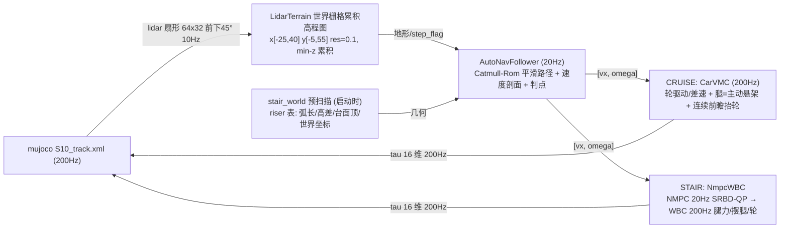

# S10 巡逻赛 · 总方案主文档（MASTER）

> **维护中** · 创建 2026-08-13 · 基线 HEAD `6cb4b05`（+ M1 多 knot NMPC）
> 本文件是全仓库唯一"总方案"入口：赛题 / 双技能方案 / 数据管线 / 实际控制频率 /
> 参数表 / 进度 / 卡点 / 待办 / 维护日志。**每次实验后在此追加维护日志并更新参数表。**

---

## 0. 维护约定（如何维护本文件）

1. **事实唯一来源**：执行层参数以 `src/S10_sdk_deploy/s10_mpc/*.py` 代码默认值为准；
   实际运行参数以 `tmp/run_*.sh` 为准；本文档只做归纳，不覆盖代码。
2. **每次会话收尾**：在 §10 维护日志追加一行（日期 / HEAD / 做了什么 / 结果），
   并同步更新 §7 参数表、§8 进度、§9 待办；然后 `git add doc && git commit && git push`。
3. **相关文档**：`doc/0808.md`（逐版本实验长记录）、`doc/stair_*` 系列（台阶专项）、
   `doc/carvmc_方案与数据管线_20260810.md`（巡航专项）、`README.md`（快速开始）。

---

## 1. 赛题与申报模式

- 仿真环境（官方）：`S10_track.xml` + `track_overlay.xml` 33 航点（`000_start`~`032_end`），
  base 进入 wp0 的 0.2m 水平半径开始计时，逐点推进，到终点停止计时并打印耗时。
- 计分：总成绩 = 完成时间 ÷ 模式系数（越低越好），30 个定位点须全部完成。
  模式系数（官方 PDF）：**遥控 ÷1.0 / 自主跟随 ÷1.3 / 自主导航 ÷1.4**。
- **申报模式：自主跟随（÷1.3）**——航点跟随 + 感知地形限速/爬坡 + roll 安全，不强制全局 A*。

## 2. 总体方案（双技能 + 三层架构）

```
CRUISE（CarVMC 车化巡航） ⇄ STAIR（NmpcWBC 爬梯）
   唯一离散门控：前轴距首级 riser < S10_STAIR_EXEC_D 切 STAIR；几何完成 AND 导航推进切回
```

三层架构：**感知层(10Hz) → 规划层(20Hz) → 执行层(200Hz)**，无 MPPI 轨迹优化（v850 冻结）。

铁律（用户指令）：
- **唯一允许的离散门控 = CRUISE/STAIR 技能切换**；地形/抬轮/限速全部用连续几何量或连续安全包线。
- **禁止 z 先验**：AutoNavFollower 纯 xy 路径规划，不读任何高程/台面信息（v829）；楼梯感知由 lidar 高程图 + stair_world 预扫描给出。
- 力矩合规：腿 ≤48Nm、轮 ≤13.5Nm。

## 3. 数据管线



关键点：
- **感知**：mujoco-lidar 扇形射线（`lidar_site` base 上方 0.15m，前下 45°，64×32，垂直 +10°~-55°，cutoff 20m，10Hz）→ LidarTerrain 世界坐标栅格（SLAM 式跨帧累积 min-z，geomgroup 只留 group0 地形，未覆盖格返回 0）。
- **stair_world 预扫描**：启动时沿平滑路径射线扫描，生成 riser 表（每级弧长/高差/台面顶高，世界坐标），供台阶几何相位与显式轮心 z 参考使用（不依赖 s_cur 弧长投影，防漂移）。
- **导航**：Catmull-Rom 平滑路径（切线因子 0.7）+ 曲率/横脊/高架限速速度剖面 + 单调弧长游标/切线投影 + 航点严格判点（`S10_WP_ADVANCE_DIST`），20Hz 输出 [vx, ω]。
- **CRUISE 执行**：CarVMC（200Hz）——轮=驱动+差速转向（yaw 比例+阻尼、动态抓地钳制按载荷），腿=主动悬架（mg/4+roll/pitch 分配+地形阻抗，半蹲降质心、微 roll 内倾压弯），横脊单步跨越/抬轮前馈；无门控、连续地形响应。
- **STAIR 执行**：NmpcWBC——NMPC（20Hz）SRBD 接触力 QP（m·a=ΣF+mg、I·α=Σr×F），WBC（200Hz）支撑腿 Jᵀ·F_des 力分配 + 摆腿纯位置 PD + 轮速 PID/差速。

## 4. 实际控制频率表

| 环节 | 频率 | 周期 | 说明 |
|---|---|---|---|
| 仿真/主控制环 | **200Hz** | 5ms | `DT=0.005`，所有执行层逐主步重算 |
| 导航 AutoNavFollower | **20Hz** | 50ms | `S10_NAV_HZ=20`（代码默认 2 为保守值，运行脚本均设 20） |
| NMPC（STAIR 内） | **20Hz** | 50ms | `S10_NMPC_HZ=20`；H=4（M1 改 `S10_NMPC_HORIZON=8` 多 knot） |
| WBC（STAIR 内） | **200Hz** | 5ms | 每主步；osqp 固定结构 <2ms |
| CarVMC（CRUISE 内） | **200Hz** | 5ms | 每主步 |
| LiDAR 高程图 | **10Hz** | 100ms | `S10_LIDAR_FREQ=10`，部署同款 |
| BodyMPPI（已冻结，不用） | ~10–20Hz | — | N=2048/H=40 实测 ~12ms；v850 后 `S10_VMC_USE_NAV=1` 直通 |
| 仿真实时比 | ≈0.53x | — | 瓶颈 MuJoCo Python 步进（~9.4ms/步），非控制器；真机控制环按 200Hz |

## 5. CRUISE 模式细节方案（CarVMC，稳定主线）

### 5.1 感知（LidarTerrain）
| 参数 | 值 | 说明 |
|---|---|---|
| 栅格 | x[-25,40] y[-5,55] res=0.10 | 覆盖全程 |
| 射线 | th_n=64, phi_n=32 | 近场地面→远场高台 |
| 累积 | 世界坐标增量，min-z | SLAM 式；局部清空会丢数据（起步卡死根因 v223） |
| 盲区 | 未覆盖格返回 0 | 真机近场盲区同款；横脊阴影由连续前瞻抬轮兜底 |

### 5.2 导航（AutoNavFollower 20Hz）
- 路径：Catmull-Rom 严格过 33 航点（偏差 0.013m），切线因子 `S10_GLOBAL_TANGENT_K=0.7`（弯道半径 1.36→2.1m+）。
- 速度剖面：曲率限速 `v=√(3.5·R)`、转向能力 `v≤2.0·R`、急弯/横脊/台阶/高架限速（`S10_RIDGE_VX`、`S10_AUTO_STEP_VX`、`S10_AUTO_ELEV_K`），运行时减速前瞻 `S10_AUTO_VLIM_LOOKAHEAD`。
- 目标选择：接近航点（d_wp<0.8）瞄航点；过点后瞄路径前视点（v267）；cte 纠偏仅当 |cte|<0.5 且不与 err 冲突（v272 离线恢复丢弃 cte）。
- 判点：`S10_WP_ADVANCE_DIST=1.0`（位置式），过点后强制 s_cur 前进（v253）。

### 5.3 执行（CarVMC 200Hz）
- **轮**：差速参考 `v_ref = vx ± ω_ref·track_half`（ω_ref 用即时指令，v252）；`t_yaw = -yk·(ω_cmd−ω) + kd·ω_hf` + 可选摩擦前馈；yaw 超速保护（|ω|>a_lat_max/v 反向差速硬刹，v251）；力矩限速 `S10_CAR_YAW_SLEW`；差速滑移余量 `S10_VMC_YAW_TMAX`（受控滑移转向）。
- **腿（主动悬架）**：垂直力 `F = mg/4 + roll分配 + pitch分配 + kp_h·(terr+r−wheel_z)`；半蹲（knee 1.90 降质心 ~6cm）；微 roll 压弯 `roll_tar = −0.06·ω·|vx|`。
- **连续前瞻抬轮（无门控）**：按"轴前 0.35m 地形高 − 轴下地形高"连续抬放，比例 clamp 0.15m；带通 0.02~0.5m（0.12m 脊→满抬、高架伪尖峰→0）；抬轮前瞻独立于 terr 前瞻（v266）。
- **轮矩钳制**：`τ_w = μ_w·F_load·r + YAW_TMAX·f(ω_cmd)`，μ_w=0.9。

### 5.4 CRUISE 当前参数集（run_v850test.sh，v890 基线）
| 参数 | 值 | 参数 | 值 |
|---|---|---|---|
| S10_AUTO_VMAX | 6.0 | S10_AUTO_ELEV_K | 0.2 |
| S10_AUTO_LOOKAHEAD | 3.5 | S10_AUTO_CTE_MAX | 1.5 |
| S10_AUTO_CTE_ERR_GATE | 1.0 | S10_AUTO_ARRIVE_ERR | 0.5 |
| S10_AUTO_VYAW_MAX | 2.0 | S10_AUTO_YAW_GAIN | 2.5 |
| S10_YAW_DAMP | 1.0 | S10_RIDGE_VX | 2.5 |
| S10_RIDGE_MIN_VX | 3.0 | S10_AUTO_STEP_VX | 2.5 |
| S10_VMC_MODE | car | S10_VMC_TERRAIN | lidar |
| S10_VMC_TERRAIN_LOOKAHEAD | 0.15 | S10_VMC_TERRAIN_ERR_GATE | 1.2 |
| S10_VMC_TERRAIN_LP | 0.2 | S10_VMC_OM_CAP | 2.0 |
| S10_VMC_OM_ABS_MAX | 1.5 | S10_VMC_YAW_TMAX | 4 |
| S10_CAR_KD_YAW | 4.0 | S10_CAR_YAW_VX_GATE | 1.5 |
| S10_CAR_YAW_FF | 1.0 | S10_CAR_YAW_K_SM | 20 |
| S10_VMC_WHEEL_K | 4.0 | S10_VMC_VX_TAU | 0.25 |
| S10_VMC_YAW_K_WHEEL | 60 | S10_CTE_LP | 0.3 |
| S10_VMC_STAIR_GAIT | 1 | S10_NAV_HZ | 20 |

## 6. STAIR 模式细节方案（NmpcWBC，当前攻关）

> 目标：真原图 wp6→7 连续越过全部 6 级台阶（riser 高 **0.061 + 0.125×5**，R=0.081，阶距 0.4m）。
> 现状：最优基线 m23 稳定越过 riser1–3（y=39.4），卡在爬顶折叠停滞墙。

### 6.1 技能切换（唯一离散门控）
- 入口：前轴距首级 riser < `S10_STAIR_EXEC_D`（1.0–1.5m）→ STAIR；接近段 yaw 未对准时保持 CRUISE 对准（`S10_STAIR_YAW_GATE`）。
- 出口：几何完成（后轴过末级 riser 且轮高≥台面顶+R−0.02，持续 0.05s）AND 导航推进（next_idx 推进或 s_cur 超末级+1.0m）→ CRUISE。
- vx 连续：入口/出口窗插值，不归零（`S10_STAIR_VX_RAMP`、`S10_STAIR_WIN_VX`）。

### 6.2 NMPC（20Hz，SRBD 接触力 QP）
- 变量 [F(12), a(3)]（单点版）；等式 m·a=ΣF+mg、角动量 I·α=Σr×F；摩擦锥 μ=`S10_NMPC_MU`=0.8、Fz≤180N。
- 接触模式进 NMPC（#1）：前轴 SWING 从 SRBD/力矩删列（F=0）；后轴 SWING 贴面滚爬保留 `S10_NMPC_REAR_SWING_FZ_MIN`=46N；SWING 期支撑腿 `S10_NMPC_STANCE_FZ_MIN`=95N。
- 抗发射：vz>0.5 时 a_des z 允许下探 -10（m23 关键）。
- **M1（2026-08-13 提交）**：改为多 knot 轨迹 QP——每 knot [F(12),a(3),p(3),v(3)]，`S10_NMPC_HORIZON`=8，硬等式 v/p 状态传播，代价含 z/xy 跟踪、角动量、力平滑；意图在 0.4s 预测窗内规划并平滑力（防发射尖峰）。

### 6.3 WBC（200Hz）
- 支撑腿：`τ = Jᵀ·(Rᵀ·F_des)` + 姿态正则 + 地形阻抗；摆腿：纯位置 PD（`S10_NMPC_KP_SW`=120、`KP_SW_R`=40、`KD_SW`=6，v1141 文献共识去 Jᵀ 力）；轮：速度 PID + 差速 yaw。
- 折叠钳制：轮目标 ≤ hip−0.02（v1145）；SWING 期 yaw 冻结解除；roll 阻尼 −8·roll−6·rate；力矩限幅 腿48/轮13.5。

### 6.4 STAIR 当前参数集（m23 = run_3knob_m16.sh）
| 参数 | 值 | 参数 | 值 |
|---|---|---|---|
| S10_VMC_MODE | nmpcwbc | S10_STAIR_POSMODE | 1 |
| S10_STAIR_ENTER_DIST | 2.0 | S10_STAIR_EXEC_D | 1.0 |
| S10_STAIR_VX_RAMP | 10.0 | S10_STAIR_WIN_VX | 2.0 |
| S10_STAIR_CREST_VX | 1.2 | S10_STAIR_MPPI_OFF_D | 0.5 |
| S10_AUTO_LOOKAHEAD_STAIR | 3.5 | S10_AUTO_CTE_GAIN_STAIR | 1.0 |
| S10_AUTO_YAW_GAIN_STAIR | 0.8 | S10_YAW_DAMP | 2.0 |
| S10_STAIR_YAW_GATE | 1.0 | S10_VMC_TERRAIN_KIN | 1 |
| S10_NMPC_HZ | 20 | S10_NMPC_SWING_D | 0.35 |
| S10_NMPC_MU | 0.8 | S10_NMPC_FRONT_SWING_FZ_MIN | 0.0 |
| S10_NMPC_WF | 1e-3 | S10_NMPC_WM | 0.3 |
| S10_NMPC_WA | 1.0 | S10_NMPC_KP_PITCH | 80.0 |
| S10_NMPC_KD_PITCH | 15.0 | S10_NMPC_Z_OFF | 0.25 |
| S10_NMPC_KP_VX | 10.0 | S10_NMPC_KP_YAW | 6.0 |
| S10_NMPC_YAW_ERR_K | 1.5 | S10_NMPC_WHEEL_K | 12.0 |
| S10_NMPC_YAW_DIFF | 1.0 | S10_STAIR_HDG_K | 1.0 |
| S10_STAIR_HDG_D | 3.0 | S10_STAIR_HDG_OM | 0.5 |
| S10_STAIR_OM_SCALE | 1.0 | S10_FP_STAND_DROP | 0.22 |
| S10_WHEEL_PRESS | 0.05 | S10_CAR_YAW_SLEW | 12 |

NMPC 代码默认（未覆盖时）：KP_Z=200 / KD_Z=30 / KP_YAW=2 / KD_YAW=2 / WM=0.1 / WFR=0.02 / WS=0.02 / WP=0.05 / WV=0.10 / FZ_MAX=180 / REACH=-0.34 / SWING_D=0.35 / H=4 / HORIZON=8(M1)。

### 6.5 卡点与结论（29 变体证据，HEAD 7961731）
- **最优 m23**：y=39.4（越过 riser3，3/6 级），body 稳定 0.84–0.96，t≈12 折叠停滞坠落；29 个变体（m24–m51）全部更差。
- **机制链**：爬顶动量过冲（2.0m/s 撞 0.125m 面，v²/2g≈0.2m 弹起）→ 折叠（轮甩到髋上方，J22≈0 奇异）→ 模型-执行断层（折叠轮被标记 stance、后轮被标记 swing）→ 后轴预抬失牵引 → 停滞-坠落。
- **决定性几何根因**：`J21 = -px`——站立位形轮在髋正下方（px=0）时 hip 力矩对垂直力贡献严格为 0，body 高度只由"轮高+腿长静态几何"决定；z 跟踪应移除或改用途，爬升靠轮滚（接触+动量冲棱），摆腿只做引导。
- **剩余选项**：① 完整 OCS2 式轨迹优化（离散接触 mode 序列 + Pfaffian 轮约束 + 全身轨迹规划，多日工作量，需确认投入）；② 换执行策略（爬顶期前后轮"低抬快滚"）；③ 接受 3/6 级为当前架构上限，转其他赛道能力优化。

## 7. 硬件 / 模型参数

| 参数 | 值 | 说明 |
|---|---|---|
| 质量 m | 19.0 kg | NmpcWbc 默认 |
| 腿长 L1=L2 | 0.18 m | FK 一致 |
| 轮半径 R | 0.081 m | FK 一致（vmc_legs） |
| 轴距 wheelbase | 0.456 m | > 阶距 0.4m → 前后轴永不同时 SWING |
| 半轮距 track_half | 0.24 m | 差速参考用 |
| 腿力矩限幅 | ≤48 Nm | 合规 |
| 轮力矩限幅 | ≤13.5 Nm | 合规 |
| 台阶几何 | 0.061 + 0.125×5 | wp6→7 连续 6 级，阶距 0.4m |

## 8. 当前进度（2026-08-13）

- **CRUISE（稳定主线）**：wp0→4 ≈13.5s；wp0→5 稳定通过（v890：高架伪影过滤 + 加速度限幅）；wp0→33 分段验证通过 18 点（wp0-6/8/10/12/14-16/18/20/22/26-27，跳过台阶 wp6-7 与横脊/墙区），卡点集中在坡底脊区与 wp17 大弯。最新图 `doc/final_wp0-6_xy_speed.png`。
- **STAIR（当前攻关）**：m23 = 3/6 级（y=39.4），29 变体全差；工作树 M1 多 knot 轨迹 QP 待验证。
- **速度目标**：70s 全程需均速 3.35 m/s（离线扫描 OMAX≥2 + 放开急弯/横脊/近点可达 70.4s，依赖台阶技能）。
- **真机**：未迁移（待 vel_scale 回退 50、IMU 闭环、Orin 实测）。
- **初赛材料**：8.20 技术方案 PDF + Demo + GitHub 链接（待做）。

## 9. 待办（按优先级）

1. STAIR 方向决策：OCS2 轨迹优化 / 执行策略重写 / 接受 3/6 上限（需用户确认）。
2. 验证 M1 多 knot 轨迹 QP（工作树 WIP）是否解决折叠发射。
3. 33 航点全程（打通台阶后逐段回归 wp6→8→…→32）。
4. 真机迁移（vel_scale 50、IMU 闭环、Orin 实测）。
5. 8.20 初赛材料（技术方案 PDF + Demo + GitHub）。

## 10. 维护日志

| 日期 | HEAD | 内容 |
|---|---|---|
| 2026-08-13 | 6cb4b05 | 创建总方案主文档；归纳 CRUISE/STAIR 方案、数据管线、控制频率、参数表；清理 8-11 前旧归档（_archive_20260806/08/10/12、backups、根 dial-mpc、refs）；venv dial_mpc 改指向仓库内置副本；提交 M1 多 knot NMPC WIP |

> 后续每次实验：在此表追加一行，并同步 §7/§8/§9。

## 11. 代码 / 文档索引

| 类别 | 文件 |
|---|---|
| STAIR 执行层 | `src/S10_sdk_deploy/s10_mpc/s10_nmpc_wbc.py`（NMPC+WBC）、`stair_wbc.py`（位置基全身控制）、`stair_wbc_qp.py`（QP 力分配变体） |
| CRUISE 执行层 | `src/S10_sdk_deploy/s10_mpc/vmc_legs.py`（LidarTerrain + CarVMC） |
| 导航 | `src/S10_sdk_deploy/s10_mpc/auto_nav.py`、`stair_auto_nav.py` |
| 主入口 | `src/S10_sdk_deploy/scripts/cruise_vmc_noros.py`（CRUISE）、`stair_vmc_noros.py`（STAIR） |
| 模型 | `src/S10_sdk_deploy/S10_description/s10_mjcf/mjcf/`（S10_track.xml、new_wp30.xml） |
| 运行脚本 | `tmp/run_3knob_m16.sh`（stair m23）、`tmp/run_v850test.sh`（cruise v890）、`tmp/run_stw_smoke.sh`（主测试入口）、`tmp/run_nmpc_real114.sh`（进梯对齐最优） |
| 文档 | `doc/0808.md`（工程总文档）、`doc/stair_nmpcwbc_攻坚最终总结_20260813.md`、`doc/stair_方案与数据管线_当前版_20260812.md`、`doc/carvmc_方案与数据管线_20260810.md`、`doc/s10_mpc_deploy.yaml`（dial-mpc 部署配置） |
| 官方材料 | `doc/比赛规则_赛道四_具身未来.md`、`doc/赛道四_具身未来.pdf`、`doc/hardware spec.pdf`、`doc/Airy*` |
