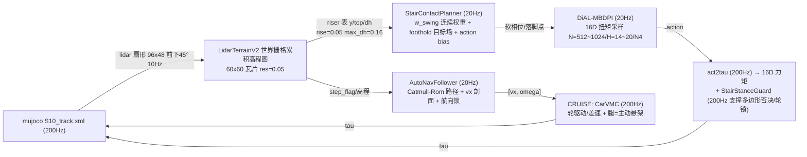

# S10 巡逻赛 · 总方案主文档（MASTER）

> **维护中** · 创建 2026-08-13 · 更新 2026-08-14 · 基线 HEAD `7386c5b`（lidar res 0.05 + 96×48 射线；wp0-6 复测 13.5s 一致性确认；riser 跳变点/台面顶修复）
> 本文件是全仓库唯一"总方案"入口：赛题 / 双技能方案 / 数据管线 / 实际控制频率 /
> 参数表 / 进度 / 卡点 / 待办 / 维护日志。**每次实验后在此追加维护日志并更新参数表。**

---

## 0. 维护约定（如何维护本文件）

1. **事实唯一来源**：执行层参数以 `src/S10_sdk_deploy/s10_mpc/*.py` 代码默认值为准；
   实际运行参数以 `tmp/run_*.sh` 为准；本文档只做归纳，不覆盖代码。
2. **每次会话收尾**：在 §10 维护日志追加一行（日期 / HEAD / 做了什么 / 结果），
   并同步更新 §7 参数表、§8 进度、§9 待办；然后 `git add doc && git commit && git push`。
3. **相关文档**：`doc/0808.md`（逐版本实验长记录）、`doc/S10_轮足爬梯_全方案总文档_20260813.md`（NmpcWBC 阶段总档）、
   `doc/stair_dial_hierarchical_plan_20260814.md`（DiAL 分层爬梯·当前实现）、`doc/stair_dial_layered_plan_20260814.md`（v2 方案）、`doc/carvmc_方案与数据管线_20260810.md`（巡航专项）、`README.md`。

---

## 1. 赛题与申报模式

- 仿真环境（官方）：`S10_track.xml` + `track_overlay.xml` 33 航点（`000_start`~`032_end`），
  base 进入 wp0 的 0.2m 水平半径开始计时，逐点推进，到终点停止计时并打印耗时。
- 计分：总成绩 = 完成时间 ÷ 模式系数（越低越好），30 个定位点须全部完成。
  模式系数（官方 PDF）：**遥控 ÷1.0 / 自主跟随 ÷1.3 / 自主导航 ÷1.4**。
- **申报模式：自主跟随（÷1.3）**——航点跟随 + 感知地形限速/爬坡 + roll 安全，不强制全局 A*。

## 2. 总体方案（双技能 + 三层架构）

```
CRUISE（CarVMC 车化巡航） ⇄ STAIR（DiAL 分层：StairContactPlanner + DiAL-MBDPI + act2tau + StairStanceGuard）
   唯一离散门控：lidar riser 感知确认（stair_confirmed）切 STAIR；几何完成 AND 导航推进切回
```

三层架构：**感知层(10Hz) → 规划层(20Hz) → 执行层(200Hz)**；STAIR 内 DiAL 规划 20Hz、力矩 200Hz。

**方案演进（已归档为历史）**：
1. **StairWBC（08-11，位置基全身控制）**：三层 + 布尔相位 + BodyIK 位置 PD + 轮开环限幅。
   结论：非奇异区正确，但 0.125m 阶"同踏面"位形腿近水平，Jᵀ 垂直权威消失——折叠不可回收。
2. **NmpcWBC M1 系列（08-12~13，155 实验/23 提交）**：多 knot SRBD 力优化(20Hz) + WBC(200Hz) +
   角状态 MPC、轮 Pfaffian、几何阻抗、对角步态、力基摆动等 11 个墙逐一闭环。
   结论：几何盲区（轴距 0.456m ≥ 踏面 0.399~0.448m → 25° 俯仰同踏面位形），增量调参彻底闭环。
3. **DiAL 分层（08-14，当前）**：上层连续相位/落脚点规划 + 下层 DiAL(MBDPI) 扭矩采样，见 §6。

铁律（用户指令）：
- **唯一允许的离散门控 = CRUISE/STAIR 技能切换**；地形/抬轮/限速全部用连续几何量或连续安全包线。
- **禁止 z 先验**：AutoNavFollower 纯 xy 路径规划；楼梯几何只来自 lidar 高程图 + riser 检测（决策 2）。
- **比赛原文件零改动、cruise 源文件零改动**（STAIR 用复制出的 `stair_dial_noros.py`）。
- 力矩合规：腿 ≤48Nm、轮 ≤13.5Nm。

## 3. 数据管线



### STAIR DiAL 数据管线（每层输入/输出）

| 层 | 频率 | 输入 | 输出 | 代码 |
|---|---|---|---|---|
| 感知 | 10Hz | lidar 点云/高程 | 高程栅格、riser 特征 | `lidar_terrain_v2.py` |
| 导航 | 20Hz | 位姿、waypoint | `vx`, `vyaw`, `s_cur` | `stair_auto_nav.py` |
| 接触规划 | 20Hz | 高程栅格、riser 表、轮世界坐标 | `w_swing[4]`、`foothold_xy[4]`、`foothold_z[4]` | `stair_contact_planner.py` |
| DiAL | 20Hz | 状态、目标、软相位、地形场 | 16D action | `mpc_controller.py` |
| 力矩 | 200Hz | action、qpos、qvel | 16D torque | `mpc_controller.compute_tau()` + `stair_stance_guard.py` |

## 4. 实际控制频率表

| 环节 | 频率 | 周期 | 说明 |
|---|---|---|---|
| 仿真/主控制环 | **200Hz** | 5ms | `DT=0.005`，所有执行层逐主步重算 |
| 导航 AutoNavFollower | **20Hz** | 50ms | `S10_NAV_HZ=20`（运行脚本均设 20） |
| StairContactPlanner | **20Hz** | 50ms | `stair_dial_noros.py` 内 step%10 调用 |
| 感知 LidarTerrainV2 / riser 检测 | **10Hz** | 100ms | `S10_LIDAR_FREQ=10`；step%20 调用 |
| DiAL-MBDPI 规划（STAIR） | **20Hz（目标；P1-5b 后 N=512 待实测）** | 50ms | `S10_MPC_PLAN_INTERVAL_AUTO=10`；N=512/H=14~20/N4 目标采样+PD（Ndiffuse=1 退火已最小，无法再减）；实测 2048 档 ~12Hz（plan_ms≈82ms）、1024 档 ~17-18Hz（plan_ms≈55ms） |
| act2tau + StairStanceGuard（STAIR） | **200Hz** | 5ms | 每主步；guard 做支撑多边形否决与轮锁 |
| CarVMC（CRUISE） | **200Hz** | 5ms | 每主步 |
| 历史 NmpcWBC（归档） | NMPC 20Hz / WBC 200Hz | — | 已由 DiAL 顶替，代码保留在 `s10_nmpc_wbc.py` |
| 仿真实时比 | ≈0.5x | — | 瓶颈 MuJoCo Python 步进，非控制器；真机按 200Hz |

## 5. CRUISE 模式细节方案（CarVMC，稳定主线）

### 5.1 感知（LidarTerrain）
| 参数 | 值 | 说明 |
|---|---|---|
| 栅格 | x[-25,40] y[-5,55] res=0.05（8-14 由 0.10 加密） | 覆盖全程，楼梯台面可见性↑ |
| 射线 | th_n=96, phi_n=48（8-14 加密） | 近场地面→远场高台 |
| 累积 | 世界坐标增量，min-z | SLAM 式；局部清空会丢数据（起步卡死根因 v223） |
| 盲区 | 未覆盖格返回 0 | 真机近场盲区同款；横脊阴影由连续前瞻抬轮兜底 |

### 5.2 导航（AutoNavFollower 20Hz）
- 路径：Catmull-Rom 严格过 33 航点（偏差 0.013m），切线因子 `S10_GLOBAL_TANGENT_K=0.7`。
- 速度剖面：曲率限速 `v=√(3.5·R)`、转向 `v≤2.0·R`、急弯/横脊/台阶/高架限速，运行时减速前瞻 `S10_AUTO_VLIM_LOOKAHEAD`。
- 目标选择：接近航点瞄航点；过点后瞄路径前视点（v267）；cte 纠偏带门控（v272）。
- 判点：`S10_WP_ADVANCE_DIST=1.0`（位置式），过点后强制 s_cur 前进（v253）。

### 5.3 执行（CarVMC 200Hz）
- **轮**：差速参考 `v_ref = vx ± ω_ref·track_half`（即时指令，v252）；`t_yaw = -yk·(ω_cmd−ω) + kd·ω_hf`；yaw 超速保护（v251）；差速滑移余量 `S10_VMC_YAW_TMAX`。
- **腿（主动悬架）**：`F = mg/4 + roll分配 + pitch分配 + kp_h·(terr+r−wheel_z)`；半蹲（knee 1.90 降质心 ~6cm）；微 roll 压弯。
- **连续前瞻抬轮（无门控）**：轴前 0.35m 地形高差连续抬放，比例 clamp 0.15m；带通 0.02~0.5m。
- **轮矩钳制**：`τ_w = μ_w·F_load·r + YAW_TMAX·f(ω_cmd)`，μ_w=0.9。

### 5.4 CRUISE 当前参数集（run_v850test.sh，v890 基线）
| 参数 | 值 | 参数 | 值 |
|---|---|---|---|
| S10_AUTO_VMAX | 6.0 | S10_AUTO_ELEV_K | 0.2 |
| S10_AUTO_LOOKAHEAD | 3.5 | S10_AUTO_CTE_MAX | 1.5 |
| S10_AUTO_CTE_ERR_GATE | 1.0 | S10_AUTO_ARRIVE_ERR | 0.5 |
| S10_AUTO_VYAW_MAX | 2.0 | S10_AUTO_YAW_GAIN | 2.5 |
| S10_YAW_DAMP | 1.0 | S10_RIDGE_VX | 2.5 |
| S10_RIDGE_MIN_VX | 3.0 | S10_AUTO_STEP_VX | 2.5 |
| S10_VMC_MODE | car | S10_VMC_TERRAIN | lidar |
| S10_VMC_TERRAIN_LOOKAHEAD | 0.15 | S10_VMC_TERRAIN_ERR_GATE | 1.2 |
| S10_VMC_TERRAIN_LP | 0.2 | S10_VMC_OM_CAP | 2.0 |
| S10_VMC_OM_ABS_MAX | 1.5 | S10_VMC_YAW_TMAX | 4 |
| S10_CAR_KD_YAW | 4.0 | S10_CAR_YAW_VX_GATE | 1.5 |
| S10_CAR_YAW_FF | 1.0 | S10_CAR_YAW_K_SM | 20 |
| S10_VMC_WHEEL_K | 4.0 | S10_VMC_VX_TAU | 0.25 |
| S10_VMC_YAW_K_WHEEL | 60 | S10_CTE_LP | 0.3 |
| S10_VMC_STAIR_GAIT | 1 | S10_NAV_HZ | 20 |

## 6. STAIR 模式细节方案（DiAL 分层，当前）

> 目标：真原图 wp6→7 连续越过全部 6 级台阶（riser 高 **0.061 + 0.125×5**，R=0.081，阶距 0.4m）。
> 核心思想：**不把步态/落脚点塞进 DiAL 的暴力采样维度**——上层连续软相位+目标场，下层 DiAL 只搜 16 维扭矩。

### 6.1 架构（v2，20+200Hz）

```
lidar 高程图 (10Hz) → riser/高程特征 (10Hz) → AutoNavFollower (20Hz, vx/yaw/s_cur)
  → StairContactPlanner (20Hz, w_swing + foothold) → DiAL-MBDPI (20Hz, 16D 扭矩采样)
  → act2tau (200Hz) → StairStanceGuard (200Hz, 安全否决) → MuJoCo (200Hz)
```

- DiAL 是底层执行器，**直接顶掉 NMPC+WBC**（不是接在两者之间）。
- 废弃 `s10_dial_mpc.py` 的 DDP/SRBD 骨架（方向已错，已归档 → `src/S10_sdk_deploy/s10_mpc/_archived/s10_dial_mpc_ddp_20260814.py`）。

### 6.2 接触规划（StairContactPlanner，20Hz）
> 当前实现（HEAD 33aa019）：默认 `S10_STAIR_HARD_MODE=1`（hierarchical 硬 mode，轴级 0/1 摆动 + 200Hz guard），
> 即 `doc/stair_dial_hierarchical_plan_20260814.md`；连续软权重版（`S10_GAIT_UTIL=1`）保留为对照开关。
> **P0 修复（2026-08-14）**：hard-mode 摆动信号（`_gait_swing` 非零时）已注入 DiAL cost，不再只进 guard。
- **riser 检测（决策 2，lidar 唯一几何来源）**：LidarTerrainV2 沿导航路径窗口扫描，
  `rise=0.05, max_dh=0.16`，检测到后覆盖 `S10_STAIR_RISERS/TOPS`（follower 硬编码表仅作 fallback）。
- **步态 = 连续 swing 权重**：`w_swing_i = sigmoid((d_i - d_trigger_i)/sigma)`，σ 默认 0.05m；
  前后轴天然错开半阶，**不新增布尔门控**（可复用 `S10_SWING_PROX/S10_SWING_THRESH`）。
- **落脚点 = 连续目标场**：stance 轮 `p_z = terrain(wheel_xy)+R`；swing 轮 `p_z = 下一级台面顶+R`，
  `p_xy = 下一级踏面中心`。DiAL 代价只惩罚"轮实际偏离目标场"。
- **软 action bias**：把几何抬升场作为 MBDPI 采样均值先验（非门控），
  `S10_BIAS_FL_HIPY=0.20 / S10_BIAS_FL_KNEE=-0.50 / S10_BIAS_HL_HIPY=-0.10 / S10_BIAS_HL_KNEE=0.45`，
  `S10_BIAS_LIFT_MIN=0.05`、`S10_BIAS_T_PROFILE=0`、`S10_BIAS_FULL_REF=0`。
- **roll 不平衡前馈**：左右抬升差 → `S10_ROLL_IMB_GAIN=0.8`，clip ±0.15。

### 6.3 DiAL-MBDPI（20Hz，执行核心）
- 动作空间保持 16D：`u = [hipy, thigh, calf]*4 + [wheel]*4`，不新增接触/落脚点变量。
- 代价新增三项（软相位进 rollout）：`J += w_swing·‖wheel_z−foothold_z‖² + (1−w_swing)·‖wheel_z−ground_z‖² + w_foothold·w_swing·‖wheel_xy−foothold_xy‖²`。
- 现有注入入口已具备：`set_gait_swing / set_foothold / set_elevation_map / set_stair_ref / set_stair_action_bias`。
- 核心采样参数（`doc/s10_mpc_deploy.yaml`，desktop_4090）：`Nsample=2048, Hsample=14, Hnode=4,
  Ndiffuse=1, Ndiffuse_init=10, temp_sample=0.05, update_method=mppi, sigma_scale=1.0, dt=0.02`；
  执行 `leg_control=torque, kp=80, kd=2, vel_scale=56, kd_wheel=1.2, wheel_tau_scale=3.0`。
- 地形代价（s10_env）：slope=2.0 / roughness=1.0 / step=5.0（阈值 0.18m）/ ground=120 / leg=1.0 /
  upright=25 / attdamp=0.8 / stumble=0.5。

### 6.4 StairStanceGuard（200Hz，确定性安全层，WIP）
- 在 MBDPI 力矩之后逐主步执行，不做 reward shaping，只**否决/钳制不安全摆动**：
  - 几何接触判定：`wheel_z < terrain_z + R + 0.02`；
  - **支撑多边形否决**：若剩余接触轮（≥3）构成的凸多边形不含投影 CoM（margin 0.06m），则禁止该轮 swing；
  - **轮锁**：swing 轮 τ=0；支撑轮按库仑牵引 `τ ≤ μ·N·R`（N=20N，μ=0.8，上限 13.5Nm）。
- 参数：`contact_min_n=20, support_margin=0.06, wheel_tau_max=13.5, mu=0.8`。

### 6.5 当前 STAIR 参数集（stair_dial_noros.py 默认 + 计划参数）
| 参数 | 值 | 参数 | 值 |
|---|---|---|---|
| S10_MPC_PLAN_INTERVAL_AUTO | 10 (20Hz) | S10_MPC_YAML | doc/s10_mpc_deploy.yaml |
| S10_STAIR_W_FOOTHOLD | 0.0（待调） | S10_GAIT / S10_GAIT_UTIL | 0（软相位开关） |
| S10_ROLL_IMB_GAIN | 0.8 | S10_BIAS_LIFT_MIN | 0.05 |
| S10_BIAS_FL_HIPY / KNEE | 0.20 / -0.50 | S10_BIAS_HL_HIPY / KNEE | -0.10 / 0.45 |
| riser 检测 rise / max_dh | 0.05 / 0.16 | stair_confirmed rise/span | 0.06 / 2.0m |
| tile_half / res | 3.0 / 0.10 | StairStanceGuard N / margin | 20N / 0.06m |
| S10_NAV_HZ | 20 | S10_AUTO_VYAW_MAX | 1.5 |
| S10_AUTO_YAW_GAIN | 3.0 | S10_AUTO_YAW_FF_GAIN | 20.0 |

### 6.6 历史 NmpcWBC 参数（归档参考，run_m1mmm3.sh）
| 参数 | 值 | 说明 |
|---|---|---|
| S10_VMC_MODE | nmpcwbc | 旧 STAIR 执行器（已顶替） |
| S10_NMPC_HZ / WBC | 20Hz / 200Hz | SRBD 力优化 + WBC 力分配 |
| S10_NMPC_WA / WM / WF | 0.2 / 0.3 / 1e-3 | 轨迹 QP 权重 |
| S10_NMPC_KP_PITCH / KD_PITCH | 80 / 15 | 姿态增益 |
| S10_NMPC_Z_OFF | 0.25 | body-z 参考偏移 |
| S10_NMPC_KP_SW | 40 | 摆腿位置 PD |
| S10_NMPC_WWHEEL | 30 | 轮速权重 |
| S10_STAIR_HDG_LAT | 0.0 | 纯切线航向锁 |

### 6.7 卡点与结论
- **NmpcWBC 结构性卡点（155 实验闭环）**：几何盲区——轴距 0.456m ≥ 踏面 0.399~0.448m → "同踏面"位形 →
  25° 俯仰；三个同源墙：前轮左右不对称→roll、后轮折叠→yaw 漂移、后轮够不到摆动窗。增量调参彻底闭环。
- **DiAL 转向动机**：步态/落脚点是离散决策，不该由暴力采样承担；上层连续软相位 + 下层扭矩采样是正确分层。
- **DiAL 风险与回退**：若软相位搜不到抬轮 → 先调 `swing_prox / w_foothold / ground_phase`；
  仍不够 → 升级为"低维上层离散选择器 + 固定 mode DiAL"（上层搜 4 腿相位 + 4 落脚点）。
  不重开：旧 NMPC+WBC 距离窗、力控软切换、车化动量冲阶。

## 7. 硬件 / 模型参数

| 参数 | 值 | 说明 |
|---|---|---|
| 质量 m | 19.0 kg | NmpcWbc 默认 |
| 腿长 L1=L2 | 0.18 m | FK 一致 |
| 轮半径 R | 0.081 m | FK 一致（vmc_legs） |
| 轴距 wheelbase | 0.456 m | ≥ 阶距 0.4m → 爬梯同踏面位形根因 |
| 半轮距 track_half | 0.24 m | 差速参考用 |
| 腿力矩限幅 | ≤48 Nm | 合规 |
| 轮力矩限幅 | ≤13.5 Nm | 合规 |
| 台阶几何 | 0.061 + 0.125×5 | wp6→7 连续 6 级，阶距 0.4m，踏面 0.399~0.448m |

## 8. 当前进度（2026-08-14）

- **CRUISE（稳定主线）**：wp0→4 ≈13.5s；wp0→5 稳定通过（v890）；wp0→33 分段验证通过 18 点，
  卡点集中在坡底脊区与 wp17 大弯。8-14 复测确认一致性（1520702：wp0-6 13.5s 与历史逐航点同秒；控制环 221→209Hz 受 CPU 竞争微降、MPPI 仍 20Hz 达标；巡航代码=v890 未被 stair 污染）。最新图 `doc/final2_wp0-6_xy_speed.png`。
- **STAIR（DiAL 分层，当前攻关）**：
  - NmpcWBC M1 系列 155 实验/23 提交已闭环（`S10_轮足爬梯_全方案总文档_20260813.md`），物理最远
    "前轮登顶 riser2 + 后轮跟爬、yaw 0.60、body 0.70 无发射"。
  - 8-14 DiAL 落地 7 个提交：riser 表来自 lidar（决策 2）、已知地形/roll override/action bias/joint debug、
    DiAL lidar 接触规划器 + 无 ROS 测试台、轮锁 reward、AXLE 步态前后轴同步。
  - 已提交：`stair_stance_guard.py`（b229932）、hard mode 接触规划器（232a6e0）、前/后轴同步与可配置站姿（33aa019）、hierarchical DiAL 方案（7811a85）；
    P0 修复后 hard-mode 摆动信号已进 DiAL cost。
  - 8-14 下午迭代：riser 台面顶取跳变后窗口最大值（a570db1）、riser 位置取跳变点 k（9651d35）、lidar res 0.05 + 96×48 射线（7386c5b）、前后轴互斥不双抬（8c83eeb）、v10-v13 迭代脚本入库（76d3e23）。
- **速度目标**：70s 全程需均速 3.35 m/s（依赖台阶技能打通）。
- **真机**：未迁移。**初赛材料**：8.20 技术方案 PDF + Demo + GitHub 链接（待做）。

## 9. 待办（按优先级）

1. **DiAL 实施顺序（计划 1→7）**：
   ① [已完成] 归档 DDP 骨架（`s10_dial_mpc.py` → `s10_mpc/_archived/`，2026-08-14）；② 确认 MBDPI 基线（`tmp/run_v658_test.sh` 记录卡点）；
   ③ StairContactPlanner 离线单测（w_swing 连续、前后轴自然交替）；④ 接入 `stair_dial_noros.py` STAIR 分支；
   ⑤ [已通 gait_swing] hard-mode 摆动已进 DiAL cost（2026-08-14 P0）；foothold 前拉仍未接（w_foothold=0，待调）；⑥ 清理旧距离窗/HOVER/相位门参数；
   ⑦ 真原图 wp6→7 验证。
2. **STAIR 验收**：wp6→7 连续成功 4 次（前轮过 riser2、fn>10N、|yaw_err|<5°、|pitch|<0.5、|roll|<0.5、vx≥0.8、力矩合规）。
3. 提交并验证 StairStanceGuard（工作树 WIP）。
4. 33 航点全程（台阶打通后逐段回归 wp6→8→…→32）。
5. 真机迁移（vel_scale 50、IMU 闭环、Orin 实测）。
6. 8.20 初赛材料（技术方案 PDF + Demo + GitHub）。

## 10. 维护日志

| 日期 | HEAD | 内容 |
|---|---|---|
| 2026-08-13 | 6cb4b05→61425a9 | 创建总方案主文档；归纳 CRUISE/STAIR 方案、数据管线、控制频率、参数表；清理 8-11 前旧归档；venv dial_mpc 改指向仓库内置副本；M1 多 knot NMPC 提交并由并行会话收口为 M1j |
| 2026-08-14 | cc70c19 | 方案转向 DiAL 分层爬梯（StairContactPlanner + DiAL-MBDPI + StairStanceGuard）；更新本总方案（DiAL 数据管线/频率/参数表）；删除 8-12 前旧 stair 方案文档（6 篇 08-11 文档）与旧图 carvmc_vmax6_wp0-6_v730.png；README 进度更新 |
| 2026-08-14 | 7386c5b | wp0-6 复测 13.5s 一致性确认（final2_wp0-6_xy_speed.png）；lidar res 0.05 + 96×48 射线；riser 跳变点/台面顶修复；hierarchical DiAL 方案落地（S10_STAIR_HARD_MODE=1 + 200Hz guard）；v10-v13 迭代脚本入库 |
| 2026-08-14 | 110a467+ | 审阅收口：P1-5b 采样 1024->512（code+yaml+run 脚本）、退火 Ndiffuse=1 已最小；P0-4 清理死 _hard_foothold_z 写；P1-6 补提交 v21/v22 实验脚本；P2-9 复核 DDP 已归档；wp7 卡点（前轮悬空/无接触）仍为 STAIR 主阻塞 |

> 后续每次实验：在此表追加一行，并同步 §7/§8/§9。

## 11. 代码 / 文档索引

| 类别 | 文件 |
|---|---|
| STAIR 执行层（当前 DiAL） | `src/S10_sdk_deploy/s10_mpc/stair_contact_planner.py`（接触规划）、`mpc_controller.py`（DiAL-MBDPI + act2tau）、`stair_stance_guard.py`（支撑多边形否决/轮锁，WIP）、`lidar_terrain_v2.py`（高程图+riser 检测） |
| STAIR 历史执行层（归档） | `s10_nmpc_wbc.py`（NmpcWBC）、`stair_wbc.py` / `stair_wbc_qp.py` / `stair_vmc_legs.py` |
| CRUISE 执行层 | `src/S10_sdk_deploy/s10_mpc/vmc_legs.py`（LidarTerrain + CarVMC） |
| 导航 | `src/S10_sdk_deploy/s10_mpc/auto_nav.py`、`stair_auto_nav.py` |
| 主入口 | `src/S10_sdk_deploy/scripts/cruise_vmc_noros.py`（CRUISE）、`stair_dial_noros.py`（STAIR DiAL，由 cruise_noros.py 复制）、`stair_vmc_noros.py`（旧 NmpcWBC 入口） |
| 模型 | `src/S10_sdk_deploy/S10_description/s10_mjcf/mjcf/`（S10_track.xml、new_wp30.xml） |
| 运行脚本 | `tmp/run_v850test.sh`（cruise v890）、`tmp/run_m1mmm3.sh`（NmpcWBC 历史最优）、`tmp/run_v658_test.sh`（DiAL MBDPI 基线） |
| 文档 | `doc/0808.md`（工程总文档）、`doc/S10_轮足爬梯_全方案总文档_20260813.md`、`doc/stair_dial_hierarchical_plan_20260814.md`（当前 DiAL 实现方案）、`doc/stair_dial_layered_plan_20260814.md`（v2）、`doc/carvmc_方案与数据管线_20260810.md`（巡航专项）、`doc/s10_mpc_deploy.yaml`（DiAL 部署配置） |
| 官方材料 | `doc/比赛规则_赛道四_具身未来.md`、`doc/赛道四_具身未来.pdf`、`doc/hardware spec.pdf`、`doc/Airy*` |